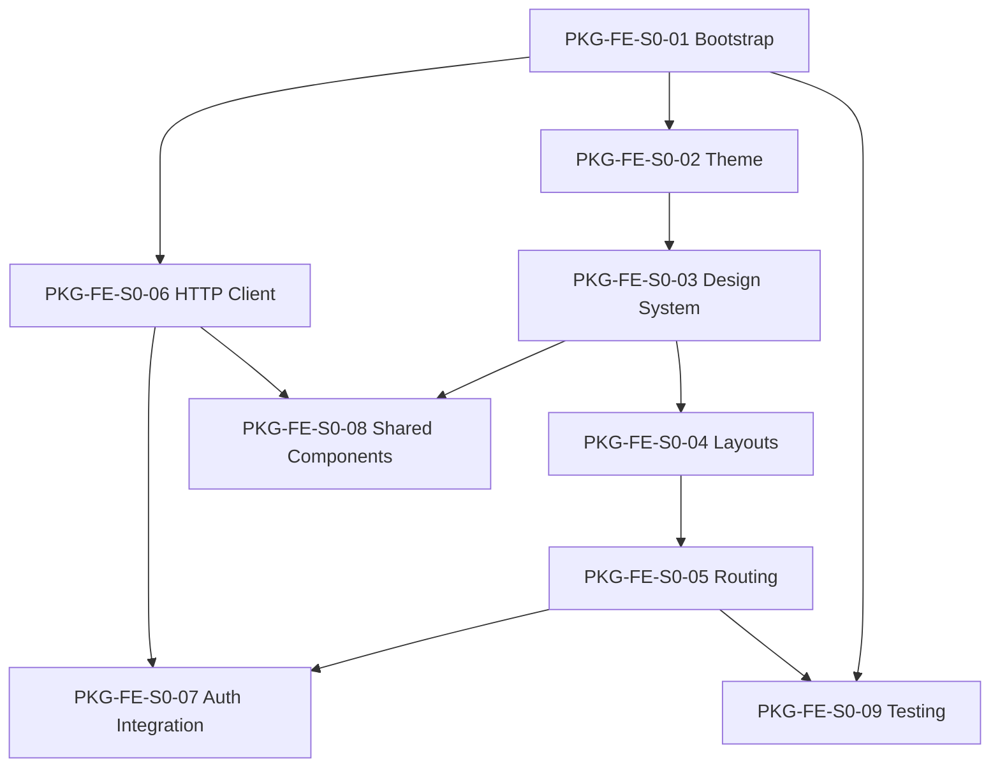

# Package Dependency Graph — Frontend Foundation (Sprint 0)

| Item | Valor |
|------|-------|
| Sprint | Sprint 0 — Frontend Foundation |
| Versão | 1.0 |
| Data | 2026-07-15 |

---

## Ordem de Execução Oficial

```text
PKG-FE-S0-01 (Project Bootstrap)
    │
    ├── PKG-FE-S0-02 (Theme)
    │       └── PKG-FE-S0-03 (Design System)
    │               ├── PKG-FE-S0-04 (Layouts)
    │               │       └── PKG-FE-S0-05 (Routing)
    │               │               ├── PKG-FE-S0-07 (Auth Integration) ← também depende de S0-06
    │               │               └── PKG-FE-S0-09 (Testing) ← também depende de S0-01
    │               └── PKG-FE-S0-08 (Shared Components) ← também depende de S0-06
    │
    └── PKG-FE-S0-06 (HTTP Client)
            ├── PKG-FE-S0-07 (Authentication Integration)
            └── PKG-FE-S0-08 (Shared Components)
```

---

## Sequência Linear Recomendada

Para execução sequencial sem paralelismo:

```text
PKG-FE-S0-01
    ↓
PKG-FE-S0-02
    ↓
PKG-FE-S0-03
    ↓
PKG-FE-S0-04
    ↓
PKG-FE-S0-05
    ↓
PKG-FE-S0-06
    ↓
PKG-FE-S0-07
    ↓
PKG-FE-S0-08
    ↓
PKG-FE-S0-09
```

Esta sequência respeita todas as dependências declaradas em `00-frontend-foundation.md` §8.

---

## Diagrama de Dependências



---

## Dependências Externas

| Package | Dependência externa |
|---------|---------------------|
| PKG-FE-S0-01 | Backend integrado validado; Docker Compose local |
| PKG-FE-S0-07 | Contrato FT-AUTH (`specs/features/authentication/api.md`) — validável com mocks |

---

## Próximo após Sprint 0

```text
Sprint 1 → FT-AUTH (TASK-AUTH-FE-001 a FE-011)
```

Fonte: `docs/discovery/frontend-feature-mapping.md` — Sprint Dependency Chain.
