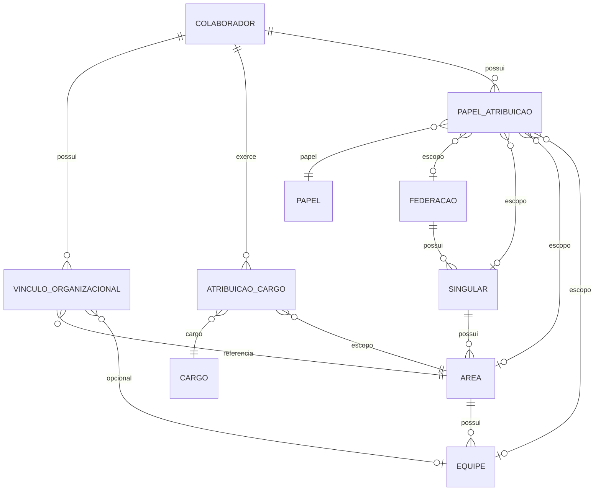

# Formalização — Modelo Organizacional, Cargos e Autorização — Etapa 6

| Campo | Valor |
|-------|-------|
| Artefato | organizational-authorization-formalization-etapa6.md |
| Camada | Construction / Review |
| Versão | 1.2 |
| Data | 2026-08-14 |
| Categoria documental | Evidence |
| Status | **ETAPA 6 + 6.x — CONCLUÍDA** (formalização documental) |
| Precede | [`organizational-authorization-reconciliation-etapa5.md`](organizational-authorization-reconciliation-etapa5.md) |

---

## 1. Objetivo

Formalizar a diferença entre **AS-IS** (estado do repositório descrito na Etapa 5) e **TO-BE** (decisões de domínio definidas pelo responsável do projeto após a reconciliação), registrar decisões **confirmadas** vs **pendentes**, e inventariar dependências de artefatos candidatos à evolução — **sem alterar código, banco ou specs implementáveis**.

Esta etapa **não** substitui DEC-DB-016 nem implementa PKG-FE-02. É pré-requisito para revisão de decisões de banco e para Features de autorização / vínculo.

---

## 2. Leitura da situação

| Perspectiva | Conteúdo |
|-------------|----------|
| **Etapa 5** | Descreve corretamente o **AS-IS** do repositório |
| **TO-BE (domínio)** | Modelo em definição: cargo/função ≠ papel administrativo; papéis `ADMIN_*` independentes; escopo contextual; hierarquia por relacionamentos |
| **Gap** | AS-IS foi construído com DEC-DB-015/016 (gestor/líder como FK) e DEC-DB-016 (CARGO rejeitado); TO-BE exige revisão dessas decisões **antes** de DDL/JPA |

```text
AS-IS (repositório)          TO-BE (domínio em formalização)
─────────────────────        ─────────────────────────────────
GESTOR/LÍDER → FK            GESTOR → cargo/função organizacional
CARGO → rejeitado (DEC-DB-016) CARGO → entidade de domínio (DEC-ORG-002)
ADMIN → e-mail whitelist      ADMIN_* → PAPEL + escopo (PAPEL_ATRIBUICAO)
1 vínculo em COLABORADOR      N vínculos (DEC-FA-003 confirmado)
FKs redundantes em COLABORADOR  Hierarquia derivada por relacionamentos
```

---

## 3. Decisões de domínio — CONFIRMADAS (TO-BE)

Fonte: definição do responsável do projeto (2026-08-14). **Não alteram o repositório até implementação formal.**

| # | Decisão | Implicação |
|---|---------|------------|
| D-01 | **GESTOR** é **cargo/função organizacional** (ex.: Gestor de Tecnologia da Informação) | Não é sinônimo de papel `ADMIN_*` nem de FK `COD_GESTOR` AS-IS |
| D-02 | **ADMIN_*** são **papéis de autorização** independentes: `ADMIN_FEDERACAO`, `ADMIN_SINGULAR`, `ADMIN_AREA`, `ADMIN_EQUIPE` | Substituem léxico legado `ADMINISTRADOR` / `ADMIN` / e-mail whitelist como modelo definitivo |
| D-03 | **Não existe herança automática** entre papéis administrativos | `ADMIN_FEDERACAO` ≠ implica `ADMIN_SINGULAR` ≠ `ADMIN_AREA` ≠ `ADMIN_EQUIPE` |
| D-04 | Hierarquia organizacional: **Federação → Singular → Área → Equipe** | Equipe é **opcional** no vínculo operacional |
| D-05 | Hierarquia representada por **relacionamentos entre entidades**, não por replicar `COD_FEDERACAO` / `COD_SINGULAR` / `COD_AREA` / `COD_EQUIPE` em todas as tabelas | Cadeia derivável: `EQUIPE → AREA → SINGULAR → FEDERACAO` |
| D-06 | Uma unidade organizacional pode ter **zero ou mais** administradores (`ADMIN_*` no escopo) | Administrador é atribuição via `PAPEL_ATRIBUICAO`, não campo único na unidade |
| D-07 | Um colaborador pode ter o **mesmo papel em múltiplos escopos** | Ex.: `ADMIN_AREA` em TI e Financeiro |
| D-08 | **Cargo não determina automaticamente autorização** | Separação cargo (função) × papel (permissão) |
| D-09 | **ADMIN_*** não é sinônimo de cargo | Gestor de TI pode não ser `ADMIN_AREA` |
| D-10 | Autorização deve ser **contextualizada pelo escopo organizacional** | Alinhado a `PAPEL_ATRIBUICAO` com FKs de escopo |
| D-11 | **Multi-vínculo** — colaborador pode ter N vínculos simultâneos (DEC-FA-003) | Ex.: Área TI + Área Financeiro + Equipe X — **confirmado como TO-BE** |
| D-12 | **CARGO** é **entidade de domínio independente** (DEC-ORG-002) | Cargo/função organizacional ≠ `PAPEL` ≠ `ADMIN_*`; não implica autorização |

---

## 4. Decisões de domínio — PENDENTES (bloqueiam modelagem física)

| ID | Questão | Impacto | Relação AS-IS |
|----|---------|---------|---------------|
| ~~PD-01~~ | ~~CARGO volta ao modelo?~~ | — | **Encerrada** — ver DEC-ORG-002 (entidade confirmada; persistência pendente PD-CARGO-01) |
| PD-02 | Como representar **N vínculos** sem redundância? | Nova tabela(s) vs evolução `COLABORADOR` | AS-IS: FKs únicas em `COLABORADOR` — **reconciliado Etapa 8**; pendente DEC formal |
| PD-03 | Colaborador vincula-se a **Área**, **Equipe**, ou **ambos** no TO-BE? | Cardinalidade do vínculo | AS-IS: três FKs opcionais no mesmo registro — **reconciliado Etapa 8**; pendente DEC formal |
| PD-04 | Remover `COLABORADOR.COD_GESTOR`? | DDL, RN-006 colaborador, API `managerId` | AS-IS: gestor direto (reporting line) |
| PD-05 | Remover `AREA.COD_GESTOR`? | DDL, FT-AREA, API `managerId` | AS-IS: gestor único da área |
| PD-06 | Remover `EQUIPE.COD_LIDER`? | DDL, FT-EQUIPE, API `leaderId` | AS-IS: líder único da equipe |
| PD-07 | Significado definitivo de **LÍDER** | Equipe vs cargo vs papel | AS-IS: FK `COD_LIDER`; domínio não formalizado |
| PD-08 | `PAPEL_ATRIBUICAO` — regras de escopo (quais `COD_*` obrigatórios por `ADMIN_*`)? | Constraints, validação | AS-IS: 4 FKs opcionais sem CHECK |
| PD-09 | Exposição API/sessão: `roles`, `permissions`, capabilities? | `/auth/me`, JWT, FE guards | AS-IS: vazio / `ADMIN` scaffold |
| PD-10 | Aplicação backend/frontend da autorização contextual | Services, guards, OQ-020 | AS-IS: `sessionAdministratorEmails` |
| PD-11 | Relação **gestor direto** (reporting) vs **cargo Gestor** vs **ADMIN_*** | PD-04 e modelo de cargo | Três conceitos distintos no TO-BE |
| PD-12 | `COLABORADOR.COD_FEDERACAO` obrigatório permanece? | Identidade vs vínculo | AS-IS: obrigatório (FT-AUTH default federation) |

---

## 5. AS-IS vs TO-BE — por tema

### 5.1 GESTOR, CARGO e LÍDER

| Conceito | AS-IS (Etapa 5) | TO-BE (confirmado + pendente) |
|----------|-----------------|-------------------------------|
| Entidade CARGO | Rejeitada (DEC-DB-016 — **parcialmente superseded**) | **Entidade de domínio** (DEC-ORG-002); tabela física **não implementada** |
| GESTOR | `COD_GESTOR` FK em `COLABORADOR`, `AREA` | **Cargo/função** (D-01); FKs candidatas à remoção (PD-04, PD-05) |
| LÍDER | `COD_LIDER` FK em `EQUIPE` | Significado **pendente** (PD-07); FK candidata à remoção (PD-06) |
| ADMIN administrativo | E-mail whitelist + scaffold `ADMIN` | `ADMIN_*` independentes com escopo (D-02, D-03) |

**Exemplo TO-BE (ilustrativo, não implementado):**

```text
Colaborador: Vicente Freitas
  Cargo: Gestor de Tecnologia da Informação         → entidade CARGO (DEC-ORG-002)
  Papel: ADMIN_AREA → Tecnologia da Informação      → PAPEL_ATRIBUICAO
  Papel: ADMIN_AREA → Financeiro                    → segunda atribuição
  (não implica ADMIN_SINGULAR nem ADMIN_EQUIPE)
```

### 5.2 Multi-vínculo organizacional

| Aspecto | AS-IS | TO-BE |
|---------|-------|-------|
| DEC-FA-003 | Aprovada documentalmente | **Confirmada** (D-11) |
| Persistência | `COLABORADOR.COD_SINGULAR`, `COD_AREA`, `COD_EQUIPE` (um conjunto) | **N vínculos** — mecanismo físico **pendente** (PD-02, PD-03) |
| Contexto Ativo | Snapshot das FKs únicas em `/auth/me` | Um contexto entre N vínculos disponíveis |
| Exemplo N vínculos | Não suportado | Área TI + Área Financeiro + Equipe X |

**Hipóteses de modelagem (não decididas — apenas para discussão PD-02):**

| Hipótese | Descrição | Prós | Riscos |
|----------|-----------|------|--------|
| H-A | `VINCULO_ORGANIZACIONAL` (colaborador + unidade folha + tipo) | Normaliza N vínculos; remove FKs redundantes de `COLABORADOR` | Migration + impacto em FT-SESSION/FT-PRIMEIRO-ACESSO |
| H-B | Vínculo só em **Área**; equipe derivada ou segunda tabela | Simples para DEC-FA-003 (áreas múltiplas) | Equipe opcional (D-04) exige regra clara |
| H-C | Manter `COLABORADOR` AS-IS até Feature de vínculo | Zero mudança imediata | Contradiz DEC-FA-003 na prática |

### 5.3 Hierarquia sem redundância

**Princípio TO-BE (D-05):** estrutura institucional apenas nas entidades da cadeia:

```text
FEDERACAO
    ↑ COD_FEDERACAO
SINGULAR
    ↑ COD_SINGULAR
AREA
    ↑ COD_AREA
EQUIPE (opcional no vínculo do colaborador)
```

**AS-IS — redundância em `COLABORADOR`:**

| Coluna AS-IS | Derivável via |
|--------------|---------------|
| `COD_SINGULAR` | `COD_AREA → AREA.COD_SINGULAR` ou vínculo direto se só singular |
| `COD_AREA` | Vínculo primário ou `COD_EQUIPE → EQUIPE.COD_AREA` |
| `COD_EQUIPE` | Vínculo folha quando equipe participa |
| `COD_FEDERACAO` | `COD_SINGULAR → SINGULAR.COD_FEDERACAO` ou default identidade |

**TO-BE:** colaborador vincula-se à **unidade folha** do vínculo (área ou equipe); federação/singular/área superiores **derivadas**, não duplicadas em cada vínculo além do necessário para identidade (`PD-12`).

**Nota:** `PAPEL_ATRIBUICAO` no AS-IS já usa FKs de **escopo de autorização** — não é a mesma redundância que vínculo operacional; TO-BE deve definir CHECK por `ADMIN_*` (PD-08).

### 5.4 Autorização — papéis independentes

| Papel TO-BE | Escopo típico em `PAPEL_ATRIBUICAO` | Herança automática |
|-------------|-------------------------------------|--------------------|
| `ADMIN_FEDERACAO` | `COD_FEDERACAO` | **Não** concede outros ADMIN_* |
| `ADMIN_SINGULAR` | `COD_SINGULAR` (+ federação derivada) | **Não** |
| `ADMIN_AREA` | `COD_AREA` (+ cadeia derivada) | **Não** |
| `ADMIN_EQUIPE` | `COD_EQUIPE` (+ cadeia derivada) | **Não** |

**AS-IS DDL seed (`008-initial-data.sql`):** `ADMINISTRADOR`, `GESTOR_DOCUMENTAL`, `EDITOR`, `COLABORADOR` — **não mapeados** 1:1 ao TO-BE. Reconciliação de nomenclatura obrigatória antes de implementação (PD-09).

| Camada AS-IS | Identificador | TO-BE alvo |
|--------------|---------------|------------|
| Domínio legado (`01-vision`) | `administrator`, `singular_administrator`, … | `ADMIN_*` |
| DDL `PAPEL` | `ADMINISTRADOR` | Migrar / seed novo catálogo |
| Frontend rotas | `ADMIN` | `ADMIN_*` ou capabilities derivadas |
| E2E mock | `roles: ["ADMIN"]` | Alinhar ao contrato definitivo |
| Backend | `sessionAdministratorEmails` | `PAPEL_ATRIBUICAO` + escopo |

---

## 6. Inventário de dependências — candidatos à remoção/evolução

**Regra:** nenhuma coluna abaixo deve ser removida até PD-04/05/06/07 resolvidos e plano de migration aprovado.

### 6.1 `COLABORADOR.COD_GESTOR`

| Camada | Artefato | Uso |
|--------|----------|-----|
| DDL | `003-create-tables.sql`, `004-create-constraints.sql`, `005-create-indexes.sql`, `006-create-comments.sql` | Coluna, FK, índice, comment DEC-DB-016 |
| Migration | `V004__colaborador_corporate_columns.sql`, `VAL-DB-02-verify-colaborador-columns.sql` | ADD coluna |
| Modelo | `02-logical-model.md`, `03-physical-model.md`, `02-conceptual-model.md`, `05-decisions-and-risks.md` (DEC-DB-016) | Documentação |
| JPA | `ColaboradorEntity.gestorId` | Mapeamento |
| Backend | `ColaboradorApplicationService`, `ColaboradorDomainService.validateManager`, `existsByGestorIdAndAtivo` (RN inativação subordinados) | CRUD + RN-006, RN-008 |
| DTO/API | `CreateColaboradorRequest`, `UpdateColaboradorRequest`, `ColaboradorResponse`, `ColaboradorMapper` | Campo `managerId` |
| Specs | `specs/features/colaborador/api.md`, `specification.md` (RN-006) | Contrato público |
| Testes | `ColaboradorDomainServiceTest`, `SchemaOracleAuditTest`, `IntegrationTestDatabaseCleaner` | Validação + limpeza IT |
| Frontend | `useColaboradorForm.ts`, `colaborador.types.ts` | Form + tipos |
| Construction | `FT-COLABORADOR/execution-plan.md`, reconciliation report | Planejamento FE |

### 6.2 `AREA.COD_GESTOR`

| Camada | Artefato | Uso |
|--------|----------|-----|
| DDL | `003`–`006` (constraints, indexes, comments DEC-DB-015) | Coluna, FK, índice |
| Modelo | `02-logical-model.md`, `03-physical-model.md`, DEC-DB-015 | Gestor único área |
| JPA | `AreaEntity.gestorId` | Mapeamento |
| Backend | `AreaApplicationService`, `AreaDomainService.validateManager` | CRUD |
| DTO/API | `CreateAreaRequest`, `UpdateAreaRequest`, `AreaResponse`, `AreaMapper` | `managerId` |
| Specs | `specs/features/area/*` (RN gestor, AT managerId inválido, api.md) | FT-AREA completo |
| Testes | `SchemaOracleAuditTest`, `IntegrationTestDatabaseCleaner` | Auditoria + IT |
| Frontend | `area.types.ts` (`managerId`) | Tipos (form área FE pode estar incompleto) |
| Construction | `FT-AREA/review/reconciliation-report.md` | Ressalva OQ-020 |

### 6.3 `EQUIPE.COD_LIDER`

| Camada | Artefato | Uso |
|--------|----------|-----|
| DDL | `003`–`006` (DEC-DB-015) | Coluna, FK, índice |
| Modelo | `02-logical-model.md`, `03-physical-model.md` | Líder único equipe |
| JPA | `EquipeEntity.liderId` | Mapeamento |
| Backend | `EquipeApplicationService`, `EquipeDomainService.validateLeader` | CRUD |
| DTO/API | `CreateEquipeRequest`, `UpdateEquipeRequest`, `EquipeResponse`, `EquipeMapper` | `leaderId` |
| Specs | `specs/features/equipe/*`, `equipe/specification-frontend.md` | FT-EQUIPE + FE |
| Testes | `SchemaOracleAuditTest`, `IntegrationTestDatabaseCleaner` | Auditoria + IT |
| Frontend | `useEquipeForm.ts`, `EquipeBasicInfoSection.vue`, `EquipeInfoCard.vue`, `equipe.types.ts`, E2E `equipe.spec.ts`, mocks | Form + exibição + E2E |
| Construction | `FT-EQUIPE/pkg-01/status.md`, review README | Implementação FE |

### 6.4 `COLABORADOR.COD_SINGULAR / COD_AREA / COD_EQUIPE` (evolução multi-vínculo)

| Camada | Artefato | Uso |
|--------|----------|-----|
| DDL + migrations | `003`, `V004`, baseline, VAL-DB-02 | Schema físico |
| JPA | `ColaboradorEntity` | Três FKs |
| Backend | `ColaboradorDomainService` (coerência vínculo), `AuthenticationService.organizationalLinksFrom` | RN-005, `/auth/me` |
| FT-SESSION | `RN-SESSION-001`, organizational links | Contexto sessão |
| FT-PRIMEIRO-ACESSO | Onboarding, contexto ativo | WIP |
| Frontend | `session.store`, `ColaboradorOrganizationalLinks`, forms colaborador | Sessão + CRUD |
| DEC-DB-020 | Separação FK org vs PAPEL_ATRIBUICAO | Governança |

---

## 7. Decisões de banco a revisar ou substituir

| Decisão AS-IS | Status TO-BE | Ação recomendada |
|---------------|--------------|------------------|
| **DEC-DB-016** — rejeição de entidade `CARGO` | **Parcialmente superseded** por DEC-ORG-002 | Item “Rejeitado: CARGO” **obsoleto**; restante **vigente** até revisão PD-04 |
| **DEC-DB-016** — `COD_GESTOR` auto-ref | **Em revisão** (D-01, PD-04, PD-11) | Não remover AS-IS; não superseded automaticamente |
| **DEC-DB-015** — `AREA.COD_GESTOR`, `EQUIPE.COD_LIDER` FK únicos | **Conflita** com D-01, D-06, PD-05/06/07 | Revisar após modelo de cargo e ADMIN_* |
| **DEC-DB-020** — FKs org em `COLABORADOR` ≠ `PAPEL_ATRIBUICAO` | **Mantém-se** no TO-BE | Princípio vínculo ≠ autorização preservado |
| **DEC-FA-003** — N vínculos + Contexto Ativo | **Confirmada** (D-11) | Exige PD-02/03 e migration |
| **OQ-020** — matriz ADMIN_* | **Aberta** → alvo TO-BE `ADMIN_*` | Encerrar com matriz explícita (PD-10) |
| Seed `PAPEL` (`ADMINISTRADOR`, …) | **Desalinhado** do TO-BE | Novo seed ou migration de nomenclatura |

**Ordem sugerida de governança (sem implementação):**

1. PD-CARGO-01 + PD-07 — persistência de CARGO e significado de LÍDER  
2. PD-02 + PD-03 + PD-12 — vínculo colaborador  
3. PD-08 — escopo `PAPEL_ATRIBUICAO`  
4. PD-04 + PD-05 + PD-06 — remoção FKs (se confirmada)  
5. PD-09 + PD-10 — API e enforcement  
6. Revisão formal DEC-DB-016 / DEC-DB-015 → novas DECs em `05-decisions-and-risks.md` ou `docs/governance/03-open-decisions.md`

---

## 8. Modelo TO-BE conceitual (referência — não é SSOT até aprovação)



Entidades `VINCULO_ORGANIZACIONAL`, `CARGO`, `ATRIBUICAO_CARGO` são **placeholders conceituais** — `CARGO` confirmado em domínio (DEC-ORG-002) mas **sem tabela DDL**; vínculo multi (PD-02) pendente.

---

## 9. Impacto em Features e trabalho em andamento

| Item | Recomendação |
|------|--------------|
| **PKG-FE-02** (FT-COLABORADOR FE) | **Não iniciar** até PD-02/PD-CARGO-01 e contrato API estável para vínculo/cargo |
| **FT-PRIMEIRO-ACESSO** | Depende de PD-02/03; manter spec, não expandir CRUD gestor AS-IS |
| **FT-SESSION** | organizationalLinks AS-IS temporário; evolução após vínculo TO-BE |
| **OQ-020** | Reorientar para matriz `ADMIN_*` (D-02, D-03) |
| **enforceAuthorization** FE | Manter desabilitado até PD-09/10 |
| **CRUDs org existentes** | AS-IS válido para operação incremental; não remover `managerId`/`leaderId` sem plano |

---

## 10. Critérios de aceite — Etapa 6

| Critério | Status |
|----------|--------|
| AS-IS (Etapa 5) e TO-BE separados explicitamente | ✅ |
| Decisões confirmadas registradas (seção 8 do feedback) | ✅ |
| Decisões pendentes registradas (seção 9 do feedback) | ✅ |
| Inventário de dependências COD_GESTOR / COD_LIDER | ✅ |
| DEC-DB-016 / DEC-FA-003 / OQ-020 relacionados ao plano | ✅ |
| Sem alteração de código ou banco | ✅ |
| Artefato produzido | ✅ |

---

## 11. Conclusão

A **Etapa 5** permanece válida como fotografia **AS-IS**. O **TO-BE** definido pelo domínio introduz três eixos de mudança estrutural:

1. **Cargo/função** (incluindo Gestor) separado de **papel administrativo** (`ADMIN_*`).  
2. **Multi-vínculo** confirmado (DEC-FA-003) com modelagem física ainda aberta.  
3. **Hierarquia derivada** e **papéis com escopo** sem herança automática.

`COD_GESTOR`, `AREA.COD_GESTOR` e `EQUIPE.COD_LIDER` são **candidatos à remoção** no TO-BE, mas o inventário da seção 6 mostra dependência transversal em DDL, JPA, APIs, specs, testes e frontend (equipe). **DEC-DB-016 deve ser revisada ou substituída antes de qualquer alteração estrutural.**

```text
ETAPA 6 + 6.x — CONCLUÍDA (formalização documental)
Próximo passo: aprovação humana PD-02/PD-03 → **DEC-DB-028** (modelo físico vínculo). DEC-DB-027 formalizada (2026-08-14); obrigatoriedade na criação **superseded** por **DH-CARGO-01** (2026-08-17). PD-CARGO-01/02/03 encerradas — ver [`cargo-vinculo-reconciliation-pd-cargo-01-02-03.md`](cargo-vinculo-reconciliation-pd-cargo-01-02-03.md) v2.0.
```

---

## 12. Etapa 6.x — Domínio de CARGO e reconciliação de decisões

### 12.1 Objetivo da sub-etapa

Registrar formalmente que **CARGO** é entidade de domínio independente de **PAPEL** / `ADMIN_*`, e reconciliar o impacto sobre decisões anteriores — **sem implementação**.

### 12.2 Decisão formal — DEC-ORG-002

Registro definitivo: `docs/governance/03-open-decisions.md` (DEC-ORG-002).

| Campo | Valor |
|-------|-------|
| ID | DEC-ORG-002 |
| Título | CARGO como entidade de domínio independente |
| Status | **Aprovada** (2026-08-14) |
| Categoria | Domínio — Organização Corporativa |
| Criticidade | Crítica |

**Decisão:**

1. **CARGO** é entidade de domínio independente.
2. **CARGO** representa o **cargo/função organizacional** ocupado pelo colaborador.
3. Exemplos canônicos: Presidente; Diretor de Tecnologia; Gestor de Tecnologia da Informação; Analista de Sistemas; Desenvolvedor de Sistemas.
4. **CARGO** é conceito de **organização** — não de autorização.
5. **CARGO ≠ PAPEL** (autorização).
6. **CARGO ≠ ADMIN_*** (papéis administrativos independentes).
7. Ocupar um cargo **não concede** automaticamente permissões administrativas.

**Exemplo oficial:**

```text
Colaborador: Vicente Freitas

Cargo:
  Gestor de Tecnologia da Informação

Papéis (autorização — PAPEL_ATRIBUICAO):
  ADMIN_AREA → Tecnologia da Informação
  ADMIN_AREA → Financeiro

(Não implica ADMIN_SINGULAR nem ADMIN_EQUIPE.)
```

**Não incluído nesta decisão (pendente):**

- Criação de tabela `CARGO` ou migration (PD-CARGO-01).
- Remoção de `COD_GESTOR`, `AREA.COD_GESTOR`, `EQUIPE.COD_LIDER`.
- Alteração de API, JPA, frontend ou testes.

### 12.3 Reconciliação — DEC-DB-016

| Bloco DEC-DB-016 | Situação após DEC-ORG-002 | Classificação |
|------------------|---------------------------|---------------|
| **Rejeitado: Entidade `CARGO`** | Contradiz DEC-ORG-002 | **OBSOLETO** — superseded |
| **Rejeitado: Entidade `GESTOR`** (como entidade separada) | Alinhado — Gestor é **nome de cargo**, não entidade `GESTOR` | **MANTIDO** |
| **Rejeitado: `HIERARQUIA`, `ORGANOGRAMA`** | Sem alteração TO-BE | **MANTIDO** |
| `CONTATO.COD_COLABORADOR`, canais em `CONTATO` | Sem alteração | **MANTIDO** |
| `DES_EMAIL`, `ID_ZIMBRA` obrigatórios | Sem alteração | **MANTIDO** |
| `COD_GESTOR` auto-referência em `COLABORADOR` | Conflita com modelo cargo vs reporting line (PD-04, PD-11) | **EM REVISÃO** — AS-IS vigente |
| FKs `COD_SINGULAR` / `COD_AREA` / `COD_EQUIPE` | Multi-vínculo TO-BE (DEC-FA-003) | **EM REVISÃO** — AS-IS vigente |
| Status “congelamento COLABORADOR para DDL” (2026-07-10) | Congelamento **AS-IS** preservado; evolução TO-BE exige nova DEC de banco | **MANTIDO** para baseline atual |

**Veredito DEC-DB-016:** **parcialmente superseded** — apenas a rejeição da entidade `CARGO` está obsoleta. O documento permanece referência histórica e para itens ainda vigentes no schema AS-IS.

### 12.4 Reconciliação — outras decisões

| Decisão | Relação com DEC-ORG-002 | Veredito |
|---------|-------------------------|----------|
| **DEC-DB-015** (`AREA.COD_GESTOR`, `EQUIPE.COD_LIDER` como FK) | Gestor/líder AS-IS ≠ cargo TO-BE; FKs não substituem `CARGO` | **Não superseded** — **em revisão** com PD-05/06/07 |
| **DEC-DB-020** (FK org ≠ `PAPEL_ATRIBUICAO`) | Princípio estendido: **cargo ≠ papel** | **Mantido e ampliado** |
| **DEC-FA-003** (N vínculos) | Colaborador pode ter N cargos/vínculos em escopos distintos | **Mantido** — ortogonal a CARGO |
| **DEC-ORG-001** (hierarquia) | CARGO ocupa-se **no contexto** de unidade organizacional | **Mantido** |
| **V007** (remove `DES_CARGO`) | Atributo texto removido; entidade `CARGO` é decisão distinta | **Mantido** — não conflita com DEC-ORG-002 |
| **OQ-020** | Matriz `ADMIN_*` separada de catálogo de cargos | **Aberta** — reorientada |

### 12.5 Pendências abertas após DEC-ORG-002

| ID | Questão | Bloqueia |
|----|---------|----------|
| PD-CARGO-01 | Modelo físico de `CARGO` (catálogo + `COLABORADOR.COD_CARGO`) | **Encerrada** — DEC-DB-027 (2026-08-14) |
| PD-CARGO-02 | Cardinalidade **1 colaborador = 1 cargo** | **Encerrada** (domínio) — Etapa 7 v2.0 |
| PD-CARGO-03 | Cargo em **COLABORADOR** (Hipótese A), não no vínculo | **Encerrada** (domínio) — Etapa 7 v2.0 |
| PD-02 … PD-12 | (mantidas da seção 4, exceto PD-01 encerrada) | Vínculo, authz, FKs legados — **PD-02/03 reconciliados** Etapa 8 |

### 12.7 Reconciliação PD-02 / PD-03 (Etapa 8 — 2026-08-14)

Artefatos:

- [`vinculo-organizacional-reconciliation-pd-02-03.md`](vinculo-organizacional-reconciliation-pd-02-03.md) v1.0
- [`vinculo-organizacional-reconciliation-pd-02-03-complementar.md`](vinculo-organizacional-reconciliation-pd-02-03-complementar.md) v1.0 — semântica das FKs em `COLABORADOR` × nova regra (Fed/Sing/Área obrigatórios; Equipe opcional)

| ID | Recomendação da análise | Status governança |
|----|-------------------------|-------------------|
| PD-02 | Tabela `VINCULO_ORGANIZACIONAL` (1 linha = 1 vínculo); deprecar FKs org em `COLABORADOR` | **Pronta para decisão** → DEC-DB-028 |
| PD-03 | Unidade folha = `COD_AREA` (NN) + `COD_EQUIPE` (opcional); derivar Sing/Fed | **Pronta para decisão** → DEC-DB-028 |
| PD-12 | `COD_FEDERACAO` em `COLABORADOR` — âncora identidade (FT-AUTH) | **Pendente** |
### 12.6 Critérios de aceite — Etapa 6.x

| Critério | Status |
|----------|--------|
| DEC-ORG-002 registrada em governança | ✅ |
| CARGO ≠ PAPEL ≠ ADMIN_* formalizado | ✅ |
| DEC-DB-016 reconciliada (parcial superseded) | ✅ |
| Decisões relacionadas classificadas | ✅ |
| Sem alteração de código, DDL, banco, API, FE, testes | ✅ |

---

## Referências

- [`organizational-authorization-reconciliation-etapa5.md`](organizational-authorization-reconciliation-etapa5.md)
- `docs/governance/03-open-decisions.md` (DEC-ORG-002, DEC-FA-003, DEC-ORG-001)
- `database/model/05-decisions-and-risks.md` (DEC-DB-015, DEC-DB-016, DEC-DB-020)
- `specs/features/session/specification.md`
- `docs/domain/10-open-questions.md` (OQ-020)
- [`cargo-vinculo-reconciliation-pd-cargo-01-02-03.md`](cargo-vinculo-reconciliation-pd-cargo-01-02-03.md) (Etapa 7 v2.0 — 1:1 cargo, Hipótese A)
