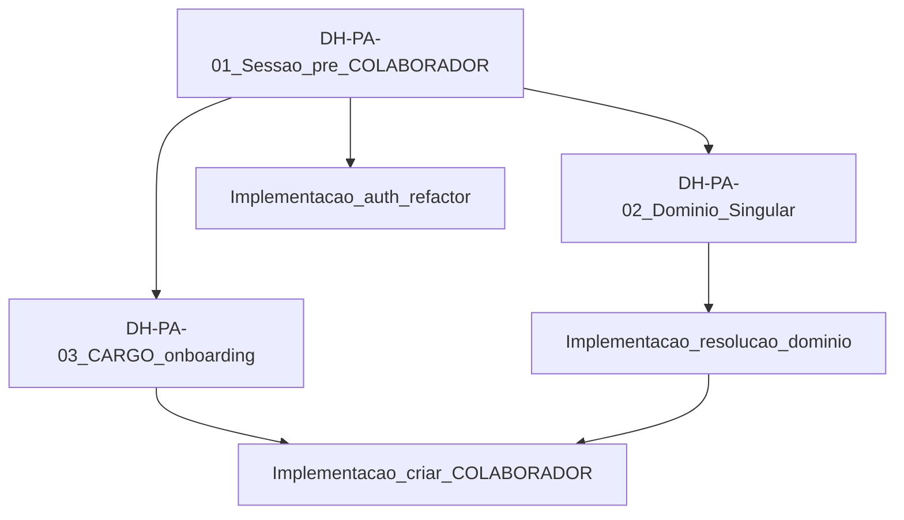

```mermaid
flowchart LR
  Zimbra[Zimbra_OK] --> Identity[Identidade_autenticada]
  Identity --> Domain[Resolver_dominio]
  Domain --> Singular[Singular_resolvida]
  Singular --> Area[Selecao_Area]
  Area --> Equipe[Equipe_opcional]
  Equipe --> CreateColab[Criar_COLABORADOR]
  CreateColab --> Contexto[Contexto_Ativo]
  Contexto --> Home[Home_dinamica]
```

# Pacote de decisão humana — FT-PRIMEIRO-ACESSO (3 questões bloqueantes)

| Campo | Valor |
|-------|-------|
| Projeto | Portal de Comunicação |
| Artefato | `construction/review/primeiro-acesso-blocking-decisions-package.md` |
| Feature | FT-PRIMEIRO-ACESSO |
| Data | 2026-08-15 |
| Tipo | **Pacote consolidado para decisão humana** |
| Categoria documental | Evidence |
| Status | **EVIDÊNCIA** (DH-PA-01/02/03 **APROVADAS**; **DH-CARGO-01 APROVADA** 2026-08-17 — reconciliação DEC-DB-027 **encerrada** — ver `docs/governance/03-open-decisions.md`) |
| IDs propostos | DH-PA-01, DH-PA-02, DH-PA-03 |

**Classificação usada:** `FATO` · `INFERÊNCIA` · `HIPÓTESE` · `RECOMENDAÇÃO TÉCNICA` · `DECISÃO HUMANA NECESSÁRIA`.

**Restrições cumpridas nesta etapa:**

- Nenhum código, DDL, migration, JPA, API, frontend, teste ou seed foi alterado.
- Nenhum artefato em `specs/features/primeiro-acesso/*`, `docs/domain/*` ou `docs/governance/03-open-decisions.md` foi alterado.
- Nenhuma DEC foi criada ou aprovada em governança nesta etapa.
- Este documento **não** registra decisão — apenas consolida alternativas para aprovação humana.

---

## 1. Objetivo

Subsidiar **uma sessão de decisão humana** sobre as três questões que bloqueiam a implementação vertical de **FT-PRIMEIRO-ACESSO** (login → onboarding → Contexto Ativo → Home dinâmica), após as decisões de vínculo organizacional aprovadas em 2026-08-14 (DH-02, DH-03, DH-04, DEC-ORG-003, DEC-DB-028).

O decisor deve poder aprovar ou rejeitar cada questão usando os checklists do Apêndice A, sem necessidade de ler dezenas de artefatos dispersos.

---

## 2. Resumo executivo

| # | ID | Questão | Bloqueia |
|---|-----|---------|----------|
| 1 | **DH-PA-01** | Modelo de **credencial temporária** de Primeiro Acesso (sem AUTH_SESSAO operacional) | Auth, JWT, refresh, security, guards, BE/FE PA | **APROVADA** (2026-08-15) |
| 2 | **DH-PA-02** | **Domínio e-mail → Singular** (cardinalidade e comportamento) | Passo 1 do wizard; resolução de Singular | **APROVADA** (2026-08-15) |
| 3 | **DH-PA-03** / **DH-CARGO-01** | Política de CARGO na criação do COLABORADOR | Implementação física delegada (sem obrigatoriedade na criação) | **APROVADA** — reconciliação **ENCERRADA** (2026-08-17) |

**Ordem de dependência conceitual:**

```text
DH-PA-01 (raiz — sessão pré-COLABORADOR)
    ↓
DH-PA-02 (resolver domínio → Singular no onboarding autenticado)
    ↓
DH-PA-03 / DH-CARGO-01 (CARGO não obrigatório na criação — reconciliação DEC-DB-027 encerrada)
```

DH-PA-02 e DH-PA-03 podem ser deliberadas na **mesma sessão** que DH-PA-01; a implementação deve seguir a ordem acima.

**Consequência derivada (não é decisão separada):** qualquer alternativa de DH-PA-01 exige **remover ou deslocar** `locateOrCreate` do login (`finalizeLogin`) — equivalente analítico a DA-NEW-03.

---

## 3. Premissas já aprovadas — não reabrir

Estas decisões são **vigentes** e orientam o pacote. Não devem ser rediscutidas nesta sessão.

| Decisão | Conteúdo normativo | SSOT |
|---------|-------------------|------|
| **DH-02** | 1 vínculo organizacional por COLABORADOR (FKs escalares) | `docs/governance/03-open-decisions.md` |
| **DH-03** | Alternativa A — COLABORADOR só persistido após vínculo mínimo completo | idem |
| **DH-04** | Federação + Singular + Área obrigatórios; Equipe opcional | idem |
| **DEC-ORG-003** | Domínio do e-mail determina Singular; usuário não escolhe Singular; Área dentro da Singular | idem + BR-043 |
| **DEC-DB-028** | Modelo de vínculo único; GAP-028-03 (sessão pré-COLABORADOR) e GAP-028-04 (domínio→Singular) pendentes | `database/model/05-decisions-and-risks.md` |
| **DEC-DB-027** | Catálogo `CARGO` + vínculo com `COLABORADOR`. **DH-CARGO-01 (2026-08-17):** `COD_CARGO NOT NULL` na criação **SUPERSEDED** — CARGO opcional. Catálogo TO-BE **não implementado** em DDL. | idem |
| **DEC-FA-001..004** | Primeiro acesso = onboarding; Contexto Ativo; Home dinâmica | `docs/governance/03-open-decisions.md` |

**Fluxo TO-BE normativo (DH-03 + DEC-ORG-003):**

```text
Zimbra OK
  → Identidade autenticada (sem COLABORADOR persistido)
  → Resolver domínio do e-mail → Singular
  → Usuário seleciona Área (+ Equipe opcional)
  → Criar COLABORADOR com vínculo completo
  → Estabelecer Contexto Ativo
  → Obter Home dinâmica
```



---

## 4. AS-IS bloqueante — evidências

### 4.1 Pipeline de login atual

**FATO** — `AuthenticationService.finalizeLogin` sempre cria ou localiza COLABORADOR **antes** da sessão:

| # | Momento | Ação | Componente |
|---|---------|------|------------|
| 1 | Login/callback | Valida Zimbra | `IdentityCredentialValidator` |
| 2 | Pós-Zimbra | `locateOrCreate(identity)` | `ColaboradorService` |
| 3 | Sessão | `createSession(colaborador, ...)` | `SessionService` |
| 4 | JWT | `issueAccessToken(colaborador, sessionId)` | `JwtTokenService` |
| 5 | Cookies | `access_token`, `refresh_token` | `AuthCookieService` |

Evidência: `backend/src/main/java/br/com/unimedceara/portalcomunicacao/accesscontrol/application/service/AuthenticationService.java` (método `finalizeLogin`).

### 4.2 Criação antecipada de COLABORADOR incompleto

**FATO** — `ColaboradorService.createColaborador` persiste apenas identidade + `COD_FEDERACAO` via configuração:

| Campo no INSERT | AS-IS |
|-----------------|-------|
| `email`, `nome`, `zimbraId`, `FLG_ATIVO` | Preenchidos |
| `COD_FEDERACAO` | `authProperties.defaultFederationId()` — **não** deriva de domínio |
| `COD_SINGULAR`, `COD_AREA`, `COD_EQUIPE` | **NULL** |
| `COD_CARGO` | **Inexistente** (sem tabela `CARGO`) |

Evidência: `backend/src/main/java/br/com/unimedceara/portalcomunicacao/accesscontrol/application/service/ColaboradorService.java`.

**CONFLICT** com DH-03 (Alternativa A) e DEC-DB-028 (GAP-028-01).

### 4.3 Sessão e JWT exigem COLABORADOR

**FATO** — estrutura AS-IS:

| Artefato | Restrição |
|----------|-----------|
| `AUTH_SESSAO.COD_COLABORADOR` | `NOT NULL` — `database/ddl/003-create-tables.sql` L360 |
| `AuthSessaoEntity` | `@JoinColumn(nullable = false)` |
| `SessionService.createSession` | Parâmetro `ColaboradorEntity` obrigatório |
| JWT `sub` | Sempre `colaboradorId` (`Long.parseLong`) |
| `JwtAuthenticatedPrincipal` | `colaboradorId` é `long` não opcional |

**LACUNA (LA-01):** não existe representação de identidade autenticada sem COLABORADOR em persistência, token nem `SecurityContext`.

### 4.4 Domínio → Singular

**FATO** — AS-IS:

| Local | Mapeamento domínio→Singular? |
|-------|------------------------------|
| Tabela `SINGULAR` | **Não** — sem coluna de domínio (`database/ddl/003-create-tables.sql` L58-69) |
| Tabela dedicada | **Não** encontrada em `database/` |
| Código backend | **Não** — usa `defaultFederationId` |
| BR-043 | Regra aprovada; **persistência física: lacuna** |

**LACUNA (LA-02, GAP-028-04).**

### 4.5 CARGO

**FATO** — AS-IS:

| Camada | Estado |
|--------|--------|
| DDL | Sem tabela `CARGO`; sem `COLABORADOR.COD_CARGO` |
| JPA / API / FE | Sem entidade, contrato ou UI de cargo |
| DEC-DB-027 | Modelo TO-BE **APPROVED**; implementação **pendente** |

### 4.6 Gaps registrados (DEC-DB-028)

| GAP | Descrição |
|-----|-----------|
| GAP-028-01 | `locateOrCreate` / `finalizeLogin` AS-IS cria COLABORADOR no login |
| GAP-028-02 | DDL: `COD_SINGULAR`/`COD_AREA` ainda nullable |
| GAP-028-03 | Sessão pré-COLABORADOR — arquitetura pendente (**DH-PA-01**) |
| GAP-028-04 | Persistência física domínio→Singular — não aprovada (**DH-PA-02**) |
| GAP-028-05 | FT-PRIMEIRO-ACESSO — evolução para fluxo de criação de vínculo |

---

## 5. DH-PA-01 — Credencial temporária de Primeiro Acesso

> **Atualização (2026-08-15):** **DH-PA-01 APROVADA** pelo decisor humano. Registro definitivo em `docs/governance/03-open-decisions.md`. O conteúdo analítico abaixo permanece como evidência histórica; alternativas M1/M2/M3 e sub-questões técnicas **não** constituem decisão humana.

### 5.1 Pergunta

Como o usuário **autenticado pelo Zimbra** navega o onboarding **antes** de existir `COLABORADOR` persistido com vínculo completo?

### 5.2 Contexto

| Item | Detalhe |
|------|---------|
| Decisão relacionada | DH-03 (Alternativa A) — COLABORADOR criado **após** seleção Área/Equipe |
| Bloqueio estrutural | `finalizeLogin` → `locateOrCreate` → `createSession(colaborador)` |
| Contradições | CA-01 (vs DEC-DB-020), CA-02 (vs `finalizeLogin`), CA-05 (APIs org exigem JWT com `colaboradorId`) |
| Lacuna | LA-01 — nenhum mecanismo de sessão pré-COLABORADOR |

### 5.3 Estados conceituais TO-BE vs AS-IS

| Estado | TO-BE | AS-IS |
|--------|-------|-------|
| A — Identidade autenticada | Zimbra OK; sem COLABORADOR | **Não existe** — `locateOrCreate` imediato |
| B — Onboarding organizacional | Auth OK; Singular resolvida; seleção Área/Equipe | **Não existe** |
| C — Sessão operacional | COLABORADOR + vínculo + Contexto Ativo | Parcial — vínculo pode ser só Federação |

### 5.4 Alternativas

#### M1 — Sessão de identidade separada

```text
IDENTIDADE (email, zimbraId)
    ↓
AUTH_SESSAO_IDENTIDADE (sem COD_COLABORADOR)
    ↓
ONBOARDING (resolver Singular, listar Áreas, criar COLABORADOR)
    ↓
AUTH_SESSAO operacional (ou promoção)
```

| Critério | Avaliação |
|----------|-----------|
| Segurança | **Favorável** — separação clara onboarding vs operação |
| Complexidade | **Alta** — nova tabela, dois tipos de sessão |
| Compatibilidade AS-IS | **Baixa** |
| DDL | Nova entidade + grants |
| JWT | Novo perfil ou cookie distinto; `sub` alternativo pré-colaborador |
| Refresh / CSRF | Política independente para onboarding |
| `/auth/me` | Novo contrato (modo identidade vs operacional) |
| Frontend | Fluxo login → onboarding → promoção → app |
| Testes | Suite separada onboarding |
| Risco de regressão auth | **Baixo** (isolado) |

#### M2 — JWT pré-operacional

```text
Zimbra → JWT onboarding (sub=email ou zimbraId, typ=onboarding)
    → seleção Área/Equipe
    → COLABORADOR criado → JWT operacional (sub=colaboradorId)
```

| Critério | Avaliação |
|----------|-----------|
| Segurança | **Média** — exige claims `typ`/`scope` e validação rigorosa |
| Complexidade | **Média-Alta** — dois perfis JWT, rotação no complete |
| Compatibilidade AS-IS | **Média** — reutiliza cookies/JWT infra |
| DDL | Baixo-Médio (refresh pode usar tabela identidade ou JWT curto) |
| JWT | **Gap** — `JwtTokenService`: `sub` hoje é sempre `colaboradorId` long |
| `JwtAuthenticatedPrincipal` | **Gap** — `colaboradorId` é `long` não opcional |
| API | Filtro distingue onboarding vs operacional |
| Frontend | Troca de token após complete |
| Testes | Dois perfis de token |
| Risco de regressão auth | **Médio** |

#### M3 — `AUTH_SESSAO` adaptada

```text
AUTH_SESSAO com COD_COLABORADOR NULL inicialmente
    → onboarding
    → UPDATE COD_COLABORADOR após criação
```

| Critério | Avaliação |
|----------|-----------|
| Segurança | **Média** — mesma tabela, estados diferentes |
| Complexidade | **Média** — menos artefatos que M1 |
| Compatibilidade AS-IS | **Média-Alta** — evolui entidade existente |
| DDL | `ALTER` nullable em `COD_COLABORADOR`; JPA `optional=true` |
| JWT | Ainda precisa `sub` alternativo pré-colaborador **ou** JWT só após promoção |
| Refresh | Deve funcionar antes e depois da promoção |
| `enforceSessionLimit` | **Gap** — hoje por `colaboradorId`; pré-colaborador por email? |
| `/auth/me` | Precisa modo pré-operacional |
| Testes | Estados intermediários na mesma tabela |
| Risco de regressão auth | **Médio** |

### 5.5 Comparação consolidada (§21 architecture-impact)

| Critério | M1 — Identidade separada | M2 — JWT onboarding | M3 — AUTH_SESSAO adaptada |
|----------|:------------------------:|:-------------------:|:-------------------------:|
| Segurança | Alta | Média | Média |
| Complexidade | Alta | Média-Alta | Média |
| Compatibilidade arquitetura atual | Baixa | Média | Média-Alta |
| Clareza conceitual | Alta | Média | Média |
| Impacto DDL | Nova tabela | Baixo-Médio | ALTER nullable |
| Impacto JWT/Principal | Médio | **Alto** | Médio-Alto |
| Impacto `/auth/me` | Novo contrato | Dois modos | Dois modos |
| Impacto frontend | Alto | Médio | Médio |
| Impacto testes | Alto | Médio | Médio |
| Risco de regressão auth | Baixo (isolado) | Médio | Médio |

### 5.6 Sub-questões obrigatórias (card do decisor)

O decisor deve responder explicitamente:

| # | Sub-questão | Por que importa |
|---|-------------|-----------------|
| SQ-01 | Como identificar sessão pré-operacional no JWT / `SecurityContext`? | Guards e filtros |
| SQ-02 | Refresh token e CSRF funcionam **antes** da promoção a sessão operacional? | Continuidade do wizard |
| SQ-03 | Como endpoints de Área/Equipe (`GET /areas`, `GET /equipes`) são acessados no onboarding sem `colaboradorId`? (CA-05) | Wizard precisa listar opções |
| SQ-04 | Política de TTL para sessão de onboarding vs sessão operacional? | Segurança |
| SQ-05 | Promoção onboarding → operacional: rotação de token, mesma `sessionId` ou nova sessão? | FE e auditoria |

### 5.7 Impacto por camada (qualquer alternativa M1/M2/M3)

| Camada | Impacto |
|--------|---------|
| `AuthenticationService` | Remover `locateOrCreate` de `finalizeLogin`; bifurcar hand-off onboarding |
| `ColaboradorService` | `locateOrCreate` deslocado ou restrito a admin; novo fluxo de criação onboarding |
| `SessionService` | Suportar sessão sem colaborador ou tipo distinto |
| `JwtTokenService` | Claims / `sub` alternativo ou `typ` |
| `JwtAuthenticatedPrincipal` | Identidade sem `colaboradorId` obrigatório |
| Security config | Rotas onboarding vs operacionais |
| `/auth/me` | Modo pré-operacional |
| Frontend guards | Distinção autenticado vs operacional |
| Testes auth | Novos cenários onboarding |

### 5.8 Consequência derivada — locateOrCreate no login

**FATO:** qualquer aprovação de DH-PA-01 **implica** supersession operacional do item normativo de `locateOrCreate` no login (DEC-DB-020 / GAP-028-01).

| Antes (AS-IS) | Depois (TO-BE) |
|---------------|----------------|
| Login cria COLABORADOR com só `COD_FEDERACAO` | Login **não** cria COLABORADOR |
| Sessão sempre com `colaboradorId` | Sessão pré-operacional permitida |
| Onboarding assume vínculo pré-existente | Onboarding **cria** vínculo + COLABORADOR |

Esta consequência **não** requer decisão humana separada — é obrigatória dado DH-03 + DH-PA-01.

### 5.9 RECOMENDAÇÃO TÉCNICA (não é decisão)

| Alternativa | Quando considerar |
|-------------|-------------------|
| **M3** | Priorizar evolução incremental de `AUTH_SESSAO` e menor número de artefatos novos |
| **M1** | Priorizar separação de segurança e clareza entre onboarding e operação |
| **M2** | Priorizar reutilização de JWT com aceitação de impacto alto em token service |

**Nenhuma alternativa foi selecionada neste documento.**

---

## 6. DH-PA-02 — Domínio do e-mail → Singular

> **Atualização (2026-08-15):** **DH-PA-02 APROVADA** pelo decisor humano. Registro definitivo em `docs/governance/03-open-decisions.md`. O conteúdo analítico abaixo permanece como evidência histórica; alternativas P1/P2/P3 e sub-questões técnicas **não** constituem decisão humana — a decisão aprovada está em governança (DH-PA-02.1 cardinalidade 1:1; DH-PA-02.2 domínio sem Singular).

### 6.1 Pergunta

Onde e como persistir o mapeamento **domínio de e-mail corporativo → Singular**, conforme DEC-ORG-003 e BR-043?

### 6.2 Contexto

| Item | Detalhe |
|------|---------|
| Regra aprovada | Domínio determina Singular; backend é autoridade; usuário não escolhe Singular |
| Lacuna | BR-043: "Persistência física do mapeamento domínio→Singular: **lacuna**" |
| GAP | GAP-028-04, LA-02 |
| Exemplos ilustrativos (DEC-ORG-003) | `unimedcariri.com.br` → Unimed Cariri; `unimedceara.com.br` → Unimed Ceará |

### 6.3 Evidência AS-IS

| Local | Existe mapeamento? |
|-------|-------------------|
| `SINGULAR` (DDL) | **Não** — colunas: `COD_SINGULAR`, `COD_FEDERACAO`, `NOM_SINGULAR`, `SIG_SINGULAR`, `COD_UNIMED`, etc. |
| Tabela de domínios | **Não** |
| `ColaboradorService` | Usa `defaultFederationId()` — **não** resolve domínio |
| `AuthProperties` | Federação fixa por configuração |

### 6.4 Alternativas de persistência

#### P1 — Coluna em `SINGULAR`

Exemplo conceitual: `DES_DOMINIO_EMAIL VARCHAR2(255)` (domínio principal, único por Singular).

| Prós | Contras |
|------|---------|
| Coeso com entidade organizacional | Um domínio principal apenas (sem alternativos nativos) |
| Query direta por domínio | DDL em tabela existente |
| Alinhado a catálogo org | Múltiplos domínios por Singular exige evolução futura |

#### P2 — Tabela associativa `SINGULAR_DOMINIO` (ou equivalente)

```text
SINGULAR_DOMINIO
  COD_SINGULAR_DOMINIO  PK
  COD_SINGULAR          FK → SINGULAR (NOT NULL)
  DES_DOMINIO           NOT NULL (ex.: unimedceara.com.br)
  FLG_PRINCIPAL         S/N (opcional)
  FLG_ATIVO             S/N
  DAT_CADASTRO, DAT_ATUALIZACAO
```

| Prós | Contras |
|------|---------|
| Múltiplos domínios por Singular | Nova entidade + governança |
| Domínios alternativos / alias | Mais DDL e JPA |
| UK em `DES_DOMINIO` garante resolução determinística | Seed e manutenção administrativa |

#### P3 — Configuração (`application.yaml` / externo)

| Prós | Contras |
|------|---------|
| Rápido para poucos domínios | **Não** é SSOT da camada Organização |
| Sem DDL imediato | Não escalável; fora do modelo corporativo |

**Classificação:** P3 deve ser tratada como **descartada** para SSOT normativo, ou aceita apenas como **transição temporária** se o decisor registrar ressalva explícita.

### 6.5 Sub-questões de regra (§10.3)

| ID | Sub-questão | Status analítico | Decisor deve definir |
|----|-------------|------------------|----------------------|
| SQ-P02-01 | Comparação exata do domínio? | **INDEFINIDO** | Exata após `@` |
| SQ-P02-02 | Normalização (lowercase, trim)? | Email já lowercase em `createColaborador` | Confirmar para resolução |
| SQ-P02-03 | Múltiplos domínios por Singular? | **INDEFINIDO** — provável (alias) | Permitir / não |
| SQ-P02-04 | Um domínio → múltiplas Singulares? | **INDEFINIDO** — deve ser **proibido** para resolução determinística | Confirmar proibição + UK |
| SQ-P02-05 | Domínio não cadastrado (**DA-PA-02a**) | **INDEFINIDO** | Bloquear onboarding / mensagem / contato admin |
| SQ-P02-06 | Singular resolvida mas **inativa** (**DA-PA-02b**) | Parcial — rejeição em `resolveOrganizationalLinks` | Igualar regra na resolução por domínio |
| SQ-P02-07 | Singular sem Áreas ativas (**DA-PA-02c**) | **LACUNA** | Bloquear (alinha DH-04) vs exceção |

**Default analítico para DA-PA-02c:** **bloquear** onboarding — DH-04 exige Área obrigatória no COLABORADOR persistido; Singular sem Área impede vínculo mínimo.

### 6.6 Impacto por camada

| Camada | Impacto |
|--------|---------|
| DDL / migrations | P1: `ALTER SINGULAR`; P2: `CREATE SINGULAR_DOMINIO` + FK + UK |
| JPA / repositório | Nova coluna ou entidade + query por domínio |
| Serviço org | `SingularDomainResolutionService` (ou equivalente) |
| Seed DML | Domínios das Singulares existentes (ex.: Ceará, Cariri) |
| Onboarding API | `GET /onboarding/singular` ou resolução embutida no primeiro passo |
| Testes | Fixtures com domínios mapeados e casos de erro |

### 6.7 RECOMENDAÇÃO TÉCNICA (não é decisão)

| Cenário | Sugestão |
|---------|----------|
| MVP com 2+ Singulares e possibilidade de alias | **P2** — tabela associativa com UK em `DES_DOMINIO` |
| MVP com 1 domínio principal fixo por Singular, sem alias | **P1** — coluna em `SINGULAR` suficiente |

**Nenhuma alternativa foi selecionada neste documento.**

---

## 7. DH-PA-03 — Política de CARGO no Primeiro Acesso

> **Atualização (2026-08-17):** **DH-CARGO-01 APROVADA** — CARGO não obrigatório na criação de qualquer COLABORADOR; supersession parcial DEC-DB-027; reconciliação **encerrada**. Conteúdo analítico abaixo permanece como evidência histórica (pré-DH-CARGO-01).

### 7.1 Pergunta (evidência histórica — pré-DH-PA-03)

Como satisfazer **DEC-DB-027** (`COLABORADOR.COD_CARGO NOT NULL`) na criação **self-service** do COLABORADOR ao final do wizard (DH-03), dado que **não existe** tabela `CARGO` implementada hoje?

### 7.2 Contexto

| Item | Detalhe |
|------|---------|
| DEC-DB-027 | `CARGO` catálogo + `COLABORADOR.COD_CARGO` FK **NOT NULL** na criação |
| Proibição explícita | "Não utilizar `nullable=true` como solução temporária do modelo TO-BE" |
| AS-IS | Sem `CARGO` em DDL, JPA, API, FE |
| DH-03 | COLABORADOR criado no onboarding — INSERT deve incluir cargo |
| Separação | CARGO ≠ PAPEL ≠ ADMIN_* (DEC-ORG-002) |

### 7.3 Modelo TO-BE (referência — não é DDL)

```text
CARGO
  COD_CARGO, NOM_CARGO, FLG_ATIVO, auditoria

COLABORADOR
  COD_CARGO NOT NULL → FK CARGO
```

### 7.4 Alternativas

#### C1 — Seleção de cargo no wizard

O usuário escolhe cargo de um catálogo durante o onboarding (step adicional ou combinado com Área/Equipe).

| Impacto | Detalhe |
|---------|---------|
| DDL | `CREATE TABLE CARGO` + `ALTER COLABORADOR ADD COD_CARGO` |
| Seed | Catálogo inicial de cargos institucionais |
| API | `GET /cargos` (ou subset) + campo `cargoId` no complete onboarding |
| Frontend | Step de seleção de cargo no wizard |
| UX | Mais completo; alinha DEC-ORG-002 semanticamente |

#### C2 — Cargo default sistêmico

Sistema atribui automaticamente um cargo seed (ex.: `NOM_CARGO = "Colaborador"`) sem step de UI; administrador pode alterar depois via FT-COLABORADOR.

| Impacto | Detalhe |
|---------|---------|
| DDL | Mínimo — tabela `CARGO` + um registro seed |
| Seed | Um `COD_CARGO` default conhecido (constante ou lookup por nome) |
| API | `cargoId` implícito no backend no complete onboarding |
| Frontend | Sem step de cargo no wizard PA |
| UX | Onboarding mais curto; cargo pode ser genérico inicialmente |

#### C3 — Atribuição administrativa posterior

Onboarding cria COLABORADOR **sem** cargo; admin atribui depois.

| Status | **REJEITADA** |
|--------|---------------|
| Motivo | **Incompatível** com DEC-DB-027 — `COD_CARGO NOT NULL` na criação |
| Nota | Não apresentar como opção válida ao decisor |

### 7.5 Sub-questões (card do decisor)

| # | Sub-questão |
|---|-------------|
| SQ-C03-01 | Catálogo seed mínimo no MVP — quais `NOM_CARGO` obrigatórios além do default? |
| SQ-C03-02 | Se C2: nome canônico do cargo default (`NOM_CARGO`: ex. "Colaborador", "Analista") |
| SQ-C03-03 | Cargo default editável pelo usuário no primeiro acesso? (C2 geralmente **não**) |
| SQ-C03-04 | Relação com papel mínimo `COLABORADOR` — enforcement de `PAPEL_ATRIBUICAO` é **futuro** (DH-07, não bloqueante PA núcleo) |

### 7.6 Impacto por camada

| Camada | C1 | C2 |
|--------|----|----|
| DDL | `CARGO` + FK + seed amplo | `CARGO` + seed mínimo |
| JPA | `CargoEntity` + relação em `ColaboradorEntity` | Idem |
| API onboarding | Lista cargos + validação | Cargo implícito |
| FT-COLABORADOR FE | CRUD pode exibir/editar cargo | Idem |
| Testes | Wizard + catálogo | Wizard sem step cargo |

### 7.7 RECOMENDAÇÃO TÉCNICA (não é decisão)

| Cenário | Sugestão |
|---------|----------|
| Fechar PA vertical rapidamente; cargo refinado depois | **C2** — default sistêmico + seed mínimo |
| Alinhar UX a DEC-ORG-002 desde o primeiro acesso | **C1** — seleção no wizard |

Em ambos os casos, **DDL `CARGO` é pré-requisito** de implementação — a decisão é sobre **UX e catálogo**, não sobre nullable.

**Nenhuma alternativa foi selecionada neste documento.**

---

## 8. Dependências entre as três questões



| Relação | Descrição |
|---------|-----------|
| DH-PA-01 → DH-PA-02 | Resolver domínio requer sessão autenticada **sem** COLABORADOR (onboarding) |
| DH-PA-01 → DH-PA-03 | Criar COLABORADOR requer sessão que sobrevive ao wizard |
| DH-PA-02 → complete | Federação derivada de `SINGULAR.COD_FEDERACAO` — não `defaultFederationId` |
| DH-PA-03 → complete | **DH-CARGO-01** — CARGO não obrigatório na criação; reconciliação DEC-DB-027 **encerrada** |

---

## 9. Matriz de impacto consolidada

| Camada | DH-PA-01 | DH-PA-02 | DH-PA-03 |
|--------|----------|----------|----------|
| Auth / JWT / Session | **Alto** | Baixo | Baixo |
| DDL Oracle | Médio (M1/M3) | **Alto** (P1/P2) | **Alto** (`CARGO`) |
| JPA backend | Alto | Médio | Médio |
| API onboarding | Alto | Médio | Médio |
| API org (Área/Equipe) | Médio (CA-05) | Baixo | Baixo |
| Frontend PA wizard | Alto | Médio | Médio (C1) / Baixo (C2) |
| FT-COLABORADOR | Baixo | Baixo | Médio (edição cargo) |
| Testes integração | Alto | Médio | Médio |

---

## 10. Contradições e lacunas remanescentes (referência)

Não resolvidas por este pacote — registradas para implementação/spec futura.

### Contradições

| ID | Descrição |
|----|-----------|
| CA-01 | Alternativa A vs DEC-DB-020 (login `locateOrCreate`) |
| CA-02 | Alternativa A vs `finalizeLogin` AS-IS |
| CA-03 | Alternativa A vs FT-PA spec legado (vínculo pré-provisionado) |
| CA-04 | Domínio→Singular vs BR-026 (domínios institucionais sem mapear Singular) |
| CA-05 | Endpoints onboarding vs Security (JWT com `colaboradorId`) |

### Lacunas

| ID | Descrição | Decidido aqui? |
|----|-----------|----------------|
| LA-01 | Credencial temporária de Primeiro Acesso | **DH-PA-01 — APROVADA** (2026-08-15) |
| LA-02 | SSOT domínio→Singular | **DH-PA-02** |
| LA-03 | API self-service criação COLABORADOR | Derivada de DH-PA-01 + DH-03 |
| LA-04 | Regras de erro (domínio, 0 áreas) | Parcial em **DH-PA-02** (DA-PA-02a/b/c) |
| LA-05 | Promoção Primeiro Acesso → operacional | Parcial em **DH-PA-01** (decisão de negócio); detalhes técnicos delegados à engenharia |
| LA-06 | Mecanismo físico Contexto Ativo (INC-PA-004) | **Não** — CDD-PA-02; etapa posterior |

### Inconsistências spec (contexto — não corrigir nesta etapa)

| ID | Descrição |
|----|-----------|
| INC-PA-001 | 1 vínculo AS-IS vs BR-041 N vínculos (texto legado) |
| INC-PA-002 | FT-SESSION fase 1 vs multi-contexto |
| INC-PA-003 | `/auth/me` singular vs lista N proposta |
| INC-PA-004 | Persistência Contexto Ativo aberta |
| INC-PA-005 | Template crud-feature vs workflow |
| INC-PA-006 | OQ-007 evento Colaborador Integrado |

Fonte: `specs/features/primeiro-acesso/traceability.md`.

---

## 11. O que NÃO é decidido neste pacote

| Tema | Motivo |
|------|--------|
| **DH-01** — supersession formal DEC-FA-003 em specs | Ratificação documental; DH-02/DEC-DB-028 já aprovados |
| **LA-06 / INC-PA-004** — persistência Contexto Ativo | CDD-PA-02 (tabela dedicada) — desenho já orientado; implementação posterior |
| **NOT NULL** `COD_SINGULAR`/`COD_AREA` em DDL | Consequência de implementação DEC-DB-028 (GAP-028-02) |
| **Contrato API completo** onboarding (DA-NEW-04) | Derivado de DH-PA-01 + DH-03 após decisão |
| **CI backend** | Infra — não bloqueia deliberação |
| **DH-07 / DH-09** — papel mínimo, catálogo ADMIN_* | Não bloqueante núcleo PA |

---

## Apêndice A — Checklist do decisor

```text
═══════════════════════════════════════════════════════════════
 PACOTE DH-PA-01 / DH-PA-02 / DH-PA-03 — FT-PRIMEIRO-ACESSO
═══════════════════════════════════════════════════════════════

Pré-leitura:
[ ] Entendo que DH-02, DH-03, DH-04, DEC-ORG-003, DEC-DB-028 já estão aprovados
[ ] Entendo que login atual cria COLABORADOR incompleto (locateOrCreate)
[ ] Entendo que sem estas 3 decisões a vertical PA não pode implementar o TO-BE

───────────────────────────────────────────────────────────────
 DH-PA-01 — Sessão pré-COLABORADOR
───────────────────────────────────────────────────────────────
[ ] M1 — Sessão de identidade separada (nova tabela, promoção após onboarding)
[ ] M2 — JWT pré-operacional (typ=onboarding, rotação ao completar)
[ ] M3 — AUTH_SESSAO adaptada (COD_COLABORADOR nullable → UPDATE)

Sub-questões (preencher ou anotar):
  SQ-01 Identificação pré-operacional no JWT/Principal: _______________
  SQ-02 Refresh/CSRF antes da promoção: _______________
  SQ-03 Acesso a APIs de Área/Equipe no onboarding: _______________
  SQ-04 TTL sessão onboarding: _______________
  SQ-05 Promoção onboarding → operacional: _______________

[ ] Aceito remoção de locateOrCreate do login como consequência obrigatória

───────────────────────────────────────────────────────────────
 DH-PA-02 — Domínio e-mail → Singular
───────────────────────────────────────────────────────────────
**APROVADA (2026-08-15)** — ver `docs/governance/03-open-decisions.md`:
  DH-PA-02.1 — 1 domínio : 1 Singular (sem múltiplos domínios por Singular)
  DH-PA-02.2 — domínio sem Singular → informar usuário; PA não prossegue automaticamente

(Evidência histórica abaixo — alternativas P1/P2/P3 não constituem decisão.)

[ ] P1 — Coluna em SINGULAR (domínio principal)
[ ] P2 — Tabela SINGULAR_DOMINIO (N domínios por Singular)
[ ] P3 — Configuração (application.yaml) — apenas transição: ___

Regras (decididas):
  SQ-P02-03 Múltiplos domínios por Singular: **não**
  SQ-P02-04 Um domínio → múltiplas Singulares: **proibido**
  DA-PA-02a Domínio não cadastrado: **bloquear PA; informar usuário**
  DA-PA-02b Singular inativa: bloquear / outro: _______________
  DA-PA-02c Singular sem Área ativa: bloquear / outro: _______________

───────────────────────────────────────────────────────────────
 DH-PA-03 — CARGO no onboarding
───────────────────────────────────────────────────────────────
[ ] C1 — Usuário seleciona cargo no wizard
[ ] C2 — Cargo default sistêmico (NOM_CARGO: _______________)
[ ] C3 — REJEITADA (incompatível DEC-DB-027)

  SQ-C03-01 Catálogo seed mínimo MVP: _______________
  SQ-C03-02 Se C2, cargo default editável no PA: sim / não: ___

───────────────────────────────────────────────────────────────
 Decisão global
───────────────────────────────────────────────────────────────
[ ] APROVO todas as questões conforme marcado acima
[ ] APROVO COM RESSALVAS (especificar): _______________
[ ] NÃO APROVO (especificar): _______________

Decisor: _________________________  Data: __________
```

---

## Apêndice B — Confirmação de não-implementação

| Item | Status nesta etapa |
|------|-------------------|
| Código Java / TypeScript / Vue | **Não alterado** |
| DDL, migrations, DML seeds | **Não alterado** |
| JPA entities | **Não alterado** |
| APIs REST | **Não alterado** |
| Testes | **Não alterado** |
| `specs/features/primeiro-acesso/*` | **Não alterado** |
| `specs/features/session/*` | **Não alterado** |
| `docs/domain/*` | **Não alterado** |
| `docs/governance/03-open-decisions.md` | **Não alterado** — sem DEC/DH aprovados |
| DEC-FA-003, DEC-DB-027, DEC-DB-028 | **Não alterados** |
| Único artefato produzido | **Este arquivo** |

---

## Apêndice C — Registro futuro (fora deste escopo)

Após o decisor humano marcar o checklist (Apêndice A), a **etapa posterior** (não nesta atividade) deve:

1. Registrar **DH-PA-01**, **DH-PA-02** e **DH-PA-03** em `docs/governance/03-open-decisions.md` com texto integral da decisão, alternativas rejeitadas e encerramentos.
2. Atualizar `database/model/05-decisions-and-risks.md` — fechar GAP-028-03 e GAP-028-04 conforme decisões.
3. Reconciliar specs FT-PRIMEIRO-ACESSO / FT-SESSION / FT-AUTH (`specification-engineer`).
4. Iniciar implementação seguindo `specs/foundation/development-workflow.md`.

**Proibido nesta etapa:** registrar aprovação em governança sem checklist assinado pelo decisor.

---

## Referências

| Fonte | Uso |
|-------|-----|
| `construction/review/vinculo-organizacional-alternative-a-architecture-impact.md` | Modelos M1/M2/M3, domínio §10, contradições CA/LA |
| `construction/review/vinculo-organizacional-decision-proposal.md` | Formato proposta + checklist decisor |
| `construction/review/vinculo-organizacional-blocking-decisions-analysis.md` | DH-01..04 análise (contexto) |
| `construction/review/cargo-vinculo-reconciliation-pd-cargo-01-02-03.md` | AS-IS CARGO, DEC-DB-027 |
| `database/model/05-decisions-and-risks.md` | DEC-DB-027, DEC-DB-028, GAP-028-* |
| `docs/governance/03-open-decisions.md` | DH-02/03/04, DEC-ORG-003, DEC-FA-* |
| `docs/domain/09-business-rules.md` | BR-043, BR-026, lacunas |
| `specs/features/primeiro-acesso/specification.md` §11 | Impacto TO-BE documentado |
| `specs/features/primeiro-acesso/traceability.md` | INC-PA-001..006 |
| `backend/.../AuthenticationService.java` | Evidência `finalizeLogin` |
| `backend/.../ColaboradorService.java` | Evidência `locateOrCreate` |
| `database/ddl/003-create-tables.sql` | `SINGULAR`, `AUTH_SESSAO` |

---

| Versão | 1.0 |
|--------|-----|
| Status | EVIDÊNCIA PARA DECISÃO HUMANA |
