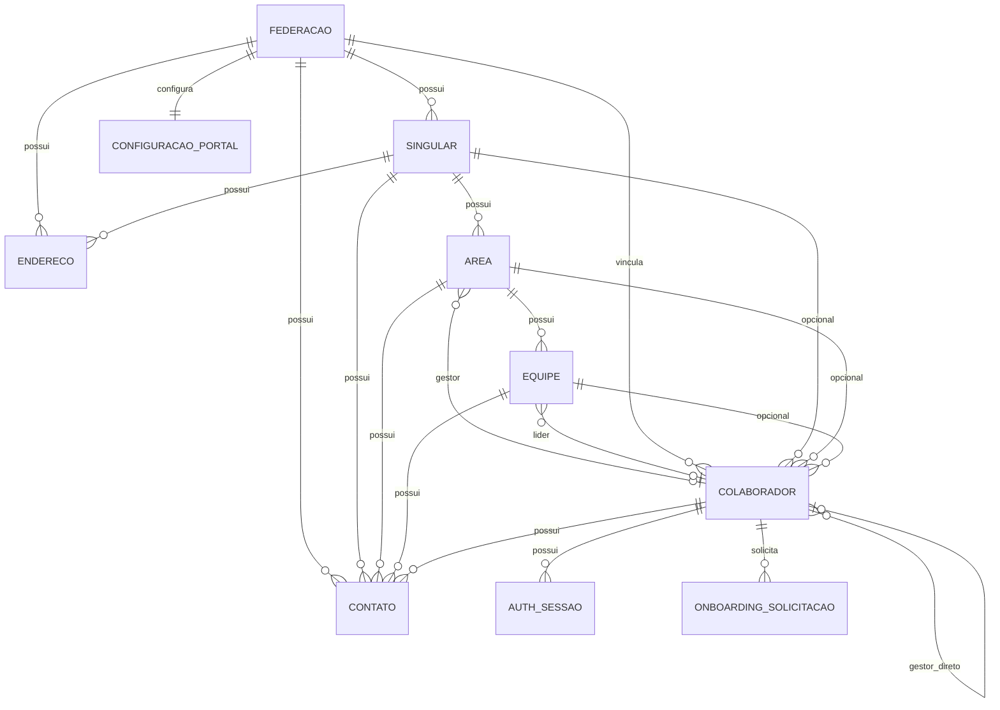

# Modelo Lógico de Dados

| Item | Valor |
|------|-------|
| Projeto | Portal de Comunicação |
| Schema lógico | UNMPORTCOM |
| Versão | 1.5 |
| Status | Approved |
| Baseline DDL | `database/ddl/` (2026-07-10) |
| Última atualização | 2026-07-10 |

---

## 1. Objetivo

Descrever entidades lógicas, atributos principais e cardinalidades do Portal de Comunicação, como ponte entre o modelo conceitual e o modelo físico Oracle.

Implementação física detalhada: `03-physical-model.md`. Conceitos de negócio: `02-conceptual-model.md`.

---

## 2. Visão geral — 23 entidades lógicas

| # | Entidade lógica | Domínio |
|---|-----------------|---------|
| 1 | FEDERACAO | Organização |
| 2 | SINGULAR | Organização |
| 3 | ENDERECO | Organização |
| 4 | CONTATO | Organização |
| 5 | AREA | Organização |
| 6 | EQUIPE | Organização |
| 7 | COLABORADOR | Organização |
| 8 | ONBOARDING_SOLICITACAO | Organização |
| 9 | CATEGORIA_DOCUMENTAL | Documental |
| 10 | PASTA | Documental |
| 11 | DOCUMENTO | Documental |
| 12 | ARQUIVO_BINARIO | Documental |
| 13 | DOCUMENTO_VERSAO | Documental |
| 14 | COMPARTILHAMENTO | Documental |
| 15 | AUTH_SESSAO | Controle de Acesso |
| 16 | PAPEL | Controle de Acesso |
| 17 | PAPEL_ATRIBUICAO | Controle de Acesso |
| 18 | PERMISSAO_PASTA | Controle de Acesso |
| 19 | SOLICITACAO_PERMISSAO | Controle de Acesso |
| 20 | REGISTRO_AUDITORIA | Controle de Acesso |
| 21 | COMUNICADO | Comunicação |
| 22 | NOTIFICACAO | Comunicação |
| 23 | CONFIGURACAO_PORTAL | Configuração |

---

## 3. Diagrama lógico — Organização e Autenticação



---

## 4. Entidades — Organização Corporativa

### FEDERACAO

| Atributo lógico | Obrigatório | Observação |
|-----------------|-------------|------------|
| COD_FEDERACAO | Sim | Identificador surrogate |
| NOM_FEDERACAO | Sim | Nome oficial |
| SIG_FEDERACAO | Sim | UK — sigla |
| COD_UNIMED | Sim | UK — código Unimed da federação |
| NUM_REGISTRO_ANS | Sim | Registro ANS |
| URL_SITE | Não | Site institucional |
| DSC_FEDERACAO | Não | Descrição institucional |
| FLG_ATIVO | Sim | S/N |
| DAT_CADASTRO | Sim | Auditoria |
| DAT_ATUALIZACAO | Não | Auditoria |

**Responsabilidade:** identidade institucional estável da federação. Sem endereços ou contatos embutidos (DEC-DB-013).

### SINGULAR

| Atributo lógico | Obrigatório | Observação |
|-----------------|-------------|------------|
| COD_SINGULAR | Sim | Identificador surrogate |
| COD_FEDERACAO | Sim | FK federação |
| NOM_SINGULAR | Sim | Nome da cooperativa |
| SIG_SINGULAR | Sim | UK — sigla |
| COD_UNIMED | Sim | UK — código Unimed (BR-014) |
| NUM_REGISTRO_ANS | Sim | Registro ANS |
| FLG_ATIVO | Sim | S/N |
| DAT_CADASTRO | Sim | Auditoria |
| DAT_ATUALIZACAO | Não | Auditoria |

**Responsabilidade:** identidade da cooperativa filiada. Registro ANS obrigatório (`NUM_REGISTRO_ANS`). Não duplica atributos institucionais da federação (site, descrição, etc.). Endereços e contatos em `ENDERECO` e `CONTATO` (DEC-DB-013).

### ENDERECO

| Atributo lógico | Obrigatório | Observação |
|-----------------|-------------|------------|
| COD_ENDERECO | Sim | PK surrogate |
| COD_FEDERACAO | Não | FK — exclusivo com COD_SINGULAR |
| COD_SINGULAR | Não | FK — exclusivo com COD_FEDERACAO |
| NOM_LOCAL | Sim | Nome amigável do local |
| TIP_ENDERECO | Sim | Classificação — validada na aplicação |
| DES_LOGRADOURO | Sim | Logradouro |
| NUM_ENDERECO | Não | Número |
| DES_COMPLEMENTO | Não | Complemento |
| NOM_BAIRRO | Sim | Bairro |
| NOM_CIDADE | Sim | Cidade |
| SIG_UF | Sim | UF |
| NUM_CEP | Sim | CEP |
| FLG_PRINCIPAL | Sim | S/N |
| DAT_CADASTRO | Sim | Auditoria |
| DAT_ATUALIZACAO | Não | Auditoria |

**Regra:** pertence a exatamente uma organização (federação ou singular) — `CK_ENDERECO_PROPRIETARIO`.

### CONTATO

| Atributo lógico | Obrigatório | Observação |
|-----------------|-------------|------------|
| COD_CONTATO | Sim | PK surrogate |
| COD_FEDERACAO | Não | FK — exclusivo com demais proprietários |
| COD_SINGULAR | Não | FK — exclusivo com demais proprietários |
| COD_AREA | Não | FK — exclusivo com demais proprietários |
| COD_EQUIPE | Não | FK — exclusivo com demais proprietários |
| COD_COLABORADOR | Não | FK — exclusivo com demais proprietários |
| TIP_CONTATO | Sim | Canal — validado na aplicação |
| DSC_CONTATO | Não | Descrição opcional |
| DES_VALOR | Sim | Telefone, e-mail ou WhatsApp |
| DES_HORARIO | Não | Horário de atendimento |
| FLG_PRINCIPAL | Sim | S/N |
| DAT_CADASTRO | Sim | Auditoria |
| DAT_ATUALIZACAO | Não | Auditoria |

**Regra:** pertence a exatamente um proprietário — `CK_CONTATO_PROPRIETARIO` (DEC-DB-015/016).

**Diretriz (DEC-DB-014/016):** único repositório de canais; sem entidades `EMAIL`, `PHONE`, `WHATSAPP`.

### AREA

| Atributo lógico | Obrigatório | Observação |
|-----------------|-------------|------------|
| COD_AREA | Sim | PK surrogate |
| COD_SINGULAR | Não | FK singular (nulo = área da federação) |
| NOM_AREA | Sim | Nome |
| SIG_AREA | Não | Sigla |
| DSC_AREA | Não | Descrição |
| COD_GESTOR | Não | FK colaborador gestor único (DEC-DB-015) |
| FLG_ATIVO | Sim | S/N |

Contatos: `CONTATO.COD_AREA`. Equipes: `EQUIPE.COD_AREA`.

### EQUIPE

| Atributo lógico | Obrigatório | Observação |
|-----------------|-------------|------------|
| COD_EQUIPE | Sim | PK surrogate |
| COD_AREA | Sim | FK área |
| NOM_EQUIPE | Sim | Nome |
| DSC_EQUIPE | Não | Descrição |
| COD_LIDER | Não | FK colaborador líder único (DEC-DB-015) |
| FLG_ATIVO | Sim | S/N |

Contatos: `CONTATO.COD_EQUIPE`. Membros: `COLABORADOR.COD_EQUIPE`.

### COLABORADOR

| Atributo lógico | Obrigatório | Observação |
|-----------------|-------------|------------|
| COD_COLABORADOR | Sim | Identificador surrogate |
| COD_FEDERACAO | Sim | FK federação |
| COD_SINGULAR | Não | Contexto organizacional |
| COD_AREA | Não | Contexto organizacional |
| COD_EQUIPE | Não | Contexto organizacional |
| COD_GESTOR | Não | FK gestor direto (auto-referência; DEC-DB-016) |
| NOM_COLABORADOR | Sim | Nome completo |
| DES_EMAIL | Sim | UK — e-mail de identidade/login (FT-AUTH) |
| ID_ZIMBRA | Sim | UK — identidade Zimbra (FT-AUTH) |
| DES_BIOGRAFIA | Não | Biografia (máx. 4000) |
| FLG_ATIVO | Sim | S/N |
| DAT_NASCIMENTO | Não | Data de nascimento |
| DAT_CONTRATACAO | Não | Data de contratação |
| DAT_ULTIMO_ACESSO | Não | Último acesso |
| DAT_CADASTRO | Sim | Auditoria |
| DAT_ATUALIZACAO | Não | Auditoria |

**Identidade do colaborador (versão atual):** `COD_COLABORADOR` (interno), `DES_EMAIL` (login FT-AUTH) e `ID_ZIMBRA` (quando disponível). Canais de comunicação em `CONTATO` (DEC-DB-016). Sem `NUM_MATRICULA` (DEC-DB-011).

**Canais do colaborador:** `CONTATO.COD_COLABORADOR` — telefone, celular, ramal, WhatsApp, e-mails adicionais.

### AUTH_SESSAO

| Atributo lógico | Obrigatório | Observação |
|-----------------|-------------|------------|
| COD_SESSAO | Sim | PK surrogate |
| ID_SESSAO | Sim | UK — session_id público |
| COD_COLABORADOR | Sim | FK colaborador |
| HASH_REFRESH_TOKEN | Sim | UK — hash SHA-256 |
| DES_DISPOSITIVO | Não | Dispositivo/navegador |
| FLG_REMEMBER_ME | Sim | S/N — TTL estendido |
| DAT_CRIACAO | Sim | Início da sessão |
| DAT_EXPIRACAO | Sim | Expiração do Refresh |
| FLG_REVOGADA | Sim | S/N |
| DAT_REVOGACAO | Não | Data da revogação |

**Cardinalidade:** COLABORADOR (1) ── (N) AUTH_SESSAO

---

## 5. Entidades — Gestão Documental

### Relacionamentos lógicos

```text
CATEGORIA_DOCUMENTAL 1 ── N DOCUMENTO
PASTA 1 ── N PASTA (hierarquia via COD_PASTA_PAI)
PASTA 1 ── N DOCUMENTO
DOCUMENTO 1 ── N DOCUMENTO_VERSAO
ARQUIVO_BINARIO 1 ── N DOCUMENTO_VERSAO
DOCUMENTO_VERSAO N ── 1 COLABORADOR (autor da versão)
COMPARTILHAMENTO → polimórfico (TIP_ORIGEM / TIP_DESTINATARIO)
```

---

## 6. Entidades — Controle de Acesso (autorização)

```text
PAPEL 1 ── N PAPEL_ATRIBUICAO
COLABORADOR 1 ── N PAPEL_ATRIBUICAO
PAPEL_ATRIBUICAO N ── 0..1 FEDERACAO / SINGULAR / AREA / EQUIPE (escopo)

PASTA 1 ── N PERMISSAO_PASTA
COLABORADOR 1 ── N SOLICITACAO_PERMISSAO
COLABORADOR 0 ── N REGISTRO_AUDITORIA
```

**Separação autenticação × autorização:**

| Função | Entidade lógica |
|--------|-----------------|
| Autenticação (quem está logado) | AUTH_SESSAO + COLABORADOR |
| Autorização (o que pode fazer) | PAPEL, PAPEL_ATRIBUICAO, PERMISSAO_PASTA |

---

## 7. Entidades — Comunicação

```text
COLABORADOR 1 ── N COMUNICADO
COLABORADOR 1 ── N NOTIFICACAO
COMUNICADO 1 ── N NOTIFICACAO (opcional, via eventos)
```

---

## 8. Rastreabilidade lógico → físico → DDL

Todas as entidades lógicas possuem correspondência 1:1 com tabelas físicas no baseline `ddl/003-create-tables.sql`.

| Verificação | Resultado |
|-------------|-----------|
| Entidades lógicas documentadas | 23 |
| Tabelas no DDL baseline | 23 |
| Sequences no DDL baseline | 23 |
| Divergências estruturais | 0 |

Detalhamento de colunas, índices e constraints: `03-physical-model.md` e scripts `ddl/004`–`ddl/006`.

---

## 9. Regras lógicas implementadas no banco

| Regra | Mecanismo |
|-------|-----------|
| Proprietário exclusivo de endereço | CK_ENDERECO_PROPRIETARIO |
| Proprietário exclusivo de contato | CK_CONTATO_PROPRIETARIO (5 proprietários) |
| Gestor direto do colaborador | COLABORADOR.COD_GESTOR → COLABORADOR |
| Gestor único de área | AREA.COD_GESTOR → COLABORADOR |
| Líder único de equipe | EQUIPE.COD_LIDER → COLABORADOR |
| E-mail único por colaborador | UK_COLABORADOR_EMAIL |
| Código Unimed único por singular | UK_SINGULAR_COD_UNIMED |
| Sigla única por singular | UK_SINGULAR_SIGLA |
| Identidade Zimbra única (quando informada) | UK_COLABORADOR_ZIMBRA |
| session_id único | UK_AUTH_SESSAO_ID |
| Refresh Token único (hash) | UK_AUTH_SESSAO_HASH |
| Sessão vinculada a colaborador existente | FK_AUTH_SESSAO_COLABORADOR |
| Versão única por documento | UK_DOCUMENTO_VERSAO + regra de domínio |

Regras exclusivas de domínio (sem constraint Oracle): ver `03-physical-model.md` § 6.

---

## 10. Artefatos relacionados

- `02-conceptual-model.md`
- `03-physical-model.md`
- `04-entity-catalog.md`
- `05-decisions-and-risks.md`
