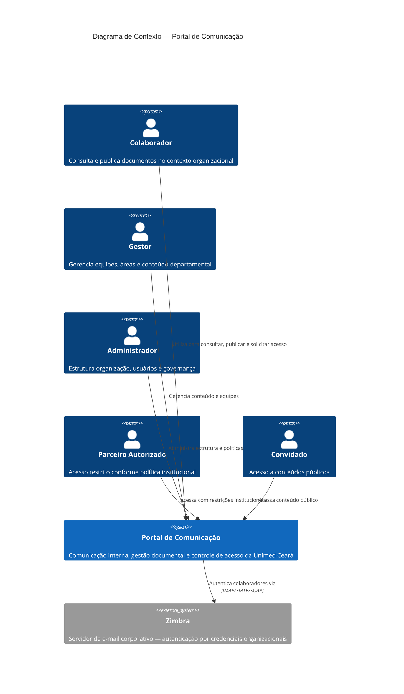

# System Context — Portal de Comunicação

## 1. Objetivo

Este documento descreve o **Portal de Comunicação** em seu contexto organizacional e de negócio. Consolida o conhecimento das camadas Discovery e Domain em uma visão arquitetural de alto nível, identificando propósito, atores, sistemas externos, fronteiras, responsabilidades e fluxos de valor.

Serve como primeiro artefato da camada Architecture e como base para os diagramas de contêineres e componentes subsequentes, sem reproduzir integralmente os artefatos de domínio.

**Rastreabilidade:** `docs/architecture/_summary/domain-summary.md`, `docs/architecture/_summary/discovery-summary.md`, `docs/domain/01-vision.md`, `docs/domain/05-bounded-contexts.md`, `docs/domain/06-context-map.md`.

---

## 2. Visão Geral do Sistema

O **Portal de Comunicação** é um sistema corporativo da **Unimed Ceará** voltado à **comunicação interna** e à **gestão documental** em uma organização de saúde cooperativa com estrutura **federativa multi-singular**.

### Missão da solução

Centralizar comunicação institucional, compartilhamento controlado de documentos, colaboração entre equipes e governança de acesso — permitindo que colaboradores autorizados acessem informações no contexto organizacional correto (singular, área, equipe ou pessoal), com rastreabilidade e confidencialidade.

### Contexto organizacional

O portal opera no ecossistema da Unimed Ceará, servindo unidades singulares da federação, suas áreas departamentais, equipes e colaboradores vinculados. A estrutura organizacional é pré-requisito upstream de todas as demais capacidades do sistema.

### Valor entregue

| Dimensão | Valor |
| -------- | ----- |
| Acesso unificado | Ponto único para documentos públicos e privados, conforme escopo organizacional |
| Governança | Controle de quem publica, consulta e aprova acesso por papéis e escopo |
| Rastreabilidade | Registro de eventos relevantes de controle de acesso e alterações |
| Comunicação | Notificação de eventos e canais de informação institucional aos colaboradores |
| Integração | Vinculação de novos colaboradores ao contexto organizacional adequado |

**Nível de confiança da visão:** Médio-Alto — núcleo organizacional, documental e de acesso estável; capacidades periféricas de comunicação interna com ressalvas documentadas.

---

## 3. Atores

Atores identificados e confirmados na documentação consolidada de Discovery e Domain.

| Ator | Tipo | Responsabilidade |
| ---- | ---- | ---------------- |
| Colaborador | Pessoa | Consulta e publica documentos conforme permissões; opera no contexto de singular, área e equipe |
| Gestor | Pessoa | Exerce gestão operacional em escopo departamental ou de equipe (ex.: administrador de área, proprietário de equipe) |
| Administrador | Pessoa | Estrutura a organização, usuários, políticas de acesso e auditoria em escopo global ou de singular |
| Parceiro Autorizado | Pessoa externa | Acessa o portal com restrições conforme política institucional da Unimed Ceará |
| Convidado | Pessoa externa | Acessa documentos e conteúdos públicos com perfil restrito |
| Responsável pelo recurso | Função (pessoa) | Aprova ou nega solicitações de acesso a recursos privados — pode ser exercida por colaborador ou gestor conforme escopo |

**Observações:**

- Papéis administrativos documentados (administrador global, de singular, de área, proprietário de equipe) consolidam-se nas categorias **Administrador** e **Gestor**, conforme escopo de atuação.
- A distinção operacional entre **Parceiro Autorizado** e **Convidado** permanece em aberto (OQ-002).

---

## 4. Sistemas Externos

Sistemas externos identificados na documentação consolidada. Integrações técnicas não inventadas; ausência de evidência registrada explicitamente.

| Sistema | Tipo | Relação |
| ------- | ---- | ------- |
| Zimbra (e-mail corporativo) | Provedor de identidade / autenticação | Autentica colaboradores por credenciais de e-mail corporativo da organização |
| Sistema destino de webhook (opcional) | Canal de notificação externo | Pode receber notificações do portal quando configurado por destinatário — implementação parcial documentada |

**Não identificados na documentação consolidada:** LDAP, Active Directory, SSO corporativo unificado ou outros sistemas externos de RH/ERP.

---

## 5. Fronteira do Sistema

### O que pertence ao Portal

| Responsabilidade | Descrição arquitetural |
| ---------------- | ---------------------- |
| Estrutura organizacional | Manutenção da hierarquia federação → singular → área → equipe e vínculos de colaboradores |
| Gestão documental | Publicação, organização em pastas hierárquicas, visibilidade e compartilhamento de documentos |
| Controle de acesso | Papéis, autorização por escopo, solicitações de permissão, auditoria e sessão autenticada |
| Comunicação interna | Notificações, comunicados, canais de publicação e busca transversal de conteúdo |
| Onboarding | Integração de novos colaboradores ao contexto organizacional (singular e área) |
| Configuração institucional | Parâmetros e metadados do portal |

### O que não pertence ao Portal

| Exclusão | Motivo |
| -------- | ------ |
| Gestão de identidade corporativa (provisionamento de contas de e-mail) | Responsabilidade do provedor de e-mail corporativo (Zimbra) |
| Estrutura organizacional mestre fora do portal | O portal mantém representação operacional da hierarquia; não é sistema de RH ou ERP |
| Conteúdo produzido fora do portal | Documentos importados ou referenciados são artefatos gerenciados, não originados externamente de forma integrada |
| Políticas institucionais de confidencialidade | O portal aplica restrições; a definição da política é organizacional, externa ao sistema |
| Sistemas de mensageria corporativa além do escopo documentado | Canais não mapeados na documentação consolidada |

### Responsabilidades arquiteturais de alto nível

O Portal de Comunicação é o **sistema orquestrador** do ecossistema de comunicação interna da Unimed Ceará. Ele **consome** identidade corporativa do Zimbra, **mantém** a representação organizacional e documental, **governa** o acesso efetivo aos recursos e **comunica** eventos relevantes aos colaboradores. Não substitui sistemas corporativos de identidade, RH ou ERP.

---

## 6. Fluxos de Valor Principais

Fluxos documentados no fluxo de valor consolidado (Discovery e Domain). Sequência de negócio, não de implementação.

### 6.1 Integração de colaborador

1. Colaborador acessa o portal com identidade corporativa (e-mail da organização).
2. Se novo usuário, passa pelo **onboarding** para vincular-se à singular e área adequadas.
3. Sistema estabelece **contexto organizacional** e **papel** do colaborador.
4. Evento de negócio: **Colaborador Integrado** — pré-requisito para acesso a recursos organizacionais (BR-011).

*Incerteza: fluxo oficial de onboarding não consolidado (OQ-001).*

### 6.2 Publicação e disponibilização de conteúdo

1. Colaborador ou gestor publica documento em pasta no escopo organizacional adequado.
2. Sistema classifica **visibilidade** e define **compartilhamento** (audiência autorizada).
3. Conteúdo fica disponível conforme escopo (público, singular, área, pessoal).
4. Eventos: **Documento Publicado**, **Compartilhamento Definido**.

### 6.3 Consumo de informação

1. Colaborador navega na estrutura organizacional.
2. Consulta documentos e pastas conforme visibilidade, compartilhamento e permissões efetivas.
3. Busca unificada permite localização transversal em documentos, áreas, singulares e colaboradores.

### 6.4 Solicitação e concessão de acesso

1. Colaborador sem permissão direta solicita acesso a recurso privado.
2. **Responsável pelo recurso** aprova ou nega a solicitação.
3. Sistema concede ou mantém restrição de acesso.
4. Colaborador é **notificado** do resultado.
5. Eventos: **Solicitação de Permissão Registrada**, **Permissão Concedida**, **Notificação Emitida**.

*Incerteza: fluxo de ponta a ponta e revogação não confirmados (OQ-003, OQ-006).*

### 6.5 Comunicação institucional

1. Administrador ou gestor publica comunicado ou conteúdo em canal interno (ex.: Fique por Dentro).
2. Colaboradores recebem informação institucional no portal.
3. Notificações comunicam eventos relevantes (ex.: resultado de solicitação de permissão).

*Incerteza: fronteira entre comunicado como documento e como publicação institucional (OQ-004); canais periféricos com confiança documentada como baixa a média.*

### 6.6 Governança e auditoria

1. Administradores estruturam singulares, áreas, equipes e colaboradores.
2. Definem políticas de acesso e papéis por escopo.
3. **Auditoria** registra eventos de controle de acesso e alterações relevantes.

---

## 7. Contexto Arquitetural

Quatro domínios de negócio identificados na camada Domain, com responsabilidades em nível arquitetural. Não reproduzem os artefatos Domain; consolidam posicionamento para decisões de contêineres e componentes.

### Organização Corporativa

**Responsabilidade arquitetural:** Contexto upstream. Define e mantém a hierarquia federativa (federação, singular, área, equipe), vínculos de colaboradores e processo de onboarding. Todos os demais domínios dependem de sua estrutura.

**Posição no mapa:** Produtor de contexto organizacional; não depende conceitualmente dos demais contextos.

### Gestão Documental

**Responsabilidade arquitetural:** Núcleo de conteúdo. Publica, organiza e classifica documentos e pastas; define visibilidade, compartilhamento e quotas de armazenamento. Objeto principal do portal como repositório de comunicação interna.

**Dependências:** Organização Corporativa (escopo); Controle de Acesso (autorização efetiva).

### Controle de Acesso

**Responsabilidade arquitetural:** Governança operacional. Atribui papéis, autentica via identidade corporativa, processa solicitações de permissão, registra auditoria e administra perfis restritos (convidado, parceiro autorizado).

**Dependências:** Organização Corporativa (escopo de autorização); governa Gestão Documental.

### Comunicação Interna

**Responsabilidade arquitetural:** Camada de suporte e engajamento. Notifica colaboradores, disponibiliza canais de publicação institucional e busca transversal. Depende dos três contextos centrais.

**Posição no mapa:** Contexto de suporte com menor nível de confiança documentada; capacidades periféricas (Central de Colaboração, métricas administrativas) sem escopo de negócio estabilizado.

### Sequência de dependência de negócio

```
Organização Corporativa → Gestão Documental → Controle de Acesso → Comunicação Interna
```

---

## 8. Restrições Arquiteturais Conhecidas

### Dependências organizacionais

| Restrição | Impacto arquitetural |
| --------- | -------------------- |
| Estrutura federativa multi-singular | Modelagem de escopo em todos os domínios; compartilhamento por federação, singular e área |
| Identidade corporativa por e-mail | Autenticação depende de provedor externo (Zimbra); domínios de e-mail corporativos |
| Política de confidencialidade interna | Acesso restrito a colaboradores e parceiros autorizados; conteúdo de uso profissional |

### Dependências funcionais

| Restrição | Impacto arquitetural |
| --------- | -------------------- |
| Colaborador integrado antes de recursos organizacionais (BR-011) | Onboarding é gate obrigatório no fluxo de valor |
| Documento com visibilidade definida (BR-019) | Classificação de exposição é invariante de publicação |
| Compartilhamento define audiência (BR-020) | Separação entre audiência documentada e acesso efetivo requer coordenação entre Gestão Documental e Controle de Acesso |
| Solicitação e concessão de permissões (BR-029 a BR-032) | Fluxo formal de acesso a recursos privados com responsável pelo recurso |

### Restrições de negócio

| Restrição | Impacto arquitetural |
| --------- | -------------------- |
| Autorização por papel e contexto organizacional | Decisões de acesso dependem de singular, área e equipe |
| Colaborador sem área vinculada pode ser impedido de operar | Validação de pré-condição organizacional em múltiplos fluxos |
| Quota de armazenamento por colaborador | Limite de publicação documental por usuário |

### Limitações identificadas

| Limitação | Origem |
| --------- | ------ |
| Capacidades parciais: onboarding, solicitação de permissões, comunicados, convidados, busca global | Discovery — status PARCIAL em módulos |
| Comunicação Interna com confiança baixa a média | Domain — aggregate e eventos periféricos não estabilizados |
| Dois fluxos de onboarding coexistentes (seleção direta vs. solicitação com aprovação) | Conflito documentado entre modelos de integração |
| Ausência de processo formal de revogação de permissão | Lacuna de ciclo de vida em Controle de Acesso |

---

## 9. Questões Arquiteturais em Aberto

Questões selecionadas de `docs/domain/10-open-questions.md` com impacto direto em fronteiras, integrações ou modelagem arquitetural. Nenhuma questão nova criada neste documento.

| ID | Questão | Impacto arquitetural |
| -- | ------- | -------------------- |
| OQ-001 | Qual é o fluxo oficial de onboarding: seleção direta de singular/área ou solicitação com aprovação administrativa? | Define gate de entrada e pré-requisitos do fluxo de valor |
| OQ-002 | Parceiro autorizado e convidado são perfis distintos? Quais critérios de elegibilidade e permissões aplicam a cada um? | Fronteira de acesso externo e modelagem de identidade |
| OQ-003 | O fluxo de solicitação de permissão opera de ponta a ponta (registro → decisão → notificação)? | Validação do fluxo central de concessão de acesso |
| OQ-004 | Comunicado é categoria de documento, publicação institucional independente ou ambos com regras distintas? | Fronteira entre Gestão Documental e Comunicação Interna |
| OQ-005 | Compartilhamento definido em Gestão Documental e acesso efetivo em Controle de Acesso devem ser sempre equivalentes? | Risco de inconsistência entre exposição e autorização |
| OQ-006 | Existe processo formal de revogação de permissão após Permissão Concedida? | Ciclo de vida de acesso incompleto |
| OQ-007 | Quais pré-condições de negócio definem o evento Colaborador Integrado em cada modelo de onboarding? | Critérios de integração variam conforme fluxo oficial |
| OQ-011 | Como alterar compartilhamento ou visibilidade após publicação de documento ou pasta? | Processos de manutenção documental pós-publicação |
| OQ-012 | Quais regras de herança de permissões ou visibilidade aplicam-se na hierarquia de pastas? | Modelagem de hierarquia documental e propagação de acesso |
| OQ-013 | Federação como escopo de compartilhamento é equivalente à federação como estrutura organizacional? | Vocabulário com duplo sentido afeta escopo de audiência |
| OQ-016 | Quem é o responsável pelo recurso em cada escopo (pessoal, área, singular, federação)? | Pré-requisito para fluxo de solicitação de permissão |
| OQ-017 | Existe evento e regra de negócio para revogação ou expiração de permissão concedida? | Complemento de OQ-006; ciclo de vida de autorização |
| OQ-020 | Papéis administrativos possuem limites de ação documentados por escopo? | Governança administrativa e matriz de permissões |
| OQ-021 | Qual é o escopo de negócio da Central de Colaboração além do nome de interface? | Decisão de investimento arquitetural em capacidade periférica |
| OQ-023 | Fique por Dentro possui processo de publicação, aprovação e audiência formalizado? | Modelagem de canal interno com baixa confiança |

---

## 10. Diagrama de Contexto (Mermaid)

Diagrama no nível C4 Context: sistema central, atores humanos e sistemas externos com relações principais.



---

## Fontes Utilizadas

### Fonte primária (resumos Architecture)

- `docs/architecture/_summary/domain-summary.md`
- `docs/architecture/_summary/discovery-summary.md`
- `docs/architecture/00-architecture-index.md`

### Fonte secundária (aprofundamento)

- `docs/domain/01-vision.md`
- `docs/domain/05-bounded-contexts.md`
- `docs/domain/06-context-map.md`
- `docs/domain/10-open-questions.md`
- `docs/discovery/05-current-integrations.md` — sistemas externos corporativos (Zimbra)

*Nenhum código-fonte, banco de dados, API implementada ou infraestrutura foi analisado para a construção deste artefato.*

---

## Nível de Confiança

**Médio-Alto**

| Faixa | Escopo |
| ----- | ------ |
| Alto | Propósito do sistema, atores centrais, domínios núcleo, fluxo de valor principal, fronteira com Zimbra |
| Médio | Atores externos (parceiro vs. convidado), fluxos de permissão e onboarding, Comunicação Interna |
| Baixo | Sistemas externos além do Zimbra; canais periféricos de comunicação |

Este documento consolida conhecimento suficiente para iniciar `02-container-diagram.md` e `03-component-diagram.md`, com incertezas registradas explicitamente nas seções 9 e nas notas dos fluxos.
