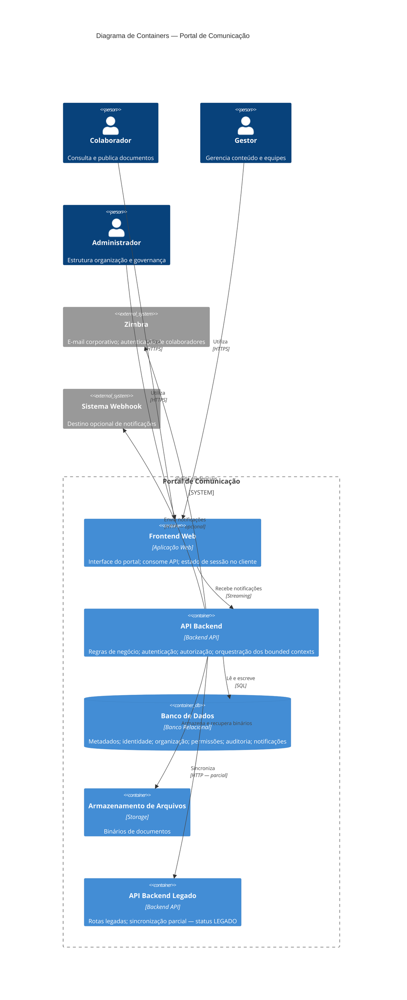

# Container Diagram — Portal de Comunicação

## 1. Objetivo

Este documento decompõe o **Portal de Comunicação** no segundo nível do modelo C4 (Container Diagram). Identifica os containers arquiteturais que compõem a solução, suas responsabilidades, comunicação entre si e mapeamento dos bounded contexts de negócio.

Consolida o `01-system-context.md` com o conhecimento documentado em Discovery e Domain, estabelecendo fronteiras internas estáveis para o diagrama de componentes subsequente.

**Rastreabilidade:** `docs/architecture/01-system-context.md`, `docs/architecture/_summary/domain-summary.md`, `docs/architecture/_summary/discovery-summary.md`, `docs/discovery/07-current-architecture.md`, `docs/discovery/05-current-integrations.md`.

---

## 2. Visão Geral dos Containers

O Portal de Comunicação é uma **aplicação web distribuída** composta por containers que separam apresentação, lógica de negócio, persistência estruturada e armazenamento de arquivos. A documentação consolidada identifica uma arquitetura centrada em uma **API Backend principal** que concentra regras de negócio, autenticação, autorização e integração com sistemas externos.

### Containers identificados

| Container | Papel na arquitetura |
| --------- | -------------------- |
| Frontend Web | Interface com atores; consome API; mantém estado de sessão no cliente |
| API Backend | Aplicação servidor principal; expõe API REST; orquestra domínios de negócio |
| Banco de Dados | Persistência relacional de metadados, identidade, estrutura organizacional e transações |
| Armazenamento de Arquivos | Persistência de binários de documentos |
| API Backend Legado | Aplicação servidor legada; coexistência documentada com status LEGADO |

### Limites arquiteturais

- O **Frontend Web** não contém regras de negócio; delega decisões à API Backend.
- A **API Backend** é o ponto de convergência dos quatro bounded contexts; não há decomposição em microsserviços documentada.
- **Banco de Dados** e **Armazenamento de Arquivos** são containers de persistência distintos: metadados versus binários.
- A **API Backend Legado** permanece referenciada na documentação com acoplamento parcial; não é tratada como container principal.
- **Serviço de autenticação** externo (Zimbra) e **entrega de notificações** não constituem containers internos separados: a documentação consolida autenticação corporativa no Zimbra (externo) e notificações na API Backend, sem serviço de notificação independente documentado.

**Nível de confiança:** Médio-Alto para containers centrais; Médio para API Backend Legado e capacidades parciais.

---

## 3. Catálogo de Containers

Containers sustentados pela documentação consolidada (Discovery e System Context). Tipos conforme definição C4.

| Container | Tipo | Responsabilidade |
| --------- | ---- | ---------------- |
| Frontend Web | Aplicação Web | Interface do portal; navegação; consumo de API; apresentação de documentos, organização e notificações |
| API Backend | Backend API | API REST principal; regras de negócio; autenticação e autorização; orquestração de domínios; notificações e auditoria |
| Banco de Dados | Banco de Dados | Persistência relacional de usuários, estrutura organizacional, metadados documentais, permissões, auditoria e notificações |
| Armazenamento de Arquivos | Storage | Armazenamento e recuperação de binários de documentos |
| API Backend Legado | Backend API | Rotas HTTP legadas; sincronização parcial com API Backend principal — status LEGADO documentado |
| Zimbra | Serviço Externo | Autenticação de colaboradores por credenciais de e-mail corporativo |
| Sistema destino de webhook | Serviço Externo | Recebimento opcional de notificações configuradas por destinatário — implementação parcial |

---

## 4. Mapeamento dos Bounded Contexts

| Bounded Context | Container Responsável | Racional |
| --------------- | --------------------- | -------- |
| Organização Corporativa | API Backend (primário); Banco de Dados (persistência) | Hierarquia federativa, vínculos de colaboradores e onboarding são expostos e mantidos pela API principal |
| Gestão Documental | API Backend (primário); Banco de Dados (metadados); Armazenamento de Arquivos (binários) | Publicação, pastas, visibilidade e compartilhamento exigem coordenação entre lógica de negócio e duas formas de persistência |
| Controle de Acesso | API Backend (primário); Banco de Dados (persistência); Zimbra (autenticação externa) | Papéis, permissões, solicitações e auditoria residem na API; identidade corporativa validada externamente |
| Comunicação Interna | API Backend (primário); Frontend Web (consumo e streaming); Banco de Dados (notificações) | Notificações, busca e canais internos originam-se na API; Frontend recebe atualizações e exibe conteúdo |

### Racional arquitetural

A documentação consolidada descreve arquitetura **monolítica modular** na camada de aplicação: uma API Backend central hospeda os quatro bounded contexts, sem separação documentada em serviços independentes por domínio. O Frontend Web atua exclusivamente como camada de apresentação.

A fronteira sensível entre **Gestão Documental** e **Controle de Acesso** (compartilhamento versus autorização efetiva) materializa-se como coordenação interna na API Backend, não como containers distintos. A **Comunicação Interna** depende dos demais contextos e consome dados produzidos por Organização Corporativa, Gestão Documental e Controle de Acesso.

---

## 5. Fluxos Entre Containers

Fluxos em alto nível. Sequência entre containers, sem detalhes de implementação.

### Fluxo de autenticação

1. Ator acessa o **Frontend Web** e informa credenciais corporativas.
2. **Frontend Web** encaminha solicitação à **API Backend**.
3. **API Backend** valida credenciais no **Zimbra**.
4. **API Backend** estabelece sessão autenticada (token) e persiste contexto em **Banco de Dados**.
5. **Frontend Web** armazena token e passa a incluir credenciais nas requisições subsequentes.

*Incerteza: coexistência de mecanismos de autenticação documentada (OQ implícita em duplicidade JWT na Discovery).*

### Fluxo de publicação documental

1. Colaborador ou gestor envia documento e metadados via **Frontend Web**.
2. **Frontend Web** transmite à **API Backend** (visibilidade, compartilhamento, escopo organizacional).
3. **API Backend** valida autorização e quota; persiste metadados no **Banco de Dados**.
4. **API Backend** armazena binário no **Armazenamento de Arquivos**.
5. **API Backend** confirma publicação ao **Frontend Web**.

### Fluxo de consulta documental

1. Ator navega estrutura organizacional e documentos no **Frontend Web**.
2. **Frontend Web** solicita listagem e conteúdo à **API Backend**.
3. **API Backend** consulta **Banco de Dados** (metadados, permissões, escopo).
4. **API Backend** avalia autorização conforme papel e contexto organizacional.
5. Para download, **API Backend** recupera binário do **Armazenamento de Arquivos** e disponibiliza ao **Frontend Web**.

### Fluxo de solicitação de permissão

1. Colaborador solicita acesso a recurso privado via **Frontend Web**.
2. **Frontend Web** registra pedido na **API Backend**.
3. **API Backend** persiste solicitação no **Banco de Dados** e identifica responsável pelo recurso.
4. Responsável aprova ou nega via **Frontend Web** → **API Backend**.
5. **API Backend** atualiza permissões no **Banco de Dados** e emite notificação.
6. **Frontend Web** do solicitante recebe notificação (consulta ou streaming).

*Incerteza: fluxo de ponta a ponta com persistência completa não confirmado (OQ-003); endpoints referenciados no Frontend sem correspondência documentada na API.*

### Fluxo de comunicação institucional

1. Administrador ou gestor publica comunicado ou conteúdo em canal interno via **Frontend Web**.
2. **Frontend Web** envia à **API Backend**.
3. **API Backend** persiste no **Banco de Dados** (ou como documento com categoria específica — fronteira em aberto).
4. **API Backend** notifica colaboradores: persistência em **Banco de Dados** e entrega via streaming ao **Frontend Web**.
5. Canais opcionais: **API Backend** pode enviar para **Sistema destino de webhook** ou e-mail corporativo.

*Incerteza: fronteira comunicado documento versus publicação institucional (OQ-004); canais periféricos com confiança baixa a média.*

---

## 6. Dependências Externas

| Sistema Externo | Relação |
| --------------- | ------- |
| Zimbra (e-mail corporativo) | API Backend valida credenciais de colaboradores durante autenticação |
| Sistema destino de webhook | API Backend envia notificações HTTP quando configurado por destinatário — parcial |
| Servidor de e-mail (via canal interno) | API Backend pode encaminhar notificações por e-mail — parcial |

**Não identificados:** LDAP, Active Directory, SSO unificado, ERP, RH ou outros sistemas corporativos além dos listados.

---

## 7. Responsabilidades por Container

### Frontend Web

#### Objetivo

Prover interface web para todos os atores interagirem com o portal.

#### Responsabilidades

- Apresentar telas de login, onboarding, navegação organizacional, documentos, pastas e administração.
- Consumir API REST da API Backend com credenciais de sessão.
- Manter estado de autenticação e contexto organizacional no cliente.
- Receber notificações em tempo real (streaming).
- Executar busca unificada via composição de chamadas à API.

#### Dados Mantidos

- Token de sessão e preferências de interface no cliente (não persistência primária de negócio).

#### Dependências

- API Backend (obrigatória).
- Nenhuma dependência direta a Banco de Dados, Armazenamento ou Zimbra.

#### Observações

- Referências a endpoints sem implementação correspondente na API Backend documentadas (capacidades parciais/órfãs).
- Guards de autorização no cliente documentados como permissivos; decisão efetiva na API Backend.

---

### API Backend

#### Objetivo

Centralizar lógica de negócio, exposição de API e orquestração dos bounded contexts.

#### Responsabilidades

- Expor API REST para todos os módulos funcionais documentados.
- Autenticar via Zimbra; emitir e validar tokens de sessão.
- Implementar RBAC, ACL por recurso, solicitações de permissão e auditoria.
- Gerenciar estrutura organizacional (singulares, áreas, equipes, colaboradores, onboarding).
- Publicar, organizar e controlar documentos e pastas (visibilidade, compartilhamento, quotas).
- Emitir e entregar notificações (banco, streaming, canais opcionais).
- Sincronizar parcialmente com API Backend Legado quando configurado.

#### Dados Mantidos

- Não mantém dados próprios; persiste via Banco de Dados e Armazenamento de Arquivos.

#### Dependências

- Banco de Dados (obrigatória).
- Armazenamento de Arquivos (obrigatória para documentos).
- Zimbra (obrigatória para autenticação corporativa).
- API Backend Legado (opcional, parcial).
- Sistemas externos de notificação (opcionais).

#### Observações

- Container principal; hospeda os quatro bounded contexts.
- Subsistemas de notificação duplicados documentados na persistência.
- Módulos com status PARCIAL: solicitação de permissões, onboarding, comunicados, convidados, busca global, analytics.

---

### Banco de Dados

#### Objetivo

Persistir dados estruturados e transacionais do portal.

#### Responsabilidades

- Armazenar identidade de usuários, papéis, vínculos organizacionais.
- Persistir metadados de singulares, áreas, equipes, documentos e pastas.
- Registrar permissões, solicitações, auditoria e notificações.
- Suportar cache transacional documentado.

#### Dados Mantidos

- Usuários e metadados organizacionais.
- Documentos e pastas (metadados; binários no Armazenamento).
- Permissões, solicitações, registros de auditoria.
- Notificações in-app (dois subsistemas paralelos documentados).
- Configurações institucionais do portal.

#### Dependências

- Nenhuma dependência de outros containers do portal (é dependência, não consumidor).

#### Observações

- Banco relacional externo à aplicação documentado na Discovery.
- Entidades referenciadas no Frontend sem persistência confirmada (solicitação de permissão, analytics, comunicados).

---

### Armazenamento de Arquivos

#### Objetivo

Persistir binários de documentos de forma durável.

#### Responsabilidades

- Armazenar arquivos enviados na publicação documental.
- Disponibilizar binários para download autorizado.
- Organizar arquivos conforme estrutura documental definida pela API Backend.

#### Dados Mantidos

- Binários de documentos referenciados por metadados no Banco de Dados.

#### Dependências

- Referenciado exclusivamente pela API Backend.

#### Observações

- Separação explícita entre metadados (Banco de Dados) e binários (Armazenamento).
- Volume de armazenamento sujeito a quotas por colaborador (BR-023).

---

### API Backend Legado

#### Objetivo

Manter rotas HTTP legadas em coexistência com a API Backend principal.

#### Responsabilidades

- Expor rotas de autenticação, documentos e pastas em formato legado.
- Receber sincronização de usuários e tokens da API Backend principal.

#### Dados Mantidos

- Persistência própria não detalhada na documentação consolidada.

#### Dependências

- Acoplamento parcial com API Backend via sincronização.

#### Observações

- Status **LEGADO** documentado; não é caminho principal do fluxo de valor.
- Implementação fonte ausente na validação Discovery; impacto arquitetural em consolidação futura.

---

## 8. Restrições Arquiteturais

Consolidação de restrições já documentadas em System Context, Domain e Discovery. Sem novas restrições inventadas.

### Restrições organizacionais

| Restrição | Impacto nos containers |
| --------- | ------------------------ |
| Estrutura federativa multi-singular | API Backend e Banco de Dados modelam escopo em todos os fluxos |
| Identidade corporativa por e-mail | API Backend depende obrigatoriamente do Zimbra |
| Confidencialidade institucional | API Backend aplica autorização antes de qualquer entrega ao Frontend |

### Restrições funcionais

| Restrição | Impacto nos containers |
| --------- | ------------------------ |
| Colaborador integrado antes de recursos (BR-011) | API Backend valida onboarding antes de operações organizacionais |
| Visibilidade e compartilhamento definidos (BR-019, BR-020) | API Backend coordena metadados no Banco e entrega condicionada |
| Solicitação e concessão de permissões (BR-029 a BR-032) | Fluxo entre Frontend e API Backend com persistência em Banco de Dados |

### Dependências externas

| Dependência | Container impactado |
| ----------- | ------------------- |
| Zimbra | API Backend — autenticação bloqueada sem disponibilidade |
| Banco de Dados externo | API Backend — indisponibilidade impede operação |
| Armazenamento de Arquivos | API Backend — publicação e download de documentos comprometidos |

### Limitações identificadas

| Limitação | Impacto |
| --------- | ------- |
| API Backend Legado coexistindo com API principal | Duplicidade de rotas; acoplamento via sincronização |
| Endpoints órfãos no Frontend | Expectativa de capacidade sem container de backend correspondente |
| Dois subsistemas de notificação no Banco de Dados | Complexidade na Comunicação Interna |
| Mecanismos de autenticação duplicados documentados | Incerteza na fronteira de sessão |
| Capacidades PARCIAL em múltiplos módulos | Fluxos incompletos entre Frontend e API Backend |
| Manutenção ou descomissionamento da API Backend Legado | Reduz containers e acoplamentos — decisão de consolidação pendente |
| Unificação dos subsistemas de notificação | Simplifica Banco de Dados e API Backend — decisão de consolidação pendente |
| Resolução de endpoints órfãos no Frontend | Alinha Frontend Web com API Backend — decisão de consolidação pendente |

---

## 9. Decisões Arquiteturais Pendentes

Questões de `docs/domain/10-open-questions.md` com impacto direto em containers. Nenhuma questão nova criada.

| ID | Questão | Impacto em containers |
| -- | ------- | --------------------- |
| OQ-001 | Fluxo oficial de onboarding: seleção direta ou solicitação com aprovação? | Define interação Frontend ↔ API Backend no ingresso |
| OQ-002 | Parceiro autorizado e convidado são perfis distintos? | Modelagem de identidade e autorização na API Backend |
| OQ-003 | Fluxo de solicitação de permissão opera de ponta a ponta? | Valida existência de persistência e rotas na API Backend |
| OQ-004 | Comunicado é documento, publicação independente ou ambos? | Distribuição de responsabilidade entre API Backend (Gestão Documental vs. Comunicação Interna) |
| OQ-005 | Compartilhamento e acesso efetivo devem ser equivalentes? | Coordenação interna na API Backend entre módulos documentais e de acesso |
| OQ-006 | Existe revogação formal de permissão concedida? | Ciclo de vida de dados no Banco de Dados e fluxo API Backend |
| OQ-011 | Como alterar compartilhamento ou visibilidade após publicação? | Operações de manutenção na API Backend e Banco de Dados |
| OQ-012 | Regras de herança na hierarquia de pastas? | Lógica de autorização e metadados no Banco de Dados |
| OQ-013 | Federação no compartilhamento equivale à federação organizacional? | Escopo de consultas na API Backend |
| OQ-016 | Quem é responsável pelo recurso em cada escopo? | Roteamento de solicitações na API Backend |
| OQ-017 | Existe evento de revogação ou expiração de permissão? | Modelo de persistência no Banco de Dados |
| OQ-020 | Limites de ação dos papéis administrativos por escopo? | Matriz de autorização na API Backend |
| OQ-021 | Escopo de negócio da Central de Colaboração? | Decisão de manter ou remover capacidade no Frontend/API Backend |
| OQ-023 | Fique por Dentro possui processo formalizado? | Container e persistência do canal interno |

---

## 10. Diagrama C4 Container (Mermaid)

Diagrama no nível C4 Container: atores, boundary do portal, containers internos e sistemas externos.

---

## Fontes Utilizadas

### Fonte primária (Architecture)

- `docs/architecture/01-system-context.md`
- `docs/architecture/_summary/domain-summary.md`
- `docs/architecture/_summary/discovery-summary.md`
- `docs/architecture/00-architecture-index.md`

### Fonte secundária (aprofundamento)

- `docs/discovery/07-current-architecture.md`
- `docs/discovery/05-current-integrations.md`
- `docs/domain/10-open-questions.md`

*Nenhum código-fonte, schema de banco de dados, docker-compose, kubernetes, terraform ou infraestrutura implantada foi analisado para a construção deste artefato.*

---

## Nível de Confiança

**Médio-Alto**

| Faixa | Escopo |
| ----- | ------ |
| Alto | Frontend Web, API Backend, Banco de Dados, Armazenamento de Arquivos, Zimbra, fluxos centrais de autenticação e documentos |
| Médio | API Backend Legado, fluxos de permissão e onboarding, Comunicação Interna, endpoints órfãos |
| Baixo | Consolidação futura da API Backend Legado; canais periféricos de comunicação |

Este documento estabelece fronteiras de containers estáveis para `03-component-diagram.md`, com decisões pendentes registradas na seção 9.
