# Component Diagram — Portal de Comunicação

## 1. Objetivo

Este documento decompõe os containers definidos em `02-container-diagram.md` no terceiro nível do modelo C4 (Component Diagram). Identifica os **componentes arquiteturais** — capacidades de negócio — responsáveis por implementar as funcionalidades do Portal de Comunicação, suas colaborações internas e mapeamento aos bounded contexts de domínio.

O documento permanece **independente de tecnologia**: componentes representam capacidades, não classes, frameworks ou estruturas de persistência física.

**Rastreabilidade:** `docs/architecture/02-container-diagram.md`, `docs/architecture/_summary/domain-summary.md`, `docs/domain/05-bounded-contexts.md`, `docs/domain/06-context-map.md`, `docs/domain/08-aggregates.md`, `docs/discovery/01-current-modules.md`.

---

## 2. Visão Geral dos Componentes

A decomposição interna concentra-se no container **API Backend**, onde residem os quatro bounded contexts documentados. O **Frontend Web** expõe capacidades de apresentação que consomem a API sem replicar regras de negócio. Containers de persistência (**Banco de Dados**, **Armazenamento de Arquivos**) não contêm componentes de negócio — são dependências dos componentes da API Backend.

### Componentes identificados

| Agrupamento | Quantidade | Confiança |
| ----------- | ---------- | --------- |
| Organização Corporativa | 6 | Alto (1 parcial) |
| Gestão Documental | 5 | Alto |
| Controle de Acesso | 8 | Alto (2 parciais) |
| Comunicação Interna | 6 | Médio (5 parciais) |
| Transversal | 1 | Alto |
| Frontend Web (apresentação) | 4 | Alto |

**Total:** 30 componentes catalogados.

### Agrupamento por domínio

Componentes seguem os bounded contexts aprovados em Domain. Cada componente implementa uma ou mais capacidades funcionais documentadas na Discovery, traduzidas para vocabulário de negócio.

### Limites arquiteturais

- Componentes **não** cruzam fronteiras de aggregate sem dependência explícita documentada.
- **Gestão de Compartilhamento** (Gestão Documental) e **Autorização** (Controle de Acesso) são componentes distintos com fronteira sensível documentada.
- **Busca Unificada** consulta outros componentes sem possuir os conceitos que indexa.
- Componentes com status **PARCIAL** na Discovery permanecem catalogados com ressalva de maturidade.

---

## 3. Componentes da API Backend

### Organização Corporativa

Componentes responsáveis pela hierarquia federativa, vínculos de colaboradores e integração ao contexto organizacional. Aggregate de referência: **Organização Corporativa**.

| Componente | Responsabilidade | Status |
| ---------- | ---------------- | ------ |
| **Gestão de Onboarding** | Vincular novos colaboradores à singular e área adequadas; estabelecer pré-condição de Colaborador Integrado (BR-011) | PARCIAL |
| **Gestão de Singulares** | Administrar unidades organizacionais da federação; manter código Unimed e agrupamento de áreas | ATIVO |
| **Gestão de Áreas** | Administrar setores departamentais hierárquicos vinculados a singulares | ATIVO |
| **Gestão de Equipes** | Administrar agrupamentos operacionais de colaboradores dentro de áreas | ATIVO |
| **Gestão de Colaboradores** | Visualizar e administrar colaboradores por escopo de singular ou área | ATIVO |
| **Gestão de Vínculos Organizacionais** | Estabelecer e manter vínculo de identidade a singular, área e equipe; provisionamento de perfil organizacional | ATIVO |

**Colaboração interna:** Gestão de Onboarding depende de Gestão de Singulares, Gestão de Áreas e Gestão de Vínculos Organizacionais. Gestão de Colaboradores consome estrutura mantida pelos demais componentes do contexto.

---

### Gestão Documental

Componentes responsáveis por publicação, organização e exposição de documentos e pastas. Aggregate de referência: **Gestão Documental**.

| Componente | Responsabilidade | Status |
| ---------- | ---------------- | ------ |
| **Gestão de Documentos** | Publicar, consultar, classificar e disponibilizar documentos no escopo organizacional | ATIVO |
| **Gestão de Pastas** | Organizar documentos em estrutura hierárquica; criar pastas por contexto (singular, área, pessoal) | ATIVO |
| **Gestão de Visibilidade** | Classificar exposição de documentos e pastas — público ou privado por escopo (BR-019) | ATIVO |
| **Gestão de Compartilhamento** | Definir audiência autorizada de recursos — pessoal, setor, federação, singulares ou colaboradores (BR-020) | ATIVO |
| **Gestão de Armazenamento** | Controlar quotas por colaborador; validar limites de publicação; coordenar persistência de binários | ATIVO |

**Colaboração interna:** Gestão de Documentos coordena Gestão de Pastas, Gestão de Visibilidade, Gestão de Compartilhamento e Gestão de Armazenamento como unidade de publicação. Depende de escopo organizacional fornecido por Organização Corporativa e de decisão de **Autorização** antes de entregar conteúdo.

---

### Controle de Acesso

Componentes responsáveis por autenticação, autorização, permissões e auditoria. Aggregate de referência: **Controle de Acesso**.

| Componente | Responsabilidade | Status |
| ---------- | ---------------- | ------ |
| **Autenticação Corporativa** | Validar credenciais de e-mail corporativo via provedor externo; estabelecer identidade autenticada | ATIVO |
| **Gestão de Sessão** | Manter sessão autenticada e contexto de operação do colaborador | ATIVO |
| **Gestão de Papéis** | Atribuir e governar papéis de negócio por escopo organizacional (global, singular, área, equipe) | ATIVO |
| **Autorização** | Decidir se identidade pode executar ação sobre recurso conforme papel e contexto organizacional | ATIVO |
| **Gestão de Permissões de Pastas** | Aplicar regras granulares de acesso na hierarquia de pastas | ATIVO |
| **Gestão de Solicitações de Permissão** | Registrar pedidos de acesso a recursos privados; submeter ao responsável; conceder ou negar (BR-029 a BR-032) | PARCIAL |
| **Auditoria** | Registrar e consultar eventos de controle de acesso e alterações relevantes | ATIVO |
| **Gestão de Perfis Externos** | Administrar perfis de acesso restrito — convidado e parceiro autorizado | PARCIAL |

**Colaboração interna:** Autenticação Corporativa precede Gestão de Sessão. Autorização consome Gestão de Papéis e contexto de Organização Corporativa. Gestão de Solicitações de Permissão depende de Autorização e aciona Auditoria e Gestão de Notificações.

---

### Comunicação Interna

Componentes responsáveis por informar, notificar e engajar colaboradores. Aggregate de referência: **Comunicação Interna** — menor confiança documentada.

| Componente | Responsabilidade | Status |
| ---------- | ---------------- | ------ |
| **Gestão de Notificações** | Emitir, persistir e entregar notificações de eventos relevantes ao colaborador | ATIVO |
| **Gestão de Comunicados** | Publicar comunicações institucionais de comunicação corporativa | PARCIAL |
| **Canal Fique por Dentro** | Disponibilizar feed de publicações e informações internas | PARCIAL |
| **Central de Colaboração** | Oferecer espaço de interação entre colaboradores | PARCIAL |
| **Busca Unificada** | Pesquisar transversalmente documentos, áreas, singulares e colaboradores sem mutar estado fonte | PARCIAL |
| **Métricas Administrativas** | Exibir indicadores de gestão e acompanhamento do portal | PARCIAL |

**Colaboração interna:** Gestão de Notificações é acionada por eventos de Controle de Acesso e Gestão Documental. Busca Unificada compõe resultados de componentes de Organização Corporativa e Gestão Documental, aplicando restrições de Autorização.

---

## 4. Catálogo de Componentes

| Componente | Bounded Context | Container | Responsabilidade |
| ---------- | --------------- | --------- | ---------------- |
| Gestão de Onboarding | Organização Corporativa | API Backend | Integrar novos colaboradores ao contexto organizacional |
| Gestão de Singulares | Organização Corporativa | API Backend | Administrar unidades singulares da federação |
| Gestão de Áreas | Organização Corporativa | API Backend | Administrar áreas departamentais hierárquicas |
| Gestão de Equipes | Organização Corporativa | API Backend | Administrar equipes vinculadas a áreas |
| Gestão de Colaboradores | Organização Corporativa | API Backend | Administrar colaboradores por escopo organizacional |
| Gestão de Vínculos Organizacionais | Organização Corporativa | API Backend | Manter vínculos de identidade a singular, área e equipe |
| Gestão de Documentos | Gestão Documental | API Backend | Ciclo de vida de documentos no portal |
| Gestão de Pastas | Gestão Documental | API Backend | Estrutura hierárquica de organização documental |
| Gestão de Visibilidade | Gestão Documental | API Backend | Classificação de exposição pública ou privada |
| Gestão de Compartilhamento | Gestão Documental | API Backend | Definição de audiência autorizada de recursos |
| Gestão de Armazenamento | Gestão Documental | API Backend | Quotas e coordenação de binários com Armazenamento de Arquivos |
| Autenticação Corporativa | Controle de Acesso | API Backend | Validação de identidade via e-mail corporativo |
| Gestão de Sessão | Controle de Acesso | API Backend | Manutenção de sessão e contexto operacional |
| Gestão de Papéis | Controle de Acesso | API Backend | Governança de papéis por escopo |
| Autorização | Controle de Acesso | API Backend | Decisão de acesso efetivo a recursos e ações |
| Gestão de Permissões de Pastas | Controle de Acesso | API Backend | Regras de acesso na hierarquia de pastas |
| Gestão de Solicitações de Permissão | Controle de Acesso | API Backend | Fluxo formal de pedido e concessão de acesso |
| Auditoria | Controle de Acesso | API Backend | Registro consultável de eventos de governança |
| Gestão de Perfis Externos | Controle de Acesso | API Backend | Perfis convidado e parceiro autorizado |
| Gestão de Notificações | Comunicação Interna | API Backend | Comunicação de eventos relevantes ao colaborador |
| Gestão de Comunicados | Comunicação Interna | API Backend | Publicações institucionais corporativas |
| Canal Fique por Dentro | Comunicação Interna | API Backend | Feed de informações internas |
| Central de Colaboração | Comunicação Interna | API Backend | Interação entre colaboradores |
| Busca Unificada | Comunicação Interna | API Backend | Localização transversal de conteúdo e pessoas |
| Métricas Administrativas | Comunicação Interna | API Backend | Indicadores de gestão do portal |
| Configuração Institucional | Transversal | API Backend | Parâmetros e metadados institucionais do portal |
| Apresentação de Autenticação | Controle de Acesso | Frontend Web | Interface de login, logout e estado de sessão no cliente |
| Apresentação Organizacional | Organização Corporativa | Frontend Web | Navegação em singulares, áreas, equipes e colaboradores |
| Apresentação Documental | Gestão Documental | Frontend Web | Interface de documentos, pastas e publicação |
| Apresentação de Comunicação | Comunicação Interna | Frontend Web | Exibição de notificações, busca e canais internos |

---

## 5. Dependências Entre Componentes

Dependências relevantes entre componentes da API Backend. Direção: origem depende de destino para executar sua responsabilidade.

| Componente Origem | Componente Destino | Motivo |
| ----------------- | ------------------ | ------ |
| Gestão de Onboarding | Gestão de Singulares | Seleção de singular no fluxo de integração |
| Gestão de Onboarding | Gestão de Áreas | Seleção de área no fluxo de integração |
| Gestão de Onboarding | Gestão de Vínculos Organizacionais | Estabelecimento de vínculo após integração |
| Gestão de Colaboradores | Gestão de Singulares | Escopo organizacional de consulta |
| Gestão de Colaboradores | Gestão de Áreas | Escopo departamental de consulta |
| Gestão de Equipes | Gestão de Áreas | Equipe pertence a área |
| Gestão de Áreas | Gestão de Singulares | Área pertence a singular |
| Gestão de Documentos | Gestão de Pastas | Documento organizado em pasta |
| Gestão de Documentos | Gestão de Visibilidade | Classificação de exposição na publicação |
| Gestão de Documentos | Gestão de Compartilhamento | Audiência definida na publicação |
| Gestão de Documentos | Gestão de Armazenamento | Quota e persistência de binário |
| Gestão de Documentos | Autorização | Validação antes de publicar ou entregar |
| Gestão de Documentos | Gestão de Singulares / Gestão de Áreas | Escopo organizacional do documento |
| Gestão de Pastas | Gestão de Permissões de Pastas | Regras de acesso na hierarquia |
| Gestão de Compartilhamento | Autorização | Alinhamento entre audiência e acesso efetivo |
| Gestão de Solicitações de Permissão | Autorização | Concessão atualiza permissões efetivas |
| Gestão de Solicitações de Permissão | Gestão de Notificações | Comunicação de resultado ao solicitante |
| Gestão de Solicitações de Permissão | Auditoria | Registro de decisão de acesso |
| Autorização | Gestão de Papéis | Papel determina ações permitidas |
| Autorização | Gestão de Vínculos Organizacionais | Contexto organizacional delimita escopo |
| Autenticação Corporativa | Gestão de Sessão | Sessão estabelecida após autenticação |
| Gestão de Notificações | Gestão de Vínculos Organizacionais | Identificação do destinatário |
| Busca Unificada | Gestão de Documentos | Indexação de conteúdo documental |
| Busca Unificada | Gestão de Singulares / Gestão de Áreas / Gestão de Colaboradores | Indexação organizacional |
| Busca Unificada | Autorização | Filtragem por visibilidade e permissão |
| Gestão de Comunicados | Gestão de Documentos | Fronteira em aberto — possível sobreposição (OQ-004) |
| Canal Fique por Dentro | Gestão de Notificações | Publicação pode gerar notificação |
| Apresentação Documental | Gestão de Documentos | Consumo de API de documentos |
| Apresentação de Comunicação | Busca Unificada | Composição de busca no cliente |
| Apresentação de Autenticação | Autenticação Corporativa | Encaminhamento de credenciais |

---

## 6. Dependências Entre Bounded Contexts

Sequência de dependência de negócio validada contra `docs/domain/06-context-map.md` e `docs/domain/05-bounded-contexts.md`:

```
Organização Corporativa
        │
        ├── fornece escopo organizacional ──► Gestão Documental
        ├── fornece contexto de vínculo ────► Controle de Acesso
        └── fornece identidade de destino ─► Comunicação Interna

Gestão Documental
        │
        ├── depende de escopo ──────────────► Organização Corporativa
        ├── é governada por ──────────────► Controle de Acesso
        └── é consultada por ─────────────► Comunicação Interna

Controle de Acesso
        │
        ├── depende de contexto ────────────► Organização Corporativa
        ├── governa acesso a ─────────────► Gestão Documental
        └── gera eventos para ────────────► Comunicação Interna

Comunicação Interna
        │
        ├── depende de destinatários ───────► Organização Corporativa
        ├── utiliza conteúdo de ──────────► Gestão Documental
        └── notifica sobre processos de ──► Controle de Acesso
```

### Validação com Domain

| Relação Domain | Materialização em componentes |
| -------------- | ----------------------------- |
| Organização Corporativa → Gestão Documental | Gestão de Singulares/Áreas fornece escopo a Gestão de Documentos |
| Controle de Acesso → Gestão Documental | Autorização governa Gestão de Documentos e Gestão de Pastas |
| Gestão Documental ↔ Controle de Acesso (fronteira sensível) | Gestão de Compartilhamento define audiência; Autorização efetiva acesso |
| Comunicação Interna → todos os contextos centrais | Busca Unificada e Gestão de Notificações consomem os três contextos |

**Organização Corporativa** é upstream — nenhum componente deste contexto depende de Gestão Documental, Controle de Acesso ou Comunicação Interna para sua consistência primária.

---

## 7. Componentes Compartilhados

Componentes transversais que atravessam bounded contexts, sustentados pela documentação.

| Componente | Contexto primário | Contextos consumidores | Natureza transversal |
| ---------- | ----------------- | ---------------------- | -------------------- |
| **Auditoria** | Controle de Acesso | Gestão de Papéis, Gestão de Solicitações de Permissão, operações administrativas | Registro de eventos de governança em múltiplos fluxos |
| **Gestão de Notificações** | Comunicação Interna | Controle de Acesso (resultado de permissão), Gestão Documental (eventos de publicação), Canal Fique por Dentro | Comunicação de resultados de processos de outros contextos |
| **Busca Unificada** | Comunicação Interna | Consulta Organização Corporativa e Gestão Documental sem ser dona dos conceitos | Localização transversal com preservação de estado fonte (BR-038) |
| **Configuração Institucional** | Transversal | Todos os contextos | Parâmetros institucionais e metadados do portal consumidos globalmente |

**Fronteira preservada:** componentes transversais **consultam ou registram** eventos de outros contextos; não assumem responsabilidade primária dos conceitos que referenciam.

---

## 8. Restrições Arquiteturais

Consolidação de restrições documentadas. Nenhuma restrição nova criada.

### Dependências obrigatórias

| Restrição | Componentes impactados |
| --------- | ---------------------- |
| Colaborador integrado antes de recursos organizacionais (BR-011) | Gestão de Onboarding precede operações de Gestão de Documentos e Autorização plena |
| Documento com visibilidade definida (BR-019) | Gestão de Visibilidade é pré-requisito de publicação em Gestão de Documentos |
| Compartilhamento define audiência (BR-020) | Gestão de Compartilhamento coordena com Autorização |
| Solicitação e concessão de permissões (BR-029 a BR-032) | Gestão de Solicitações de Permissão depende de Autorização e Gestão de Notificações |

### Restrições de negócio

| Restrição | Componentes impactados |
| --------- | ---------------------- |
| Autorização por papel e contexto organizacional | Autorização + Gestão de Papéis + Gestão de Vínculos Organizacionais |
| Colaborador sem área vinculada impedido de operar | Gestão de Vínculos Organizacionais valida pré-condição em múltiplos fluxos |
| Quota de armazenamento por colaborador | Gestão de Armazenamento bloqueia publicação em Gestão de Documentos |

### Limitações conhecidas

| Limitação | Componentes impactados |
| --------- | ---------------------- |
| Gestão de Onboarding com fluxos coexistentes | Gestão de Onboarding — OQ-001 |
| Gestão de Solicitações de Permissão parcial | Fluxo incompleto documentado — OQ-003 |
| Gestão de Comunicados vs. Gestão de Documentos | Fronteira indefinida — OQ-004 |
| Gestão de Perfis Externos sem distinção operacional | Parceiro vs. convidado — OQ-002 |
| Busca Unificada e Métricas Administrativas parciais | Capacidades sem confirmação completa |
| Central de Colaboração sem escopo de negócio | Componente com confiança baixa — OQ-021 |

### Acoplamentos identificados

| Acoplamento | Componentes envolvidos |
| ----------- | ---------------------- |
| Compartilhamento confundido com autorização efetiva | Gestão de Compartilhamento ↔ Autorização |
| Comunicado como documento e como publicação institucional | Gestão de Comunicados ↔ Gestão de Documentos |
| Busca absorvendo responsabilidade alheia | Busca Unificada → múltiplos contextos sem ser dona |
| Notificações acionadas por múltiplos contextos sem catálogo fechado | Gestão de Notificações ← diversos emissores |

---

## 9. Questões Arquiteturais em Aberto

Questões de `docs/domain/10-open-questions.md` com impacto em componentes. Nenhuma questão nova criada.

| ID | Questão | Componentes impactados |
| -- | ------- | ---------------------- |
| OQ-001 | Fluxo oficial de onboarding? | Gestão de Onboarding |
| OQ-002 | Parceiro autorizado vs. convidado? | Gestão de Perfis Externos, Autorização |
| OQ-003 | Solicitação de permissão de ponta a ponta? | Gestão de Solicitações de Permissão, Gestão de Notificações |
| OQ-004 | Comunicado: documento, publicação ou ambos? | Gestão de Comunicados, Gestão de Documentos |
| OQ-005 | Compartilhamento equivalente ao acesso efetivo? | Gestão de Compartilhamento, Autorização |
| OQ-006 | Revogação formal de permissão concedida? | Gestão de Solicitações de Permissão, Autorização |
| OQ-007 | Pré-condições de Colaborador Integrado? | Gestão de Onboarding, Gestão de Vínculos Organizacionais |
| OQ-008 | Colaborador em múltiplas equipes? | Gestão de Equipes, Gestão de Vínculos Organizacionais |
| OQ-011 | Alterar compartilhamento ou visibilidade após publicação? | Gestão de Visibilidade, Gestão de Compartilhamento, Gestão de Documentos |
| OQ-012 | Herança na hierarquia de pastas? | Gestão de Pastas, Gestão de Permissões de Pastas |
| OQ-013 | Federação no compartilhamento vs. organizacional? | Gestão de Compartilhamento, Gestão de Singulares |
| OQ-016 | Responsável pelo recurso em cada escopo? | Gestão de Solicitações de Permissão |
| OQ-017 | Revogação ou expiração de permissão? | Autorização, Gestão de Solicitações de Permissão |
| OQ-018 | Regras operacionais de parceiro autorizado? | Gestão de Perfis Externos |
| OQ-020 | Limites de papéis administrativos por escopo? | Gestão de Papéis, Autorização |
| OQ-021 | Escopo da Central de Colaboração? | Central de Colaboração |
| OQ-022 | Léxico de métricas administrativas? | Métricas Administrativas |
| OQ-023 | Processo formal de Fique por Dentro? | Canal Fique por Dentro |
| OQ-024 | Regras de escopo da busca unificada? | Busca Unificada, Autorização |
| OQ-025 | Eventos além de notificação em Comunicação Interna? | Gestão de Notificações, demais componentes do contexto |

---

## 10. Diagrama C4 Component

Diagrama no nível C4 Component: componentes internos da API Backend, dependências entre componentes e sistemas externos relevantes.

```mermaid
C4Component
    title Diagrama de Componentes — API Backend

    Container_Boundary(api, "API Backend") {

        Component(onb, "Gestão de Onboarding", "Organização Corporativa", "Integração de colaboradores")
        Component(sing, "Gestão de Singulares", "Organização Corporativa", "Unidades da federação")
        Component(area, "Gestão de Áreas", "Organização Corporativa", "Setores departamentais")
        Component(equipe, "Gestão de Equipes", "Organização Corporativa", "Agrupamentos operacionais")
        Component(colab, "Gestão de Colaboradores", "Organização Corporativa", "Colaboradores por escopo")
        Component(vinc, "Gestão de Vínculos Organizacionais", "Organização Corporativa", "Vínculos singular/área/equipe")

        Component(docs, "Gestão de Documentos", "Gestão Documental", "Ciclo de vida de documentos")
        Component(pastas, "Gestão de Pastas", "Gestão Documental", "Hierarquia documental")
        Component(vis, "Gestão de Visibilidade", "Gestão Documental", "Exposição pública/privada")
        Component(comp, "Gestão de Compartilhamento", "Gestão Documental", "Audiência autorizada")
        Component(armaz, "Gestão de Armazenamento", "Gestão Documental", "Quotas e binários")

        Component(authn, "Autenticação Corporativa", "Controle de Acesso", "Validação via e-mail corporativo")
        Component(sess, "Gestão de Sessão", "Controle de Acesso", "Sessão autenticada")
        Component(papeis, "Gestão de Papéis", "Controle de Acesso", "Papéis por escopo")
        Component(authz, "Autorização", "Controle de Acesso", "Decisão de acesso efetivo")
        Component(permPastas, "Gestão de Permissões de Pastas", "Controle de Acesso", "ACL hierárquica")
        Component(solPerm, "Gestão de Solicitações de Permissão", "Controle de Acesso", "Pedido e concessão")
        Component(audit, "Auditoria", "Controle de Acesso", "Registro de eventos")

        Component(notif, "Gestão de Notificações", "Comunicação Interna", "Entrega de notificações")
        Component(busca, "Busca Unificada", "Comunicação Interna", "Pesquisa transversal")
        Component(comun, "Gestão de Comunicados", "Comunicação Interna", "Publicações institucionais")

        Component(config, "Configuração Institucional", "Transversal", "Parâmetros do portal")
    }

    ContainerDb(db, "Banco de Dados", "Persistência relacional")
    Container(storage, "Armazenamento de Arquivos", "Binários de documentos")
    System_Ext(zimbra, "Zimbra", "Autenticação corporativa")

    Rel(onb, sing, "Seleciona")
    Rel(onb, area, "Seleciona")
    Rel(onb, vinc, "Estabelece vínculo")
    Rel(equipe, area, "Pertence a")
    Rel(area, sing, "Pertence a")

    Rel(docs, pastas, "Organiza em")
    Rel(docs, vis, "Classifica")
    Rel(docs, comp, "Define audiência")
    Rel(docs, armaz, "Persiste binário")
    Rel(docs, authz, "Valida acesso")
    Rel(docs, sing, "Escopo organizacional")
    Rel(pastas, permPastas, "Regras de acesso")

    Rel(authn, zimbra, "Valida credenciais")
    Rel(authn, sess, "Estabelece sessão")
    Rel(authz, papeis, "Consulta papéis")
    Rel(authz, vinc, "Consulta contexto")
    Rel(comp, authz, "Alinha audiência")
    Rel(solPerm, authz, "Concede acesso")
    Rel(solPerm, notif, "Notifica resultado")
    Rel(solPerm, audit, "Registra decisão")

    Rel(busca, docs, "Consulta")
    Rel(busca, sing, "Consulta")
    Rel(busca, colab, "Consulta")
    Rel(busca, authz, "Filtra por permissão")
    Rel(notif, vinc, "Identifica destinatário")

    Rel(docs, db, "Metadados")
    Rel(armaz, storage, "Binários")
    Rel(authz, db, "Permissões")
    Rel(notif, db, "Notificações")
    Rel(audit, db, "Registros")
```



---

## Fontes Utilizadas

### Fonte primária (Architecture)

- `docs/architecture/00-architecture-index.md`
- `docs/architecture/01-system-context.md`
- `docs/architecture/02-container-diagram.md`
- `docs/architecture/_summary/domain-summary.md`

### Fonte secundária (aprofundamento)

- `docs/domain/05-bounded-contexts.md`
- `docs/domain/06-context-map.md`
- `docs/domain/08-aggregates.md`
- `docs/domain/10-open-questions.md`
- `docs/discovery/01-current-modules.md`

*Nenhum código-fonte, classe, controller, service, repository, DTO, entity, tabela física ou framework foi analisado para a construção deste artefato.*

---

## Nível de Confiança

**Médio-Alto**

| Faixa | Escopo |
| ----- | ------ |
| Alto | Componentes de Organização Corporativa, Gestão Documental e Controle de Acesso com status ATIVO; dependências entre contextos |
| Médio | Componentes PARCIAL; fronteiras Compartilhamento/Autorização e Comunicados/Documentos |
| Baixo | Central de Colaboração, Métricas Administrativas, Canal Fique por Dentro |

Este documento estabelece fronteiras de componentes estáveis para `04-integrations.md` e `05-data-architecture.md`, com incertezas registradas na seção 9.
