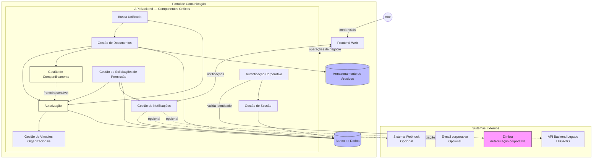

# Integrations — Portal de Comunicação

## 1. Objetivo

Este documento consolida as **integrações arquiteturais** do Portal de Comunicação — relações entre sistemas externos, containers e componentes que permitem a operação da solução. Descreve quem inicia e consome cada integração, objetivos, contratos lógicos, dependências críticas, impactos de indisponibilidade e riscos.

Consolida os artefatos `01-system-context.md`, `02-container-diagram.md` e `03-component-diagram.md` em uma visão unificada de dependências, permanecendo **independente de tecnologia** — sem protocolos, payloads técnicos ou infraestrutura implantada.

**Rastreabilidade:** `docs/architecture/01-system-context.md`, `docs/architecture/02-container-diagram.md`, `docs/architecture/03-component-diagram.md`.

---

## 2. Visão Geral das Integrações

### Resumo executivo

| Categoria | Quantidade | Confiança |
| --------- | ---------- | --------- |
| Integrações externas | 4 | Alta (1 crítica; 3 parciais/opcionais) |
| Integrações entre containers | 6 | Alta |
| Integrações entre componentes (relevantes) | 18 | Médio-Alto |
| Dependências críticas | 4 | Alta |

### Integrações externas

O portal depende de **um sistema externo crítico** (Zimbra) para autenticação corporativa. Três integrações externas adicionais são **opcionais ou parciais**: API Backend Legado, sistema destino de webhook e servidor de e-mail corporativo para notificações.

### Integrações internas

A arquitetura interna concentra integrações no eixo **Frontend Web → API Backend → persistência** (Banco de Dados e Armazenamento de Arquivos). Componentes da API Backend colaboram por dependências de negócio documentadas, com fronteiras sensíveis entre Gestão de Compartilhamento e Autorização.

### Dependências críticas

| Dependência | Tipo | Impacto se indisponível |
| ----------- | ---- | ----------------------- |
| Zimbra | Externa | Autenticação de colaboradores impossibilitada |
| Banco de Dados | Interna (container) | Operação do portal interrompida |
| Armazenamento de Arquivos | Interna (container) | Publicação e download de documentos comprometidos |
| Autorização + Gestão de Vínculos Organizacionais | Interna (componentes) | Decisões de acesso sem referência de escopo |

**Nível de confiança geral:** Médio-Alto.

---

## 3. Catálogo de Integrações Externas

Integrações identificadas nos artefatos de arquitetura anteriores. Nenhuma integração inventada.

| Integração | Sistema Externo | Objetivo | Criticidade |
| ---------- | --------------- | -------- | ----------- |
| Autenticação Corporativa | Zimbra (e-mail corporativo) | Validar credenciais de colaboradores com identidade de e-mail da organização | **Crítica** |
| Sincronização Legada | API Backend Legado | Manter coexistência de rotas e sincronização parcial de usuários e sessão | Baixa (status LEGADO) |
| Notificação Externa por Webhook | Sistema destino de webhook | Entregar notificações a sistema configurado por destinatário | Baixa (opcional, parcial) |
| Notificação por E-mail | Servidor de e-mail corporativo | Encaminhar notificações por canal de e-mail | Baixa (opcional, parcial) |

**Não identificadas na documentação:** LDAP, Active Directory, SSO unificado, ERP, RH ou outros sistemas corporativos.

| Integração | Iniciador | Consumidor |
| ---------- | --------- | ---------- |
| Autenticação Corporativa | API Backend (Autenticação Corporativa) | Zimbra |
| Sincronização Legada | API Backend | API Backend Legado |
| Notificação Externa por Webhook | API Backend (Gestão de Notificações) | Sistema destino de webhook |
| Notificação por E-mail | API Backend (Gestão de Notificações) | Servidor de e-mail corporativo |

---

## 4. Catálogo de Integrações Internas

Integrações relevantes entre containers e componentes. Chamadas triviais de consulta isolada omitidas.

### Integrações entre containers

| Origem | Destino | Objetivo |
| ------ | ------- | -------- |
| Frontend Web | API Backend | Executar operações de negócio; autenticação; consulta e publicação |
| Frontend Web | API Backend | Receber notificações em tempo real |
| API Backend | Banco de Dados | Persistir e recuperar metadados, identidade, permissões, auditoria e notificações |
| API Backend | Armazenamento de Arquivos | Armazenar e recuperar binários de documentos |
| API Backend | API Backend Legado | Sincronizar usuários e validar sessão em coexistência legada |
| Apresentação de Autenticação | Autenticação Corporativa | Encaminhar credenciais do ator para validação |

### Integrações entre componentes (API Backend)

| Origem | Destino | Objetivo |
| ------ | ------- | -------- |
| Gestão de Onboarding | Gestão de Singulares / Gestão de Áreas / Gestão de Vínculos Organizacionais | Integrar colaborador ao contexto organizacional |
| Gestão de Documentos | Gestão de Pastas / Visibilidade / Compartilhamento / Armazenamento | Publicar documento com exposição e audiência definidas |
| Gestão de Documentos | Autorização | Validar permissão antes de publicar ou entregar |
| Gestão de Documentos | Gestão de Singulares / Gestão de Áreas | Vincular documento ao escopo organizacional |
| Gestão de Compartilhamento | Autorização | Alinhar audiência documentada com acesso efetivo |
| Gestão de Pastas | Gestão de Permissões de Pastas | Aplicar regras de acesso na hierarquia |
| Autenticação Corporativa | Gestão de Sessão | Estabelecer sessão após identidade validada |
| Autorização | Gestão de Papéis / Gestão de Vínculos Organizacionais | Decidir acesso por papel e contexto |
| Gestão de Solicitações de Permissão | Autorização / Gestão de Notificações / Auditoria | Fluxo de pedido, concessão, comunicação e registro |
| Busca Unificada | Gestão de Documentos / Singulares / Áreas / Colaboradores | Compor resultados transversais |
| Busca Unificada | Autorização | Filtrar resultados por visibilidade e permissão |
| Gestão de Notificações | Gestão de Vínculos Organizacionais | Identificar destinatário da notificação |
| Gestão de Comunicados | Gestão de Documentos | Fronteira em aberto — possível sobreposição de publicação |
| Apresentação Documental | Gestão de Documentos | Expor interface de documentos ao ator |
| Apresentação de Comunicação | Busca Unificada | Compor busca na camada de apresentação |
| Apresentação Organizacional | Gestão de Singulares / Áreas / Equipes / Colaboradores | Navegação organizacional |

---

## 5. Fluxos de Integração

### Fluxo de Autenticação

| Aspecto | Descrição |
| ------- | --------- |
| **Origem** | Ator → Apresentação de Autenticação → Autenticação Corporativa |
| **Destino** | Zimbra (validação); Banco de Dados (persistência de sessão); Gestão de Sessão |
| **Dependências** | Zimbra disponível; Gestão de Vínculos Organizacionais para contexto pós-login |
| **Resultado esperado** | Identidade autenticada; sessão estabelecida; colaborador apto a operar conforme papel e vínculo organizacional |

**Sequência:** Ator informa credenciais → Frontend encaminha à API Backend → Autenticação Corporativa valida no Zimbra → Gestão de Sessão persiste contexto → Frontend mantém sessão para requisições subsequentes.

*Incerteza: coexistência de mecanismos de autenticação documentada na Discovery.*

---

### Fluxo de Publicação de Documentos

| Aspecto | Descrição |
| ------- | --------- |
| **Componentes envolvidos** | Apresentação Documental → Gestão de Documentos → Gestão de Pastas, Visibilidade, Compartilhamento, Armazenamento → Autorização |
| **Validações** | Autorização para publicar; quota de armazenamento (BR-023); visibilidade definida (BR-019); compartilhamento coerente (BR-020); escopo organizacional válido |
| **Dependências** | Gestão de Singulares/Áreas (escopo); Banco de Dados (metadados); Armazenamento de Arquivos (binário); Autorização |

**Sequência:** Ator envia documento e metadados → Gestão de Documentos coordena classificação e pasta → Gestão de Armazenamento persiste binário → metadados gravados no Banco de Dados → confirmação ao Frontend.

**Eventos de negócio:** Documento Publicado, Compartilhamento Definido.

---

### Fluxo de Solicitação de Permissão

| Aspecto | Descrição |
| ------- | --------- |
| **Componentes envolvidos** | Apresentação Documental → Gestão de Solicitações de Permissão → Autorização → Auditoria → Gestão de Notificações |
| **Concessão** | Responsável pelo recurso aprova ou nega; Autorização atualiza permissões efetivas |
| **Auditoria** | Registro da decisão de acesso |
| **Notificações** | Gestão de Notificações comunica resultado ao solicitante; entrega via Frontend (consulta ou streaming) |

**Sequência:** Colaborador solicita acesso → pedido persistido → responsável decide → Autorização concede ou mantém restrição → Auditoria registra → Notificação Emitida ao solicitante.

*Incerteza: fluxo de ponta a ponta não confirmado (OQ-003); revogação não documentada (OQ-006, OQ-017).*

**Eventos de negócio:** Solicitação de Permissão Registrada, Permissão Concedida, Notificação Emitida.

---

### Fluxo de Busca Unificada

| Aspecto | Descrição |
| ------- | --------- |
| **Fontes consultadas** | Gestão de Documentos; Gestão de Singulares; Gestão de Áreas; Gestão de Colaboradores |
| **Restrições de autorização** | Autorização filtra resultados por visibilidade, compartilhamento e permissões efetivas; consulta sem mutação de estado fonte (BR-038) |
| **Composição** | Busca Unificada agrega resultados de múltiplos componentes; Apresentação de Comunicação pode compor chamadas na camada de apresentação |

*Incerteza: regras de escopo e filtros além da autorização básica (OQ-024); status PARCIAL documentado.*

---

## 6. Contratos Lógicos

Contratos conceituais — dados trocados em nível de negócio, sem definição de formato técnico.

| Integração | Dados Trocados | Observações |
| ---------- | -------------- | ----------- |
| Autenticação Corporativa ↔ Zimbra | Credenciais de e-mail corporativo (entrada); confirmação de identidade válida (saída) | Portal não provisiona contas; apenas valida |
| Gestão de Sessão ↔ Banco de Dados | Identidade autenticada, contexto organizacional, papel ativo, metadados de sessão | Sessão é pré-requisito de operações subsequentes |
| Gestão de Documentos ↔ Banco de Dados | Metadados de documento, visibilidade, compartilhamento, referência a escopo e pasta | Binário não reside no banco |
| Gestão de Armazenamento ↔ Armazenamento de Arquivos | Binário do documento (entrada/saída); referência de localização (metadado) | Coordenado com metadados no banco |
| Gestão de Documentos ↔ Autorização | Identidade, recurso, ação solicitada (entrada); decisão permitir/negar (saída) | Aplicado em publicação e consulta |
| Gestão de Compartilhamento ↔ Autorização | Audiência autorizada do recurso (entrada); alinhamento com permissões efetivas (saída) | Fronteira sensível — OQ-005 |
| Gestão de Solicitações de Permissão ↔ Autorização | Pedido de acesso, identidade do solicitante, recurso (entrada); concessão ou manutenção de restrição (saída) | Depende de responsável pelo recurso — OQ-016 |
| Gestão de Solicitações de Permissão ↔ Auditoria | Evento de decisão de acesso (entrada); registro persistido (saída) | Rastreabilidade de governança |
| Gestão de Solicitações de Permissão ↔ Gestão de Notificações | Resultado da decisão, identidade do solicitante (entrada); notificação dirigida (saída) | Comunicação de resultado ao colaborador |
| Gestão de Onboarding ↔ Organização Corporativa | Identidade do colaborador, seleção de singular e área (entrada); vínculo estabelecido, Colaborador Integrado (saída) | Pré-requisito BR-011 — OQ-001 |
| Busca Unificada ↔ múltiplos componentes | Critério de busca (entrada); conjunto filtrado de documentos, áreas, singulares e colaboradores (saída) | Sem mutação de estado fonte |
| Gestão de Notificações ↔ Frontend Web | Notificação de evento relevante (saída); confirmação de recebimento/leitura (entrada opcional) | Entrega por consulta ou streaming |
| Gestão de Notificações ↔ Sistema externo | Conteúdo da notificação, destinatário (saída) | Opcional; configurado por destinatário |
| API Backend ↔ API Backend Legado | Identidade de usuário, estado de sessão (entrada/saída) | Sincronização parcial; status LEGADO |
| Frontend Web ↔ API Backend | Solicitação de operação de negócio (entrada); resultado ou erro de negócio (saída) | Todas as operações passam pela API Backend |

---

## 7. Dependências Críticas

### Dependências externas

| Dependência | Integração | Componente iniciador | Justificativa |
| ----------- | ---------- | -------------------- | ------------- |
| **Zimbra** | Autenticação Corporativa | Autenticação Corporativa | Único provedor de identidade corporativa documentado; sem alternativa registrada |
| Sistema destino de webhook | Notificação Externa | Gestão de Notificações | Canal opcional; portal opera sem ele |
| Servidor de e-mail corporativo | Notificação por E-mail | Gestão de Notificações | Canal opcional; notificações in-app permanecem |
| API Backend Legado | Sincronização Legada | API Backend | Coexistência documentada; não é caminho principal do fluxo de valor |

### Dependências internas

| Dependência | Integração | Justificativa |
| ----------- | ---------- | ------------- |
| **Autorização** | Gestão de Documentos, Busca Unificada, Gestão de Solicitações de Permissão | Toda entrega de recurso depende de decisão de acesso |
| **Gestão de Vínculos Organizacionais** | Autorização, Gestão de Onboarding, Gestão de Notificações | Contexto organizacional delimita escopo de operação |
| **Gestão de Papéis** | Autorização | Papel determina ações permitidas por escopo |
| **Gestão de Singulares / Gestão de Áreas** | Gestão de Documentos, Gestão de Onboarding | Escopo organizacional é upstream de publicação e integração |
| **Banco de Dados** | Todos os componentes com estado | Persistência transacional central |
| **Armazenamento de Arquivos** | Gestão de Armazenamento | Binários de documentos |
| **Gestão de Compartilhamento ↔ Autorização** | Publicação e consulta documental | Audiência e acesso efetivo devem permanecer coerentes — fronteira crítica |

---

## 8. Falhas e Estratégias de Degradação

Impactos arquiteturais documentados. Mecanismos técnicos de fallback não especificados na documentação consolidada.

### Zimbra (Autenticação Corporativa)

| Aspecto | Descrição |
| ------- | --------- |
| **Impacto da indisponibilidade** | Novos logins impossibilitados; colaboradores sem sessão ativa não acessam o portal |
| **Comportamento esperado** | Operações que exigem autenticação corporativa não prosseguem; sessões já estabelecidas podem continuar até expiração — comportamento de expiração não detalhado na documentação |
| **Risco para o negócio** | Bloqueio operacional de todo o portal para novos acessos; dependência única de identidade corporativa |

### Banco de Dados

| Aspecto | Descrição |
| ------- | --------- |
| **Impacto da indisponibilidade** | Persistência e recuperação de metadados, permissões, sessão e notificações interrompidas |
| **Comportamento esperado** | API Backend não executa operações transacionais; Frontend recebe indisponibilidade de serviço |
| **Risco para o negócio** | Interrupção completa da operação do portal |

### Armazenamento de Arquivos

| Aspecto | Descrição |
| ------- | --------- |
| **Impacto da indisponibilidade** | Publicação de novos documentos e download de binários comprometidos |
| **Comportamento esperado** | Metadados podem persistir sem binário correspondente — risco de inconsistência; consulta de metadados pode funcionar parcialmente |
| **Risco para o negócio** | Documentos inacessíveis; publicação bloqueada; possível inconsistência metadado/binário |

### API Backend Legado

| Aspecto | Descrição |
| ------- | --------- |
| **Impacto da indisponibilidade** | Sincronização legada interrompida; rotas legadas indisponíveis |
| **Comportamento esperado** | Fluxo principal via API Backend permanece; impacto limitado a consumidores da API legada |
| **Risco para o negócio** | Baixo para fluxo de valor principal; acoplamento residual em coexistência |

### Gestão de Solicitações de Permissão (PARCIAL)

| Aspecto | Descrição |
| ------- | --------- |
| **Impacto da indisponibilidade** | Fluxo formal de pedido e concessão de acesso a recursos privados não atendido |
| **Comportamento esperado** | Colaboradores sem permissão direta não obtêm acesso via solicitação |
| **Risco para o negócio** | Frustração de usuários; governança de acesso incompleta — OQ-003 |

### Canais externos de notificação (webhook, e-mail)

| Aspecto | Descrição |
| ------- | --------- |
| **Impacto da indisponibilidade** | Notificações não entregues por canal externo |
| **Comportamento esperado** | Notificações in-app e streaming ao Frontend podem continuar; canais opcionais falham silenciosamente |
| **Risco para o negócio** | Baixo; comunicação principal permanece no portal |

### Gestão de Compartilhamento / Autorização (divergência)

| Aspecto | Descrição |
| ------- | --------- |
| **Impacto** | Colaborador vê recurso na audiência mas não acessa — ou o inverso |
| **Comportamento esperado** | Inconsistência entre exposição documentada e permissão efetiva |
| **Risco para o negócio** | Violação percebida de política de acesso; confiança no portal comprometida — OQ-005 |

---

## 9. Riscos de Integração

Riscos consolidados dos artefatos anteriores. Nenhum risco novo inventado.

| Risco | Categoria | Descrição |
| ----- | --------- | --------- |
| Dependência única do Zimbra | Externa | Autenticação corporativa sem alternativa documentada |
| API Backend Legado coexistindo | Acoplamento | Duplicidade de rotas e sincronização parcial com API principal |
| Endpoints órfãos Frontend ↔ API Backend | Acoplamento | Expectativa de capacidade sem integração correspondente documentada |
| Compartilhamento ≠ Autorização efetiva | Fronteira ambígua | Gestão de Compartilhamento e Autorização podem divergir |
| Comunicado documento vs. publicação institucional | Fronteira ambígua | Gestão de Comunicados e Gestão de Documentos com sobreposição indefinida |
| Fluxo de solicitação de permissão incompleto | Parcialmente conhecida | Gestão de Solicitações de Permissão com status PARCIAL |
| Dois subsistemas de notificação | Acoplamento | Complexidade na persistência e entrega de notificações |
| Busca Unificada com escopo indefinido | Parcialmente conhecida | Regras de filtro além da autorização básica em aberto |
| Parceiro autorizado vs. convidado | Fronteira ambígua | Gestão de Perfis Externos sem distinção operacional consolidada |
| Onboarding com fluxos coexistentes | Parcialmente conhecida | Gestão de Onboarding com modelos divergentes documentados |
| Mecanismos de autenticação duplicados | Acoplamento | Incerteza na fronteira de sessão documentada na Discovery |

---

## 10. Questões Arquiteturais em Aberto

Questões de `docs/domain/10-open-questions.md` com impacto em integrações. Nenhuma questão nova criada.

| ID | Questão | Impacto em integrações |
| -- | ------- | ---------------------- |
| OQ-001 | Fluxo oficial de onboarding? | Contrato entre Gestão de Onboarding e componentes organizacionais |
| OQ-002 | Parceiro autorizado vs. convidado? | Integração de perfis externos com Autorização |
| OQ-003 | Solicitação de permissão de ponta a ponta? | Integração Gestão de Solicitações ↔ Autorização ↔ Notificações |
| OQ-004 | Comunicado: documento ou publicação? | Integração Gestão de Comunicados ↔ Gestão de Documentos |
| OQ-005 | Compartilhamento equivalente ao acesso efetivo? | Contrato Gestão de Compartilhamento ↔ Autorização |
| OQ-006 | Revogação formal de permissão? | Ciclo de vida da integração Solicitações ↔ Autorização |
| OQ-007 | Pré-condições de Colaborador Integrado? | Contrato de onboarding com demais fluxos |
| OQ-011 | Alterar compartilhamento após publicação? | Integração de manutenção documental pós-publicação |
| OQ-012 | Herança na hierarquia de pastas? | Integração Gestão de Pastas ↔ Gestão de Permissões de Pastas |
| OQ-013 | Federação no compartilhamento vs. organizacional? | Escopo nas integrações de compartilhamento e organização |
| OQ-016 | Responsável pelo recurso em cada escopo? | Roteamento na integração de solicitação de permissão |
| OQ-017 | Revogação ou expiração de permissão? | Contrato de ciclo de vida Autorização ↔ Solicitações |
| OQ-018 | Regras operacionais de parceiro autorizado? | Integração de perfis externos |
| OQ-024 | Regras de escopo da busca unificada? | Integração Busca Unificada ↔ Autorização |
| OQ-025 | Eventos além de notificação em Comunicação Interna? | Integrações emitidas pelo contexto de Comunicação Interna |

---

## 11. Diagrama de Integrações (Mermaid)

Diagrama de dependências arquiteturais — sistemas externos, containers, componentes críticos e fluxos principais.

**Legenda:** linhas sólidas — integrações documentadas como ativas; linhas tracejadas — integrações opcionais, parciais ou fronteiras sensíveis.

---

## Fontes Utilizadas

### Fonte primária (Architecture)

- `docs/architecture/00-architecture-index.md`
- `docs/architecture/01-system-context.md`
- `docs/architecture/02-container-diagram.md`
- `docs/architecture/03-component-diagram.md`

### Fonte secundária (esclarecimento de negócio)

- `docs/domain/10-open-questions.md`

*Nenhum código-fonte, API implementada, banco de dados físico, infraestrutura implantada ou contrato técnico não documentado foi analisado para a construção deste artefato.*

---

## Nível de Confiança

**Médio-Alto**

| Faixa | Escopo |
| ----- | ------ |
| Alto | Integrações externas catalogadas; fluxos de autenticação e publicação; dependências críticas Zimbra, Banco de Dados, Autorização |
| Médio | Fluxo de solicitação de permissão; busca unificada; canais opcionais de notificação |
| Baixo | API Backend Legado; fronteiras Comunicados/Documentos; perfis externos |

Este documento consolida fluxos e dependências para `05-data-architecture.md`, sem necessidade de redescoberta de integrações entre componentes.
