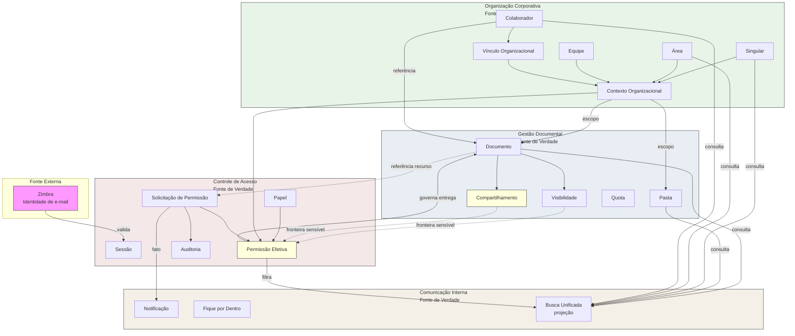

# Data Architecture — Portal de Comunicação

## 1. Objetivo

Este documento define a **arquitetura lógica de dados** do Portal de Comunicação — quais informações existem, quem é proprietário de cada dado, quem pode alterá-lo e consultá-lo, quais são as fontes de verdade e como os bounded contexts compartilham informação.

Consolida ownership, fronteiras de consistência, ciclo de vida e governança em nível arquitetural, permanecendo **independente de tecnologia**. Não modela tabelas, schemas, ORM ou estruturas físicas de persistência.

**Rastreabilidade:** `docs/architecture/02-container-diagram.md`, `docs/architecture/03-component-diagram.md`, `docs/architecture/04-integrations.md`, `docs/domain/06-context-map.md`, `docs/domain/08-aggregates.md`, `docs/domain/09-business-rules.md`.

---

## 2. Visão Geral da Arquitetura de Dados

A arquitetura lógica de dados organiza-se em **quatro bounded contexts proprietários**, alinhados aos aggregates de domínio. Cada contexto é **fonte de verdade** dos dados que governa; os demais contextos **consomem por referência** (identificadores de negócio), sem duplicar estado mutável.

### Ownership dos dados

| Princípio | Descrição |
| --------- | --------- |
| Um aggregate, uma fonte de verdade | Cada aggregate define o owner lógico dos dados sob sua responsabilidade |
| Referência, não duplicação | Contextos consumidores referenciam identificadores sem replicar estado mutável (BR-006) |
| Separação metadado × binário | Metadados de negócio e binários de documento possuem repositórios lógicos distintos |
| Decisão de acesso separada da exposição | Audiência (Gestão Documental) e permissão efetiva (Controle de Acesso) são dados distintos |

### Bounded contexts proprietários

| Contexto | Aggregate | Papel na arquitetura de dados |
| -------- | --------- | ----------------------------- |
| Organização Corporativa | Organização Corporativa | Upstream — estrutura, vínculos e contexto organizacional |
| Gestão Documental | Gestão Documental | Núcleo de conteúdo — documentos, pastas, visibilidade, compartilhamento |
| Controle de Acesso | Controle de Acesso | Governança — papéis, permissões, sessão, auditoria |
| Comunicação Interna | Comunicação Interna | Suporte — notificações, canais, consultas transversais |

### Compartilhamento entre contextos

Compartilhamento ocorre por **identificadores de negócio** e **eventos de domínio**. Consistência **entre** aggregates é **eventual**, mediada por eventos; consistência **dentro** de cada aggregate é **forte**.

### Dependências críticas de dados

| Dependência | Impacto |
| ----------- | ------- |
| Organização Corporativa → todos os contextos | Sem vínculo e escopo válidos, demais dados perdem referência |
| Gestão Documental → Controle de Acesso | Recursos privados requerem classificação antes de governança de acesso |
| Controle de Acesso → Gestão Documental | Acesso efetivo governa entrega de conteúdo |
| Zimbra (externo) → Controle de Acesso | Validação de identidade corporativa; portal não é fonte de verdade de contas de e-mail |

**Nível de confiança:** Médio-Alto para núcleo organizacional, documental e de acesso; Médio para Comunicação Interna e fronteiras sensíveis.

---

## 3. Catálogo de Dados de Negócio

| Dado | Contexto Proprietário | Fonte de Verdade |
| ---- | --------------------- | ---------------- |
| Federação | Organização Corporativa | Aggregate Organização Corporativa |
| Singular | Organização Corporativa | Aggregate Organização Corporativa |
| Área | Organização Corporativa | Aggregate Organização Corporativa |
| Equipe | Organização Corporativa | Aggregate Organização Corporativa |
| Colaborador | Organização Corporativa | Aggregate Organização Corporativa |
| Contexto organizacional | Organização Corporativa | Aggregate Organização Corporativa |
| Vínculo organizacional | Organização Corporativa | Aggregate Organização Corporativa |
| Código Unimed | Organização Corporativa | Aggregate Organização Corporativa |
| Documento (metadados) | Gestão Documental | Aggregate Gestão Documental |
| Documento (binário) | Gestão Documental | Aggregate Gestão Documental — repositório lógico de binários |
| Pasta | Gestão Documental | Aggregate Gestão Documental |
| Visibilidade | Gestão Documental | Aggregate Gestão Documental |
| Compartilhamento | Gestão Documental | Aggregate Gestão Documental |
| Quota de armazenamento | Gestão Documental | Aggregate Gestão Documental |
| Papel | Controle de Acesso | Aggregate Controle de Acesso |
| Sessão autenticada | Controle de Acesso | Aggregate Controle de Acesso |
| Permissão efetiva | Controle de Acesso | Aggregate Controle de Acesso |
| Solicitação de permissão | Controle de Acesso | Aggregate Controle de Acesso |
| Registro de auditoria | Controle de Acesso | Aggregate Controle de Acesso |
| Perfil externo (convidado, parceiro) | Controle de Acesso | Aggregate Controle de Acesso |
| Notificação | Comunicação Interna | Aggregate Comunicação Interna |
| Comunicado | Gestão Documental / Comunicação Interna | **Lacuna de ownership** — OQ-004 |
| Publicação em Fique por Dentro | Comunicação Interna | Aggregate Comunicação Interna |
| Resultado de busca unificada | Comunicação Interna | Projeção de consulta — não é dado proprietário |
| Configuração institucional | Transversal | Configuração Institucional — consumida por todos os contextos |
| Identidade corporativa (credencial) | Externa (Zimbra) | Zimbra — portal valida, não provisiona |

---

## 4. Ownership por Bounded Context

### Organização Corporativa

| Aspecto | Descrição |
| ------- | --------- |
| **Dados proprietários** | Federação, singular, área, equipe, colaborador, contexto organizacional, vínculo organizacional, código Unimed, estado de onboarding |
| **Consumidores** | Gestão Documental (escopo de documentos); Controle de Acesso (contexto de autorização); Comunicação Interna (destinatários) |
| **Responsáveis por atualização** | Administradores (estrutura global/singular); gestores (área/equipe); Gestão de Onboarding (vínculo inicial); Gestão de Vínculos Organizacionais |
| **Dependências externas** | Identidade de e-mail validada externamente (Zimbra); portal mantém representação operacional do vínculo |

**Componentes:** Gestão de Singulares, Gestão de Áreas, Gestão de Equipes, Gestão de Colaboradores, Gestão de Vínculos Organizacionais, Gestão de Onboarding.

---

### Gestão Documental

| Aspecto | Descrição |
| ------- | --------- |
| **Dados proprietários** | Documento (metadados e referência a binário), pasta, visibilidade, compartilhamento, quota de armazenamento, classificação recurso privado/público |
| **Consumidores** | Controle de Acesso (referência de recurso privado); Comunicação Interna (conteúdo consultável, comunicados em lacuna) |
| **Responsáveis por atualização** | Colaboradores e gestores conforme papel e escopo; Gestão de Documentos, Gestão de Pastas, Gestão de Visibilidade, Gestão de Compartilhamento, Gestão de Armazenamento |
| **Dependências externas** | Escopo organizacional (Organização Corporativa); decisão de autorização (Controle de Acesso) antes de entrega |

**Componentes:** Gestão de Documentos, Gestão de Pastas, Gestão de Visibilidade, Gestão de Compartilhamento, Gestão de Armazenamento.

---

### Controle de Acesso

| Aspecto | Descrição |
| ------- | --------- |
| **Dados proprietários** | Papel, sessão autenticada, permissão efetiva, solicitação de permissão, registro de auditoria, perfil externo |
| **Consumidores** | Gestão Documental (governa entrega); Comunicação Interna (fatos de decisão de acesso para notificação) |
| **Responsáveis por atualização** | Gestão de Papéis (administradores); Autorização (decisões de acesso); Gestão de Solicitações de Permissão (responsável pelo recurso); Autenticação Corporativa (validação de identidade); Auditoria (registro) |
| **Dependências externas** | Zimbra (validação de credenciais); contexto organizacional e colaborador (Organização Corporativa); classificação de recurso (Gestão Documental) |

**Componentes:** Autenticação Corporativa, Gestão de Sessão, Gestão de Papéis, Autorização, Gestão de Permissões de Pastas, Gestão de Solicitações de Permissão, Auditoria, Gestão de Perfis Externos.

---

### Comunicação Interna

| Aspecto | Descrição |
| ------- | --------- |
| **Dados proprietários** | Notificação, publicação em Fique por Dentro, métricas administrativas (parcial), resultado de busca (projeção) |
| **Consumidores** | Frontend Web (apresentação); colaboradores (destinatários) |
| **Responsáveis por atualização** | Gestão de Notificações (emissão); administradores/gestores (canais internos); Busca Unificada (consulta sem mutação) |
| **Dependências externas** | Colaborador e contexto (Organização Corporativa); conteúdo documental (Gestão Documental); fatos de acesso (Controle de Acesso) |

**Componentes:** Gestão de Notificações, Gestão de Comunicados, Canal Fique por Dentro, Busca Unificada, Métricas Administrativas, Central de Colaboração.

**Ressalva:** aggregate com menor confiança documentada; comunicado com ownership em lacuna.

---

## 5. Fluxo de Dados Entre Contextos

| Origem | Destino | Dados Compartilhados | Motivo |
| ------ | ------- | -------------------- | ------ |
| Organização Corporativa | Gestão Documental | Identificadores de singular, área, colaborador | Escopo de documentos e pastas |
| Organização Corporativa | Controle de Acesso | Contexto organizacional, vínculo de colaborador | Autorização por escopo |
| Organização Corporativa | Comunicação Interna | Identidade e contexto do colaborador | Destinatário de notificações e publicações |
| Gestão Documental | Controle de Acesso | Classificação recurso privado/público, referência de documento/pasta | Governança de acesso a recursos |
| Gestão Documental | Comunicação Interna | Metadados de documento, comunicado (lacuna) | Busca e canais internos |
| Controle de Acesso | Gestão Documental | Decisão de autorização, permissão efetiva | Governa entrega de conteúdo |
| Controle de Acesso | Comunicação Interna | Resultado de solicitação de permissão | Notificação de decisão de acesso |
| Comunicação Interna | — | Nenhum dado mutável proprietário exportado | Contexto de suporte; apenas consome |

**Direção upstream:** Organização Corporativa não consome dados mutáveis dos demais contextos para sua consistência primária.

---

## 6. Fronteiras de Consistência

### Consistência forte

Dados que exigem atualização atômica dentro do limite do aggregate. Violação de invariante é inválida no mesmo contexto transacional lógico.

| Dado / conjunto | Aggregate | Invariante crítica |
| --------------- | --------- | ------------------ |
| Hierarquia federativa e vínculos | Organização Corporativa | Área pertence a singular; colaborador com área vinculada (BR-007 a BR-010) |
| Visibilidade + compartilhamento | Gestão Documental | Coerência mútua; privado sem exposição pública sem reclassificação (BR-019, BR-024) |
| Ciclo de solicitação de permissão | Controle de Acesso | Registrada → concedida ou negada; responsável identificado (BR-030 a BR-032) |
| Papel + escopo | Controle de Acesso | Papel com referência organizacional válida (BR-028) |
| Notificação + destinatário | Comunicação Interna | Destinatário colaborador identificado (BR-035) |
| Sessão + identidade autenticada | Controle de Acesso | Operação exige identidade validada (BR-025) |

### Consistência eventual

Dados propagados entre aggregates ou produzidos como projeção de consulta. Alinhamento mediado por eventos de domínio.

| Dado / processo | Motivo |
| --------------- | ------ |
| Permissão efetiva após compartilhamento definido | Gestão Documental define audiência; Controle de Acesso efetiva acesso — fronteira sensível |
| Notificação após decisão de permissão | Comunicação Interna consome fato de Controle de Acesso |
| Notificação após publicação documental | Comunicação Interna consome fato de Gestão Documental |
| Resultado de busca unificada | Projeção read-only; sem mutação de fontes (BR-038) |
| Métricas administrativas | Indicadores derivados; léxico não confirmado |
| Sincronização com API Backend Legado | Estado de identidade/sessão potencialmente divergente — legado |

### Fronteiras sensíveis

| Fronteira | Dados envolvidos | Risco |
| --------- | ---------------- | ----- |
| **Compartilhamento ↔ Autorização** | Audiência (Gestão Documental) vs. permissão efetiva (Controle de Acesso) | Divergência entre exposição e acesso — OQ-005 |
| **Documento ↔ Comunicado** | Metadados documentais vs. publicação institucional | Ownership duplicado ou indefinido — OQ-004 |
| **Perfis externos ↔ Controle de Acesso** | Convidado vs. parceiro autorizado | Governança de dados de perfil ambígua — OQ-002, OQ-018 |
| **Federação (estrutura vs. compartilhamento)** | Escopo organizacional vs. audiência institucional | Vocabulário com duplo sentido — OQ-013 |
| **Metadado ↔ binário de documento** | Referência lógica vs. conteúdo armazenado | Inconsistência se binário indisponível com metadado persistido |

---

## 7. Ciclo de Vida dos Dados

### Colaborador

| Fase | Descrição | Owner | Evento |
| ---- | --------- | ----- | ------ |
| **Criação** | Identidade autenticada via e-mail corporativo; vínculo estabelecido no onboarding | Organização Corporativa | Colaborador Autenticado → Colaborador Integrado |
| **Atualização** | Alteração de vínculo a singular, área ou equipe; atribuição de papel | Organização Corporativa + Controle de Acesso | Vínculo Organizacional Alterado; Papel Atribuído |
| **Consumo** | Referenciado em documentos, permissões, notificações e busca | Todos os contextos consumidores | — |
| **Encerramento** | **Não documentado** — processo de desligamento ou inativação não formalizado | — | — |

*Pré-requisitos:* área vinculada para operação plena (BR-010); onboarding antes de recursos organizacionais (BR-011).

---

### Documento

| Fase | Descrição | Owner | Evento |
| ---- | --------- | ----- | ------ |
| **Criação** | Publicação com metadados, visibilidade, compartilhamento e binário | Gestão Documental | Documento Publicado |
| **Atualização** | Reorganização em pasta; alteração de visibilidade/compartilhamento — **processo pós-publicação em aberto** (OQ-011) | Gestão Documental | Visibilidade Definida; Compartilhamento Definido |
| **Consumo** | Consulta e download condicionados a Autorização | Gestão Documental + Controle de Acesso | — |
| **Encerramento** | **Não documentado** — exclusão ou arquivamento não formalizado | — | — |

*Restrições:* quota respeitada (BR-023); escopo organizacional válido (BR-015).

---

### Permissão

| Fase | Descrição | Owner | Evento |
| ---- | --------- | ----- | ------ |
| **Criação** | Concessão por papel, compartilhamento, permissão de pasta ou solicitação aprovada | Controle de Acesso | Papel Atribuído; Permissão Concedida |
| **Atualização** | Alteração de papel ou escopo; **revogação não documentada** (OQ-006, OQ-017) | Controle de Acesso | — |
| **Consumo** | Autorização consulta permissões em cada operação | Controle de Acesso → Gestão Documental | — |
| **Encerramento** | **Lacuna documentada** — sem evento de revogação estabilizado | — | — |

---

### Solicitação de Permissão

| Fase | Descrição | Owner | Evento |
| ---- | --------- | ----- | ------ |
| **Criação** | Colaborador registra pedido para recurso privado | Controle de Acesso | Solicitação de Permissão Registrada |
| **Atualização** | Responsável aprova ou nega | Controle de Acesso | Permissão Concedida ou Permissão Negada |
| **Consumo** | Notificação ao solicitante; registro em auditoria | Comunicação Interna; Auditoria | Notificação Dirigida ao Colaborador |
| **Encerramento** | Decisão final registrada; solicitação não reabre automaticamente | Controle de Acesso | — |

*Lacuna:* fluxo de ponta a ponta não confirmado (OQ-003).

---

### Notificação

| Fase | Descrição | Owner | Evento |
| ---- | --------- | ----- | ------ |
| **Criação** | Emitida em resposta a evento relevante (ex.: decisão de permissão) | Comunicação Interna | Notificação Dirigida ao Colaborador |
| **Atualização** | Leitura ou confirmação pelo destinatário (opcional) | Comunicação Interna | — |
| **Consumo** | Exibida ao colaborador via Frontend Web | Comunicação Interna | — |
| **Encerramento** | **Não documentado** — política de retenção ou expurgo não formalizada | — | — |

*Invariante:* destinatário colaborador identificado (BR-035); comunica evento relevante (BR-036).

---

## 8. Governança de Dados

### Responsáveis lógicos

| Papel / função | Responsabilidade sobre dados |
| -------------- | ------------------------------ |
| Administrador global | Estrutura organizacional, papéis, configuração institucional, auditoria em escopo global |
| Administrador de singular | Singular, áreas vinculadas, colaboradores e documentos no escopo |
| Administrador de área | Área, equipes, colaboradores e documentos departamentais |
| Proprietário de equipe | Equipe, membros e documentos no escopo do time |
| Colaborador | Documentos e pastas conforme permissões no seu escopo |
| Responsável pelo recurso | Decisão sobre solicitações de permissão a recursos privados |
| Zimbra (externo) | Provisão e validação de identidade de e-mail corporativo |

### Regras de atualização

| Regra | Código | Efeito |
| ----- | ------ | ------ |
| Vínculo organizacional obrigatório | BR-009, BR-010 | Colaborador sem área não opera |
| Onboarding antes de operação plena | BR-011 | Integração precede consumo organizacional |
| Visibilidade e compartilhamento coerentes | BR-019, BR-020 | Publicação documental com regras de exposição |
| Decisão de permissão pelo responsável | BR-031, BR-032 | Concessão de acesso a recurso privado |
| Quota de armazenamento | BR-023 | Bloqueio de nova publicação se ultrapassada |
| Papel com escopo válido | BR-028 | Atribuição de papel exige contexto organizacional |
| Agregados referenciam-se por identificador | BR-006 | Atualização local sem duplicar estado de outro aggregate |

### Regras de consulta

| Regra | Código | Efeito |
| ----- | ------ | ------ |
| Autorização por papel e contexto | BR-003, BR-027 | Consulta condicionada a decisão de acesso |
| Recurso público acessível sem escopo privado | BR-022 | Convidados consultam conteúdos públicos |
| Recurso privado com restrição | BR-021 | Consulta exige permissão ou compartilhamento adequado |
| Busca sem mutação de fonte | BR-038 | Busca unificada não altera dados consultados |
| Conteúdo confidencial | BR-004 | Uso profissional; restrição institucional |

### Restrições de negócio

| Restrição | Impacto em dados |
| --------- | ---------------- |
| Acesso restrito a colaboradores e parceiros autorizados (BR-001) | Perfis externos com escopo limitado |
| Confidencialidade institucional (BR-004) | Classificação e exposição controladas |
| Autenticação por e-mail corporativo (BR-025, BR-026) | Identidade vinculada a domínios institucionais |
| Auditoria de eventos relevantes (BR-005) | Registros de governança obrigatórios — catálogo em aberto (OQ-019) |

---

## 9. Riscos Arquiteturais Relacionados a Dados

Riscos consolidados dos artefatos anteriores. Evidência documentada; nenhum risco inventado.

| Risco | Categoria | Evidência |
| ----- | --------- | --------- |
| Ownership de comunicado indefinido | Ownership ambíguo | OQ-004; context map |
| Divergência compartilhamento vs. permissão efetiva | Inconsistência entre contextos | OQ-005; 04-integrations |
| Revogação de permissão não documentada | Ciclo de vida incompleto | OQ-006, OQ-017 |
| Perfis externos sem distinção operacional | Duplicação conceitual | OQ-002, OQ-018 |
| Federação com duplo sentido | Escopo de dados ambíguo | OQ-013 |
| Herança de permissões em pastas indefinida | Propagação imprevisível | OQ-012 |
| Metadado sem binário correspondente | Inconsistência metadado × conteúdo | 04-integrations (falha de armazenamento) |
| Dois subsistemas de notificação documentados | Duplicação de informação | 02-container-diagram |
| Sincronização com API Backend Legado | Estado divergente de identidade/sessão | 04-integrations |
| Solicitação de permissão parcial | Dados de governança incompletos | OQ-003 |
| Alteração pós-publicação sem regras | Manutenção documental indefinida | OQ-011 |
| Responsável pelo recurso não formalizado | Dados de aprovação sem roteamento claro | OQ-016 |
| Busca com escopo de filtro incompleto | Exposição indevida em consulta | OQ-024 |

---

## 10. Questões Arquiteturais em Aberto

Questões de `docs/domain/10-open-questions.md` com impacto em dados. Nenhuma questão nova criada.

| ID | Questão | Impacto em dados |
| -- | ------- | ---------------- |
| OQ-001 | Fluxo oficial de onboarding? | Dados de vínculo inicial e Colaborador Integrado |
| OQ-004 | Comunicado: documento ou publicação? | Ownership e modelo de dados de comunicado |
| OQ-005 | Compartilhamento equivalente ao acesso efetivo? | Consistência entre aggregates Gestão Documental e Controle de Acesso |
| OQ-006 | Revogação formal de permissão? | Ciclo de vida de permissão |
| OQ-007 | Pré-condições de Colaborador Integrado? | Dados de integração |
| OQ-008 | Colaborador em múltiplas equipes? | Modelo de vínculo organizacional |
| OQ-009 | Alteração de vínculo após integração? | Manutenção de dados organizacionais |
| OQ-011 | Alterar compartilhamento ou visibilidade após publicação? | Manutenção documental |
| OQ-012 | Herança na hierarquia de pastas? | Propagação de dados de exposição e permissão |
| OQ-013 | Federação no compartilhamento vs. organizacional? | Escopo de audiência |
| OQ-014 | Documento e pasta como sublimites distintos? | Granularidade do aggregate Gestão Documental |
| OQ-015 | Consequências além do bloqueio de quota? | Dados de armazenamento |
| OQ-016 | Responsável pelo recurso por escopo? | Dados de roteamento de solicitação |
| OQ-017 | Revogação ou expiração de permissão? | Encerramento de dados de acesso |
| OQ-018 | Regras operacionais de parceiro autorizado? | Dados de perfil externo |
| OQ-024 | Regras de escopo da busca unificada? | Projeção de consulta |
| OQ-025 | Eventos além de notificação? | Dados emitidos por Comunicação Interna |

---

## 11. Matriz de Ownership

| Dado | Owner | Consumidores |
| ---- | ----- | ------------ |
| Singular | Organização Corporativa | Gestão Documental, Controle de Acesso, Comunicação Interna |
| Área | Organização Corporativa | Gestão Documental, Controle de Acesso, Comunicação Interna |
| Equipe | Organização Corporativa | Controle de Acesso |
| Colaborador | Organização Corporativa | Gestão Documental, Controle de Acesso, Comunicação Interna |
| Contexto organizacional | Organização Corporativa | Controle de Acesso, Gestão Documental |
| Vínculo organizacional | Organização Corporativa | Controle de Acesso, Gestão de Onboarding |
| Documento | Gestão Documental | Controle de Acesso, Comunicação Interna |
| Pasta | Gestão Documental | Controle de Acesso, Comunicação Interna |
| Visibilidade | Gestão Documental | Controle de Acesso |
| Compartilhamento | Gestão Documental | Controle de Acesso |
| Quota de armazenamento | Gestão Documental | — |
| Papel | Controle de Acesso | Autorização, Gestão Documental (indireto) |
| Sessão | Controle de Acesso | Todos os fluxos autenticados |
| Permissão efetiva | Controle de Acesso | Gestão Documental |
| Solicitação de permissão | Controle de Acesso | Comunicação Interna, Auditoria |
| Auditoria | Controle de Acesso | Administradores |
| Perfil externo | Controle de Acesso | Autorização |
| Notificação | Comunicação Interna | Frontend Web |
| Comunicado | Gestão Documental / Comunicação Interna (lacuna) | Comunicação Interna |
| Fique por Dentro | Comunicação Interna | Colaboradores |
| Busca unificada (projeção) | Comunicação Interna (consulta) | Frontend Web |
| Configuração institucional | Transversal | Todos os contextos |
| Identidade de e-mail (credencial) | Zimbra (externo) | Controle de Acesso |

---

## 12. Diagrama de Ownership e Fluxo de Dados (Mermaid)

Diagrama de governança e ownership — bounded contexts, dados proprietários e fluxos de consumo.

**Legenda:** caixas coloridas — bounded contexts proprietários; amarelo — fronteira sensível de consistência; tracejado — dependência por referência ou consistência eventual.

---

## Fontes Utilizadas

### Fonte primária (Architecture)

- `docs/architecture/00-architecture-index.md`
- `docs/architecture/01-system-context.md`
- `docs/architecture/02-container-diagram.md`
- `docs/architecture/03-component-diagram.md`
- `docs/architecture/04-integrations.md`

### Fonte secundária (negócio)

- `docs/domain/05-bounded-contexts.md`
- `docs/domain/06-context-map.md`
- `docs/domain/08-aggregates.md`
- `docs/domain/09-business-rules.md`
- `docs/domain/10-open-questions.md`

*Nenhum código-fonte, script SQL, banco físico, migration, infraestrutura ou configuração de persistência foi analisado para a construção deste artefato.*

---

## Nível de Confiança

**Médio-Alto**

| Faixa | Escopo |
| ----- | ------ |
| Alto | Ownership dos quatro aggregates; catálogo de dados centrais; regras BR-006 a BR-034 aplicáveis |
| Médio | Ciclo de vida (encerramento/revogação); fronteiras sensíveis; Comunicação Interna |
| Baixo | Comunicado; métricas; Central de Colaboração; processos pós-publicação |

Este documento consolida ownership e governança de dados para `06-security-architecture.md` e artefatos subsequentes, sem necessidade de redescoberta de dependências entre contextos.
