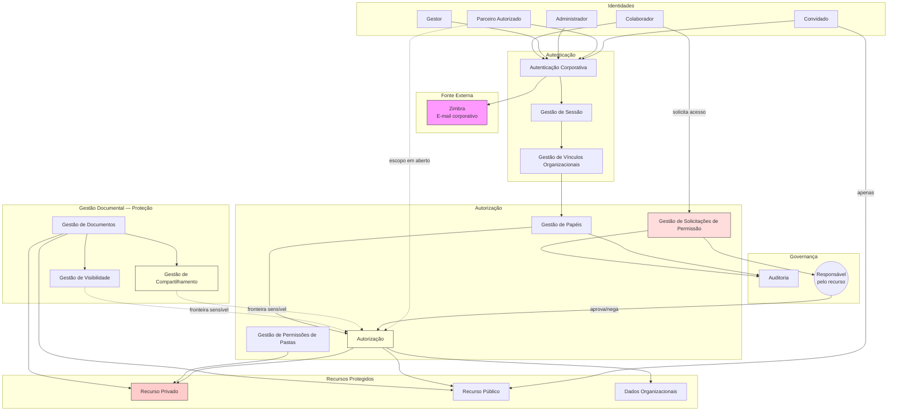

# Security Architecture — Portal de Comunicação

| Item | Valor |
|------|-------|
| Camada | Architecture |
| Categoria documental | **SSOT** (arquitetura de segurança) |
| Documentos complementares | `docs/solution-design/08-security-architecture.md` (Evidence de solução), `docs/implementation/10-security-implementation.md` (padrões de implementação) |

## 1. Objetivo

Este documento define a **arquitetura de segurança** do Portal de Comunicação — como identidades são reconhecidas, como recebem e perdem permissões, como o acesso é governado, auditado e protegido. Consolida autenticação, autorização, governança de acesso, auditoria, proteção de dados e segregação de responsabilidades em nível arquitetural.

É a **fonte oficial** de arquitetura de segurança. Demais camadas referenciam ou materializam este documento — não o substituem.

Permanece **independente de tecnologia**: sem protocolos, frameworks, mecanismos de implementação ou infraestrutura. O foco é governança e fronteiras de segurança de negócio.

**Rastreabilidade:** `docs/architecture/01-system-context.md`, `docs/architecture/02-container-diagram.md`, `docs/architecture/03-component-diagram.md`, `docs/architecture/04-integrations.md`, `docs/domain/09-business-rules.md`, `docs/domain/08-aggregates.md`.

---

## 2. Visão Geral da Arquitetura de Segurança

A segurança do portal estrutura-se em quatro pilares interdependentes, materializados pelos componentes do bounded context **Controle de Acesso** e por fronteiras com **Gestão Documental** e **Organização Corporativa**.

| Pilar | Responsabilidade | Componentes principais |
| ----- | ---------------- | ---------------------- |
| **Identidade** | Reconhecer quem acessa o portal e em qual contexto organizacional opera | Autenticação Corporativa, Gestão de Sessão, Gestão de Vínculos Organizacionais |
| **Acesso** | Decidir o que cada identidade pode fazer e quais recursos pode consultar | Gestão de Papéis, Autorização, Gestão de Permissões de Pastas, Gestão de Compartilhamento |
| **Auditoria** | Registrar eventos relevantes de governança para rastreabilidade | Auditoria |
| **Proteção de dados** | Classificar exposição, restringir audiência e preservar confidencialidade institucional | Gestão de Visibilidade, Gestão de Compartilhamento, Gestão de Armazenamento |

### Princípios arquiteturais de segurança

| Princípio | Regra de negócio | Efeito |
| --------- | ---------------- | ------ |
| Acesso restrito institucional | BR-001, BR-004 | Portal destinado a colaboradores e parceiros autorizados; conteúdo confidencial |
| Contexto organizacional obrigatório | BR-002, BR-009, BR-010 | Operação exige vínculo válido a singular e área |
| Autorização por papel e escopo | BR-003, BR-027, BR-028 | Decisões dependem de papel de negócio e contexto organizacional |
| Decisão de acesso pelo responsável | BR-030, BR-031, BR-032 | Recursos privados governados por responsável identificado |
| Rastreabilidade | BR-005 | Eventos relevantes registrados em auditoria |
| Decisão centralizada na API Backend | Arquitetura de containers | Frontend não decide autorização; API Backend é ponto de decisão |

**Nível de confiança:** Médio-Alto para núcleo de identidade e autorização; Médio para perfis externos, revogação e fronteiras sensíveis.

---

## 3. Modelo de Identidade

Perfis identificados na documentação consolidada. Cada perfil combina **identidade autenticada**, **papel de negócio** e **contexto organizacional** para determinar capacidades de acesso.

### Colaborador

| Aspecto | Descrição |
| ------- | --------- |
| **Natureza** | Pessoa com vínculo operacional a singular e área; identidade autenticada por e-mail corporativo |
| **Pré-requisitos** | Autenticação corporativa (BR-025, BR-026); onboarding concluído com vínculo válido (BR-011); área vinculada (BR-009, BR-010) |
| **Capacidades** | Consultar e publicar documentos conforme permissões; operar no contexto de singular, área e equipe |
| **Restrições** | Autorização depende de papel e escopo (BR-003); sem área vinculada não opera (BR-010) |

### Gestor

| Aspecto | Descrição |
| ------- | --------- |
| **Natureza** | Pessoa com responsabilidades de gestão operacional em escopo departamental ou de equipe |
| **Papéis documentados** | Administrador de área, proprietário de equipe |
| **Capacidades** | Gerenciar conteúdo, equipes e colaboradores no escopo; pode exercer função de responsável pelo recurso |
| **Restrições** | Papéis administrativos operam em escopo definido (BR-034); limites por escopo não detalhados — OQ-020 |

### Administrador

| Aspecto | Descrição |
| ------- | --------- |
| **Natureza** | Pessoa com responsabilidades de governança estrutural e institucional |
| **Papéis documentados** | Administrador global, administrador de singular |
| **Capacidades** | Estruturar organização, usuários, políticas de acesso e auditoria no escopo de atuação |
| **Restrições** | Escopo delimitado por nível organizacional — global ou singular (BR-034) |

### Parceiro Autorizado

| Aspecto | Descrição |
| ------- | --------- |
| **Natureza** | Pessoa externa à operação cotidiana com acesso restrito conforme política institucional |
| **Capacidades** | Acesso ao portal dentro dos limites da política institucional da Unimed Ceará (BR-001) |
| **Restrições** | Critérios de elegibilidade e permissões não formalizados — distinção de convidado em aberto (OQ-002, OQ-018) |
| **Componente** | Gestão de Perfis Externos — status PARCIAL |

### Convidado

| Aspecto | Descrição |
| ------- | --------- |
| **Natureza** | Pessoa externa com perfil de acesso mínimo |
| **Capacidades** | Acesso a documentos e conteúdos públicos (BR-022, BR-033) |
| **Restrições** | Operação limitada ao escopo público; sem acesso a recursos privados por padrão |
| **Incerteza** | Equivalência operacional com parceiro autorizado não consolidada (OQ-002) |

### Responsável pelo recurso

| Aspecto | Descrição |
| ------- | --------- |
| **Natureza** | Função exercida por colaborador ou gestor — não é perfil independente |
| **Capacidades** | Aprovar ou negar solicitações de acesso a recursos privados (BR-031) |
| **Restrições** | Decisão exclusiva do responsável; solicitação não pode ser decidida sem responsável identificado (BR-032) |
| **Incerteza** | Critério de identificação por escopo não formalizado (OQ-016) |

---

## 4. Arquitetura de Autenticação

### Fonte de identidade

| Fonte | Papel | Responsabilidade do portal |
| ----- | ----- | -------------------------- |
| **Zimbra (e-mail corporativo)** | Provedor externo de identidade corporativa | Valida credenciais; não provisiona contas de e-mail |

**Documentado:** autenticação vinculada a domínios de e-mail corporativos da Unimed Ceará (BR-026).

**Não identificado:** LDAP, Active Directory, SSO unificado ou provedor alternativo.

### Fluxo de autenticação

| Etapa | Descrição | Componente |
| ----- | --------- | ---------- |
| **Entrada** | Ator informa credenciais de e-mail corporativo via Apresentação de Autenticação | Apresentação de Autenticação |
| **Validação** | Credenciais encaminhadas à Autenticação Corporativa; validação no Zimbra | Autenticação Corporativa |
| **Sessão** | Identidade confirmada; Gestão de Sessão estabelece sessão autenticada | Gestão de Sessão |
| **Contexto organizacional** | Vínculo a singular, área e equipe carregado; papel ativo definido | Gestão de Vínculos Organizacionais, Gestão de Papéis |

**Resultado esperado:** identidade autenticada com sessão válida e contexto organizacional para operações subsequentes.

**Evento de negócio:** Colaborador Autenticado.

**Lacunas:** coexistência de mecanismos de autenticação documentada na Discovery; comportamento de expiração de sessão não detalhado.

### Segregação de responsabilidades

| Responsabilidade | Onde reside |
| ---------------- | ----------- |
| Provisão de contas de e-mail | Zimbra (externo) |
| Validação de credenciais | Autenticação Corporativa |
| Manutenção de sessão operacional | Gestão de Sessão |
| Representação de vínculo organizacional | Gestão de Vínculos Organizacionais |
| Decisão de autorização | Autorização — após autenticação |

---

## 5. Arquitetura de Autorização

Autorização governa **ações** (publicar, consultar, administrar) e **recursos** (documentos, pastas, conteúdo organizacional) com base em papel, escopo e classificação de exposição.

### Papéis

Papéis de negócio documentados, atribuídos por Gestão de Papéis:

| Papel | Escopo de atuação | Governança |
| ----- | ----------------- | ---------- |
| Colaborador | Operacional — singular, área, equipe | Consulta e publicação conforme permissões |
| Administrador global | Global | Gestão completa do portal |
| Administrador de singular | Singular | Gestão da singular e áreas vinculadas |
| Administrador de área | Área | Gestão da área, equipes e documentos do setor |
| Proprietário de equipe | Equipe | Gestão da equipe e documentos no escopo |
| Convidado | Público | Acesso restrito a conteúdos públicos |
| Parceiro autorizado | Institucional | Acesso restrito conforme política — critérios em aberto |

**Regras:** papel determina ações permitidas (BR-027); papel exige escopo organizacional válido (BR-028); papéis administrativos operam em escopo definido (BR-034).

### Permissões

| Tipo | Descrição | Componente |
| ---- | --------- | ---------- |
| **Permissão por papel** | Capacidade de ação derivada do papel de negócio no escopo | Gestão de Papéis → Autorização |
| **Permissão por recurso** | Acesso a documento ou pasta privada concedido individualmente | Gestão de Solicitações de Permissão → Autorização |
| **Permissão hierárquica de pasta** | Regras granulares na árvore de pastas | Gestão de Permissões de Pastas |
| **Audiência por compartilhamento** | Definição de quem pode acessar conforme regra de exposição | Gestão de Compartilhamento |

### Escopos

Escopos organizacionais que delimitam autorização:

| Escopo | Descrição | Uso em autorização |
| ------ | --------- | ------------------ |
| **Federação** | Conjunto organizacional institucional da Unimed Ceará | Compartilhamento institucional — vocabulário com duplo sentido documentado (OQ-013) |
| **Singular** | Unidade organizacional da federação | Escopo de documentos, papéis e colaboradores |
| **Área** | Setor departamental vinculado a singular | Escopo departamental de conteúdo e gestão |
| **Equipe** | Agrupamento operacional dentro de área | Escopo do proprietário de equipe |
| **Pessoal** | Contexto individual do colaborador | Pastas e documentos pessoais |
| **Global** | Escopo administrativo institucional | Administrador global |

**Regra transversal:** contexto organizacional combina singular, área e eventual equipe de forma coerente (BR-012).

### Modelo de decisão de autorização

```
Identidade autenticada
    + Papel ativo (Gestão de Papéis)
    + Contexto organizacional (Gestão de Vínculos Organizacionais)
    + Classificação do recurso (visibilidade, compartilhamento, permissão concedida)
    → Decisão: permitir ou negar (Autorização)
```

Toda entrega de recurso documental passa por **Autorização** antes da resposta ao Frontend Web.

---

## 6. Governança de Acesso

### Concessão de acesso

| Mecanismo | Descrição | Componentes |
| --------- | --------- | ----------- |
| **Por papel e escopo** | Papel atribuído confere capacidades no escopo organizacional | Gestão de Papéis, Autorização |
| **Por compartilhamento** | Audiência definida na publicação do recurso | Gestão de Compartilhamento, Gestão de Visibilidade |
| **Por permissão de pasta** | Regras na hierarquia de pastas | Gestão de Permissões de Pastas |
| **Por solicitação formal** | Pedido aprovado pelo responsável pelo recurso | Gestão de Solicitações de Permissão |

**Eventos:** Papel Atribuído, Compartilhamento Definido, Permissão Concedida.

### Solicitação de acesso

Fluxo formal para recursos privados (BR-029 a BR-032):

1. Colaborador sem permissão direta solicita acesso a recurso privado.
2. Gestão de Solicitações de Permissão registra pedido referenciando recurso e solicitante.
3. Pedido submetido ao **responsável pelo recurso** (BR-030).
4. Responsável aprova ou nega (BR-031).
5. Autorização atualiza permissões efetivas em caso de concessão.
6. Gestão de Notificações comunica resultado; Auditoria registra decisão.

**Eventos:** Solicitação de Permissão Registrada, Permissão Concedida ou Permissão Negada, Notificação Emitida.

**Lacuna:** fluxo de ponta a ponta com persistência completa não confirmado (OQ-003); componente com status PARCIAL.

### Aprovação

| Aspecto | Regra |
| ------- | ----- |
| **Autoridade** | Exclusiva do responsável pelo recurso (BR-031) |
| **Pré-requisito** | Responsável identificado antes da decisão (BR-032) |
| **Escopos** | Pessoal, área, singular, federação — critério de responsável por escopo em aberto (OQ-016) |

### Revogação

| Aspecto | Status documentado |
| ------- | ------------------ |
| **Processo formal** | **Não documentado** |
| **Evento de revogação** | **Não estabilizado** |
| **Expiração de permissão** | **Não documentada** |

**Lacunas:** OQ-006, OQ-017 — ciclo de vida de acesso incompleto após Permissão Concedida. Alteração de compartilhamento ou visibilidade após publicação também sem processo documentado (OQ-011).

---

## 7. Auditoria

### Eventos auditáveis

Eventos de negócio com relação documentada a auditoria (BR-005):

| Evento | Contexto | Componente emissor |
| ------ | -------- | ------------------ |
| Colaborador Autenticado | Controle de Acesso | Autenticação Corporativa |
| Papel Atribuído | Controle de Acesso | Gestão de Papéis |
| Solicitação de Permissão Registrada | Controle de Acesso | Gestão de Solicitações de Permissão |
| Permissão Concedida | Controle de Acesso | Gestão de Solicitações de Permissão |
| Permissão Negada | Controle de Acesso | Gestão de Solicitações de Permissão |
| Evento de Controle Registrado em Auditoria | Controle de Acesso | Auditoria |
| Estrutura Organizacional Alterada | Organização Corporativa | Componentes organizacionais |

**Lacuna:** catálogo fechado de eventos obrigatoriamente auditáveis não documentado (OQ-019, BR-005).

### Responsáveis

| Papel | Responsabilidade em auditoria |
| ----- | ------------------------------ |
| **Auditoria (componente)** | Registrar e disponibilizar consulta de eventos |
| **Administrador** | Consulta de registros de governança no escopo de atuação |
| **Gestão de Solicitações de Permissão** | Emite eventos de decisão de acesso para registro |
| **Gestão de Papéis** | Emite eventos de atribuição de papel |

### Rastreabilidade

| Dimensão | Garantia arquitetural |
| -------- | --------------------- |
| **Decisões de acesso** | Solicitação, concessão e negação registráveis |
| **Atribuição de papéis** | Evento de papel atribuído vinculado a identidade e escopo |
| **Alterações organizacionais** | Estrutura e vínculos com eventos de domínio documentados |
| **Consulta** | Administradores consultam registros conforme escopo |

Auditoria é componente transversal do Controle de Acesso; não substitui logs técnicos de infraestrutura — escopo é governança de negócio.

---

## 8. Proteção dos Dados

Proteção em nível de classificação, exposição e governança — sem especificação de criptografia ou mecanismos técnicos.

### Dados organizacionais

| Dado | Owner (aggregate) | Proteção |
| ---- | ----------------- | -------- |
| Hierarquia federativa (singular, área, equipe) | Organização Corporativa | Acesso por escopo organizacional e papel administrativo |
| Vínculos de colaborador | Organização Corporativa | Consulta restrita ao escopo; alteração por gestão autorizada |
| Contexto organizacional | Organização Corporativa | Pré-requisito de toda operação (BR-002) |

### Dados documentais

| Dado | Owner (aggregate) | Proteção |
| ---- | ----------------- | -------- |
| Metadados de documento e pasta | Gestão Documental | Visibilidade pública ou privada por escopo (BR-018) |
| Binários de documento | Gestão Documental | Acesso condicionado a Autorização; armazenamento separado de metadados |
| Classificação de exposição | Gestão Documental | Compartilhamento coerente com visibilidade (BR-019, BR-020) |
| Conteúdo confidencial | Gestão Documental | Uso profissional; não destinado a divulgação externa (BR-004) |

**Recursos com proteção especial:**

| Classificação | Regra | Acesso |
| ------------- | ----- | ------ |
| Recurso privado | BR-021 | Restrito a escopo ou pessoas definidas; fluxo de solicitação habilitado |
| Recurso público | BR-022 | Acessível sem restrição de escopo privado; convidados autorizados |
| Reclassificação | BR-024 | Recurso privado não pode ter exposição pública sem reclassificação explícita |

### Dados de permissão

| Dado | Owner (aggregate) | Proteção |
| ---- | ----------------- | -------- |
| Papéis atribuídos | Controle de Acesso | Gestão de Papéis; escopo obrigatório (BR-028) |
| Permissões concedidas | Controle de Acesso | Autorização; decisão pelo responsável (BR-031) |
| Solicitações pendentes | Controle de Acesso | Visíveis ao solicitante e ao responsável pelo recurso |
| Registros de auditoria | Controle de Acesso | Consulta por administradores; imutabilidade de negócio esperada |

### Dados de comunicação

| Dado | Owner (aggregate) | Proteção |
| ---- | ----------------- | -------- |
| Notificações | Comunicação Interna | Dirigidas a colaborador identificado (BR-035) |
| Publicações em canais internos | Comunicação Interna | Audiência definida por escopo (BR-039) |
| Resultados de busca | Comunicação Interna | Filtrados por Autorização; sem mutação de fonte (BR-038) |

---

## 9. Fronteiras de Segurança

Fronteiras sensíveis documentadas nos artefatos de arquitetura e domínio.

### Compartilhamento × Autorização

| Aspecto | Gestão de Compartilhamento | Autorização |
| ------- | -------------------------- | ----------- |
| **Responsabilidade** | Define audiência autorizada do recurso | Efetiva quem pode acessar |
| **Risco** | Divergência entre exposição documentada e permissão efetiva | Colaborador vê recurso na audiência mas não acessa — ou o inverso |
| **Regra** | BR-020 (audiência) + BR-003 (acesso efetivo) | Devem permanecer coerentes — OQ-005 |

**Fronteira preservada:** componentes distintos com integração obrigatória; não fundir responsabilidades.

### Documento × Comunicado

| Aspecto | Gestão de Documentos | Gestão de Comunicados / Canal Fique por Dentro |
| ------- | -------------------- | ---------------------------------------------- |
| **Responsabilidade** | Publicação documental com visibilidade e compartilhamento | Publicação institucional em canais internos |
| **Risco** | Comunicado como categoria de documento vs. publicação independente | Regras de exposição potencialmente divergentes |
| **Status** | Fronteira em aberto — OQ-004 |

### Perfis externos

| Aspecto | Convidado | Parceiro autorizado |
| ------- | --------- | ------------------- |
| **Escopo documentado** | Conteúdos públicos (BR-033) | Política institucional restrita (BR-001) |
| **Risco** | Distinção operacional não formalizada | Governança de acesso externo ambígua |
| **Status** | OQ-002, OQ-018 — Gestão de Perfis Externos PARCIAL |

### Busca unificada

| Aspecto | Descrição |
| ------- | --------- |
| **Responsabilidade** | Consulta transversal sem ser dona dos conceitos indexados |
| **Proteção** | Autorização filtra resultados por visibilidade e permissão (BR-038) |
| **Risco** | Exposição de recurso fora do escopo autorizado se filtros incompletos |
| **Lacuna** | Regras de escopo além da autorização básica em aberto (OQ-024) |

### Frontend Web × API Backend

| Aspecto | Descrição |
| ------- | --------- |
| **Fronteira** | Toda decisão de segurança na API Backend; Frontend apenas apresenta |
| **Risco documentado** | Guards de autorização no cliente permissivos; decisão efetiva deve permanecer no servidor |

---

## 10. Riscos de Segurança

Riscos consolidados dos artefatos anteriores. Evidência documentada; nenhum risco inventado.

| Risco | Categoria | Impacto | Evidência |
| ----- | --------- | ------- | --------- |
| Dependência única do Zimbra para identidade | Dependência externa | Bloqueio de autenticação; sem alternativa documentada | 01-system-context, 04-integrations |
| Revogação de permissão não documentada | Ciclo de vida | Permissões concedidas sem mecanismo formal de retirada | OQ-006, OQ-017 |
| Compartilhamento inconsistente com autorização | Fronteira ambígua | Acesso indevido ou bloqueio injustificado | OQ-005, 04-integrations |
| Perfis externos indefinidos | Governança | Parceiro e convidado sem critérios operacionais | OQ-002, OQ-018 |
| Responsável pelo recurso não formalizado | Governança | Solicitações sem autoridade de decisão clara | OQ-016, BR-032 |
| Fluxo de solicitação de permissão incompleto | Integração parcial | Governança de recursos privados não atendida | OQ-003 |
| Matriz de papéis administrativos incompleta | Autorização | Ações administrativas sem limites documentados por escopo | OQ-020, BR-034 |
| Herança de permissões em pastas indefinida | Autorização | Comportamento imprevisível em hierarquia | OQ-012 |
| Catálogo de auditoria não fechado | Rastreabilidade | Eventos relevantes podem não ser registrados | OQ-019, BR-005 |
| Comunicado com regras de exposição ambíguas | Fronteira | Publicação institucional com proteção inconsistente | OQ-004 |
| Federação com duplo sentido | Escopo | Compartilhamento com audiência incorreta | OQ-013 |
| Decisão de autorização no cliente | Segregação | Risco se Frontend assumir decisões de acesso | 02-container-diagram |
| Sincronização com API Backend Legado | Acoplamento | Estado de identidade/sessão potencialmente divergente | 04-integrations |

---

## 11. Questões Arquiteturais em Aberto

Questões de `docs/domain/10-open-questions.md` com impacto em segurança. Nenhuma questão nova criada.

| ID | Questão | Impacto em segurança |
| -- | ------- | -------------------- |
| OQ-002 | Parceiro autorizado vs. convidado? | Modelo de identidade externa e autorização |
| OQ-003 | Solicitação de permissão de ponta a ponta? | Governança de recursos privados |
| OQ-005 | Compartilhamento equivalente ao acesso efetivo? | Integridade da fronteira Compartilhamento/Autorização |
| OQ-006 | Revogação formal de permissão? | Ciclo de vida de acesso |
| OQ-011 | Alterar compartilhamento ou visibilidade após publicação? | Reclassificação e exposição |
| OQ-012 | Herança na hierarquia de pastas? | Propagação de permissões |
| OQ-013 | Federação no compartilhamento vs. organizacional? | Escopo de audiência institucional |
| OQ-016 | Responsável pelo recurso em cada escopo? | Autoridade de aprovação |
| OQ-017 | Revogação ou expiração de permissão? | Retirada de acesso |
| OQ-018 | Regras operacionais de parceiro autorizado? | Perfis externos |
| OQ-019 | Catálogo fechado de eventos auditáveis? | Rastreabilidade |
| OQ-020 | Limites de papéis administrativos por escopo? | Autorização administrativa |
| OQ-024 | Regras de escopo da busca unificada? | Exposição em consulta transversal |
| OQ-004 | Comunicado: documento ou publicação? | Proteção de conteúdo institucional |

---

## 12. Diagrama de Segurança (Mermaid)

Representação das identidades, fluxos de autenticação e autorização, auditoria e recursos protegidos.



**Legenda:** amarelo — fronteiras sensíveis; vermelho claro — recursos com proteção reforçada; tracejado — lacunas documentadas.

---

## Fontes Utilizadas

### Fonte primária (Architecture)

- `docs/architecture/01-system-context.md`
- `docs/architecture/02-container-diagram.md`
- `docs/architecture/03-component-diagram.md`
- `docs/architecture/04-integrations.md`
- `docs/architecture/00-architecture-index.md`

### Fonte secundária (negócio)

- `docs/domain/05-bounded-contexts.md`
- `docs/domain/08-aggregates.md`
- `docs/domain/09-business-rules.md`
- `docs/domain/10-open-questions.md`

*Nenhum código-fonte, implementação de autenticação, configuração de framework, infraestrutura ou servidor foi analisado para a construção deste artefato.*

---

## Nível de Confiança

**Médio-Alto**

| Faixa | Escopo |
| ----- | ------ |
| Alto | Modelo de identidade, autenticação via Zimbra, autorização por papel e escopo, regras BR-001 a BR-034 centrais, proteção de recursos privados/públicos |
| Médio | Governança de solicitação de permissão, perfis externos, fronteiras Compartilhamento/Autorização |
| Baixo | Revogação, catálogo de auditoria, matriz administrativa, comunicados |

Este documento consolida identidade, autorização e governança para `07-deployment-architecture.md`, sem necessidade de redescoberta de políticas de segurança.
