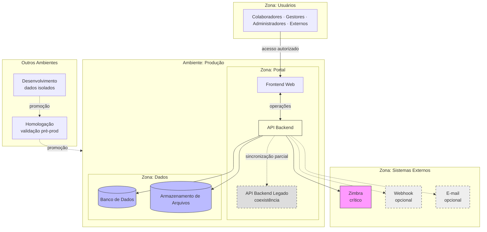

# Deployment Architecture — Portal de Comunicação

## 1. Objetivo

Este documento define a **arquitetura de implantação lógica** do Portal de Comunicação — como a solução é distribuída em ambientes, como os containers se relacionam em execução, quais zonas de confiança existem e quais requisitos de disponibilidade, escalabilidade e continuidade operacional se aplicam.

Consolida os artefatos de containers, integrações, dados e segurança em uma visão operacional alvo, permanecendo **independente de tecnologia** — sem plataformas cloud, orquestradores, proxies ou infraestrutura física.

**Rastreabilidade:** `docs/architecture/02-container-diagram.md`, `docs/architecture/04-integrations.md`, `docs/architecture/05-data-architecture.md`, `docs/architecture/06-security-architecture.md`.

---

## 2. Visão Geral da Implantação

O Portal de Comunicação implanta-se como **aplicação web distribuída em três camadas lógicas**, replicada em três ambientes com isolamento progressivo. A topologia de containers é **idêntica em estrutura** entre ambientes; diferem isolamento de dados, criticidade de disponibilidade e exposição a sistemas externos.

### Camadas lógicas de implantação

```
┌─────────────────────────────────────────────────────────┐
│  Camada de Apresentação    │  Frontend Web              │
├────────────────────────────┼────────────────────────────┤
│  Camada de Aplicação       │  API Backend               │
│                            │  API Backend Legado (opc.) │
├────────────────────────────┼────────────────────────────┤
│  Camada de Persistência    │  Banco de Dados            │
│                            │  Armazenamento de Arquivos │
└────────────────────────────┴────────────────────────────┘
         │                              │
         ▼                              ▼
   Atores (Usuários)            Sistemas Externos (Zimbra)
```

### Princípios de implantação

| Princípio | Descrição |
| --------- | --------- |
| Decisão centralizada na API Backend | Toda regra de negócio, autenticação e autorização executa na camada de aplicação |
| Persistência segregada | Metadados e binários em repositórios lógicos distintos |
| Ambientes isolados | Dados de desenvolvimento e homologação não compartilham persistência com produção |
| Dependência externa mínima | Zimbra é única dependência externa crítica documentada |
| Monólito modular | API Backend hospeda todos os bounded contexts — sem decomposição em serviços independentes documentada |

**Nível de confiança:** Médio-Alto para topologia e ambientes; Médio para requisitos operacionais detalhados (mecanismos técnicos não especificados).

---

## 3. Ambientes

Três ambientes lógicos com responsabilidades distintas. Nomenclatura alinhada à prática organizacional documentada (desenvolvimento, homologação, produção).

### Desenvolvimento

| Aspecto | Descrição |
| ------- | --------- |
| **Responsabilidade** | Construção, integração e validação técnica de componentes |
| **Dados** | Dados sintéticos ou anonimizados; sem dados operacionais de produção |
| **Sistemas externos** | Zimbra de teste ou simulação lógica de autenticação; canais opcionais desabilitados |
| **Disponibilidade** | Baixa — interrupções aceitáveis |
| **Containers** | Topologia completa disponível; API Backend Legado pode coexistir para testes de migração |
| **Exposição** | Restrita a equipe de desenvolvimento |

### Homologação

| Aspecto | Descrição |
| ------- | --------- |
| **Responsabilidade** | Validação funcional, aceite de negócio e ensaio de implantação antes de produção |
| **Dados** | Cópia controlada ou subconjunto representativo; isolado de produção |
| **Sistemas externos** | Integração com Zimbra corporativo ou ambiente de pré-produção |
| **Disponibilidade** | Média — disponível em horário de validação |
| **Containers** | Topologia idêntica à produção em estrutura; capacidade reduzida |
| **Exposição** | Stakeholders, administradores e equipe de testes |

### Produção

| Aspecto | Descrição |
| ------- | --------- |
| **Responsabilidade** | Operação do portal para colaboradores, gestores e administradores da Unimed Ceará |
| **Dados** | Dados operacionais reais; confidencialidade institucional (BR-004) |
| **Sistemas externos** | Zimbra corporativo obrigatório; canais opcionais conforme política |
| **Disponibilidade** | Alta — interrupção impacta comunicação interna e gestão documental |
| **Containers** | Topologia completa; API Backend Legado em coexistência documentada — decisão de descomissionamento pendente |
| **Exposição** | Atores autorizados (colaboradores, parceiros, convidados) |

### Dependências entre ambientes

| Relação | Descrição |
| ------- | --------- |
| Desenvolvimento → Homologação | Promoção de versão após validação técnica |
| Homologação → Produção | Promoção após aceite funcional e validação de integrações |
| Dados | **Sem compartilhamento** de persistência entre ambientes |
| Configuração institucional | Parâmetros por ambiente; produção com valores operacionais |

---

## 4. Topologia Lógica

Distribuição de responsabilidades dos containers em execução. Cada container ocupa uma camada lógica dentro do boundary do Portal de Comunicação.

| Container | Camada | Responsabilidade em execução |
| --------- | ------ | ---------------------------- |
| **Frontend Web** | Apresentação | Interface com atores; encaminha operações à API Backend; mantém estado de sessão no cliente; recebe notificações |
| **API Backend** | Aplicação | Orquestra bounded contexts; autentica via Zimbra; autoriza; persiste metadados; coordena binários; emite notificações |
| **Banco de Dados** | Persistência | Armazena metadados, identidade operacional, estrutura organizacional, permissões, auditoria e notificações |
| **Armazenamento de Arquivos** | Persistência | Armazena binários de documentos referenciados por metadados |
| **API Backend Legado** | Aplicação (legado) | Coexistência parcial; sincronização com API Backend — não é caminho principal |
| **Zimbra** | Externo | Validação de identidade corporativa |
| **Sistema destino de webhook** | Externo | Canal opcional de notificação |
| **Servidor de e-mail corporativo** | Externo | Canal opcional de notificação |

### Fluxo lógico de comunicação

```
Ator → Frontend Web → API Backend → Banco de Dados
                              ↓
                    Armazenamento de Arquivos
                              ↓
                           Zimbra (autenticação)
```

Toda operação de negócio transita pelo **API Backend**. O Frontend Web não acessa persistência ou sistemas externos diretamente.

---

## 5. Distribuição dos Containers

| Container | Responsabilidade | Dependências |
| --------- | ---------------- | ------------ |
| Frontend Web | Apresentar interface; consumir API Backend; exibir notificações | API Backend |
| API Backend | Executar regras de negócio; autenticar; autorizar; orquestrar persistência | Banco de Dados, Armazenamento de Arquivos, Zimbra; API Backend Legado (opcional) |
| Banco de Dados | Persistir metadados e dados transacionais | Nenhuma dependência de outros containers do portal |
| Armazenamento de Arquivos | Persistir binários de documentos | Referenciado pela API Backend |
| API Backend Legado | Manter rotas legadas; sincronização parcial | API Backend |
| Zimbra | Validar credenciais de e-mail corporativo | Independente do portal |
| Sistema destino de webhook | Receber notificações opcionais | API Backend (emissão) |
| Servidor de e-mail corporativo | Encaminhar notificações opcionais | API Backend (emissão) |

### Colocação lógica por ambiente

| Container | Desenvolvimento | Homologação | Produção |
| --------- | --------------- | ----------- | -------- |
| Frontend Web | Sim | Sim | Sim |
| API Backend | Sim | Sim | Sim |
| Banco de Dados | Sim (isolado) | Sim (isolado) | Sim |
| Armazenamento de Arquivos | Sim (isolado) | Sim (isolado) | Sim |
| API Backend Legado | Opcional (testes) | Opcional | Coexistência documentada |
| Zimbra | Teste/simulação | Pré-produção | Corporativo |
| Webhook / E-mail | Desabilitado | Opcional | Opcional |

---

## 6. Zonas de Confiança

Fronteiras lógicas de segurança e confiança na implantação.

### Usuários

| Aspecto | Descrição |
| ------- | --------- |
| **Conteúdo** | Colaboradores, gestores, administradores, parceiros autorizados, convidados |
| **Confiança** | Identidade validada externamente; autorização decidida na API Backend |
| **Fronteira** | Atores acessam apenas Frontend Web; não acessam camada de persistência ou API Backend diretamente |
| **Restrição** | Acesso restrito a perfis autorizados (BR-001); convidados limitados a conteúdo público (BR-033) |

### Portal

| Aspecto | Descrição |
| ------- | --------- |
| **Conteúdo** | Frontend Web, API Backend, API Backend Legado |
| **Confiança** | Boundary do sistema; decisões de negócio e segurança centralizadas na API Backend |
| **Fronteira** | Comunicação com Usuários (entrada) e Dados (persistência); integração controlada com Sistemas Externos |
| **Restrição** | Frontend não decide autorização; sessão validada em cada operação |

### Dados

| Aspecto | Descrição |
| ------- | --------- |
| **Conteúdo** | Banco de Dados, Armazenamento de Arquivos |
| **Confiança** | Zona de maior proteção; acesso exclusivo via API Backend |
| **Fronteira** | Não exposta a atores ou sistemas externos |
| **Restrição** | Conteúdo confidencial e de uso profissional (BR-004); segregação metadado × binário |

### Sistemas Externos

| Aspecto | Descrição |
| ------- | --------- |
| **Conteúdo** | Zimbra, webhook, servidor de e-mail |
| **Confiança** | Fora do boundary do portal; Zimbra é dependência crítica de identidade |
| **Fronteira** | API Backend inicia integrações; portal não provisiona contas de e-mail |
| **Restrição** | Canais opcionais (webhook, e-mail) não bloqueiam operação principal |

### Diagrama de zonas

```
┌──────────────────────────────────────────────────────────────┐
│  ZONA: Usuários                                              │
│  Colaboradores · Gestores · Administradores · Externos       │
└──────────────────────────┬───────────────────────────────────┘
                           │ acesso autorizado
┌──────────────────────────▼───────────────────────────────────┐
│  ZONA: Portal                                                  │
│  ┌──────────────┐    ┌─────────────────────────────────────┐   │
│  │ Frontend Web │───►│ API Backend (+ Legado opcional)     │   │
│  └──────────────┘    └──────────┬──────────────────────────┘   │
└─────────────────────────────────┼──────────────────────────────┘
                                  │
          ┌───────────────────────┼───────────────────────┐
          ▼                       ▼                       ▼
┌─────────────────┐   ┌─────────────────────┐   ┌─────────────────┐
│ ZONA: Dados     │   │ ZONA: Sist. Externos│   │                 │
│ Banco de Dados  │   │ Zimbra (crítico)    │   │                 │
│ Armaz. Arquivos │   │ Webhook · E-mail    │   │                 │
└─────────────────┘   └─────────────────────┘   └─────────────────┘
```

---

## 7. Disponibilidade

### Componentes críticos

Componentes cuja indisponibilidade impede operação do portal ou de fluxos de valor essenciais.

| Componente | Criticidade | Justificativa |
| ---------- | ----------- | ------------- |
| API Backend | **Crítica** | Orquestra todos os bounded contexts e decisões de segurança |
| Banco de Dados | **Crítica** | Persistência de metadados, sessão, permissões e estrutura organizacional |
| Zimbra | **Crítica** (novos acessos) | Única fonte de identidade corporativa documentada |
| Frontend Web | **Alta** | Interface obrigatória para atores; sem alternativa documentada |
| Armazenamento de Arquivos | **Alta** | Publicação e download de documentos comprometidos sem ele |
| Gestão de Solicitações de Permissão | **Média** | Fluxo parcial documentado; impacto em governança, não em operação básica |
| API Backend Legado | **Baixa** | Não é caminho principal do fluxo de valor |
| Webhook / E-mail | **Baixa** | Canais opcionais; notificações in-app permanecem |

### Dependências críticas

| Dependência | Componentes | Efeito em cascata |
| ----------- | ----------- | ----------------- |
| API Backend → Banco de Dados | Todos os fluxos transacionais | Operação interrompida |
| API Backend → Zimbra | Autenticação | Novos logins impossibilitados |
| API Backend → Armazenamento | Publicação e download | Documentos inacessíveis |
| Frontend Web → API Backend | Todas as operações | Interface sem funcionalidade |
| Autorização → Gestão de Vínculos | Decisões de acesso | Escopo inválido bloqueia operações |

### Impactos de indisponibilidade

| Componente indisponível | Impacto operacional | Impacto de negócio |
| ----------------------- | ------------------- | ------------------ |
| Zimbra | Novos logins bloqueados; sessões ativas podem continuar | Bloqueio de ingresso de colaboradores |
| Banco de Dados | Portal inoperante | Interrupção completa de comunicação interna e gestão documental |
| Armazenamento de Arquivos | Publicação e download bloqueados; risco metadado sem binário | Documentos inacessíveis |
| API Backend | Portal inoperante | Interrupção completa |
| Frontend Web | Atores sem interface | Interrupção de acesso mesmo com backend disponível |
| Canais opcionais | Notificações externas não entregues | Baixo — canal in-app permanece |

---

## 8. Escalabilidade

Requisitos e pontos de crescimento em nível lógico, sem tecnologias de escala.

### Componentes com maior demanda

| Componente | Padrão de demanda | Motivo |
| ---------- | ----------------- | ------ |
| API Backend | Operações transacionais concentradas | Monólito modular — todos os bounded contexts |
| Armazenamento de Arquivos | Crescimento contínuo | Acúmulo de binários documentais; quotas por colaborador (BR-023) |
| Banco de Dados | Leitura e escrita transacional | Metadados, permissões, estrutura organizacional, notificações |
| Frontend Web | Sessões concorrentes de atores | Interface de todos os usuários |
| Busca Unificada (componente) | Consultas transversais | Agregação de múltiplas fontes sem mutação (BR-038) |
| Gestão de Notificações (componente) | Entrega em tempo real | Streaming ao Frontend Web |

### Possíveis gargalos

| Gargalo | Descrição |
| ------- | --------- |
| API Backend centralizada | Ponto único de processamento de negócio; sem decomposição documentada |
| Banco de Dados | Persistência central de todos os metadados transacionais |
| Armazenamento de Arquivos | Volume crescente de binários; quotas limitam por colaborador, não globalmente |
| Autenticação via Zimbra | Dependência externa em cada novo login |
| Busca unificada | Composição de consultas a múltiplos componentes por requisição |

### Pontos de crescimento

| Dimensão | Direção de crescimento |
| -------- | ---------------------- |
| Colaboradores integrados | Escala de vínculos organizacionais e sessões |
| Documentos publicados | Escala de metadados e binários |
| Singulares e áreas | Escala de estrutura organizacional |
| Notificações | Escala de entrega e persistência |
| Consultas de busca | Escala de leitura transversal |

**Observação:** a documentação não define decomposição em serviços independentes; crescimento horizontal da API Backend é decisão arquitetural futura (ADR).

---

## 9. Continuidade Operacional

Requisitos de recuperação e dependências para restabelecimento da operação.

### Recuperação operacional

| Cenário | Prioridade de recuperação | Dependências para restabelecer |
| ------- | ------------------------ | ------------------------------ |
| Indisponibilidade da API Backend | 1 — imediata | Banco de Dados e Armazenamento acessíveis |
| Indisponibilidade do Banco de Dados | 1 — imediata | Restauração de metadados transacionais |
| Indisponibilidade do Armazenamento | 2 — alta | Metadados intactos; binários restaurados |
| Indisponibilidade do Zimbra | 2 — alta (novos acessos) | Sessões ativas podem sustentar operação temporária |
| Indisponibilidade do Frontend Web | 2 — alta | API Backend operacional |
| Indisponibilidade de canais opcionais | 3 — baixa | Notificações in-app como alternativa |

*Mecanismos técnicos de backup, réplica e failover não especificados na documentação consolidada.*

### Dependências de identidade

| Dependência | Continuidade |
| ----------- | ------------ |
| Zimbra | Sem alternativa documentada; novos acessos dependem de disponibilidade externa |
| Sessões estabelecidas | Podem permitir operação temporária sem reautenticação — expiração não detalhada |
| Vínculos organizacionais | Dados no Banco de Dados; recuperação vinculada à persistência |
| API Backend Legado | Sincronização parcial; estado divergente em falha — risco residual |

### Dependências de documentos

| Dependência | Continuidade |
| ----------- | ------------ |
| Metadados (Banco de Dados) | Fonte de referência para localização e classificação |
| Binários (Armazenamento) | Necessários para download; inconsistência se metadado sem binário |
| Autorização | Necessária para entrega mesmo com dados restaurados |
| Quotas (BR-023) | Publicação bloqueada se quota ultrapassada — independente de disponibilidade |

### Dependências de autorização

| Dependência | Continuidade |
| ----------- | ------------ |
| Papéis e permissões | Persistidos no Banco de Dados |
| Compartilhamento vs. permissão efetiva | Devem ser restaurados de forma coerente — fronteira sensível (OQ-005) |
| Auditoria | Registros de governança; perda compromete rastreabilidade (BR-005) |
| Solicitação de permissão | Fluxo parcial — continuidade do ciclo não garantida (OQ-003) |

---

## 10. Riscos Arquiteturais

Riscos consolidados dos artefatos anteriores com impacto em implantação. Evidência documentada.

| Risco | Categoria | Impacto em implantação |
| ----- | --------- | ---------------------- |
| API Backend como ponto único de processamento | Ponto único de falha | Indisponibilidade afeta todo o portal |
| Banco de Dados como persistência central | Ponto único de falha | Sem metadados, portal inoperante |
| Dependência única do Zimbra | Dependência externa | Novos acessos bloqueados sem alternativa |
| Armazenamento separado de metadados | Dependência de armazenamento | Inconsistência metadado/binário em falha parcial |
| API Backend Legado em coexistência | Acoplamento | Estado divergente; complexidade operacional |
| Dois subsistemas de notificação | Duplicação | Complexidade na persistência e recuperação |
| Capacidades PARCIAL em produção | Prontidão operacional | Fluxos incompletos expostos a usuários |
| Endpoints órfãos Frontend ↔ API Backend | Desalinhamento | Expectativa de funcionalidade sem backend |
| Sessões ativas sem Zimbra | Continuidade ambígua | Comportamento de expiração não documentado |
| Crescimento de binários sem política documentada | Escalabilidade | Armazenamento como gargalo de longo prazo |

---

## 11. Questões Arquiteturais em Aberto

Questões de `docs/domain/10-open-questions.md` com impacto em implantação. Nenhuma questão nova criada.

| ID | Questão | Impacto em implantação |
| -- | ------- | ---------------------- |
| OQ-003 | Solicitação de permissão de ponta a ponta? | Prontidão do fluxo de governança em produção |
| OQ-004 | Comunicado: documento ou publicação? | Distribuição de componentes e persistência em produção |
| OQ-005 | Compartilhamento equivalente ao acesso efetivo? | Consistência em ambiente com múltiplas instâncias lógicas |
| OQ-006 | Revogação formal de permissão? | Ciclo de vida operacional de dados de acesso |
| OQ-011 | Alterar compartilhamento após publicação? | Operações de manutenção em produção |
| OQ-015 | Consequências além do bloqueio de quota? | Política operacional de armazenamento |
| OQ-017 | Revogação ou expiração de permissão? | Encerramento de acesso em produção |
| OQ-021 | Escopo da Central de Colaboração? | Decisão de implantar capacidade periférica |
| OQ-022 | Léxico de métricas administrativas? | Decisão de implantar indicadores em produção |
| OQ-023 | Processo formal de Fique por Dentro? | Prontidão do canal em produção |

### Decisão de implantação pendente (arquitetura)

| Tema | Impacto |
| ---- | ------- |
| Descomissionamento da API Backend Legado | Simplifica topologia de produção |
| Unificação dos subsistemas de notificação | Simplifica persistência e recuperação |
| Resolução de endpoints órfãos | Alinha Frontend e API Backend em todos os ambientes |

---

## 12. Diagrama de Deployment (Mermaid)

Implantação lógica em produção — ambientes, containers, zonas de confiança e dependências críticas.



**Legenda:** amarelo — componente crítico; rosa — dependência externa crítica; azul — zona de dados; tracejado — opcional ou legado.

---

## Fontes Utilizadas

### Fonte primária (Architecture)

- `docs/architecture/00-architecture-index.md`
- `docs/architecture/01-system-context.md`
- `docs/architecture/02-container-diagram.md`
- `docs/architecture/03-component-diagram.md`
- `docs/architecture/04-integrations.md`
- `docs/architecture/05-data-architecture.md`
- `docs/architecture/06-security-architecture.md`

### Fonte secundária

- `docs/domain/10-open-questions.md`

*Nenhuma infraestrutura existente, docker-compose, pipeline, servidor ou configuração técnica foi analisada para a construção deste artefato.*

---

## Nível de Confiança

**Médio-Alto**

| Faixa | Escopo |
| ----- | ------ |
| Alto | Topologia de containers; três ambientes; zonas de confiança; componentes críticos |
| Médio | Escalabilidade; continuidade operacional; API Backend Legado |
| Baixo | Mecanismos técnicos de recuperação; comportamento de sessão em falha do Zimbra |

Este documento consolida requisitos operacionais para `08-decision-records.md`, sem necessidade de redescoberta de ambientes ou dependências.
