# Decision Records — Portal de Comunicação

## 1. Objetivo

Este documento consolida as **decisões arquiteturais** identificadas durante a construção da camada Architecture do Portal de Comunicação. Funciona como catálogo de ADRs (Architecture Decision Records), registrando decisões explícitas e implícitas, contexto, motivação, consequências, alternativas rejeitadas e decisões ainda pendentes.

As decisões foram derivadas exclusivamente dos artefatos `01-system-context.md` a `07-deployment-architecture.md` e do domínio de negócio quando necessário para justificativa.

---

## 2. Visão Geral das Decisões

### Decisões consolidadas (Aceitas)

| ADR | Título | Status |
| --- | ------ | ------ |
| ADR-001 | Monólito modular como arquitetura inicial | Aceita |
| ADR-002 | API Backend como ponto central de negócio | Aceita |
| ADR-003 | Autenticação corporativa via provedor externo (Zimbra) | Aceita |
| ADR-004 | Separação entre metadados e binários | Aceita |
| ADR-005 | Autorização centralizada no backend | Aceita |
| ADR-006 | Frontend Web exclusivamente como camada de apresentação | Aceita |
| ADR-007 | Quatro bounded contexts em um único API Backend | Aceita |
| ADR-008 | Compartilhamento e autorização como responsabilidades separadas | Aceita |
| ADR-009 | Referência por identificador entre aggregates | Aceita |
| ADR-010 | Consistência forte intra-aggregate e eventual inter-aggregate | Aceita |
| ADR-011 | Três ambientes lógicos isolados | Aceita |
| ADR-012 | Notificações no API Backend | Aceita |
| ADR-013 | Organização Corporativa como contexto upstream | Aceita |
| ADR-014 | Busca unificada como projeção de consulta sem mutação | Aceita |

### Decisões provisórias

| ADR | Título | Status |
| --- | ------ | ------ |
| ADR-015 | Coexistência da API Backend Legado | Provisória |

### Decisões pendentes

| Tema | Origem |
| ---- | ------ |
| Descomissionamento da API Backend Legado | 02-container, 07-deployment |
| Unificação dos subsistemas de notificação | 02-container, 04-integrations |
| Estratégia de escalabilidade horizontal | 07-deployment |
| Definição operacional de perfis externos | 06-security, OQ-002 |
| Ownership de comunicado | 05-data, OQ-004 |
| Resolução de endpoints órfãos Frontend ↔ API Backend | 04-integrations |

**Nível de confiança:** Médio-Alto para decisões aceitas; Médio para provisórias e pendentes.

---

## 3. Catálogo de ADRs

### ADR-001 — Monólito Modular como Arquitetura Inicial

#### Contexto

O Portal de Comunicação possui quatro bounded contexts documentados (Organização Corporativa, Gestão Documental, Controle de Acesso, Comunicação Interna) com dependências claras e fronteiras sensíveis. A documentação consolidada não identifica decomposição em microsserviços.

#### Decisão

Adotar arquitetura de **monólito modular** na camada de aplicação: um único API Backend hospeda todos os bounded contexts, com separação lógica por componentes de capacidade de negócio.

#### Alternativas Consideradas

| Alternativa | Motivo de rejeição |
| ----------- | ------------------ |
| Microsserviços por bounded context | Não documentada; complexidade operacional sem necessidade comprovada |
| Múltiplos backends por domínio | Sem evidência nos artefatos de arquitetura |

#### Consequências

- Simplicidade de implantação e comunicação interna entre contextos.
- API Backend como ponto único de processamento e ponto único de falha.
- Escalabilidade horizontal requer decisão futura (pendente).

#### Status

**Aceita**

---

### ADR-002 — API Backend como Ponto Central de Negócio

#### Contexto

O fluxo de valor documentado exige coordenação entre autenticação, autorização, gestão documental, organização e comunicação. O Frontend Web consome operações mas não deve decidir regras de negócio.

#### Decisão

Centralizar **todas as regras de negócio, autenticação, autorização e orquestração de persistência** no container API Backend. Toda operação de negócio transita pelo API Backend.

#### Alternativas Consideradas

| Alternativa | Motivo de rejeição |
| ----------- | ------------------ |
| Lógica de negócio distribuída no Frontend | Documentação explicita que Frontend não contém regras de negócio |
| BFF (Backend for Frontend) separado por canal | Não documentado |

#### Consequências

- Ponto único de decisão arquitetural e de segurança.
- Frontend simplificado como consumidor.
- Acoplamento de todos os fluxos ao disponibilidade da API Backend.

#### Status

**Aceita**

---

### ADR-003 — Autenticação Corporativa Centralizada via Provedor Externo

#### Contexto

Colaboradores autenticam-se com credenciais de e-mail corporativo da Unimed Ceará (BR-025, BR-026). O portal não provisiona contas de e-mail.

#### Decisão

Utilizar **Zimbra (e-mail corporativo)** como provedor externo de validação de identidade. O componente Autenticação Corporativa no API Backend consome o Zimbra; o portal mantém sessão e vínculo organizacional internamente.

#### Alternativas Consideradas

| Alternativa | Motivo de rejeição |
| ----------- | ------------------ |
| LDAP / Active Directory | Não identificado na documentação consolidada |
| SSO corporativo unificado | Não identificado na documentação consolidada |
| Identidade gerenciada exclusivamente pelo portal | Contradiz dependência documentada de e-mail corporativo; portal não provisiona contas |

#### Consequências

- Dependência crítica externa única para novos logins.
- Indisponibilidade do Zimbra bloqueia autenticação de novos acessos.
- Portal não substitui gestão de identidade corporativa.

#### Status

**Aceita**

---

### ADR-004 — Separação entre Metadados e Binários

#### Contexto

Documentos possuem metadados de negócio (visibilidade, compartilhamento, escopo) e conteúdo binário. Regras de governança aplicam-se predominantemente aos metadados.

#### Decisão

Persistir **metadados** no container Banco de Dados e **binários de documentos** no container Armazenamento de Arquivos, coordenados pelo componente Gestão de Armazenamento na API Backend.

#### Alternativas Consideradas

| Alternativa | Motivo de rejeição |
| ----------- | ------------------ |
| Armazenamento unificado de metadados e binários | Não documentado; containers distintos já consolidados |
| Binários no mesmo repositório transacional dos metadados | Separação documentada como limite arquitetural |

#### Consequências

- Dois pontos de persistência a manter disponíveis.
- Risco de inconsistência metadado/binário em falha parcial do armazenamento.
- Escalabilidade independente de volume de binários.

#### Status

**Aceita**

---

### ADR-005 — Autorização Centralizada no Backend

#### Contexto

Autorização depende de papel e contexto organizacional (BR-003). Guards de autorização no Frontend documentados como permissivos. Decisão efetiva de acesso não pode residir no cliente.

#### Decisão

Centralizar **toda decisão de autorização** no componente Autorização do API Backend. O Frontend Web não decide acesso a recursos.

#### Alternativas Consideradas

| Alternativa | Motivo de rejeição |
| ----------- | ------------------ |
| Autorização no Frontend Web | Explicitamente rejeitada — guards permissivos; decisão efetiva no servidor |
| Autorização distribuída por componente sem coordenação | Contradiz componente Autorização como ponto de decisão |

#### Consequências

- Segurança consistente independente do cliente.
- Toda entrega de recurso passa pela API Backend.
- Latência adicional em cada operação para validação de acesso.

#### Status

**Aceita**

---

### ADR-006 — Frontend Web Exclusivamente como Camada de Apresentação

#### Contexto

Arquitetura de três camadas lógicas documentada: Apresentação, Aplicação, Persistência.

#### Decisão

O container **Frontend Web** atua exclusivamente como camada de apresentação: interface, consumo da API Backend, estado de sessão no cliente e exibição de notificações. Sem acesso direto a persistência ou sistemas externos.

#### Alternativas Consideradas

| Alternativa | Motivo de rejeição |
| ----------- | ------------------ |
| Frontend com acesso direto ao Banco de Dados | Violaria zonas de confiança documentadas |
| Frontend com validação de negócio | Contradiz ADR-002 e ADR-005 |

#### Consequências

- Zona de confiança Usuários isolada da zona Dados.
- Dependência total do Frontend em relação à API Backend.

#### Status

**Aceita**

---

### ADR-007 — Quatro Bounded Contexts em um Único API Backend

#### Contexto

Domain consolidou quatro bounded contexts com mapa de dependências estável. Não há proposta de separação física por contexto.

#### Decisão

Hospedar os quatro bounded contexts (Organização Corporativa, Gestão Documental, Controle de Acesso, Comunicação Interna) como **componentes lógicos dentro do mesmo API Backend**, mapeados na camada de componentes.

#### Alternativas Consideradas

| Alternativa | Motivo de rejeição |
| ----------- | ------------------ |
| Um container por bounded context | Não documentado na camada Architecture |
| Dois backends (núcleo + comunicação) | Comunicação Interna documentada como contexto de suporte no mesmo backend |

#### Consequências

- Fronteiras de contexto são lógicas, não físicas.
- Coordenação interna sem integração inter-serviço.
- Comunicação Interna com menor confiança permanece no mesmo deployment.

#### Status

**Aceita**

---

### ADR-008 — Compartilhamento e Autorização como Responsabilidades Separadas

#### Contexto

Gestão de Compartilhamento define audiência do recurso (Gestão Documental). Autorização efetiva quem acessa (Controle de Acesso). Fronteira sensível documentada (OQ-005).

#### Decisão

Manter **Gestão de Compartilhamento** e **Autorização** como componentes distintos, com integração obrigatória para alinhamento entre audiência e permissão efetiva.

#### Alternativas Consideradas

| Alternativa | Motivo de rejeição |
| ----------- | ------------------ |
| Compartilhamento equivalente a permissão automaticamente | Questão em aberto (OQ-005); não consolidado |
| Fusão de compartilhamento e autorização em um único componente | Contradiz bounded contexts e aggregates distintos |

#### Consequências

- Risco de divergência entre exposição e acesso se integração falhar.
- Modelagem alinhada ao domínio (BR-020 + BR-003).
- Requer coordenação explícita na API Backend.

#### Status

**Aceita**

---

### ADR-009 — Referência por Identificador entre Aggregates

#### Contexto

Quatro aggregates documentados com limites de consistência. BR-006 estabelece que agregados distintos referenciam-se por identificadores de negócio.

#### Decisão

Contextos consumidores **referenciam dados de outros aggregates por identificador de negócio**, sem duplicar estado mutável entre fontes de verdade.

#### Alternativas Consideradas

| Alternativa | Motivo de rejeição |
| ----------- | ------------------ |
| Réplica de estado organizacional no Controle de Acesso | Violaria BR-006 e ownership de Organização Corporativa |
| Cache mutável de permissões sem fonte de verdade | Risco de inconsistência não documentado como aceito |

#### Consequências

- Ownership claro por aggregate.
- Consistência entre aggregates mediada por eventos (ADR-010).
- Consultas cross-context dependem de identificadores estáveis.

#### Status

**Aceita**

---

### ADR-010 — Consistência Forte Intra-Aggregate e Eventual Inter-Aggregate

#### Contexto

Aggregates possuem invariantes que não podem ser violadas dentro do limite. Contextos consomem fatos uns dos outros.

#### Decisão

Exigir **consistência forte** dentro de cada aggregate e **consistência eventual** entre aggregates, mediada por eventos de domínio documentados.

#### Alternativas Consideradas

| Alternativa | Motivo de rejeição |
| ----------- | ------------------ |
| Consistência forte global transacional | Não documentada; incompatível com aggregates distintos |
| Consistência eventual dentro do aggregate | Violaria invariantes documentadas (ex.: visibilidade + compartilhamento) |

#### Consequências

- Operações dentro de um contexto são atomicamente consistentes no nível lógico.
- Notificações e alinhamento cross-context podem ter latência.
- Eventos de domínio como mecanismo de propagação.

#### Status

**Aceita**

---

### ADR-011 — Três Ambientes Lógicos Isolados

#### Contexto

Implantação requer validação progressiva antes de produção. Dados operacionais são confidenciais (BR-004).

#### Decisão

Definir três ambientes lógicos — **Desenvolvimento**, **Homologação** e **Produção** — com **persistência isolada** entre eles e promoção de versão Dev → Hml → Prod.

#### Alternativas Consideradas

| Alternativa | Motivo de rejeição |
| ----------- | ------------------ |
| Ambiente único compartilhado | Contradiz isolamento e confidencialidade |
| Quatro ambientes incluindo local dedicado | Apenas três ambientes nomeados na documentação de deployment |

#### Consequências

- Dados de produção protegidos de ambientes inferiores.
- Custo de manter três topologias lógicas.
- Homologação como gate de aceite antes de produção.

#### Status

**Aceita**

---

### ADR-012 — Notificações no API Backend

#### Contexto

Comunicação Interna inclui notificações. Documentação consolidada não identifica serviço de notificação como container independente.

#### Decisão

Implementar **Gestão de Notificações** como componente dentro do API Backend, com persistência no Banco de Dados e entrega via Frontend Web (consulta ou streaming). Canais externos (webhook, e-mail) como opcionais.

#### Alternativas Consideradas

| Alternativa | Motivo de rejeição |
| ----------- | ------------------ |
| Container Serviço de Notificação separado | Não documentado em 02-container-diagram |
| Notificações exclusivamente externas | Contradiz notificações in-app documentadas como ATIVAS |

#### Consequências

- Notificações acopladas ao ciclo de vida da API Backend.
- Dois subsistemas de notificação documentados — unificação pendente.
- Canais opcionais não bloqueiam operação principal.

#### Status

**Aceita**

---

### ADR-013 — Organização Corporativa como Contexto Upstream

#### Contexto

Context map documenta Organização Corporativa como produtor de escopo e vínculos; todos os demais contextos dependem dele.

#### Decisão

Tratar **Organização Corporativa** como contexto **upstream obrigatório**: nenhum fluxo de valor opera sem vínculo e contexto organizacional válidos (BR-009, BR-010, BR-011).

#### Alternativas Consideradas

| Alternativa | Motivo de rejeição |
| ----------- | ------------------ |
| Operação sem vínculo organizacional | Explicitamente impedida por BR-010 |
| Gestão Documental como contexto upstream | Contradiz sequência documentada no context map |

#### Consequências

- Onboarding é gate obrigatório no fluxo de valor.
- Alterações organizacionais impactam todos os contextos consumidores.
- Colaborador sem área vinculada não opera.

#### Status

**Aceita**

---

### ADR-014 — Busca Unificada como Projeção de Consulta sem Mutação

#### Contexto

Busca unificada consulta documentos, áreas, singulares e colaboradores. BR-038 preserva estado dos aggregates fonte.

#### Decisão

Implementar **Busca Unificada** como componente de **projeção read-only** que compõe resultados de múltiplos componentes, aplicando filtros de Autorização, **sem mutar** dados proprietários dos contextos consultados.

#### Alternativas Consideradas

| Alternativa | Motivo de rejeição |
| ----------- | ------------------ |
| Busca como owner de dados indexados | Contradiz ownership dos contextos fonte |
| Busca sem filtro de autorização | Violaria BR-003 e governança de acesso |

#### Consequências

- Busca depende de disponibilidade de múltiplos componentes.
- Regras de escopo além da autorização básica em aberto (OQ-024).
- Status PARCIAL documentado na Discovery.

#### Status

**Aceita**

---

### ADR-015 — Coexistência da API Backend Legado

#### Contexto

Documentação consolidada registra API Backend Legado com status LEGADO, sincronização parcial com API Backend principal e rotas paralelas.

#### Decisão

**Manter coexistência provisória** da API Backend Legado em produção, com API Backend como caminho principal do fluxo de valor. Sincronização parcial de identidade e sessão.

#### Alternativas Consideradas

| Alternativa | Motivo de rejeição / status |
| ----------- | --------------------------- |
| Descomissionamento imediato | Decisão pendente — não consolidada |
| API Backend Legado como caminho principal | Contradiz status LEGADO e fluxo de valor documentado |

#### Consequências

- Complexidade operacional e risco de estado divergente.
- Duplicidade de rotas documentada.
- Descomissionamento é decisão pendente explícita.

#### Status

**Provisória**

---

## 4. Decisões Arquiteturais Implícitas

Decisões encontradas nos artefatos anteriores que não foram formalizadas como ADR até este documento.

| Decisão | Evidência |
| ------- | --------- |
| Quatro aggregates alinhados a quatro bounded contexts | 05-data-architecture, 08-aggregates (Domain) |
| Sessão autenticada mantida após validação no Zimbra | 04-integrations, 06-security-architecture |
| Responsável pelo recurso decide solicitações de permissão | 06-security-architecture, BR-031 |
| Convidado limitado a conteúdo público | 06-security-architecture, BR-033 |
| Quota de armazenamento bloqueia nova publicação | 05-data-architecture, BR-023 |
| Auditoria registra eventos de governança | 06-security-architecture, BR-005 |
| Zonas de confiança: Usuários, Portal, Dados, Externos | 07-deployment-architecture |
| LDAP/AD/SSO não adotados | 01-system-context, 04-integrations |
| Configuração institucional transversal a todos os contextos | 03-component-diagram |
| Capacidades PARCIAL expostas com ressalva documentada | 02-container, 03-component |

---

## 5. Decisões Pendentes

| Tema | Impacto | Origem |
| ---- | ------- | ------ |
| Descomissionamento da API Backend Legado | Simplifica topologia; remove sincronização e duplicidade de rotas | 02-container, 07-deployment, ADR-015 |
| Unificação dos subsistemas de notificação | Simplifica persistência e recuperação | 02-container, 04-integrations |
| Estratégia de escalabilidade horizontal da API Backend | Define crescimento sob demanda de colaboradores e documentos | 07-deployment |
| Definição operacional parceiro autorizado vs. convidado | Modelagem de identidade e autorização externa | 06-security, OQ-002 |
| Ownership e modelo de comunicado | Fronteira Gestão Documental ↔ Comunicação Interna | 05-data, OQ-004 |
| Equivalência compartilhamento ↔ acesso efetivo | Integração entre componentes Gestão de Compartilhamento e Autorização | 04-integrations, OQ-005 |
| Ciclo de vida de revogação de permissão | Completude do modelo de dados de acesso | 06-security, OQ-006, OQ-017 |
| Resolução de endpoints órfãos Frontend ↔ API Backend | Alinhamento de capacidades prometidas vs. implementadas | 04-integrations |
| Fluxo oficial de onboarding | Gate de entrada e dados de integração | 03-component, OQ-001 |
| Catálogo fechado de eventos auditáveis | Completude da governança | 06-security, OQ-019 |

---

## 6. Consequências Arquiteturais

### Benefícios

| Benefício | Decisões relacionadas |
| --------- | --------------------- |
| Simplicidade de implantação e operação | ADR-001, ADR-007, ADR-011 |
| Segurança centralizada e auditável | ADR-002, ADR-005, ADR-003 |
| Alinhamento com domínio (bounded contexts, aggregates) | ADR-007, ADR-008, ADR-009, ADR-013 |
| Separação clara de responsabilidades por camada | ADR-004, ADR-006 |
| Ownership de dados claro | ADR-009, ADR-010 |
| Isolamento de ambientes | ADR-011 |

### Trade-offs

| Trade-off | Decisões relacionadas |
| --------- | --------------------- |
| API Backend como ponto único de falha | ADR-001, ADR-002 |
| Dependência crítica do Zimbra | ADR-003 |
| Risco metadado/binário em falha parcial | ADR-004 |
| Divergência compartilhamento vs. autorização | ADR-008 |
| Latência de consistência eventual entre contextos | ADR-010 |
| Complexidade da coexistência legada | ADR-015 |
| Escalabilidade limitada sem decisão futura | ADR-001 |

### Restrições

| Restrição | Origem |
| --------- | ------ |
| Portal não provisiona identidade corporativa | ADR-003 |
| Frontend não decide autorização | ADR-005, ADR-006 |
| Colaborador sem área não opera | ADR-013, BR-010 |
| Conteúdo confidencial e de uso profissional | BR-004 |
| Persistência isolada entre ambientes | ADR-011 |

### Dependências futuras

| Dependência | Condição |
| ----------- | -------- |
| ADR de escalabilidade | Quando volume de colaboradores/documentos exigir |
| ADR de descomissionamento legado | Após validação de paridade de rotas |
| ADR de perfis externos | Após resolução OQ-002 |
| ADR de comunicado | Após resolução OQ-004 |
| ADR de revogação de permissão | Após resolução OQ-006, OQ-017 |

---

## 7. Rastreabilidade

| ADR | Artefatos Relacionados |
| --- | ---------------------- |
| ADR-001 | 02-container-diagram, 07-deployment-architecture |
| ADR-002 | 02-container-diagram, 03-component-diagram, 04-integrations |
| ADR-003 | 01-system-context, 04-integrations, 06-security-architecture |
| ADR-004 | 02-container-diagram, 05-data-architecture, 04-integrations |
| ADR-005 | 03-component-diagram, 06-security-architecture, 04-integrations |
| ADR-006 | 02-container-diagram, 07-deployment-architecture, 06-security-architecture |
| ADR-007 | 02-container-diagram, 03-component-diagram, 05-data-architecture |
| ADR-008 | 03-component-diagram, 05-data-architecture, 04-integrations |
| ADR-009 | 05-data-architecture, Domain 08-aggregates, BR-006 |
| ADR-010 | 05-data-architecture, Domain 08-aggregates |
| ADR-011 | 07-deployment-architecture |
| ADR-012 | 02-container-diagram, 03-component-diagram, 04-integrations |
| ADR-013 | 01-system-context, 05-data-architecture, Domain 06-context-map |
| ADR-014 | 03-component-diagram, 05-data-architecture, BR-038 |
| ADR-015 | 02-container-diagram, 04-integrations, 07-deployment-architecture |

---

## 8. Questões Arquiteturais em Aberto

Questões que impedem decisões definitivas. Fontes: `docs/domain/10-open-questions.md` e documentos Architecture.

| ID / Tema | Questão | ADR / decisão impactada |
| --------- | ------- | ------------------------ |
| OQ-001 | Fluxo oficial de onboarding? | ADR-013 |
| OQ-002 | Parceiro vs. convidado? | Decisão pendente perfis externos |
| OQ-003 | Solicitação de permissão ponta a ponta? | ADR-005, ADR-008 |
| OQ-004 | Comunicado: documento ou publicação? | Decisão pendente ownership |
| OQ-005 | Compartilhamento ≡ acesso efetivo? | ADR-008 |
| OQ-006 | Revogação de permissão? | Decisão pendente ciclo de vida |
| OQ-011 | Alterar compartilhamento após publicação? | ADR-004, ADR-008 |
| OQ-012 | Herança em hierarquia de pastas? | ADR-008 |
| OQ-013 | Federação: estrutura vs. compartilhamento? | ADR-013, ADR-008 |
| OQ-016 | Responsável pelo recurso por escopo? | ADR-005 |
| OQ-017 | Revogação ou expiração de permissão? | Decisão pendente |
| OQ-019 | Catálogo de eventos auditáveis? | ADR implícita auditoria |
| OQ-024 | Escopo da busca unificada? | ADR-014 |
| — | Descomissionamento API Backend Legado | ADR-015 |
| — | Unificação subsistemas de notificação | ADR-012 |
| — | Estratégia de escalabilidade | ADR-001 |

---

## 9. Mapa de Decisões (Mermaid)

Relação entre decisões aceitas, provisórias, pendentes e impactos arquiteturais.

```mermaid
flowchart TB
    subgraph accepted["Decisões Aceitas"]
        ADR001["ADR-001<br/>Monólito Modular"]
        ADR002["ADR-002<br/>API Backend Central"]
        ADR003["ADR-003<br/>Zimbra Externo"]
        ADR004["ADR-004<br/>Metadados × Binários"]
        ADR005["ADR-005<br/>Autorização Backend"]
        ADR006["ADR-006<br/>Frontend Apresentação"]
        ADR007["ADR-007<br/>4 Contextos / 1 Backend"]
        ADR008["ADR-008<br/>Compartilhamento ≠ Authz"]
        ADR009["ADR-009<br/>Ref. por Identificador"]
        ADR010["ADR-010<br/>Consistência Forte/Eventual"]
        ADR011["ADR-011<br/>3 Ambientes Isolados"]
        ADR012["ADR-012<br/>Notificações no Backend"]
        ADR013["ADR-013<br/>Org. Upstream"]
        ADR014["ADR-014<br/>Busca Read-Only"]
    end

    subgraph provisional["Provisória"]
        ADR015["ADR-015<br/>API Legado Coexiste"]
    end

    subgraph pending["Pendentes"]
        P1["Descomissionar Legado"]
        P2["Unificar Notificações"]
        P3["Escalabilidade"]
        P4["Perfis Externos"]
        P5["Ownership Comunicado"]
        P6["Revogação Permissão"]
    end

    subgraph impact["Impactos"]
        I1["Ponto Único de Falha"]
        I2["Dep. Externa Zimbra"]
        I3["Fronteira Sensível"]
        I4["Complexidade Legado"]
    end

    ADR001 --> ADR002
    ADR001 --> ADR007
    ADR002 --> ADR005
    ADR002 --> ADR006
    ADR003 --> ADR002
    ADR004 --> ADR002
    ADR007 --> ADR013
    ADR008 --> ADR005
    ADR009 --> ADR010
    ADR013 --> ADR007

    ADR001 --> I1
    ADR002 --> I1
    ADR003 --> I2
    ADR008 --> I3
    ADR015 --> I4
    ADR015 -.-> P1
    ADR012 -.-> P2
    ADR001 -.-> P3
    ADR003 -.-> P4
    ADR008 -.-> P5
    ADR005 -.-> P6

    style ADR015 fill:#ffd,stroke:#333
    style pending fill:#fdd,stroke:#333
    style I1 fill:#fcc,stroke:#333
    style I2 fill:#f9f,stroke:#333
```

---

## Fontes Utilizadas

### Fonte primária (Architecture)

- `docs/architecture/01-system-context.md`
- `docs/architecture/02-container-diagram.md`
- `docs/architecture/03-component-diagram.md`
- `docs/architecture/04-integrations.md`
- `docs/architecture/05-data-architecture.md`
- `docs/architecture/06-security-architecture.md`
- `docs/architecture/07-deployment-architecture.md`

### Fonte secundária (justificativa de negócio)

- `docs/domain/06-context-map.md`
- `docs/domain/08-aggregates.md`
- `docs/domain/09-business-rules.md`
- `docs/domain/10-open-questions.md`

*Nenhum código-fonte, infraestrutura implantada ou documentação externa foi analisada para a construção deste artefato.*

---

## Nível de Confiança

**Médio-Alto**

| Faixa | Escopo |
| ----- | ------ |
| Alto | ADR-001 a ADR-014 — sustentadas por múltiplos artefatos convergentes |
| Médio | ADR-015 — coexistência legada documentada com decisão de saída pendente |
| Baixo | Decisões pendentes — requerem validação com stakeholders |

Este documento consolida decisões arquiteturais para `09-risk-assessment.md`, sem necessidade de redescoberta.

---

## Decisões de banco (DEC-DB)

Decisões físicas e operacionais do Oracle estão em `database/model/05-decisions-and-risks.md` e, quando aplicável, em ADRs dedicados:

| ID | Título | Documento |
|----|--------|-----------|
| DEC-DB-024 | Application user (`UNMPORTCOM_APP`) × schema owner | [decisions/DEC-DB-024-application-user-strategy.md](decisions/DEC-DB-024-application-user-strategy.md) |

---

## Design System (reconstrução)

Contrato de escopo da reconstrução do Design System da Frontend Foundation. Não é Feature (`FT-DS` não existe e não deve ser criado). Não é ADR de identidade DS-01–DS-10 (ainda pendente) — catálogo de componentes tecnicamente encerrado (§68 do documento), pendências arquiteturais de mais longo prazo (seção 15) e destino de 3 componentes órfãos (dependente de roadmap de produto) permanecem em aberto.

| ID | Título | Status | Documento |
|----|--------|--------|-----------|
| DS-RECONSTRUCTION-SCOPE-01 | Escopo da reconstrução do Design System | `CATALOG_TECHNICALLY_CLOSED` | [decisions/DS-RECONSTRUCTION-SCOPE-01.md](decisions/DS-RECONSTRUCTION-SCOPE-01.md) |
