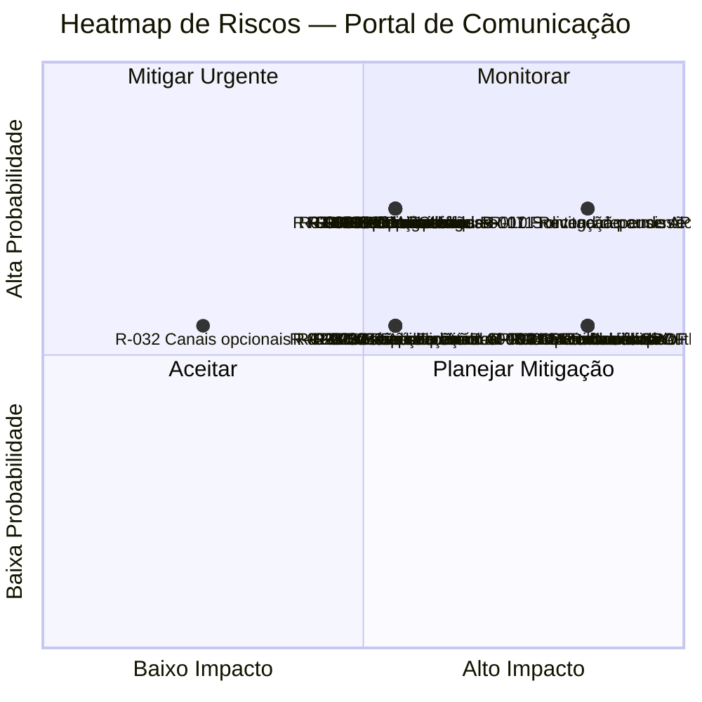
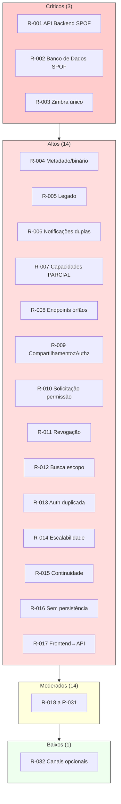

# Risk Assessment — Portal de Comunicação

## 1. Objetivo

Este documento consolida **todos os riscos identificados** ao longo das camadas Discovery, Domain e Architecture do Portal de Comunicação, produzindo uma visão arquitetural única dos fatores que podem impactar negócio, arquitetura, integrações, dados, segurança, operação e evolução futura da solução.

Cada risco possui **rastreabilidade documental** explícita. Nenhum risco hipotético foi inventado sem evidência nos artefatos consolidados.

**Rastreabilidade:** `docs/architecture/01-system-context.md` a `08-decision-records.md`; `docs/domain/10-open-questions.md`; Discovery consultada apenas para validação de riscos já referenciados na camada Architecture (`07-current-architecture.md`, `08-technical-debt.md`).

---

## 2. Visão Geral dos Riscos

### Resumo executivo

O Portal de Comunicação concentra riscos em **três eixos estruturais**: (1) pontos únicos de falha na camada de aplicação e persistência; (2) dependência externa crítica de identidade corporativa (Zimbra); (3) fronteiras de domínio ainda não estabilizadas (compartilhamento vs. autorização, comunicados, perfis externos, ciclo de vida de permissões).

A coexistência da **API Backend Legado**, **dois subsistemas de notificação** e **capacidades PARCIAL** documentadas elevam a complexidade operacional e o desalinhamento entre expectativa de interface e capacidade efetiva.

### Quantidade por severidade

| Severidade | Quantidade | Descrição consolidada |
| ---------- | ---------- | --------------------- |
| **Crítica** | 3 | Indisponibilidade total do portal ou bloqueio de identidade sem alternativa |
| **Alta** | 14 | Governança de acesso incompleta, inconsistência de dados, acoplamentos legados, prontidão parcial |
| **Moderada** | 14 | Fronteiras de domínio em aberto, lacunas de ciclo de vida, confiança reduzida em contextos periféricos |
| **Baixa** | 1 | Impacto limitado ao fluxo principal ou canais opcionais |
| **Total** | **32** | Catálogo consolidado e deduplicado |

### Distribuição por categoria

| Categoria | Quantidade |
| --------- | ---------- |
| Arquitetural | 5 |
| Integração | 8 |
| Dados | 7 |
| Segurança | 7 |
| Operacional | 4 |
| Estratégico | 1 |

*Alguns riscos pertencem a mais de uma categoria; a classificação primária foi atribuída conforme o impacto dominante.*

**Nível de confiança:** Médio-Alto para riscos estruturais (SPOF, Zimbra, legado); Médio para riscos de fronteira de domínio vinculados a questões abertas.

---

## 3. Metodologia de Avaliação

### Probabilidade

| Nível | Critério |
| ----- | -------- |
| **Baixa** | Evento documentado como raro, residual ou com impacto limitado ao fluxo principal |
| **Média** | Evento plausível no ciclo de vida normal; lacuna ou acoplamento documentado com ocorrência esperável |
| **Alta** | Condição já documentada como existente (status PARCIAL, LEGADO, coexistência) ou dependência estrutural permanente |

### Impacto

| Nível | Critério |
| ----- | -------- |
| **Baixo** | Degradação parcial; fluxo principal preservado; canais alternativos documentados |
| **Médio** | Capacidade de negócio específica comprometida; governança ou experiência degradada |
| **Alto** | Interrupção de fluxo de valor essencial, exposição indevida de dados ou inconsistência grave de estado |

### Severidade

Severidade derivada da combinação probabilidade × impacto:

| Probabilidade \ Impacto | Baixo | Médio | Alto |
| ----------------------- | ----- | ----- | ---- |
| **Baixa** | Baixa | Baixa | Moderada |
| **Média** | Baixa | Moderada | Alta |
| **Alta** | Moderada | Alta | Crítica |

| Severidade | Significado |
| ---------- | ----------- |
| **Baixa** | Monitorar; impacto contido |
| **Moderada** | Requer atenção em evolução arquitetural |
| **Alta** | Prioridade elevada de mitigação |
| **Crítica** | Bloqueia operação essencial ou expõe risco institucional severo |

### Processo de classificação

1. Consolidação de riscos já registrados em `04-integrations.md`, `05-data-architecture.md`, `06-security-architecture.md` e `07-deployment-architecture.md`.
2. Deduplicação por tema (mesmo risco em múltiplos artefatos recebe um único ID).
3. Enriquecimento com consequências de ADRs em `08-decision-records.md`.
4. Validação pontual em Discovery (`08-technical-debt.md`) apenas para riscos já abstraídos na Architecture (endpoints órfãos, subsistemas duplicados, guards permissivos).
5. Questões abertas de `10-open-questions.md` classificadas como risco estratégico quando impedem decisão definitiva.

---

## 4. Catálogo Consolidado de Riscos

| ID | Risco | Categoria | Probabilidade | Impacto | Severidade |
| -- | ----- | --------- | ------------- | ------- | ---------- |
| R-001 | API Backend como ponto único de processamento | Arquitetural | Média | Alto | **Crítica** |
| R-002 | Banco de Dados como persistência central transacional | Arquitetural | Média | Alto | **Crítica** |
| R-003 | Dependência única do Zimbra para identidade corporativa | Integração | Média | Alto | **Crítica** |
| R-004 | Inconsistência metadado/binário em falha parcial do armazenamento | Dados | Média | Alto | Alta |
| R-005 | Coexistência da API Backend Legado com sincronização parcial | Integração | Alta | Médio | Alta |
| R-006 | Dois subsistemas de notificação em paralelo | Integração | Alta | Médio | Alta |
| R-007 | Capacidades PARCIAL expostas em produção | Estratégico | Alta | Médio | Alta |
| R-008 | Endpoints órfãos Frontend ↔ API Backend | Integração | Alta | Médio | Alta |
| R-009 | Divergência entre compartilhamento e autorização efetiva | Segurança | Média | Alto | Alta |
| R-010 | Fluxo de solicitação de permissão incompleto | Segurança | Alta | Alto | Alta |
| R-011 | Revogação de permissão não documentada | Segurança | Alta | Alto | Alta |
| R-012 | Busca unificada com escopo de filtro incompleto | Segurança | Média | Alto | Alta |
| R-013 | Mecanismos de autenticação duplicados (legado) | Integração | Alta | Médio | Alta |
| R-014 | Escalabilidade horizontal da API Backend indefinida | Operacional | Média | Alto | Alta |
| R-015 | Mecanismos de backup, réplica e failover não especificados | Operacional | Média | Alto | Alta |
| R-016 | Entidades referenciadas sem persistência confirmada | Dados | Alta | Médio | Alta |
| R-017 | Frontend Web com dependência total da API Backend | Arquitetural | Alta | Alto | Alta |
| R-018 | Ownership de comunicado indefinido | Dados | Alta | Médio | Moderada |
| R-019 | Perfis externos (parceiro vs. convidado) sem distinção operacional | Segurança | Alta | Médio | Moderada |
| R-020 | Dois fluxos de onboarding coexistentes | Integração | Alta | Médio | Moderada |
| R-021 | Responsável pelo recurso não formalizado por escopo | Segurança | Alta | Médio | Moderada |
| R-022 | Herança de permissões em hierarquia de pastas indefinida | Segurança | Média | Médio | Moderada |
| R-023 | Catálogo de eventos auditáveis não fechado | Segurança | Média | Médio | Moderada |
| R-024 | Federação com duplo sentido (estrutura vs. compartilhamento) | Dados | Média | Médio | Moderada |
| R-025 | Alteração de compartilhamento/visibilidade pós-publicação sem regras | Dados | Média | Médio | Moderada |
| R-026 | Comunicação Interna com confiança baixa a média | Arquitetural | Alta | Médio | Moderada |
| R-027 | Consistência eventual entre aggregates | Arquitetural | Média | Médio | Moderada |
| R-028 | Comportamento de sessão ativa sem Zimbra ambíguo | Operacional | Média | Médio | Moderada |
| R-029 | Crescimento de binários sem política global documentada | Operacional | Média | Médio | Moderada |
| R-030 | Matriz de papéis administrativos incompleta por escopo | Segurança | Média | Médio | Moderada |
| R-031 | Guards de autorização no Frontend permissivos | Segurança | Média | Médio | Moderada |
| R-032 | Indisponibilidade de canais opcionais (webhook, e-mail) | Integração | Média | Baixo | Baixa |

### Rastreabilidade por risco

| ID | Evidência documental |
| -- | -------------------- |
| R-001 | 07-deployment §10; 08-decision-records ADR-001, ADR-002 |
| R-002 | 07-deployment §7, §10; 02-container-diagram |
| R-003 | 01-system-context; 04-integrations §8–9; 06-security §10; ADR-003 |
| R-004 | 04-integrations §8; 05-data §9; ADR-004 |
| R-005 | 02-container-diagram; 04-integrations §8–9; ADR-015; Discovery TD-ARCH-001 |
| R-006 | 02-container-diagram; 04-integrations §9; 05-data §9; Discovery TD-ARCH-002 |
| R-007 | 01-system-context §8; 02-container-diagram; 07-deployment §10 |
| R-008 | 04-integrations §9; 07-deployment §10; Discovery TD-APP-001 |
| R-009 | 04-integrations §8–9; 05-data §9; 06-security §9–10; ADR-008; OQ-005 |
| R-010 | 04-integrations §8–9; 06-security §10; OQ-003 |
| R-011 | 01-system-context §8; 05-data §9; 06-security §10; OQ-006, OQ-017 |
| R-012 | 04-integrations §9; 06-security §9–10; ADR-014; OQ-024 |
| R-013 | 04-integrations §9; Discovery TD-ARCH-003, TD-INT-003 |
| R-014 | 07-deployment §8; 08-decision-records ADR-001 (decisão pendente) |
| R-015 | 07-deployment §9 (observação explícita) |
| R-016 | 02-container-diagram §7; Discovery TD-DAT-001 |
| R-017 | 02-container-diagram; 07-deployment §7; ADR-006 |
| R-018 | 05-data §9; 06-security §9; OQ-004 |
| R-019 | 06-security §9–10; OQ-002, OQ-018 |
| R-020 | 01-system-context §8; 04-integrations §9; OQ-001 |
| R-021 | 06-security §10; OQ-016; BR-032 |
| R-022 | 05-data §9; 06-security §10; OQ-012 |
| R-023 | 06-security §7; OQ-019; BR-005 |
| R-024 | 05-data §9; OQ-013 |
| R-025 | 05-data §9; OQ-011 |
| R-026 | 01-system-context §8; 03-component-diagram §8 |
| R-027 | 05-data-architecture §2; ADR-010 |
| R-028 | 07-deployment §7, §9 |
| R-029 | 07-deployment §8, §10; BR-023 |
| R-030 | 06-security §10; OQ-020; BR-034 |
| R-031 | 06-security §9; 02-container-diagram; Discovery TD-SEC-001 |
| R-032 | 04-integrations §8 |

---

## 5. Riscos Arquiteturais

Riscos relacionados a monólito modular, acoplamentos entre contextos, dependências internas e decisões arquiteturais.

| ID | Risco | ADRs relacionados | Descrição |
| -- | ----- | ----------------- | --------- |
| R-001 | API Backend como ponto único de processamento | ADR-001, ADR-002 | Monólito modular concentra todos os bounded contexts; indisponibilidade paralisa o portal inteiro |
| R-002 | Banco de Dados como persistência central | ADR-004 | Metadados, sessão, permissões e estrutura organizacional em repositório único |
| R-017 | Dependência total do Frontend na API Backend | ADR-006 | Camada de apresentação sem acesso direto a persistência ou sistemas externos |
| R-027 | Consistência eventual entre aggregates | ADR-009, ADR-010 | Propagação por eventos pode gerar latência e janelas de inconsistência entre contextos |
| R-026 | Comunicação Interna com confiança reduzida | ADR-007, ADR-012 | Contexto de suporte com aggregate e eventos periféricos não estabilizados |

### Acoplamentos entre contextos documentados

| Acoplamento | Risco associado | Componentes |
| ----------- | --------------- | ----------- |
| Compartilhamento ↔ Autorização | R-009 | Gestão de Compartilhamento, Autorização |
| Comunicado ↔ Documento | R-018 | Gestão de Comunicados, Gestão de Documentos |
| Busca → múltiplos contextos | R-012 | Busca Unificada, Autorização |
| Organização upstream → todos | R-001 (cascata) | Gestão de Vínculos, demais contextos |

---

## 6. Riscos de Integração

Riscos relacionados a Zimbra, API Backend Legado, notificações e dependências externas.

| ID | Risco | Origem | Impacto documentado |
| -- | ----- | ------ | ------------------- |
| R-003 | Dependência única do Zimbra | 04-integrations §8 | Novos logins impossibilitados; sem alternativa documentada |
| R-005 | Coexistência API Backend Legado | 04-integrations §8–9 | Duplicidade de rotas; estado divergente de identidade/sessão |
| R-006 | Dois subsistemas de notificação | 02-container, 04-integrations | Inconsistência de persistência e entrega |
| R-008 | Endpoints órfãos Frontend ↔ API Backend | 04-integrations §9 | Expectativa de capacidade sem contrato correspondente |
| R-013 | Mecanismos de autenticação duplicados | 04-integrations §9 | Ambiguidade na fronteira de sessão e validação de tokens |
| R-020 | Onboarding com fluxos coexistentes | 04-integrations §9 | Contrato de integração indefinido entre componentes |
| R-032 | Canais opcionais indisponíveis | 04-integrations §8 | Notificações externas não entregues; in-app preservado |

### Mapa de dependências críticas

```
Atores → Frontend Web → API Backend → Banco de Dados
                              ↓
                         Zimbra (crítico)
                              ↓
                    Armazenamento de Arquivos
                              ↓
                    API Backend Legado (opcional/residual)
```

---

## 7. Riscos de Dados

Riscos relacionados a ownership, sincronização, consistência e governança.

| ID | Risco | Origem | Impacto documentado |
| -- | ----- | ------ | ------------------- |
| R-004 | Metadado sem binário correspondente | 05-data §9, 04-integrations §8 | Documento inacessível; estado inconsistente |
| R-009 | Divergência compartilhamento vs. permissão efetiva | 05-data §9, OQ-005 | Exposição documentada ≠ acesso efetivo |
| R-011 | Revogação de permissão não documentada | 05-data §9, OQ-006 | Ciclo de vida de acesso incompleto |
| R-016 | Entidades sem persistência confirmada | 02-container, 05-data | Dados de negócio sem fonte de verdade verificável |
| R-018 | Ownership de comunicado indefinido | 05-data §9, matriz ownership | Gestão Documental / Comunicação Interna em lacuna |
| R-024 | Federação com duplo sentido | 05-data §9, OQ-013 | Escopo de audiência ambíguo |
| R-025 | Alteração pós-publicação sem regras | 05-data §9, OQ-011 | Manutenção documental indefinida |

### Fronteiras sensíveis de dados

| Fronteira | Risco | Regra de negócio |
| --------- | ----- | ---------------- |
| Compartilhamento × Permissão efetiva | R-009 | BR-020 + BR-003 |
| Documento × Comunicado | R-018 | OQ-004 |
| Metadado × Binário | R-004 | ADR-004 |

---

## 8. Riscos de Segurança

Riscos relacionados a autenticação, autorização, auditoria e perfis externos.

| ID | Risco | Origem | Impacto documentado |
| -- | ----- | ------ | ------------------- |
| R-003 | Identidade dependente do Zimbra | 06-security §10 | Bloqueio de autenticação corporativa |
| R-009 | Compartilhamento inconsistente com autorização | 06-security §9–10 | Acesso indevido ou bloqueio injustificado |
| R-010 | Solicitação de permissão incompleta | 06-security §10, OQ-003 | Governança de recursos privados não atendida |
| R-011 | Revogação não documentada | 06-security §6, §10 | Permissões sem mecanismo formal de retirada |
| R-012 | Busca com filtros incompletos | 06-security §9 | Exposição de recurso fora do escopo autorizado |
| R-019 | Perfis externos indefinidos | 06-security §9, OQ-002 | Governança de acesso externo ambígua |
| R-021 | Responsável pelo recurso não formalizado | 06-security §10, OQ-016 | Solicitações sem autoridade de decisão |
| R-022 | Herança de permissões em pastas indefinida | 06-security §10, OQ-012 | Comportamento imprevisível em hierarquia |
| R-023 | Catálogo de auditoria não fechado | 06-security §7, OQ-019 | Eventos relevantes podem não ser registrados |
| R-030 | Matriz de papéis administrativos incompleta | 06-security §10, OQ-020 | Ações administrativas sem limites documentados |
| R-031 | Guards de autorização no Frontend permissivos | 06-security §9 | Risco se decisão efetiva migrar para o cliente |

**Mitigação estrutural documentada:** ADR-005 centraliza autorização no API Backend; Frontend não decide acesso (R-031 mitigado arquiteturalmente se servidor permanecer como única fonte de decisão).

---

## 9. Riscos Operacionais

Riscos relacionados a disponibilidade, armazenamento, continuidade e crescimento.

| ID | Risco | Origem | Impacto documentado |
| -- | ----- | ------ | ------------------- |
| R-001 | Indisponibilidade da API Backend | 07-deployment §7 | Portal inoperante |
| R-002 | Indisponibilidade do Banco de Dados | 07-deployment §7 | Interrupção completa |
| R-004 | Falha parcial do Armazenamento de Arquivos | 07-deployment §7 | Publicação e download bloqueados |
| R-014 | Escalabilidade horizontal indefinida | 07-deployment §8 | Gargalo em crescimento de colaboradores e documentos |
| R-015 | Backup/réplica/failover não especificados | 07-deployment §9 | Recuperação operacional sem requisitos documentados |
| R-028 | Sessão ativa sem Zimbra — comportamento ambíguo | 07-deployment §9 | Continuidade temporária sem regras de expiração claras |
| R-029 | Crescimento de binários sem política global | 07-deployment §8, §10 | Armazenamento como gargalo de longo prazo |

### Componentes por criticidade operacional

| Criticidade | Componentes |
| ----------- | ----------- |
| Crítica | API Backend, Banco de Dados, Zimbra (novos acessos) |
| Alta | Frontend Web, Armazenamento de Arquivos |
| Média | Gestão de Solicitações de Permissão |
| Baixa | API Backend Legado, Webhook, E-mail |

---

## 10. Riscos Estratégicos

Riscos decorrentes de decisões pendentes, dependências organizacionais e questões abertas.

| ID | Risco | Origem | Impacto na evolução |
| -- | ----- | ------ | ------------------- |
| R-007 | Capacidades PARCIAL em produção | 01-system-context, 07-deployment | Fluxos incompletos expostos; prontidão operacional comprometida |
| R-018 | Ownership de comunicado indefinido | OQ-004, ADR pendente | Impede modelagem alvo de Comunicação Interna |
| R-020 | Onboarding indefinido | OQ-001, ADR-013 | Gate de entrada do fluxo de valor sem contrato único |
| R-014 | Escalabilidade sem decisão | 08-decision-records (decisão pendente) | Crescimento futuro sem direção arquitetural |
| R-005 | Legado sem data de descomissionamento | ADR-015 provisória | Complexidade operacional prolongada |

### Decisões pendentes com risco associado

| Decisão pendente | Riscos relacionados | Origem |
| ---------------- | ------------------- | ------ |
| Descomissionamento API Backend Legado | R-005, R-013 | ADR-015 |
| Unificação subsistemas de notificação | R-006 | ADR-012 |
| Estratégia de escalabilidade | R-014 | ADR-001 |
| Perfis externos | R-019 | OQ-002 |
| Ownership comunicado | R-018 | OQ-004 |
| Revogação de permissão | R-011 | OQ-006, OQ-017 |
| Resolução endpoints órfãos | R-008 | 07-deployment |

---

## 11. Matriz de Priorização

Ordenação por severidade decrescente e impacto.

| ID | Probabilidade | Impacto | Severidade | Prioridade |
| -- | ------------- | ------- | ---------- | ---------- |
| R-001 | Média | Alto | Crítica | 1 |
| R-002 | Média | Alto | Crítica | 2 |
| R-003 | Média | Alto | Crítica | 3 |
| R-004 | Média | Alto | Alta | 4 |
| R-005 | Alta | Médio | Alta | 5 |
| R-006 | Alta | Médio | Alta | 6 |
| R-007 | Alta | Médio | Alta | 7 |
| R-008 | Alta | Médio | Alta | 8 |
| R-009 | Média | Alto | Alta | 9 |
| R-010 | Alta | Alto | Alta | 10 |
| R-011 | Alta | Alto | Alta | 11 |
| R-012 | Média | Alto | Alta | 12 |
| R-013 | Alta | Médio | Alta | 13 |
| R-014 | Média | Alto | Alta | 14 |
| R-015 | Média | Alto | Alta | 15 |
| R-016 | Alta | Médio | Alta | 16 |
| R-017 | Alta | Alto | Alta | 17 |
| R-018 | Alta | Médio | Moderada | 18 |
| R-019 | Alta | Médio | Moderada | 19 |
| R-020 | Alta | Médio | Moderada | 20 |
| R-021 | Alta | Médio | Moderada | 21 |
| R-022 | Média | Médio | Moderada | 22 |
| R-023 | Média | Médio | Moderada | 23 |
| R-024 | Média | Médio | Moderada | 24 |
| R-025 | Média | Médio | Moderada | 25 |
| R-026 | Alta | Médio | Moderada | 26 |
| R-027 | Média | Médio | Moderada | 27 |
| R-028 | Média | Médio | Moderada | 28 |
| R-029 | Média | Médio | Moderada | 29 |
| R-030 | Média | Médio | Moderada | 30 |
| R-031 | Média | Médio | Moderada | 31 |
| R-032 | Média | Baixo | Baixa | 32 |

---

## 12. Estratégias de Mitigação

Mitigações em nível arquitetural para riscos de severidade **Alta** ou **Crítica**. Sem proposta de tecnologias específicas.

---

### R-001 — API Backend como ponto único de processamento

#### Contexto

ADR-001 e ADR-002 consolidam monólito modular com API Backend central. Toda operação de negócio transita por este container.

#### Impacto

Indisponibilidade paralisa o portal inteiro — gestão documental, acesso e comunicação interna.

#### Mitigação Proposta

- Definir requisitos de disponibilidade e recuperação para a camada de aplicação.
- Estabelecer monitoramento de saúde da API Backend como indicador operacional primário.
- Avaliar decisão futura de escalabilidade horizontal (decisão pendente em ADR-001).
- Documentar dependências internas entre bounded contexts para isolamento lógico de falhas.

#### Dependências

ADR-001, ADR-002; decisão pendente de escalabilidade; R-015 (continuidade).

---

### R-002 — Banco de Dados como persistência central

#### Contexto

Todos os metadados transacionais — sessão, permissões, estrutura organizacional, notificações — residem em repositório único.

#### Impacto

Perda ou indisponibilidade impede qualquer operação transacional do portal.

#### Mitigação Proposta

- Definir requisitos de continuidade e recuperação para dados transacionais.
- Estabelecer prioridade de recuperação 1 (imediata) conforme 07-deployment.
- Garantir que restauração preserve coerência entre permissões, compartilhamento e estrutura organizacional.

#### Dependências

R-015; R-009 (coerência na restauração); ADR-004.

---

### R-003 — Dependência única do Zimbra

#### Contexto

ADR-003 adota Zimbra como única fonte de identidade corporativa documentada. LDAP, AD e SSO não identificados.

#### Impacto

Indisponibilidade bloqueia novos logins; portal não provisiona identidade alternativa.

#### Mitigação Proposta

- Definir requisitos de disponibilidade para integração de autenticação corporativa.
- Documentar comportamento de sessões ativas durante indisponibilidade do Zimbra (R-028).
- Estabelecer comunicação operacional com gestão do e-mail corporativo como dependência institucional.
- Avaliar — apenas após decisão de negócio — se perfis externos requerem modelo de identidade distinto (R-019).

#### Dependências

ADR-003; OQ-002; R-028.

---

### R-004 — Inconsistência metadado/binário

#### Contexto

ADR-004 separa metadados (Banco de Dados) e binários (Armazenamento de Arquivos). Falha parcial pode persistir metadado sem binário.

#### Impacto

Documentos inacessíveis; estado inconsistente entre repositórios.

#### Mitigação Proposta

- Definir contrato de atomicidade lógica na publicação documental (metadado e binário como operação coordenada).
- Estabelecer procedimento de reconciliação para registros órfãos.
- Incluir verificação de integridade metadado/binário em requisitos operacionais.

#### Dependências

ADR-004; componentes Gestão de Documentos e Gestão de Armazenamento.

---

### R-005 — Coexistência API Backend Legado

#### Contexto

ADR-015 (provisória) mantém API Backend Legado com sincronização parcial. Descomissionamento é decisão pendente.

#### Impacto

Duplicidade de rotas; estado divergente de identidade e sessão; complexidade operacional.

#### Mitigação Proposta

- Definir critérios de paridade de rotas para descomissionamento.
- Estabelecer plano de migração com data alvo.
- Reduzir superfície de sincronização até eliminação do legado.
- Documentar rotas remanescentes e consumidores.

#### Dependências

ADR-015; R-013; decisão pendente de descomissionamento.

---

### R-006 — Dois subsistemas de notificação

#### Contexto

Documentação registra dois subsistemas paralelos de persistência e entrega de notificações.

#### Impacto

Inconsistência de estado; duplicidade de envio; complexidade na recuperação.

#### Mitigação Proposta

- Definir modelo unificado de notificação como decisão arquitetural pendente.
- Estabelecer fonte de verdade única para notificações in-app.
- Mapear emissores e canais antes da unificação.

#### Dependências

ADR-012; decisão pendente de unificação.

---

### R-007 — Capacidades PARCIAL em produção

#### Contexto

Módulos com status PARCIAL documentado: onboarding, solicitação de permissões, comunicados, convidados, busca global, analytics.

#### Impacto

Expectativa de funcionalidade sem capacidade completa; frustração de usuários; governança incompleta.

#### Mitigação Proposta

- Priorizar resolução de questões abertas que bloqueiam capacidades PARCIAL (OQ-001, OQ-003, OQ-004).
- Diferenciar capacidades disponíveis vs. em construção na interface (decisão de produto/negócio).
- Não promover fluxos críticos de governança sem confirmação ponta a ponta.

#### Dependências

OQ-001, OQ-003, OQ-004; R-010, R-020.

---

### R-008 — Endpoints órfãos Frontend ↔ API Backend

#### Contexto

Expectativa de capacidade no Frontend sem integração correspondente documentada na API Backend.

#### Impacto

Funcionalidades referenciadas sem contrato efetivo; desalinhamento entre camadas.

#### Mitigação Proposta

- Inventariar contratos Frontend ↔ API Backend por capacidade de negócio.
- Resolver órfãos por implementação ou remoção da expectativa de interface.
- Estabelecer governança de contrato entre camadas de apresentação e aplicação.

#### Dependências

04-integrations; decisão pendente em 07-deployment e 08-decision-records.

---

### R-009 — Divergência compartilhamento vs. autorização efetiva

#### Contexto

ADR-008 mantém Gestão de Compartilhamento e Autorização como componentes distintos. Equivalência não consolidada (OQ-005).

#### Impacto

Colaborador vê recurso na audiência mas não acessa — ou o inverso. Confiança no portal comprometida.

#### Mitigação Proposta

- Resolver OQ-005 com regra explícita de equivalência ou processo de alinhamento.
- Definir contrato de integração obrigatória entre componentes.
- Incluir verificação de coerência em fluxos de publicação e concessão de acesso.

#### Dependências

ADR-008; OQ-005; BR-020, BR-003.

---

### R-010 — Fluxo de solicitação de permissão incompleto

#### Contexto

Gestão de Solicitações de Permissão com status PARCIAL. Fluxo ponta a ponta não confirmado (OQ-003).

#### Impacto

Governança de recursos privados não atendida; colaboradores sem mecanismo formal de acesso.

#### Mitigação Proposta

- Completar fluxo documentado: registro → decisão do responsável → atualização de Autorização → notificação → auditoria.
- Confirmar persistência e contrato entre Gestão de Solicitações, Autorização e Gestão de Notificações.
- Formalizar responsável pelo recurso por escopo (OQ-016).

#### Dependências

OQ-003, OQ-016; BR-029 a BR-032; ADR-005.

---

### R-011 — Revogação de permissão não documentada

#### Contexto

Ciclo de vida de acesso incompleto após Permissão Concedida. OQ-006 e OQ-017 em aberto.

#### Impacto

Permissões concedidas sem mecanismo formal de retirada; risco de acesso prolongado indevido.

#### Mitigação Proposta

- Definir evento e regra de negócio para revogação ou expiração.
- Integrar revogação com Autorização, Auditoria e Gestão de Notificações.
- Documentar impacto em compartilhamento e visibilidade (OQ-011).

#### Dependências

OQ-006, OQ-017; decisão pendente em 08-decision-records.

---

### R-012 — Busca unificada com escopo de filtro incompleto

#### Contexto

ADR-014 define busca como projeção read-only filtrada por Autorização. Regras de escopo além da autorização básica em aberto (OQ-024).

#### Impacto

Exposição de recurso fora do escopo autorizado em consulta transversal.

#### Mitigação Proposta

- Resolver OQ-024 com regras explícitas de escopo na busca.
- Garantir que Autorização filtre todos os tipos de resultado antes da entrega.
- Tratar busca como operação sensível de leitura, não como bypass de governança.

#### Dependências

ADR-014; OQ-024; BR-038.

---

### R-013 — Mecanismos de autenticação duplicados

#### Contexto

Incerteza na fronteira de sessão documentada; coexistência de mecanismos legados e principais.

#### Impacto

Ambiguidade de validação e refresh de tokens; estado de sessão divergente.

#### Mitigação Proposta

- Consolidar em mecanismo único de autenticação e sessão na API Backend.
- Eliminar dependência de mecanismos legados com descomissionamento (R-005).
- Documentar contrato de sessão entre Autenticação Corporativa e Gestão de Sessão.

#### Dependências

R-005; ADR-003; ADR-015.

---

### R-014 — Escalabilidade horizontal indefinida

#### Contexto

Monólito modular sem decomposição documentada. Crescimento de colaboradores, documentos e consultas pressiona API Backend, Banco de Dados e Armazenamento.

#### Impacto

Degradação de desempenho; incapacidade de absorver crescimento institucional.

#### Mitigação Proposta

- Registrar decisão arquitetural de escalabilidade quando volumes exigirem.
- Identificar componentes com maior demanda (07-deployment §8) como candidatos a otimização.
- Monitorar quotas (BR-023) e volume de binários (R-029) como indicadores de pressão.

#### Dependências

ADR-001 (decisão pendente); R-029.

---

### R-015 — Backup, réplica e failover não especificados

#### Contexto

07-deployment registra explicitamente que mecanismos técnicos de continuidade não estão especificados na documentação consolidada.

#### Impacto

Recuperação operacional sem requisitos documentados; tempo de indisponibilidade indefinido.

#### Mitigação Proposta

- Definir requisitos de continuidade operacional por componente crítico.
- Estabelecer prioridades de recuperação conforme 07-deployment §9.
- Incluir cenários de falha parcial de armazenamento (R-004) nos requisitos.

#### Dependências

R-001, R-002, R-004; 07-deployment §9.

---

### R-016 — Entidades sem persistência confirmada

#### Contexto

Entidades referenciadas no Frontend e na documentação sem persistência confirmada (solicitação de permissão, analytics, comunicados).

#### Impacto

Dados de negócio sem fonte de verdade verificável; inconsistência entre camadas.

#### Mitigação Proposta

- Confirmar ownership e persistência por aggregate antes de expor capacidade.
- Alinhar contratos de API com modelo de dados em 05-data-architecture.
- Resolver órfãos (R-008) como parte da confirmação de persistência.

#### Dependências

R-008; 05-data matriz de ownership; OQ-003, OQ-004.

---

### R-017 — Dependência total do Frontend na API Backend

#### Contexto

ADR-006 define Frontend como camada de apresentação sem acesso direto a persistência ou sistemas externos.

#### Impacto

API Backend indisponível implica interface sem funcionalidade, mesmo com persistência intacta.

#### Mitigação Proposta

- Tratar disponibilidade conjunta Frontend + API Backend como requisito de experiência.
- Não introduzir atalhos de acesso direto a dados no Frontend.
- Comunicar indisponibilidade de forma clara ao ator.

#### Dependências

ADR-006; R-001.

---

## 13. Riscos Aceitos

Riscos **conscientemente aceitos** pelas decisões arquiteturais registradas em `08-decision-records.md`. Mitigação completa exigiria mudança de decisão.

| Risco aceito | ADR | Justificativa da aceitação | Condição de revisão |
| ------------ | --- | -------------------------- | --------------------- |
| API Backend como ponto único de processamento | ADR-001, ADR-002 | Simplicidade de implantação e coordenação entre bounded contexts | Volume ou disponibilidade exigir escalabilidade |
| Dependência do Zimbra para identidade | ADR-003 | Alinhamento com identidade corporativa por e-mail (BR-025, BR-026) | Política institucional de identidade mudar |
| Separação metadado/binário com risco de inconsistência parcial | ADR-004 | Escalabilidade independente e governança de metadados | Requisitos de atomicidade exigirem repositório unificado |
| Compartilhamento e autorização como responsabilidades separadas | ADR-008 | Alinhamento com domínio e aggregates distintos | OQ-005 resolver com fusão ou equivalência automática |
| Consistência eventual entre aggregates | ADR-010 | Fronteiras de aggregate e invariantes por contexto | Requisitos de consistência forte cross-context |
| Coexistência provisória da API Backend Legado | ADR-015 | Migração gradual; legado não é caminho principal | Critérios de paridade atingidos |
| Notificações no API Backend (não serviço separado) | ADR-012 | Sem container independente documentado | Volume de notificações exigir desacoplamento |
| Três ambientes isolados com custo operacional | ADR-011 | Proteção de dados de produção e gate de homologação | Política organizacional de ambientes mudar |
| Frontend sem decisão de autorização | ADR-005, ADR-006 | Segurança centralizada no servidor | Nunca migrar decisão de acesso ao cliente |

---

## 14. Questões Arquiteturais em Aberto

Riscos decorrentes de questões abertas. Fontes exclusivas: `docs/domain/10-open-questions.md` e `docs/architecture/08-decision-records.md`. Nenhuma questão nova criada.

| ID / Tema | Questão | Risco associado | Impede decisão de |
| --------- | ------- | --------------- | ----------------- |
| OQ-001 | Fluxo oficial de onboarding? | R-020 | ADR-013; gate de entrada |
| OQ-002 | Parceiro vs. convidado? | R-019 | Perfis externos |
| OQ-003 | Solicitação de permissão ponta a ponta? | R-010 | Governança de recursos privados |
| OQ-004 | Comunicado: documento ou publicação? | R-018 | Ownership de comunicado |
| OQ-005 | Compartilhamento ≡ acesso efetivo? | R-009 | ADR-008 |
| OQ-006 | Revogação de permissão? | R-011 | Ciclo de vida de acesso |
| OQ-011 | Alterar compartilhamento após publicação? | R-025 | Manutenção documental |
| OQ-012 | Herança em hierarquia de pastas? | R-022 | Modelagem de permissões |
| OQ-013 | Federação: estrutura vs. compartilhamento? | R-024 | Escopo de audiência |
| OQ-016 | Responsável pelo recurso por escopo? | R-021 | Fluxo de solicitação |
| OQ-017 | Revogação ou expiração de permissão? | R-011 | Encerramento de acesso |
| OQ-019 | Catálogo de eventos auditáveis? | R-023 | Completude de auditoria |
| OQ-020 | Limites de papéis administrativos? | R-030 | Governança administrativa |
| OQ-024 | Escopo da busca unificada? | R-012 | ADR-014 |
| — | Descomissionamento API Backend Legado | R-005 | ADR-015 |
| — | Unificação subsistemas de notificação | R-006 | ADR-012 |
| — | Estratégia de escalabilidade | R-014 | ADR-001 |

---

## 15. Heatmap de Riscos (Mermaid)

Representação visual agrupada por severidade.



### Agrupamento por severidade



---

## Fontes Utilizadas

### Fonte primária (Architecture)

- `docs/architecture/01-system-context.md`
- `docs/architecture/02-container-diagram.md`
- `docs/architecture/03-component-diagram.md`
- `docs/architecture/04-integrations.md`
- `docs/architecture/05-data-architecture.md`
- `docs/architecture/06-security-architecture.md`
- `docs/architecture/07-deployment-architecture.md`
- `docs/architecture/08-decision-records.md`

### Fonte secundária (negócio)

- `docs/domain/09-business-rules.md`
- `docs/domain/10-open-questions.md`

### Fonte de validação (Discovery — riscos já abstraídos na Architecture)

- `docs/discovery/07-current-architecture.md`
- `docs/discovery/08-technical-debt.md`

*Nenhum código-fonte, banco de dados, infraestrutura implantada ou backlog futuro foi analisado para a construção deste artefato.*

---

## Nível de Confiança

**Médio-Alto**

| Faixa | Escopo |
| ----- | ------ |
| Alto | Riscos estruturais (R-001 a R-003); fronteiras sensíveis documentadas em múltiplos artefatos |
| Médio | Riscos vinculados a questões abertas; severidade de capacidades PARCIAL |
| Baixo | Impacto operacional detalhado — mecanismos técnicos de mitigação não especificados |

Este documento consolida riscos, limitações, dependências e restrições para `10-target-architecture.md`, sem necessidade de redescoberta.
