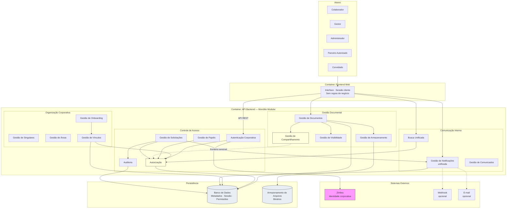

# Target Architecture — Portal de Comunicação

## 1. Objetivo

Este documento representa a **visão arquitetural alvo (Target Architecture)** do Portal de Comunicação da Unimed Ceará. Consolida toda a documentação produzida nas camadas Discovery, Domain e Architecture, definindo estado atual, estado desejado, lacunas, evolução necessária, roadmap e critérios de prontidão para desenvolvimento.

**Encerra formalmente a camada Architecture.** Serve como referência única para as próximas camadas do projeto, sem necessidade de revisitar Discovery ou Domain para iniciar implementação das capacidades estabilizadas.

**Rastreabilidade:** `docs/architecture/01-system-context.md` a `09-risk-assessment.md`; `docs/domain/09-business-rules.md`, `docs/domain/10-open-questions.md`.

---

## 2. Visão Executiva

### Visão geral

O Portal de Comunicação é uma **aplicação web corporativa** para comunicação interna, gestão documental e controle de acesso, organizada em **quatro bounded contexts** dentro de um **monólito modular**. A arquitetura alvo preserva simplicidade operacional, centraliza decisões de negócio e segurança na API Backend, e externaliza identidade corporativa ao Zimbra.

### Objetivos arquiteturais

| Objetivo | Descrição |
| -------- | --------- |
| Centralidade de negócio | Toda regra de negócio, autenticação e autorização na API Backend |
| Alinhamento com domínio | Quatro bounded contexts como componentes lógicos, não como serviços físicos |
| Governança de acesso | Autorização centralizada; compartilhamento e permissão efetiva coordenados |
| Separação de persistência | Metadados transacionais e binários documentais em repositórios distintos |
| Evolução controlada | Eliminar legado, unificar notificações e fechar fronteiras em aberto |

### Direcionadores de negócio

- Estrutura federativa multi-singular com escopo organizacional em todos os fluxos.
- Identidade corporativa por e-mail; portal não provisiona contas.
- Conteúdo confidencial de uso profissional; acesso restrito a colaboradores e parceiros autorizados.
- Onboarding como gate obrigatório antes de operação plena.
- Publicação documental com visibilidade, compartilhamento e governança de acesso a recursos privados.

### Estado atual (baseline)

Arquitetura **monolítica modular** documentada com cinco containers internos, dependência crítica do Zimbra, coexistência provisória da API Backend Legado, capacidades PARCIAL em fluxos de governança e comunicação, e **32 riscos** catalogados (3 críticos, 14 altos).

### Estado desejado (alvo)

Arquitetura **estabilizada** com: API Backend única como caminho principal; legado descomissionado; subsistema de notificação unificado; fronteiras de domínio resolvidas (compartilhamento/autorização, comunicados, perfis externos); ciclo de vida de permissões completo; contratos Frontend ↔ API Backend alinhados; requisitos de continuidade operacional definidos; decisão de escalabilidade registrada quando volumes exigirem.

**Nível de confiança:** Médio-Alto para núcleo organizacional, documental e de acesso; Médio para Comunicação Interna e capacidades periféricas.

---

## 3. Arquitetura Atual (Baseline)

Visão consolidada do estado documentado. Detalhamento em artefatos `01` a `07`.

### Containers

| Container | Papel | Status |
| --------- | ----- | ------ |
| Frontend Web | Apresentação; sessão no cliente; sem regras de negócio | ATIVO |
| API Backend | Negócio, auth, authz, orquestração, notificações | ATIVO — núcleo |
| Banco de Dados | Metadados, sessão, permissões, organização, notificações | ATIVO |
| Armazenamento de Arquivos | Binários documentais | ATIVO |
| API Backend Legado | Rotas legadas; sincronização parcial | LEGADO — coexistência |
| Zimbra (externo) | Validação de identidade corporativa | Crítico |

### Componentes (API Backend)

~30 componentes de capacidade de negócio agrupados em quatro bounded contexts + transversais. Núcleo ATIVO: Organização Corporativa, Gestão Documental, Controle de Acesso. Comunicação Interna com confiança reduzida. Capacidades PARCIAL: onboarding, solicitação de permissões, comunicados, perfis externos, busca global, métricas.

### Integrações

- **Crítica:** Zimbra (autenticação corporativa).
- **Interna residual:** API Backend Legado (sincronização parcial).
- **Opcionais:** webhook, e-mail corporativo.
- **Fronteiras sensíveis:** Compartilhamento ↔ Autorização; Documento ↔ Comunicado; Frontend ↔ API Backend (endpoints órfãos documentados).

### Dados

Quatro aggregates proprietários; referência por identificador entre contextos (BR-006); consistência forte intra-aggregate e eventual inter-aggregate. Separação metadado/binário. Lacunas: ownership de comunicado, revogação de permissão, herança em pastas.

### Segurança

Autenticação via Zimbra; sessão no portal. Autorização centralizada no backend. Auditoria de eventos de governança — catálogo não fechado. Perfis externos sem distinção operacional consolidada.

### Implantação

Três ambientes isolados (Dev, Hml, Prod). Quatro zonas de confiança (Usuários, Portal, Dados, Externos). API Backend e Banco de Dados como pontos únicos de falha. Mecanismos de backup/failover não especificados.

---

## 4. Arquitetura Alvo

### Estrutura da solução

```
Atores → Frontend Web → API Backend → Banco de Dados
                              ↓
                    Armazenamento de Arquivos
                              ↓
                         Zimbra (externo)
```

- **Monólito modular** na camada de aplicação (ADR-001, ADR-007).
- **Sem API Backend Legado** no estado alvo final.
- **Um subsistema de notificação** com persistência unificada.
- **Contratos explícitos** entre Frontend e API Backend por capacidade de negócio.

### Fronteiras arquiteturais

| Fronteira | Estado alvo |
| --------- | ----------- |
| Apresentação × Aplicação | Frontend consome API; nunca decide autorização |
| Aplicação × Persistência | API orquestra; Frontend sem acesso direto |
| Metadado × Binário | Repositórios distintos; publicação com atomicidade lógica |
| Compartilhamento × Autorização | Componentes distintos; regra de equivalência definida (OQ-005) |
| Documento × Comunicado | Ownership e modelo definidos (OQ-004) |
| Portal × Zimbra | Identidade corporativa externa; portal mantém sessão e vínculo |
| Ambientes | Dev, Hml, Prod com persistência isolada |

### Capacidades estratégicas

| Capacidade | Descrição alvo |
| ---------- | -------------- |
| Comunicação interna institucional | Documentos, pastas e canais com escopo organizacional |
| Gestão documental federada | Publicação, visibilidade e compartilhamento por singular/área/federação |
| Governança de acesso | Papéis, permissões, solicitação, concessão, revogação e auditoria |
| Integração organizacional | Onboarding único; vínculos e contexto como pré-requisito universal |
| Busca transversal | Projeção read-only filtrada por autorização com escopo definido |

### Capacidades operacionais

| Capacidade | Descrição alvo |
| ---------- | -------------- |
| Disponibilidade | Requisitos documentados para API Backend, Banco de Dados e Zimbra |
| Continuidade | Prioridades de recuperação por componente; reconciliação metadado/binário |
| Escalabilidade | Decisão arquitetural registrada conforme crescimento |
| Notificações | Entrega in-app unificada; canais externos opcionais |
| Quotas | Bloqueio de publicação por limite de armazenamento (BR-023) |

### Capacidades de governança

| Capacidade | Descrição alvo |
| ---------- | -------------- |
| Solicitação de permissão | Fluxo ponta a ponta: registro → decisão → autorização → notificação → auditoria |
| Revogação de permissão | Ciclo de vida completo documentado |
| Auditoria | Catálogo fechado de eventos obrigatórios |
| Perfis externos | Parceiro autorizado e convidado com critérios operacionais distintos |
| Responsável pelo recurso | Formalizado por escopo para roteamento de solicitações |

---

## 5. Lacunas Arquiteturais

Consolidação de questões abertas (OQ), ADRs pendentes e riscos altos/críticos.

| ID | Lacuna | Impacto | Origem |
| -- | ------ | ------- | ------ |
| L-001 | Fluxo oficial de onboarding indefinido | **Mitigado** — DEC-FA-001 / FT-PRIMEIRO-ACESSO (especificação completa e implementação pendentes) | DEC-FA-001; BR-011 |
| L-002 | Solicitação de permissão sem confirmação ponta a ponta | Governança de recursos privados incompleta | OQ-003; R-010 |
| L-003 | Equivalência compartilhamento ↔ acesso efetivo em aberto | Risco de inconsistência de exposição | OQ-005; R-009; ADR-008 |
| L-004 | Revogação de permissão não documentada | Ciclo de vida de acesso incompleto | OQ-006, OQ-017; R-011 |
| L-005 | Ownership de comunicado indefinido | Fronteira Gestão Documental ↔ Comunicação Interna | OQ-004; R-018 |
| L-006 | Perfis externos (parceiro vs. convidado) sem critérios operacionais | Governança de acesso externo ambígua | OQ-002, OQ-018; R-019 |
| L-007 | Responsável pelo recurso não formalizado por escopo | Solicitações sem autoridade de decisão | OQ-016; R-021 |
| L-008 | API Backend Legado em coexistência | Duplicidade, sincronização, complexidade | ADR-015; R-005, R-013 |
| L-009 | Dois subsistemas de notificação | Inconsistência de persistência e entrega | Decisão pendente; R-006 |
| L-010 | Endpoints órfãos Frontend ↔ API Backend | Expectativa sem contrato efetivo | Decisão pendente; R-008 |
| L-011 | Requisitos de continuidade operacional não especificados | Recuperação sem critérios documentados | R-015 |
| L-012 | Estratégia de escalabilidade horizontal indefinida | Gargalo em crescimento futuro | Decisão pendente; R-014 |
| L-013 | Busca unificada com escopo de filtro incompleto | Risco de exposição indevida | OQ-024; R-012 |
| L-014 | Herança de permissões em pastas indefinida | Comportamento imprevisível em hierarquia | OQ-012; R-022 |
| L-015 | Catálogo de auditoria não fechado | Eventos relevantes podem não ser registrados | OQ-019; R-023 |
| L-016 | Alteração pós-publicação sem regras | Manutenção documental indefinida | OQ-011; R-025 |
| L-017 | Pontos únicos de falha (API, Banco) sem mitigação operacional definida | Indisponibilidade total do portal | R-001, R-002 |
| L-018 | Dependência única do Zimbra sem plano de continuidade de identidade | Bloqueio de novos acessos | R-003; ADR-003 |

*Lacunas L-017 e L-018 são estruturais e aceitas como trade-off até decisão de mitigação operacional ou mudança de ADR.*

---

## 6. Decisões Arquiteturais Mantidas

ADRs que permanecem válidos na arquitetura alvo. Fonte: `08-decision-records.md`.

| ADR | Status | Justificativa |
| --- | ------ | ------------- |
| ADR-001 Monólito modular | Aceita | Alinhamento com domínio; simplicidade operacional; sem necessidade comprovada de microsserviços |
| ADR-002 API Backend central | Aceita | Ponto único de negócio e segurança; Frontend como consumidor |
| ADR-003 Zimbra externo | Aceita | Identidade corporativa por e-mail (BR-025, BR-026) |
| ADR-004 Metadados × binários | Aceita | Governança de metadados e escala independente de binários |
| ADR-005 Autorização no backend | Aceita | Decisão efetiva de acesso no servidor |
| ADR-006 Frontend apresentação | Aceita | Zonas de confiança; sem lógica de negócio no cliente |
| ADR-007 Quatro contextos / um backend | Aceita | Bounded contexts como fronteiras lógicas |
| ADR-008 Compartilhamento ≠ autorização | Aceita | Aggregates distintos; integração obrigatória |
| ADR-009 Referência por identificador | Aceita | Ownership claro; BR-006 |
| ADR-010 Consistência forte/eventual | Aceita | Invariantes por aggregate; eventos entre contextos |
| ADR-011 Três ambientes isolados | Aceita | Proteção de dados de produção |
| ADR-012 Notificações no backend | Aceita | Sem container independente documentado |
| ADR-013 Organização upstream | Aceita | Pré-requisito de todos os fluxos de valor |
| ADR-014 Busca read-only | Aceita | Projeção sem mutação; BR-038 |

---

## 7. Decisões Pendentes

| Tema | Impacto | Dependências |
| ---- | ------- | ------------ |
| Descomissionamento API Backend Legado | Simplifica topologia; elimina sincronização e auth duplicada | ADR-015; L-008; paridade de rotas |
| Unificação subsistemas de notificação | Persistência e recuperação simplificadas | ADR-012; L-009 |
| Estratégia de escalabilidade horizontal | Crescimento de colaboradores e documentos | ADR-001; L-012; volumes operacionais |
| Perfis externos (parceiro vs. convidado) | Modelo de identidade e autorização externa | OQ-002; L-006; BR-001, BR-033 |
| Ownership de comunicado | Modelagem Gestão Documental ↔ Comunicação Interna | OQ-004; L-005 |
| Equivalência compartilhamento ↔ acesso | Contrato entre componentes | OQ-005; L-003; ADR-008 |
| Revogação de permissão | Ciclo de vida de acesso | OQ-006, OQ-017; L-004 |
| Resolução endpoints órfãos | Alinhamento Frontend ↔ API Backend | L-010; contratos por capacidade |
| Fluxo oficial de onboarding | Gate de entrada | **DEC-FA-001** / FT-PRIMEIRO-ACESSO |
| Requisitos de continuidade operacional | Recuperação de componentes críticos | L-011; R-015 |
| Catálogo de auditoria | Completude de governança | OQ-019; L-015 |

---

## 8. Roadmap Arquitetural

### Curto prazo

**Objetivo:** reduzir riscos críticos e lacunas impeditivas do fluxo de valor principal.

| Prioridade | Ação | Lacunas / Riscos |
| ---------- | ---- | ---------------- |
| 1 | Especificar e implementar FT-PRIMEIRO-ACESSO (DEC-FA-*) | L-001 mitigado; modelo N vínculos |
| 2 | Resolver OQ-003 e OQ-016 (solicitação de permissão) | L-002, L-007, R-010 |
| 3 | Resolver OQ-005 (compartilhamento ↔ autorização) | L-003, R-009 |
| 4 | Inventariar e resolver endpoints órfãos | L-010, R-008 |
| 5 | Definir requisitos de continuidade para API Backend e Banco de Dados | L-011, L-017, R-001, R-002, R-015 |
| 6 | Documentar plano de descomissionamento do legado | L-008, ADR-015 |

### Médio prazo

**Objetivo:** simplificar integrações, consolidar governança e estabilizar operação.

| Prioridade | Ação | Lacunas / Riscos |
| ---------- | ---- | ---------------- |
| 1 | Unificar subsistema de notificações | L-009, R-006 |
| 2 | Executar descomissionamento API Backend Legado | L-008, R-005, R-013 |
| 3 | Resolver OQ-004 (comunicado) e OQ-002 (perfis externos) | L-005, L-006 |
| 4 | Resolver OQ-006, OQ-017 (revogação) e OQ-019 (auditoria) | L-004, L-015 |
| 5 | Resolver OQ-011, OQ-012 (manutenção documental e pastas) | L-014, L-016 |
| 6 | Definir atomicidade lógica metadado/binário e reconciliação | R-004 |
| 7 | Estabelecer indicadores operacionais (seção 11) | Observabilidade arquitetural |

### Longo prazo

**Objetivo:** preparar evolução sustentável conforme crescimento institucional.

| Prioridade | Ação | Lacunas / Riscos |
| ---------- | ---- | ---------------- |
| 1 | Registrar ADR de escalabilidade quando volumes exigirem | L-012, R-014 |
| 2 | Avaliar evolução de Comunicação Interna (OQ-021 a OQ-025) | R-026 |
| 3 | Revisar monólito modular vs. decomposição por bounded context | ADR-001 — somente com evidência de necessidade |
| 4 | Avaliar política global de armazenamento de binários | R-029, OQ-015 |
| 5 | Revisar dependência exclusiva do Zimbra com stakeholders institucionais | L-018, R-003 |

---

## 9. Critérios de Prontidão para Desenvolvimento

### Discovery

| Critério | Status | Observação |
| -------- | ------ | ---------- |
| Módulos e integrações documentados | **Concluído** | Camada estável; somente leitura |
| Dívidas técnicas catalogadas | **Concluído** | 57 itens em `08-technical-debt.md` |
| Arquitetura atual mapeada | **Concluído** | Abstraída na camada Architecture |

### Domain

| Critério | Status | Observação |
| -------- | ------ | ---------- |
| Bounded contexts e aggregates | **Concluído** | Quatro contextos estabilizados |
| Regras de negócio | **Concluído** | BR-001 a BR-039 documentadas |
| Questões abertas | **Parcial** | 25 OQs em `10-open-questions.md` — não bloqueiam núcleo, bloqueiam capacidades específicas |

### Architecture

| Critério | Status | Observação |
| -------- | ------ | ---------- |
| System Context a Deployment | **Concluído** | Artefatos `01` a `07` |
| Decision Records | **Concluído** | 15 ADRs; 14 aceitos, 1 provisório |
| Risk Assessment | **Concluído** | 32 riscos catalogados e priorizados |
| Target Architecture | **Concluído** | Este documento |

### Avaliação de prontidão

| Escopo | Pronto? | Justificativa |
| ------ | ------- | ------------- |
| **Núcleo organizacional + documental + acesso (capacidades ATIVAS)** | **Sim, com ressalvas** | ADRs aceitos, containers, componentes e fluxos principais documentados; fronteira compartilhamento/autorização requer decisão OQ-005 antes de implementação completa de governança |
| **Governança de recursos privados (solicitação/revogação)** | **Não** | OQ-003, OQ-006, OQ-016, OQ-017 em aberto; status PARCIAL |
| **Onboarding / Primeiro acesso** | **Decidido** | DEC-FA-001; implementação pendente |
| **Comunicação Interna e perfis externos** | **Não** | OQ-002, OQ-004; confiança reduzida |
| **Eliminação de legado e unificação** | **Não** | ADR-015 provisório; decisões pendentes |

**Conclusão:** a documentação é **suficiente para iniciar desenvolvimento do núcleo estabilizado** (organização, publicação documental básica, autenticação, autorização por papel), desde que lacunas L-003, L-010 e L-011 sejam tratadas no início do ciclo. Capacidades PARCIAL e governança avançada dependem de encerramento de OQs prioritárias (curto prazo do roadmap).

---

## 10. Critérios de Governança

### Mudanças arquiteturais

- Toda mudança que altere containers, fronteiras entre bounded contexts ou integrações externas deve gerar **novo ADR** ou **revisão de ADR existente** em `docs/architecture/08-decision-records.md` (ou sucessor na camada de implementação).
- Mudanças que afetem apenas componentes internos sem alterar fronteiras documentadas podem ser registradas como nota no ADR relacionado.

### Evolução de ADRs

| Status | Critério de transição |
| ------ | --------------------- |
| Aceita → Revisada | Nova evidência ou decisão de negócio invalida premissa |
| Provisória → Aceita ou Substituída | Critério de saída atingido (ex.: legado descomissionado) |
| Pendente → Aceita | Decisão formal registrada com alternativas e consequências |

### Revisão de riscos

- Revisar catálogo de riscos (`09-risk-assessment.md`) a cada ADR novo, encerramento de OQ ou mudança de container.
- Riscos críticos e altos exigem plano de mitigação antes de promover capacidade PARCIAL a ATIVA.

### Encerramento de OQs

- OQ encerrada quando: decisão registrada em ADR ou regra de negócio atualizada em Domain (somente via processo formal de evolução do domínio).
- OQ relacionada a lacuna (L-xxx) deve referenciar ID da lacuna e risco associado (R-xxx).

---

## 11. Métricas Arquiteturais Recomendadas

Indicadores em nível arquitetural, sem ferramentas específicas.

| Domínio | Indicador | Finalidade |
| ------- | --------- | ---------- |
| Crescimento documental | Volume de documentos publicados por escopo organizacional | Pressão em Gestão Documental e armazenamento |
| Armazenamento | Utilização de quota por colaborador; volume total de binários | Antecipar L-012, R-029; BR-023 |
| Permissões | Solicitações pendentes; tempo médio de decisão; permissões sem revogação documentada | Governança de acesso; OQ-006 |
| Notificações | Taxa de entrega in-app; falhas em canais opcionais | Unificação L-009 |
| Integrações | Disponibilidade Zimbra; latência de autenticação; chamadas a endpoints órfãos | R-003, L-010 |
| Riscos | Contagem de riscos altos/críticos abertos; lacunas sem plano | Acompanhamento de maturidade |
| Contratos | Capacidades Frontend com contrato API confirmado vs. órfãs | L-010 |
| Continuidade | Tempo de recuperação por componente crítico | L-011, R-015 |
| Consistência | Incidentes metadado sem binário; divergências compartilhamento/autorização | R-004, R-009 |
| Auditoria | Eventos de governança registrados vs. catálogo esperado | L-015 |

---

## 12. Diagrama da Arquitetura Alvo (Mermaid)

Visão consolidada: atores, containers, componentes principais, integrações, fronteiras e ownership.



**Legenda:** amarelo — fronteira sensível (compartilhamento × autorização); roxo — sistema externo crítico; azul — persistência com ownership distinto (metadado vs. binário). API Backend Legado **ausente** no estado alvo final.

---

## 13. Conclusão

### Estado de maturidade arquitetural

| Dimensão | Maturidade | Observação |
| -------- | ---------- | ---------- |
| Contexto e containers | **Alta** | Estável e convergente em todos os artefatos |
| Componentes e integrações | **Média-Alta** | Núcleo definido; PARCIAL e órfãos documentados |
| Dados e segurança | **Média** | Ownership claro no núcleo; fronteiras sensíveis em aberto |
| Implantação e operação | **Média** | Topologia definida; continuidade e escala pendentes |
| Decisões e riscos | **Alta** | 15 ADRs e 32 riscos com rastreabilidade |

**Maturidade geral da camada Architecture: Média-Alta** — suficiente para encerramento formal da fase, com lacunas explicitamente registradas.

### Principais riscos remanescentes

1. **R-001, R-002, R-003** — pontos únicos de falha e dependência Zimbra (estruturais; mitigação operacional pendente).
2. **R-009, R-010, R-011** — governança de acesso incompleta (dependem de OQs).
3. **R-005, R-006, R-008** — legado, notificações duplicadas e contratos órfãos (roadmap curto/médio prazo).

### Prontidão para desenvolvimento

**Parcialmente pronta.** O núcleo estabilizado pode ser implementado com base nos artefatos Architecture. Capacidades de governança avançada, onboarding, comunicados e perfis externos aguardam decisões de negócio e ADRs pendentes. Não é necessário revisitar Discovery ou Domain para o escopo ATIVO — referenciar `09-business-rules.md` e encerrar OQs conforme roadmap.

### Próximos passos

1. Completar especificação e construção de FT-PRIMEIRO-ACESSO (DEC-FA-001..004).
2. Encerrar OQs prioritárias remanescentes (OQ-003, OQ-005, OQ-007, OQ-016).
2. Definir requisitos de continuidade operacional (L-011).
3. Inventariar contratos Frontend ↔ API Backend (L-010).
4. Iniciar camada de implementação alinhada aos ADRs aceitos.
5. Atualizar `00-architecture-index.md` com status **CONCLUÍDO** da camada Architecture.

---

## Fontes Utilizadas

### Fonte primária (Architecture — camada completa)

- `docs/architecture/01-system-context.md`
- `docs/architecture/02-container-diagram.md`
- `docs/architecture/03-component-diagram.md`
- `docs/architecture/04-integrations.md`
- `docs/architecture/05-data-architecture.md`
- `docs/architecture/06-security-architecture.md`
- `docs/architecture/07-deployment-architecture.md`
- `docs/architecture/08-decision-records.md`
- `docs/architecture/09-risk-assessment.md`

### Fonte secundária (validação)

- `docs/domain/09-business-rules.md`
- `docs/domain/10-open-questions.md`

*Nenhum código-fonte, banco de dados físico, infraestrutura implantada ou backlog de desenvolvimento foi analisado para a construção deste artefato.*

---

## Encerramento da Camada Architecture

| Artefato | Status |
| -------- | ------ |
| 01-system-context.md | ✅ Concluído |
| 02-container-diagram.md | ✅ Concluído |
| 03-component-diagram.md | ✅ Concluído |
| 04-integrations.md | ✅ Concluído |
| 05-data-architecture.md | ✅ Concluído |
| 06-security-architecture.md | ✅ Concluído |
| 07-deployment-architecture.md | ✅ Concluído |
| 08-decision-records.md | ✅ Concluído |
| 09-risk-assessment.md | ✅ Concluído |
| 10-target-architecture.md | ✅ Concluído |

**A camada Architecture encontra-se formalmente encerrada.**
