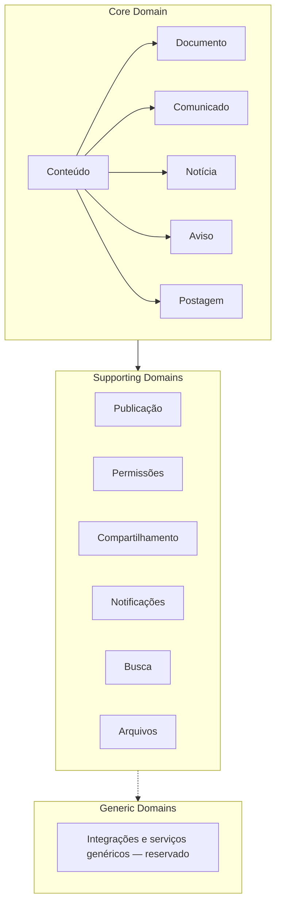
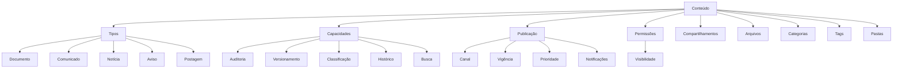

# Visão Geral do Domínio

| Campo | Valor |
|------|-------|
| Categoria documental | Archive |
| Status | Obsoleto — modela Conteúdo como Aggregate Root a ser implementado no backend do Portal; responsabilidade transferida ao WordPress (`DEC-CMS-001`, aprovada) |
| Motivo | Zero consumidores confirmados (`Content Service`, `Publication Service`, `ConteudoCriado` etc. sem uso fora desta pasta); decisão D3, Plano W2, 2026-08-20 |
| Origem | Movido de `specs/domain/00-domain-overview.md` em 2026-08-20 |

| Item | Valor |
|------|-------|
| Projeto | Portal de Comunicação |
| Camada | Domain |
| Artefato | 00-domain-overview.md |
| Status | Draft |
| Versão | 1.1 |
| Última atualização | 2026-07-08 |

---

# Objetivo

Este documento apresenta a visão arquitetural do domínio de conteúdo do Portal de Comunicação.

Seu propósito é fornecer uma visão unificada do domínio, consolidando:

- linguagem ubíqua;
- limites do domínio;
- conceitos fundamentais;
- arquitetura conceitual;
- responsabilidades;
- capacidades transversais;
- relacionamento entre os artefatos da camada.

Este documento é a principal porta de entrada da camada **Domain**.

---

# Escopo

Esta camada descreve exclusivamente o domínio de conteúdo.

Ela não define:

- banco de dados;
- Oracle;
- APIs;
- REST;
- Spring Boot;
- Vue;
- Keycloak;
- Docker;
- interfaces.

Esses assuntos pertencem às demais camadas da especificação.

---

# Visão Geral

O Portal de Comunicação é uma plataforma para criação, organização, publicação e distribuição de conteúdos institucionais.

Todo o domínio é construído ao redor de um único conceito central:

```
Conteúdo
```

Todos os demais conceitos existem para complementar ou apoiar esse conceito.

---

# Classificação dos Domínios

## Core Domain

Conceitos centrais do negócio. Representam o diferencial e o foco principal da plataforma.

| Conceito |
|----------|
| Conteúdo |
| Documento |
| Comunicado |
| Notícia |
| Aviso |
| Postagem |

## Supporting Domains

Conceitos que apoiam o Core Domain sem serem o núcleo do negócio.

| Conceito |
|----------|
| Publicação |
| Permissões |
| Compartilhamento |
| Notificações |
| Busca |
| Arquivos |

## Generic Domains

Reservado para futuras integrações e serviços genéricos.

| Área reservada |
|----------------|
| Integrações corporativas externas |
| Serviços de infraestrutura compartilhada |
| Adaptadores tecnológicos transversais |

### Diagrama — Classificação Estratégica



---

# Mapa do Domínio

```
                        Conteúdo
                             │
        ┌────────────────────┼────────────────────┐
        │                    │                    │
        │                    │                    │
   Organização         Publicação          Segurança
        │                    │                    │
        │                    │                    │
  Pasta Categoria      Canal Vigência      Permissões
       Tag             Prioridade          Visibilidade
        │                    │                    │
        └──────────────┬─────┘                    │
                       │                          │
                    Arquivos               Compartilhamentos
                       │
                       │
                 Notificações
```

---

# Mapa Completo do Domínio

Diagrama consolidado da arquitetura conceitual da camada.



---

# Bounded Context

A primeira versão do Portal define um único Bounded Context.

```
Portal de Comunicação

└── Content Management
```

No futuro poderão existir novos contextos.

Exemplos:

```
Content Management

Notification

Search

Workflow

Analytics

CMS
```

Na Sprint inicial todos permanecem dentro do mesmo contexto.

---

# Aggregate Boundaries

## Aggregate Root

```
Conteúdo
```

Todo conteúdo institucional deverá ser modelado a partir dele.

```
Conteúdo

├── Documento
├── Comunicado
├── Notícia
├── Aviso
└── Postagem
```

Nenhum tipo poderá existir independentemente de Conteúdo.

## Dentro do Aggregate

| Entidade / Conceito | Papel no Aggregate |
|---------------------|-------------------|
| Conteúdo | Aggregate Root |
| Documento, Comunicado, Notícia, Aviso, Postagem | Especializações do Root |
| Arquivos | Materializações físicas do conteúdo |
| Categorias | Classificação institucional vinculada ao conteúdo |
| Tags | Classificação livre vinculada ao conteúdo |
| Pastas | Organização lógica dos conteúdos |

## Relacionamentos Externos

| Conceito | Relação com o Aggregate |
|----------|-------------------------|
| Publicação | Distribui o conteúdo sem alterá-lo; referência externa |
| Permissões | Controla ações administrativas; referência externa |
| Compartilhamentos | Amplia acesso; referência externa |
| Notificações | Comunica usuários sobre publicações; referência externa |

## Justificativa

Publicação, Permissões, Compartilhamentos e Notificações possuem ciclos de vida, responsabilidades e eventos próprios. Mantê-los fora do Aggregate **Conteúdo** preserva:

- consistência transacional do núcleo de informação;
- desacoplamento entre informação e distribuição;
- reutilização das capacidades transversais por todos os tipos;
- evolução independente dos subdomínios de suporte.

Arquivos, Categorias, Tags e Pastas pertencem ao Aggregate porque são parte integrante da representação e organização do conteúdo institucional.

---

# Matriz de Responsabilidades

| Conceito | Responsável | Justificativa |
|----------|-------------|---------------|
| Conteúdo | Representar informação institucional | Conceito central do domínio |
| Documento | Representar conteúdo normativo permanente | Especialização de Conteúdo |
| Comunicado | Representar comunicação oficial | Especialização de Conteúdo |
| Notícia | Representar divulgação de acontecimentos | Especialização de Conteúdo |
| Aviso | Representar alertas temporários | Especialização de Conteúdo |
| Postagem | Representar comunicação dinâmica | Especialização de Conteúdo |
| Arquivo | Armazenar materializações físicas | Separa informação de representação física |
| Anexo | Associar arquivo a um conteúdo | Especialização contextual de Arquivo |
| Pasta | Organizar conteúdos logicamente | Facilita navegação sem significado de negócio |
| Categoria | Classificar conteúdos institucionalmente | Padroniza organização e busca |
| Tag | Classificar conteúdos livremente | Facilita pesquisa e relacionamentos |
| Publicação | Distribuir conteúdo | Separa informação de disponibilização |
| Canal | Definir meio de distribuição | Especialização de Publicação |
| Vigência | Controlar período de disponibilidade | Value Object da publicação |
| Prioridade | Ordenar apresentação | Value Object da publicação |
| Público-Alvo | Direcionar publicação | Define alcance da distribuição |
| Notificação | Comunicar usuários | Informa sobre conteúdo publicado |
| Destinatário | Receber publicação ou notificação | Papel do usuário na distribuição |
| Estado | Representar situação do conteúdo | Controla ciclo de vida |
| Usuário | Interagir com o Portal | Ator autenticado |
| Papel | Representar responsabilidade institucional | Agrupa permissões |
| Permissão | Autorizar ações administrativas | Controla operações sobre conteúdo |
| Visibilidade | Controlar quem visualiza conteúdo | Independente de permissão administrativa |
| Compartilhamento | Conceder acesso adicional | Complementa visibilidade |
| Auditoria | Registrar alterações | Garante rastreabilidade |
| Histórico | Preservar evolução | Mantém integridade temporal |
| Versionamento | Controlar versões do conteúdo | Preserva alterações significativas |
| Busca | Localizar conteúdos | Capacidade transversal |
| Classificação | Organizar por categorias e tags | Capacidade transversal |

---

# Classificação DDD

| Conceito | Classificação DDD |
|----------|-------------------|
| Conteúdo | Aggregate Root |
| Documento | Entity |
| Comunicado | Entity |
| Notícia | Entity |
| Aviso | Entity |
| Postagem | Entity |
| Arquivo | Entity |
| Anexo | Entity |
| Pasta | Entity |
| Categoria | Entity |
| Tag | Entity |
| Publicação | Entity |
| Canal | Value Object |
| Vigência | Value Object |
| Prioridade | Value Object |
| Público-Alvo | Value Object |
| Notificação | Entity |
| Destinatário | Entity |
| Estado | Value Object |
| Usuário | Entity |
| Papel | Entity |
| Permissão | Value Object |
| Visibilidade | Value Object |
| Compartilhamento | Entity |
| Versão | Entity |
| Content Service | Domain Service |
| Publication Service | Domain Service |
| Permission Service | Domain Service |
| Visibility Service | Domain Service |
| Sharing Service | Domain Service |
| Search Service | Domain Service |
| Notification Service | Domain Service |
| ConteudoCriado | Domain Event |
| ConteudoAtualizado | Domain Event |
| ConteudoAprovado | Domain Event |
| ConteudoPublicado | Domain Event |
| ConteudoArquivado | Domain Event |
| ConteudoExpirado | Domain Event |
| ConteudoCompartilhado | Domain Event |
| PublicacaoCriada | Domain Event |
| PublicacaoEncerrada | Domain Event |
| NotificacaoGerada | Domain Event |
| Auditoria | Capability |
| Versionamento | Capability |
| Busca | Capability |
| Classificação | Capability |
| Histórico | Capability |
| Rastreabilidade | Capability |

---

# Entidades do Domínio

A camada identifica as seguintes entidades conceituais.

| Entidade | Responsabilidade |
|-----------|------------------|
| Conteúdo | Informação institucional |
| Documento | Conteúdo normativo |
| Comunicado | Comunicação oficial |
| Notícia | Divulgação institucional |
| Aviso | Alerta temporário |
| Postagem | Comunicação dinâmica |
| Arquivo | Materialização física |
| Pasta | Organização lógica |
| Categoria | Classificação institucional |
| Publicação | Distribuição do conteúdo |
| Notificação | Comunicação derivada da publicação |

A implementação física poderá sofrer ajustes.

---

# Value Objects

Os seguintes conceitos possuem características de Value Objects.

| Conceito |
|----------|
| Estado |
| Prioridade |
| Vigência |
| Visibilidade |
| Tipo de Conteúdo |
| Canal |
| Status da Publicação |

Esses conceitos não possuem identidade própria.

---

# Capacidades Transversais

As capacidades abaixo pertencem ao conceito **Conteúdo**.

Elas nunca deverão ser implementadas individualmente em cada tipo.

```
Conteúdo

↓

Auditoria

↓

Versionamento

↓

Publicação

↓

Permissões

↓

Visibilidade

↓

Compartilhamento

↓

Busca

↓

Classificação

↓

Histórico
```

Essas capacidades deverão ser reutilizadas em toda a plataforma.

---

# Serviços de Domínio

O domínio prevê os seguintes serviços conceituais.

Este documento não define sua implementação.

## Content Service

### Objetivo

Orquestrar a gestão do conteúdo institucional e suas especializações.

### Responsabilidades

- criar e manter conteúdos;
- aplicar regras do ciclo de vida;
- coordenar versionamento;
- validar integridade do Aggregate Root.

### Entradas

- dados do conteúdo;
- tipo de conteúdo;
- ação solicitada;
- contexto do usuário.

### Saídas

- conteúdo persistido;
- estado atualizado;
- validações de negócio.

### Eventos gerados

- ConteudoCriado
- ConteudoAtualizado
- ConteudoAprovado
- ConteudoArquivado
- ConteudoExpirado

---

## Publication Service

### Objetivo

Disponibilizar conteúdos aprovados em canais definidos.

### Responsabilidades

- criar e encerrar publicações;
- controlar vigência e prioridade;
- validar pré-condições de publicação;
- coordenar canais de distribuição.

### Entradas

- conteúdo aprovado;
- configuração de canal;
- vigência;
- público-alvo.

### Saídas

- publicação ativa ou encerrada;
- situação da publicação.

### Eventos gerados

- PublicacaoCriada
- PublicacaoEncerrada
- ConteudoPublicado

---

## Permission Service

### Objetivo

Avaliar se um usuário pode executar ações administrativas sobre conteúdos.

### Responsabilidades

- validar permissões por papel;
- aplicar regras de autorização;
- registrar decisões auditáveis.

### Entradas

- usuário;
- papel;
- ação solicitada;
- conteúdo alvo.

### Saídas

- autorização concedida ou negada;
- justificativa da decisão.

### Eventos gerados

- nenhum evento de domínio exclusivo; integra-se à auditoria.

---

## Visibility Service

### Objetivo

Determinar quem pode visualizar um conteúdo publicado.

### Responsabilidades

- avaliar configuração de visibilidade;
- aplicar hierarquia de escopo;
- complementar avaliação com compartilhamentos.

### Entradas

- conteúdo publicado;
- usuário consultante;
- configuração de visibilidade.

### Saídas

- permissão de visualização;
- escopo efetivo de acesso.

### Eventos gerados

- nenhum evento de domínio exclusivo; integra-se à auditoria.

---

## Sharing Service

### Objetivo

Gerenciar concessões adicionais de acesso a conteúdos.

### Responsabilidades

- criar e revogar compartilhamentos;
- preservar histórico de concessões;
- validar conflitos com visibilidade.

### Entradas

- conteúdo;
- destinatário ou escopo;
- tipo de concessão;
- usuário responsável.

### Saídas

- compartilhamento registrado ou revogado.

### Eventos gerados

- ConteudoCompartilhado

---

## Search Service

### Objetivo

Permitir localização de conteúdos conforme critérios de negócio.

### Responsabilidades

- indexar metadados de conteúdo;
- aplicar filtros de visibilidade;
- respeitar classificação e taxonomia.

### Entradas

- critérios de busca;
- contexto do usuário;
- filtros de classificação.

### Saídas

- conjunto de conteúdos elegíveis;
- metadados para apresentação.

### Eventos gerados

- nenhum evento de domínio exclusivo.

---

## Notification Service

### Objetivo

Informar usuários sobre publicações e atualizações relevantes.

### Responsabilidades

- gerar notificações a partir de publicações;
- direcionar destinatários;
- registrar entregas para auditoria.

### Entradas

- evento de publicação;
- público-alvo;
- canal de notificação.

### Saídas

- notificação gerada;
- registro de entrega.

### Eventos gerados

- NotificacaoGerada

---

# Eventos de Domínio

Os seguintes eventos representam mudanças relevantes do domínio.

## ConteudoCriado

| Item | Descrição |
|------|-----------|
| Descrição | Um novo conteúdo foi registrado no domínio |
| Quando ocorre | Após criação bem-sucedida de conteúdo em estado RASCUNHO |
| Quem dispara | Content Service |
| Consumidores previstos | Auditoria, Busca, integrações futuras |
| Impacto no domínio | Inicia o ciclo de vida do conteúdo |

## ConteudoAtualizado

| Item | Descrição |
|------|-----------|
| Descrição | Um conteúdo existente foi alterado |
| Quando ocorre | Após edição que modifica atributos ou versão |
| Quem dispara | Content Service |
| Consumidores previstos | Auditoria, Busca, Versionamento |
| Impacto no domínio | Pode gerar nova versão; preserva histórico |

## ConteudoAprovado

| Item | Descrição |
|------|-----------|
| Descrição | Um conteúdo foi aprovado para publicação |
| Quando ocorre | Transição para estado APROVADO |
| Quem dispara | Content Service |
| Consumidores previstos | Publication Service, Auditoria |
| Impacto no domínio | Habilita criação de publicações |

## ConteudoPublicado

| Item | Descrição |
|------|-----------|
| Descrição | Um conteúdo tornou-se disponível aos usuários |
| Quando ocorre | Transição para estado PUBLICADO |
| Quem dispara | Content Service / Publication Service |
| Consumidores previstos | Notification Service, Busca, Auditoria |
| Impacto no domínio | Conteúdo passa a ser pesquisável e visível |

## ConteudoArquivado

| Item | Descrição |
|------|-----------|
| Descrição | Um conteúdo foi arquivado |
| Quando ocorre | Transição para estado ARQUIVADO |
| Quem dispara | Content Service |
| Consumidores previstos | Auditoria, Busca |
| Impacto no domínio | Conteúdo permanece consultável historicamente |

## ConteudoExpirado

| Item | Descrição |
|------|-----------|
| Descrição | A vigência de um conteúdo publicado encerrou |
| Quando ocorre | Transição para estado EXPIRADO |
| Quem dispara | Content Service / Publication Service |
| Consumidores previstos | Auditoria, Busca |
| Impacto no domínio | Conteúdo deixa de aparecer como ativo |

## ConteudoCompartilhado

| Item | Descrição |
|------|-----------|
| Descrição | Acesso adicional foi concedido a um conteúdo |
| Quando ocorre | Após criação de compartilhamento |
| Quem dispara | Sharing Service |
| Consumidores previstos | Visibility Service, Auditoria |
| Impacto no domínio | Amplia escopo de visualização |

## PublicacaoCriada

| Item | Descrição |
|------|-----------|
| Descrição | Uma publicação foi configurada para um conteúdo |
| Quando ocorre | Após criação de publicação para conteúdo aprovado |
| Quem dispara | Publication Service |
| Consumidores previstos | Notification Service, Auditoria |
| Impacto no domínio | Inicia ciclo de distribuição |

## PublicacaoEncerrada

| Item | Descrição |
|------|-----------|
| Descrição | Uma publicação foi finalizada |
| Quando ocorre | Encerramento por vigência ou ação administrativa |
| Quem dispara | Publication Service |
| Consumidores previstos | Auditoria, Busca |
| Impacto no domínio | Conteúdo pode permanecer; publicação deixa de estar ativa |

## NotificacaoGerada

| Item | Descrição |
|------|-----------|
| Descrição | Usuários foram notificados sobre conteúdo publicado |
| Quando ocorre | Após publicação ativa com política de notificação |
| Quem dispara | Notification Service |
| Consumidores previstos | Auditoria, integrações de entrega |
| Impacto no domínio | Comunica disponibilidade sem alterar o conteúdo |

Esses eventos poderão ser utilizados por integrações futuras.

---

# Fluxo Conceitual

```
Criar Conteúdo

↓

Editar

↓

Revisar

↓

Aprovar

↓

Publicar

↓

Distribuir

↓

Notificar

↓

Arquivar
```

---

# Arquitetura Conceitual

```
                    Conteúdo
                         │
        ┌────────────────┼────────────────┐
        │                │                │
   Arquivos         Publicações      Permissões
        │                │                │
        │                │                │
 Categorias         Canais         Visibilidade
        │                │                │
      Tags          Vigência      Compartilhamentos
                         │
                  Notificações
```

---

# Linguagem Ubíqua

Os conceitos oficiais do domínio são definidos em `06-content-glossary.md`.

Qualquer novo conceito deverá ser incorporado ao glossário oficial.

O modelo lógico foi consolidado durante a evolução da arquitetura; sua representação encontra-se incorporada ao modelo conceitual desta camada (`01-content-model.md` e artefatos correlatos). O modelo conceitual de domínio é a referência oficial para a especificação funcional.

---

# Organização da Camada

```
specs/domain/

README.md

00-domain-overview.md

01-content-model.md

02-content-taxonomy.md

03-content-lifecycle.md

04-publication-model.md

05-permission-model.md

06-content-glossary.md
```

---

# Rastreabilidade Arquitetural

| Conceito | Overview | Model | Taxonomy | Lifecycle | Publication | Permission | Glossary |
|----------|:--------:|:-----:|:--------:|:---------:|:-----------:|:----------:|:--------:|
| Conteúdo | ✔ | ✔ | ✔ | ✔ | ✔ | ✔ | ✔ |
| Documento | ✔ | ✔ | ✔ | ✔ | ✔ | ✔ | ✔ |
| Comunicado | ✔ | ✔ | ✔ | ✔ | ✔ | ✔ | ✔ |
| Notícia | ✔ | ✔ | ✔ | ✔ | ✔ | ✔ | ✔ |
| Aviso | ✔ | ✔ | ✔ | ✔ | ✔ | ✔ | ✔ |
| Postagem | ✔ | ✔ | ✔ | ✔ | ✔ | ✔ | ✔ |
| Arquivo | ✔ | ✔ | | | | | ✔ |
| Anexo | ✔ | | | | | | ✔ |
| Pasta | ✔ | ✔ | | | | | ✔ |
| Categoria | ✔ | ✔ | ✔ | | | | ✔ |
| Tag | ✔ | ✔ | ✔ | | | | ✔ |
| Publicação | ✔ | ✔ | | ✔ | ✔ | ✔ | ✔ |
| Canal | ✔ | | | | ✔ | | ✔ |
| Vigência | ✔ | | | ✔ | ✔ | | ✔ |
| Prioridade | ✔ | | | | ✔ | | ✔ |
| Público-Alvo | ✔ | | | | ✔ | ✔ | ✔ |
| Notificação | ✔ | ✔ | | | ✔ | | ✔ |
| Destinatário | ✔ | | | | ✔ | | ✔ |
| Estado | ✔ | | | ✔ | | | ✔ |
| Usuário | ✔ | | | | | ✔ | ✔ |
| Papel | ✔ | | | | | ✔ | ✔ |
| Permissão | ✔ | | | | | ✔ | ✔ |
| Visibilidade | ✔ | ✔ | | | ✔ | ✔ | ✔ |
| Compartilhamento | ✔ | ✔ | | | ✔ | ✔ | ✔ |
| Auditoria | ✔ | ✔ | ✔ | ✔ | ✔ | ✔ | ✔ |
| Versionamento | ✔ | ✔ | ✔ | ✔ | | | ✔ |
| Busca | ✔ | ✔ | ✔ | | | | ✔ |
| Classificação | ✔ | ✔ | ✔ | | | | ✔ |
| Histórico | ✔ | ✔ | ✔ | ✔ | | | ✔ |

---

# Dependências entre Artefatos

```
00-domain-overview

        │

        ▼

01-content-model

        │

        ▼

02-content-taxonomy

        │

        ▼

03-content-lifecycle

        │

        ▼

04-publication-model

        │

        ▼

05-permission-model

        │

        ▼

06-content-glossary
```

---

# Decisões Arquiteturais

## DA-000

O conceito **Conteúdo** é o Aggregate Root do domínio.

---

## DA-001

Todos os tipos de conteúdo especializam diretamente Conteúdo.

---

## DA-002

As capacidades transversais pertencem ao Aggregate Root.

---

## DA-003

Publicação, Permissões e Notificações são subdomínios de suporte ao gerenciamento de conteúdo.

---

## DA-004

Toda evolução desta camada deverá preservar a linguagem ubíqua definida no glossário.

---

# Critérios de Qualidade

A camada Domain será considerada aprovada quando:

- existir uma linguagem ubíqua única;
- não houver conceitos duplicados;
- todos os conceitos estiverem rastreados;
- todas as responsabilidades estiverem claramente definidas;
- todos os artefatos estiverem consistentes entre si;
- o domínio puder ser implementado independentemente da tecnologia.

---

# Próximas Camadas

Esta camada serve de base para:

```
Domain

↓

Features

↓

Use Cases

↓

API

↓

Acceptance Tests

↓

Implementation

↓

Construction
```

Nenhuma camada posterior poderá redefinir conceitos pertencentes ao domínio.
