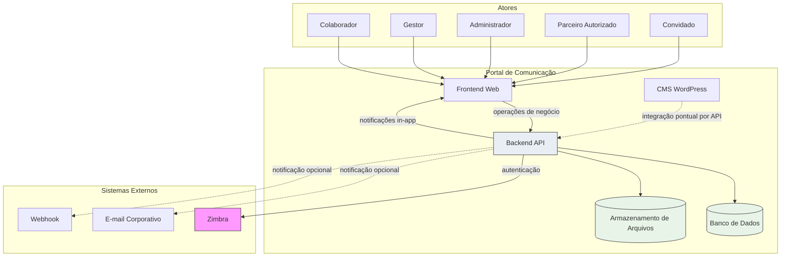

# System Context — Portal de Comunicação

## Objetivo

Este documento modela o **contexto completo da solução** do Portal de Comunicação em nível Solution Design. Identifica atores, sistemas externos, fronteiras, dependências, responsabilidades e fluxos de interação de alto nível — sem detalhar implementação, endpoints, classes ou componentes internos.

Consolida a visão definida em `01-solution-overview.md` e a arquitetura aprovada (`08-decision-records.md`, `09-risk-assessment.md`, `10-target-architecture.md`), servindo de base para `03-container-architecture.md`, `04-deployment-architecture.md` e `06-integration-contracts.md`.

**Rastreabilidade:** `docs/solution-design/00-solution-design-index.md`, `docs/solution-design/01-solution-overview.md`, `docs/architecture/01-system-context.md`, `docs/architecture/04-integrations.md`.

---

# Visão Geral da Solução

## Missão da solução

Centralizar **comunicação institucional**, **compartilhamento controlado de documentos**, **colaboração entre equipes** e **governança de acesso** na Unimed Ceará — permitindo que colaboradores autorizados acessem informações no contexto organizacional correto (singular, área, equipe ou pessoal), com rastreabilidade e confidencialidade.

## Escopo organizacional

O portal opera no ecossistema da **Unimed Ceará**, organização cooperativa de saúde com estrutura **federativa multi-singular**. A hierarquia organizacional — federação → singular → área → equipe — e os vínculos de colaboradores constituem **pré-requisito upstream** de todas as demais capacidades (ADR-013). Colaborador sem área vinculada pode ser impedido de operar (BR-010).

## Posicionamento dentro da Unimed Ceará

O Portal de Comunicação é o **sistema orquestrador** da comunicação interna institucional. Ele:

- **Consome** identidade corporativa do Zimbra;
- **Mantém** representação operacional da estrutura organizacional e do acervo documental;
- **Governa** o acesso efetivo aos recursos por papéis e escopo;
- **Comunica** eventos relevantes aos colaboradores.

Não substitui sistemas corporativos de identidade (Zimbra), RH ou ERP. Não provisiona contas de e-mail corporativo.

| Dimensão de valor | Descrição |
| ----------------- | --------- |
| Acesso unificado | Ponto único para documentos públicos e privados conforme escopo |
| Governança | Controle de publicação, consulta e aprovação de acesso |
| Rastreabilidade | Registro de eventos de controle de acesso e alterações |
| Comunicação | Notificações e canais de informação institucional |
| Integração organizacional | Vinculação de colaboradores ao contexto adequado |

**Nível de confiança:** Médio-Alto para núcleo organizacional, documental e de acesso; Médio para Comunicação Interna e atores externos.

---

# Atores

Atores humanos que interagem com a solução. Papéis administrativos documentados (administrador global, de singular, de área, proprietário de equipe) consolidam-se nas categorias **Administrador** e **Gestor** conforme escopo de atuação.

Função transversal **Responsável pelo recurso** — aprova ou nega solicitações de acesso a recursos privados — pode ser exercida por colaborador ou gestor conforme escopo (BR-031); critério por escopo em aberto (OQ-016).

---

## Colaborador

### Responsabilidades

- Consultar documentos e pastas conforme visibilidade, compartilhamento e permissões efetivas.
- Publicar documentos no contexto organizacional ao qual está vinculado (singular, área, equipe).
- Solicitar acesso a recursos privados quando não possui permissão direta.
- Operar no contexto de singular, área e equipe após integração organizacional (BR-011).
- Receber e consultar notificações in-app.

### Objetivos

- Acessar informações institucionais relevantes ao seu contexto de trabalho.
- Compartilhar documentos de forma controlada dentro do escopo autorizado.
- Obter acesso formal a recursos privados mediante solicitação.

### Interações

| Interação | Componente da solução |
| --------- | --------------------- |
| Navegação e operações de negócio | Frontend Web → Backend API |
| Autenticação | Frontend Web → Backend API → Zimbra |
| Consulta de conteúdo | Frontend Web → Backend API → Banco de Dados |
| Download de documentos | Frontend Web → Backend API → Armazenamento de Arquivos |
| Busca transversal | Frontend Web → Backend API |
| Notificações | Backend API → Frontend Web |

---

## Gestor

### Responsabilidades

- Gerenciar conteúdo departamental e de equipe no escopo de atuação (área ou equipe).
- Exercer gestão operacional sobre equipes vinculadas à sua área ou singular.
- Atuar como **responsável pelo recurso** em solicitações de permissão, quando aplicável ao escopo (BR-031).
- Publicar e organizar documentos com visibilidade e compartilhamento adequados ao departamento.

### Objetivos

- Garantir disponibilidade de conteúdo relevante para equipes e áreas sob sua gestão.
- Decidir solicitações de acesso a recursos privados sob sua responsabilidade.
- Facilitar colaboração entre membros da equipe no portal.

### Interações

| Interação | Componente da solução |
| --------- | --------------------- |
| Gestão de conteúdo departamental | Frontend Web → Backend API |
| Aprovação/negação de solicitações | Frontend Web → Backend API |
| Gestão de equipes (escopo permitido) | Frontend Web → Backend API |
| Notificações de decisões | Backend API → Frontend Web |

---

## Administrador

### Responsabilidades

- Estruturar e manter hierarquia organizacional: singulares, áreas, equipes e vínculos de colaboradores.
- Definir políticas de acesso, atribuir papéis por escopo organizacional.
- Consultar registros de auditoria de governança no escopo de atuação (global ou singular).
- Configurar parâmetros institucionais do portal.
- Publicar comunicados ou conteúdo em canais internos, quando capacidade disponível.

### Objetivos

- Manter estrutura organizacional coerente com a operação da cooperativa.
- Garantir governança de acesso e rastreabilidade institucional.
- Habilitar colaboradores ao contexto organizacional correto.

### Interações

| Interação | Componente da solução |
| --------- | --------------------- |
| Administração organizacional | Frontend Web → Backend API → Banco de Dados |
| Gestão de papéis e políticas | Frontend Web → Backend API |
| Consulta de auditoria | Frontend Web → Backend API |
| Onboarding de colaboradores | Frontend Web → Backend API (fluxo PARCIAL — OQ-001) |

---

## Parceiro Autorizado

### Responsabilidades

- Acessar o portal com restrições conforme política institucional da Unimed Ceará (BR-001).
- Consultar conteúdos autorizados ao perfil externo restrito.

### Objetivos

- Obter acesso controlado a informações institucionais necessárias à relação com a cooperativa.

### Interações

| Interação | Componente da solução |
| --------- | --------------------- |
| Acesso autenticado ao portal | Frontend Web → Backend API |
| Consulta de conteúdo autorizado | Frontend Web → Backend API |

### Restrições conhecidas

- Acesso restrito conforme política institucional (BR-001); critérios operacionais **não formalizados** (OQ-002, OQ-018).
- Distinção operacional entre parceiro autorizado e convidado **em aberto**.
- Capacidade documentada como **PARCIAL**; modelo de identidade e autorização externa pendente de decisão.

---

## Convidado

### Responsabilidades

- Acessar documentos e conteúdos **públicos** com perfil restrito (BR-033).
- Consultar informações sem escopo organizacional interno completo.

### Objetivos

- Visualizar conteúdo institucional de acesso público sem vínculo organizacional pleno.

### Interações

| Interação | Componente da solução |
| --------- | --------------------- |
| Acesso a conteúdo público | Frontend Web → Backend API |
| Autenticação (quando exigida) | Frontend Web → Backend API |

### Restrições conhecidas

- Limitado a conteúdos públicos (BR-033); sem acesso a recursos privados ou escopo organizacional interno.
- Perfil externo sem distinção operacional consolidada em relação ao parceiro autorizado (OQ-002).
- Gestão de Perfis Externos com status **PARCIAL**.

---

# Sistemas Externos

Sistemas fora do boundary da solução que a solução consome ou notifica. Integrações não documentadas (LDAP, AD, SSO, ERP, RH) **não fazem parte** do contexto da solução alvo.

---

## Zimbra

### Responsabilidade

Provedor de **identidade corporativa** e validação de credenciais de e-mail da Unimed Ceará. Autentica colaboradores por credenciais de e-mail corporativo (ADR-003, BR-025, BR-026).

### Dependências

| Direção | Descrição |
| ------- | --------- |
| Backend API → Zimbra | Backend consome Zimbra para validar credenciais em novos logins |
| Portal → Zimbra | Portal **não** provisiona contas; depende exclusivamente do Zimbra para identidade corporativa |

### Criticidade

**Crítica** — única fonte de identidade corporativa documentada. Indisponibilidade impossibilita **novos logins**; sessões já estabelecidas podem continuar até expiração — comportamento de expiração não detalhado (R-028).

### Impacto operacional

- Bloqueio de ingresso de colaboradores sem sessão ativa.
- Dependência institucional permanente; sem alternativa documentada (R-003).
- Em produção: Zimbra corporativo obrigatório; em local/dev: teste ou simulação lógica.

---

## E-mail Corporativo

### Responsabilidade

Canal **opcional** de entrega de notificações geradas pelo backend para destinatários configurados. Complementa notificações in-app; não substitui o canal principal do portal.

### Dependências

| Direção | Descrição |
| ------- | --------- |
| Backend API → E-mail corporativo | Backend encaminha notificações por canal de e-mail quando configurado |

### Criticidade

**Baixa** — canal opcional. Indisponibilidade não bloqueia operação principal; notificações in-app permanecem (ADR-012).

---

## Webhook

### Responsabilidade

Canal **opcional** de entrega de notificações a sistema destino configurado por destinatário. Permite integração com sistemas externos de recebimento de eventos.

### Dependências

| Direção | Descrição |
| ------- | --------- |
| Backend API → Webhook | Backend envia notificações a endpoint configurado |

### Criticidade

**Baixa** — canal opcional e parcialmente documentado. Falha silenciosa aceitável; notificações in-app preservadas (R-032).

---

# Fronteiras da Solução

Fronteiras lógicas da solução alvo. Cada zona define responsabilidades e limites sem expor detalhes internos.

---

## Usuários

| Aspecto | Descrição |
| ------- | --------- |
| **Conteúdo** | Colaborador, Gestor, Administrador, Parceiro Autorizado, Convidado |
| **Responsabilidade** | Iniciar fluxos de negócio via interface web |
| **Limite** | Atores acessam **apenas** o Frontend Web; sem acesso direto a Backend, persistência ou sistemas externos |
| **Zona de confiança** | Externa ao boundary técnico da solução |

---

## Frontend

| Aspecto | Descrição |
| ------- | --------- |
| **Conteúdo** | Frontend Web (Vue) |
| **Responsabilidade** | Apresentação; navegação; consumo da Backend API; estado de sessão no cliente; exibição de notificações e busca |
| **Limite** | Sem regras de negócio; sem decisão efetiva de autorização; sem acesso a Banco, Armazenamento ou Zimbra (ADR-005, ADR-006) |
| **Dependência obrigatória** | Backend API para toda operação de negócio |

---

## Backend

| Aspecto | Descrição |
| ------- | --------- |
| **Conteúdo** | Backend API (Java/Spring Boot) — monólito modular com quatro módulos lógicos |
| **Responsabilidade** | Regras de negócio; autenticação (via Zimbra); autorização efetiva; orquestração de persistência; notificações; busca; auditoria |
| **Limite** | Não provisiona identidade; não é decomposto em microsserviços (ADR-001, ADR-002); API Backend Legado **excluído** do estado alvo |
| **Dependências** | Banco de Dados, Armazenamento de Arquivos, Zimbra; opcionalmente Webhook e E-mail |

---

## CMS

| Aspecto | Descrição |
| ------- | --------- |
| **Conteúdo** | CMS WordPress |
| **Responsabilidade** | Conteúdo institucional complementar; páginas e materiais editoriais |
| **Limite** | Sem regras centrais de negócio; sem acesso ao banco do backend; integração exclusivamente por API do Backend |
| **Dependência** | Banco de dados próprio do WordPress; Backend API apenas para integrações pontuais |

---

## Persistência

| Aspecto | Descrição |
| ------- | --------- |
| **Conteúdo** | Banco de Dados (metadados transacionais); Armazenamento de Arquivos (binários documentais) |
| **Responsabilidade** | Banco: metadados, sessão, permissões, organização, notificações. Armazenamento: binários de documentos |
| **Limite** | Acessados **exclusivamente** pelo Backend API; sem acesso direto do Frontend ou CMS (ADR-004) |
| **Separação** | Metadado e binário em repositórios distintos; publicação coordenada pelo backend |

---

## Sistemas Externos

| Aspecto | Descrição |
| ------- | --------- |
| **Conteúdo** | Zimbra (crítico); E-mail corporativo e Webhook (opcionais) |
| **Responsabilidade** | Identidade corporativa (Zimbra); canais alternativos de notificação |
| **Limite** | Fora do boundary do portal; Zimbra é dependência crítica não substituível sem novo ADR |
| **Zona de confiança** | Externa; comunicação controlada pelo Backend |

---

# Fluxos Principais

Fluxos de alto nível em nível de contexto. Sequência lógica, sem detalhes de implementação.

---

## Autenticação

```
Ator → Frontend Web → Backend API → Zimbra
                ↓
         Sessão estabelecida (Backend)
                ↓
         Vínculo organizacional validado (Backend → Banco de Dados)
```

1. Ator acessa o Frontend Web e informa credenciais corporativas.
2. Frontend encaminha solicitação ao Backend API.
3. Backend API valida credenciais no **Zimbra**.
4. Em caso de sucesso, Backend estabelece sessão autenticada e associa contexto organizacional do colaborador.
5. Frontend mantém estado de sessão no cliente para operações subsequentes.

**Restrições:** Portal não provisiona identidade (ADR-003). Autorização efetiva ocorre em cada operação no Backend (ADR-005).

---

## Consulta de Conteúdo

```
Ator → Frontend Web → Backend API → Banco de Dados
                              ↓
                    Armazenamento de Arquivos (se download)
```

1. Ator autenticado solicita consulta de documentos, pastas ou resultados de busca.
2. Frontend encaminha ao Backend API.
3. Backend valida **autorização** conforme papel, escopo, compartilhamento e permissão efetiva.
4. Backend recupera metadados no **Banco de Dados**.
5. Para download, Backend recupera binário no **Armazenamento de Arquivos** após autorização.
6. Frontend apresenta conteúdo autorizado ao ator.

**Fronteira sensível:** Compartilhamento (Gestão Documental) e permissão efetiva (Controle de Acesso) devem permanecer coerentes (OQ-005, R-009).

---

## Publicação de Documento

```
Ator → Frontend Web → Backend API → Banco de Dados
                              ↓
                    Armazenamento de Arquivos
```

1. Ator autenticado com permissão adequada inicia publicação.
2. Frontend encaminha metadados e binário ao Backend API.
3. Backend valida escopo organizacional, visibilidade (BR-019) e quota de armazenamento (BR-023).
4. Backend persiste metadados no **Banco de Dados** e binário no **Armazenamento de Arquivos** de forma coordenada.
5. Backend define compartilhamento (audiência) e alinha com autorização efetiva.
6. Frontend confirma publicação ao ator.

**Risco:** Falha parcial pode gerar metadado sem binário correspondente (R-004). Solução alvo exige atomicidade lógica na publicação.

---

## Solicitação de Permissão

```
Solicitante → Frontend Web → Backend API → Banco de Dados
                                    ↓
              Responsável pelo recurso (via Frontend)
                                    ↓
              Backend API → Autorização atualizada
                                    ↓
              Backend API → Notificação → Solicitante
```

1. Colaborador sem permissão direta solicita acesso a recurso privado (BR-029).
2. Frontend encaminha ao Backend API; solicitação registrada.
3. Pedido submetido ao **responsável pelo recurso** (BR-030, BR-031).
4. Responsável aprova ou nega via Frontend → Backend API.
5. Em caso de concessão, Backend atualiza permissões efetivas.
6. Backend emite notificação do resultado ao solicitante.

**Lacunas documentadas:**

- Fluxo ponta a ponta **não confirmado** (OQ-003, R-010); capacidade **PARCIAL**.
- Responsável pelo recurso por escopo **não formalizado** (OQ-016, R-021).
- Revogação de permissão **não documentada** (OQ-006, OQ-017, R-011).

---

## Notificações

### Backend → Usuário (in-app)

```
Evento de negócio → Backend API → Banco de Dados (persistência)
                        ↓
              Frontend Web (consulta ou entrega em tempo real)
                        ↓
                     Ator
```

- Notificações centralizadas no Backend API (ADR-012).
- Entrega primária via Frontend Web ao colaborador identificado (BR-035).
- Estado alvo: subsistema unificado — baseline documenta dois subsistemas paralelos em migração (R-006).

### Backend → Sistemas externos opcionais

```
Backend API → Webhook (opcional)
Backend API → E-mail corporativo (opcional)
```

- Canais complementares; indisponibilidade não bloqueia operação principal.
- Configuração por destinatário ou política institucional.

---

# Dependências Críticas

Mapeamento das dependências estruturais da solução e riscos associados.

| Dependência | Direção | Finalidade | Risco |
| ----------- | ------- | ---------- | ----- |
| Backend API → Zimbra | Consumo | Validação de identidade corporativa | **R-003** (Crítica) |
| Backend API → Banco de Dados | Consumo | Metadados, sessão, permissões, organização | **R-002** (Crítica) |
| Backend API → Armazenamento de Arquivos | Consumo | Binários documentais | R-004 (Alta) |
| Frontend Web → Backend API | Consumo | Todas as operações de negócio | **R-001**, R-017 (Crítica/Alta) |

### Cadeia de indisponibilidade

| Componente indisponível | Efeito no contexto |
| ----------------------- | ------------------ |
| Zimbra | Novos logins bloqueados; sessões ativas podem continuar temporariamente |
| Banco de Dados | Portal inoperante — sem metadados transacionais |
| Armazenamento de Arquivos | Publicação e download bloqueados; consulta de metadados pode funcionar parcialmente |
| Backend API | Portal inoperante — Frontend sem funcionalidade |
| Frontend Web | Atores sem interface — mesmo com backend disponível |

---

# Restrições Operacionais

ADRs obrigatórios e impacto no contexto da solução.

| ADR | Decisão | Impacto no contexto |
| --- | ------- | ------------------- |
| **ADR-001** | Monólito modular | Um único Backend API no contexto; quatro módulos lógicos internos; sem microsserviços visíveis aos atores |
| **ADR-002** | Backend central | Todo fluxo de negócio transita pelo Backend; Frontend e CMS não orquestram regras centrais |
| **ADR-003** | Zimbra externo | Atores colaboradores dependem de credenciais corporativas; Zimbra é ator externo crítico no diagrama de contexto |
| **ADR-005** | Autorização no backend | Atores nunca obtêm acesso efetivo por decisão do Frontend; toda entrega de recurso passa pelo Backend |
| **ADR-006** | Frontend apresentação | Atores interagem apenas com interface; boundary Usuários → Frontend é único ponto de entrada |
| **ADR-011** | Ambientes isolados | Atores em produção não compartilham persistência com ambientes de teste; Zimbra varia por ambiente |
| **ADR-012** | Notificações no backend | Atores recebem notificações via Backend; sem serviço de notificação independente no contexto |

---

# Contexto de Ambientes

A solução opera em **quatro ambientes segregados** (ADR-011). Atores e sistemas externos interagem conforme criticidade e isolamento de cada ambiente.

| Ambiente | Atores | Sistemas externos | Objetivo |
| -------- | ------ | ------------------- | -------- |
| **Local** | Desenvolvedores; simulação de atores | Zimbra de teste ou simulação | Desenvolvimento individual; validação rápida |
| **Dev** | Equipe técnica; atores de teste | Zimbra de teste ou pré-produção | Integração contínua; validação de contratos |
| **Hml** | Gestores e administradores de aceite; atores representativos | Zimbra de pré-produção | Homologação funcional; gate antes de produção |
| **Prod** | Colaboradores, gestores, administradores, externos em uso real | Zimbra corporativo obrigatório | Operação institucional |

### Regras transversais

- **Persistência isolada** entre ambientes — dados de produção não compartilhados.
- **Mesma topologia de contexto** em todos os ambientes; diferem configuração, dados e exposição externa.
- **Promoção** de versão: local → dev → hml → prod.
- Canais opcionais (Webhook, E-mail) podem estar desabilitados em ambientes inferiores.

---

# Diagrama de Contexto

Relacionamentos de contexto da solução alvo. Sem detalhes internos do Backend ou módulos.



**Legenda:** linha contínua — dependência obrigatória; linha tracejada — dependência opcional ou pontual. API Backend Legado **ausente** — não faz parte do contexto da solução alvo.

---

# Riscos Contextuais

Riscos de `09-risk-assessment.md` com impacto direto no contexto modelado neste documento.

| ID | Risco | Impacto no contexto |
| -- | ----- | ------------------- |
| **R-001** | Backend API como ponto único de processamento | Todos os fluxos de atores dependem do Backend; indisponibilidade paralisa o portal |
| **R-002** | Banco de Dados como persistência central | Autenticação, autorização, organização e metadados indisponíveis sem banco |
| **R-003** | Dependência única do Zimbra | Novos acessos de colaboradores bloqueados; ator externo crítico no contexto |
| **R-005** | Coexistência API Backend Legado | **Transitório** — não modelado no diagrama alvo; complexidade durante migração |
| **R-006** | Dois subsistemas de notificação | Fluxo de notificações ao ator pode ter inconsistência até unificação |
| **R-015** | Continuidade operacional não especificada | Recuperação de contexto (atores sem acesso) sem requisitos documentados |

### Mitigação no contexto (direcionamento)

- **R-001, R-002, R-003, R-015:** requisitos de disponibilidade e continuidade a definir em `04-deployment-architecture.md` e `05-environment-strategy.md`.
- **R-005:** eliminação do legado em `09-migration-strategy.md`.
- **R-006:** unificação de notificações no Backend antes de estado alvo pleno.

---

# Dependências para Próximos Artefatos

Informações deste documento que alimentam artefatos subsequentes.

## `03-container-architecture.md`

- Fronteiras Usuários, Frontend, Backend, CMS, Persistência, Externos.
- Responsabilidades e limites de cada componente da solução.
- Mapeamento dos quatro bounded contexts ao Backend API modular.
- Dependências críticas Backend → Zimbra, Banco, Armazenamento.
- Exclusão do API Backend Legado no estado alvo.

## `04-deployment-architecture.md`

- Topologia de implantação derivada das fronteiras (Frontend, Backend, WordPress, Banco, Armazenamento, proxy).
- Zonas de confiança alinhadas às fronteiras deste documento.
- Posicionamento de Zimbra, Webhook e E-mail como sistemas externos por ambiente.
- Requisitos de continuidade para mitigar R-001, R-002, R-003, R-015.
- Contexto de ambientes (local, dev, hml, prod).

## `06-integration-contracts.md`

- Fluxos de autenticação, consulta, publicação, solicitação de permissão e notificações.
- Contratos Frontend → Backend por capacidade de negócio.
- Integração pontual WordPress → Backend.
- Integrações Backend → Zimbra (crítica), Webhook e E-mail (opcionais).
- Lacunas L-010 (endpoints órfãos), L-003 (compartilhamento ↔ autorização), L-009 (notificações).

---

# Conclusão

O contexto operacional da solução alvo do Portal de Comunicação compreende **cinco atores humanos** que interagem exclusivamente via **Frontend Web**, um **Backend API centralizado** que orquestra negócio e segurança, um **CMS WordPress desacoplado** para conteúdo institucional, **duas camadas de persistência** (metadados e binários) e **três sistemas externos** — sendo o **Zimbra** a dependência crítica de identidade.

Os fluxos de autenticação, consulta, publicação, solicitação de permissão e notificações convergem no Backend API, materializando os ADRs aceitos e as fronteiras documentadas. Lacunas em onboarding (OQ-001), solicitação de permissão (OQ-003) e perfis externos (OQ-002) condicionam capacidades PARCIAL sem alterar o contexto estrutural da solução.

Este documento estabelece a **visão de contexto** para detalhamento em `03-container-architecture.md`, sem expor implementação, endpoints ou componentes internos.

---

## Fontes Utilizadas

| Fonte | Uso |
| ----- | --- |
| `docs/solution-design/00-solution-design-index.md` | Governança e dependências da camada |
| `docs/solution-design/01-solution-overview.md` | Componentes, princípios, ambientes, integrações |
| `docs/architecture/01-system-context.md` | Atores, missão, fluxos de valor |
| `docs/architecture/04-integrations.md` | Sistemas externos, criticidade, degradação |
| `docs/architecture/08-decision-records.md` | ADRs e restrições |
| `docs/architecture/09-risk-assessment.md` | Riscos contextuais |
| `docs/architecture/10-target-architecture.md` | Solução alvo e lacunas |

*Nenhum endpoint, API detalhada, banco físico, docker-compose, classe ou componente interno foi produzido para a construção deste artefato.*

---

## Nível de Confiança

**Médio-Alto**

| Faixa | Escopo |
| ----- | ------ |
| Alto | Atores centrais, fronteiras, fluxos principais, Zimbra, dependências críticas |
| Médio | Parceiro autorizado, convidado, solicitação de permissão, canais opcionais |
