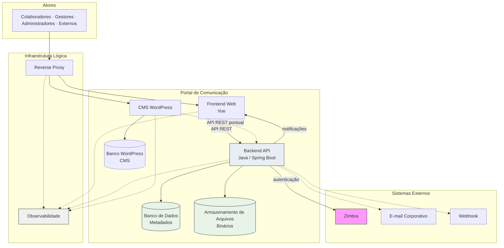

# Container Architecture — Portal de Comunicação

## Objetivo

Este documento decompõe a solução do Portal de Comunicação no **nível Container do modelo C4**, transformando as fronteiras definidas em `02-system-context.md` em containers concretos da solução implementável.

Identifica responsabilidades, dependências, comunicação, persistência, escalabilidade e disponibilidade de cada container — sem detalhar classes, pacotes, endpoints, banco físico ou infraestrutura executável.

**Rastreabilidade:** `docs/solution-design/01-solution-overview.md`, `docs/solution-design/02-system-context.md`, `docs/architecture/02-container-diagram.md`, `docs/architecture/03-component-diagram.md`, `docs/architecture/08-decision-records.md`.

---

# Visão Geral

## Arquitetura em containers

O Portal de Comunicação é uma **aplicação web distribuída** composta por containers que separam apresentação, lógica de negócio, conteúdo institucional complementar, persistência e serviços transversais. A solução alvo adota **monólito modular** na camada de aplicação: um único **Backend API** hospeda os quatro bounded contexts (ADR-001, ADR-007).

### Topologia de containers

```
Atores → Reverse Proxy → Frontend Web ──┐
                    → CMS WordPress ────┼──→ Backend API → Banco de Dados
                                        │              → Armazenamento de Arquivos
                                        │              → Zimbra (externo)
                                        │              → Canais opcionais
                                        └──→ Observabilidade (transversal)
```

### Responsabilidades por camada

| Camada | Containers | Papel |
| ------ | ---------- | ----- |
| Apresentação | Frontend Web, CMS WordPress | Interface com atores; conteúdo institucional complementar |
| Aplicação | Backend API | Negócio, segurança, orquestração, notificações |
| Persistência | Banco de Dados, Armazenamento de Arquivos | Metadados transacionais e binários documentais |
| Infraestrutura lógica | Reverse Proxy, Observabilidade | Roteamento, TLS, logs, métricas e monitoramento |

### Relacionamento entre containers

- **Frontend Web** e **CMS WordPress** consomem **Backend API** — sem acesso direto à persistência do núcleo.
- **Backend API** é o único consumidor do **Banco de Dados** e do **Armazenamento de Arquivos** do portal.
- **Reverse Proxy** é ponto de entrada HTTP/HTTPS para Frontend e WordPress.
- **Observabilidade** coleta sinais de todos os containers da solução de forma transversal.
- **Zimbra**, **Webhook** e **E-mail** são sistemas externos consumidos pelo Backend API.

**Estado alvo:** API Backend Legado **excluído** dos containers da solução (ADR-015 provisório — migração em `09-migration-strategy.md`).

**Nível de confiança:** Médio-Alto para containers centrais; Médio para Observabilidade e capacidades PARCIAL.

---

# Containers da Solução

---

## Frontend Web

### Tecnologia

**Vue** — aplicação web de página única (SPA) consumindo exclusivamente a Backend API.

### Responsabilidades

- Apresentar interface web para todos os atores (colaborador, gestor, administrador, externos).
- Consumir Backend API para todas as operações de negócio.
- Manter estado de sessão e credenciais de autenticação no cliente.
- Exibir notificações in-app e resultados de busca unificada.
- Navegar por módulos de capacidade alinhados aos bounded contexts.

### Dependências

| Dependência | Tipo | Finalidade |
| ----------- | ---- | ---------- |
| Backend API | Obrigatória | Todas as operações de negócio |
| Reverse Proxy | Obrigatória | Ponto de entrada HTTP/HTTPS |

### Dados manipulados

- Estado de sessão e token de autenticação (cliente).
- Preferências de interface e estado de navegação (cliente).
- Dados de apresentação recebidos do Backend API — **sem persistência própria de negócio**.

### Limites

- Sem regras de negócio (ADR-006).
- Sem decisão efetiva de autorização (ADR-005).
- Sem acesso a Banco de Dados, Armazenamento de Arquivos ou Zimbra.
- Sem integração direta com CMS WordPress para operações do núcleo.

### Riscos associados

| Risco | Impacto |
| ----- | ------- |
| R-017 | Dependência total do Backend API — interface inoperante se backend indisponível |
| R-008 | Endpoints órfãos documentados — expectativa de capacidade sem contrato correspondente |
| R-031 | Guards de interface permissivos — mitigado por autorização no backend |

### ADRs relacionados

ADR-005, ADR-006, ADR-002

---

## Backend API

### Tecnologia

**Java, Spring Boot** — aplicação servidor monolítica modular com separação lógica por bounded context.

### Responsabilidades

- Orquestrar quatro módulos lógicos: Organização Corporativa, Gestão Documental, Controle de Acesso, Comunicação Interna.
- Executar regras de negócio, autenticação corporativa (via Zimbra) e autorização efetiva.
- Persistir e recuperar metadados no Banco de Dados.
- Coordenar armazenamento e recuperação de binários no Armazenamento de Arquivos.
- Emitir notificações in-app e encaminhar a canais opcionais.
- Executar busca unificada como projeção read-only filtrada por autorização (ADR-014).
- Registrar eventos de auditoria de governança.
- Expor API consumível pelo Frontend Web e pelo CMS WordPress.

### Dependências

| Dependência | Tipo | Finalidade |
| ----------- | ---- | ---------- |
| Banco de Dados | Obrigatória | Metadados, sessão, permissões, organização, notificações, auditoria |
| Armazenamento de Arquivos | Obrigatória | Binários documentais |
| Zimbra | Obrigatória (crítica) | Validação de identidade corporativa |
| Frontend Web | Consumidor | Operações de negócio |
| CMS WordPress | Consumidor pontual | Integrações por API |
| Webhook / E-mail | Opcional | Notificações externas |
| Observabilidade | Emissor | Logs, métricas e traces |

### Dados manipulados

- Orquestra leitura e escrita de todos os metadados de negócio no Banco de Dados.
- Coordena referências a binários no Armazenamento de Arquivos.
- Mantém sessão autenticada e contexto organizacional em memória e persistência.
- **Não** é owner de identidade de e-mail — referencia Zimbra.

### Limites

- Não provisiona identidade corporativa (ADR-003).
- Não decomposto em microsserviços por bounded context (ADR-001).
- Não substitui CMS WordPress para conteúdo institucional estático.
- API Backend Legado **excluído** do estado alvo.

### Riscos associados

| Risco | Impacto |
| ----- | ------- |
| R-001 | Ponto único de processamento — indisponibilidade paralisa o portal |
| R-009 | Divergência compartilhamento vs. autorização efetiva |
| R-010 | Fluxo de solicitação de permissão incompleto (PARCIAL) |
| R-006 | Dois subsistemas de notificação em migração |
| R-014 | Escalabilidade horizontal indefinida |

### ADRs relacionados

ADR-001, ADR-002, ADR-003, ADR-004, ADR-005, ADR-007, ADR-008, ADR-010, ADR-012, ADR-013, ADR-014

---

## CMS WordPress

### Tecnologia

**WordPress** — sistema de gestão de conteúdo para material institucional complementar.

### Responsabilidades

- Gerenciar conteúdo institucional complementar ao núcleo de negócio (páginas, materiais editoriais).
- Publicar conteúdo estático ou editorial conforme política institucional.
- Operar de forma autônoma em relação às regras centrais do Backend API.

### Dependências

| Dependência | Tipo | Finalidade |
| ----------- | ---- | ---------- |
| Banco de Dados próprio (WordPress) | Interna | Persistência de conteúdo CMS |
| Backend API | Pontual | Integrações por API quando necessário |
| Reverse Proxy | Obrigatória | Ponto de entrada HTTP/HTTPS |

### Dados manipulados

- Conteúdo editorial e páginas institucionais (persistência própria do WordPress).
- **Sem** acesso a metadados de negócio do portal (documentos, permissões, organização).

### Limites

- Sem regras centrais de negócio (publicação documental, autorização, organização).
- Sem acesso ao Banco de Dados do Backend API.
- Sem decisão de autorização sobre recursos documentais governados pelo backend.
- Integração com núcleo **exclusivamente por API** do Backend.

### Riscos associados

| Risco | Impacto |
| ----- | ------- |
| — | Baixo impacto no fluxo principal — CMS é complementar ao núcleo |
| R-008 | Contratos de integração WordPress ↔ Backend a formalizar |

### ADRs relacionados

ADR-002 (backend permanece núcleo; CMS desacoplado)

---

## Banco de Dados

### Tecnologia

Repositório relacional transacional — tecnologia específica a definir na Implementation; acesso exclusivo pelo Backend API.

### Responsabilidades

- Persistir metadados transacionais de todos os bounded contexts.
- Garantir consistência transacional dentro dos limites de cada aggregate.
- Servir como fonte de verdade para metadados de negócio do portal.

### Dados armazenados

| Categoria | Owner lógico | Exemplos |
| --------- | ------------ | -------- |
| Organização | Organização Corporativa | Singulares, áreas, equipes, colaboradores, vínculos, contexto organizacional |
| Documental (metadados) | Gestão Documental | Documentos, pastas, visibilidade, compartilhamento, quotas |
| Acesso | Controle de Acesso | Papéis, sessão, permissões efetivas, solicitações, auditoria, perfis externos |
| Comunicação | Comunicação Interna | Notificações in-app |
| Transversal | Configuração institucional | Parâmetros do portal |

### Dependências

| Dependência | Tipo | Finalidade |
| ----------- | ---- | ---------- |
| Backend API | Consumidor exclusivo | Leitura e escrita transacional |

### Limites

- Não armazena binários de documentos (ADR-004).
- Não acessado pelo Frontend Web ou CMS WordPress.
- Persistência isolada por ambiente (ADR-011).
- Banco de dados do WordPress é **repositório separado**.

### Riscos associados

| Risco | Impacto |
| ----- | ------- |
| R-002 | Persistência central — indisponibilidade torna portal inoperante |
| R-015 | Requisitos de backup e recuperação não especificados |
| R-016 | Entidades referenciadas sem persistência confirmada (capacidades PARCIAL) |

### ADRs relacionados

ADR-004, ADR-009, ADR-010, ADR-011

---

## Armazenamento de Arquivos

### Tecnologia

Repositório de objetos ou sistema de arquivos durável — tecnologia específica a definir na Implementation; acesso exclusivo pelo Backend API.

### Responsabilidades

- Persistir binários de documentos publicados via Gestão Documental.
- Disponibilizar binários para download autorizado.
- Suportar crescimento contínuo de volume documental.

### Tipos de conteúdo

- Binários de documentos referenciados por metadados no Banco de Dados.
- Organização lógica conforme estrutura documental definida pelo Backend API.

### Dependências

| Dependência | Tipo | Finalidade |
| ----------- | ---- | ---------- |
| Backend API | Consumidor exclusivo | Upload, download, reconciliação com metadados |

### Limites

- Não armazena metadados de negócio.
- Não acessado diretamente pelo Frontend Web.
- Publicação deve ser coordenada pelo Backend para evitar inconsistência (R-004).
- Volume sujeito a quotas por colaborador (BR-023).

### Riscos associados

| Risco | Impacto |
| ----- | ------- |
| R-004 | Falha parcial pode gerar metadado sem binário correspondente |
| R-029 | Crescimento de binários sem política global documentada |

### ADRs relacionados

ADR-004

---

## Reverse Proxy

### Tecnologia

**Nginx** (ou equivalente) — camada de roteamento e terminação TLS conforme `.cursor/rules/architecture/deployment-modeling.mdc` e `docker-strategy.mdc`.

### Responsabilidades

- Ponto de entrada HTTP/HTTPS para atores externos.
- Rotear requisições ao Frontend Web e ao CMS WordPress.
- Terminar SSL/TLS na fronteira da solução.
- Opcionalmente encaminhar requisições de API ao Backend API conforme topologia de deployment.

### Dependências

| Dependência | Tipo | Finalidade |
| ----------- | ---- | ---------- |
| Frontend Web | Destino | Interface principal do portal |
| CMS WordPress | Destino | Conteúdo institucional |
| Backend API | Destino (conforme topologia) | API de negócio |

### Limites

- Não executa regras de negócio.
- Não substitui autorização do Backend API.
- Configuração por ambiente — sem valores de certificados na documentação.

### Riscos associados

| Risco | Impacto |
| ----- | ------- |
| R-017 | Indisponibilidade impede acesso de atores à interface |
| R-015 | Continuidade do proxy não especificada |

### ADRs relacionados

ADR-006, ADR-011

---

## Observabilidade

### Tecnologia

Capacidade transversal — ferramentas específicas a definir na Implementation. Sem produto imposto nesta camada.

### Responsabilidades

- Coletar **logs** de aplicação e acesso de todos os containers.
- Expor **métricas** de saúde, desempenho e volume (documentos, sessões, notificações).
- Habilitar **monitoramento** de disponibilidade e alertas operacionais.
- Suportar rastreabilidade de incidentes e auditoria técnica complementar à auditoria de negócio.

### Logs

| Origem | Conteúdo esperado |
| ------ | ----------------- |
| Backend API | Operações, erros, integrações, autenticação |
| Frontend Web | Erros de cliente (quando encaminhados) |
| Reverse Proxy | Acesso HTTP, códigos de resposta |
| Banco / Armazenamento | Eventos de conexão e falha (via backend ou agentes) |

### Métricas

Indicadores alinhados a `10-target-architecture.md` seção 11: volume documental, armazenamento, permissões, notificações, disponibilidade de integrações, incidentes de consistência metadado/binário.

### Monitoramento

- Disponibilidade de containers críticos: Backend API, Banco de Dados, Zimbra (integração).
- Latência de operações transacionais e consultas de busca.
- Taxa de falha em canais opcionais (Webhook, E-mail).

### Dependências

| Dependência | Tipo | Finalidade |
| ----------- | ---- | ---------- |
| Todos os containers da solução | Fontes de sinal | Coleta de logs e métricas |

### Limites

- Observabilidade técnica **não substitui** auditoria de governança de negócio (componente Auditoria no Backend).
- Catálogo de métricas administrativas em aberto (OQ-022).
- Implementação de stack de observabilidade reservada à camada Implementation.

---

# Mapeamento para Bounded Contexts

Os quatro bounded contexts residem como **módulos lógicos** dentro do container **Backend API**. Não há container físico por contexto (ADR-007).

## Organização Corporativa

| Aspecto | Descrição |
| ------- | --------- |
| **Módulo no Backend** | Gestão de Onboarding, Singulares, Áreas, Equipes, Colaboradores, Vínculos Organizacionais |
| **Ownership** | Fonte de verdade de estrutura organizacional, vínculos e contexto |
| **Persistência** | Banco de Dados |
| **Posição** | **Upstream** — pré-requisito de todos os demais contextos (ADR-013) |
| **Fronteira** | Produz escopo e vínculos; não governa acesso efetivo nem publicação documental |
| **Dependências** | Zimbra (identidade); consumido por Gestão Documental, Controle de Acesso e Comunicação Interna |
| **Status** | ATIVO; Onboarding PARCIAL (OQ-001) |

## Gestão Documental

| Aspecto | Descrição |
| ------- | --------- |
| **Módulo no Backend** | Gestão de Documentos, Pastas, Visibilidade, Compartilhamento, Armazenamento |
| **Ownership** | Fonte de verdade de documentos, pastas, visibilidade, compartilhamento e quotas |
| **Persistência** | Banco de Dados (metadados); Armazenamento de Arquivos (binários) |
| **Fronteira sensível** | Compartilhamento (audiência) ↔ Autorização (acesso efetivo) — integração obrigatória (ADR-008, OQ-005) |
| **Dependências** | Organização Corporativa (escopo); Controle de Acesso (autorização para entrega) |
| **Status** | ATIVO |

## Controle de Acesso

| Aspecto | Descrição |
| ------- | --------- |
| **Módulo no Backend** | Autenticação Corporativa, Sessão, Papéis, Autorização, Permissões de Pastas, Solicitações de Permissão, Auditoria, Perfis Externos |
| **Ownership** | Fonte de verdade de papéis, sessão, permissões efetivas, solicitações e auditoria |
| **Persistência** | Banco de Dados; Zimbra (identidade externa) |
| **Fronteira sensível** | Autorização efetiva vs. compartilhamento documentado |
| **Dependências** | Organização Corporativa (escopo); governa entrega de Gestão Documental |
| **Status** | ATIVO; Solicitações de Permissão e Perfis Externos PARCIAL |

## Comunicação Interna

| Aspecto | Descrição |
| ------- | --------- |
| **Módulo no Backend** | Gestão de Notificações, Comunicados, Fique por Dentro, Busca Unificada, Métricas Administrativas |
| **Ownership** | Fonte de verdade de notificações; projeção read-only de busca (ADR-014) |
| **Persistência** | Banco de Dados (notificações); consulta a demais contextos por referência |
| **Posição** | **Downstream** — consome dados de Organização, Documental e Acesso |
| **Dependências** | Todos os contextos upstream; Frontend Web para entrega |
| **Status** | ATIVO com confiança reduzida; Comunicados, Busca e Métricas PARCIAL |

### Diagrama de dependência entre contextos

```text
Organização Corporativa (upstream)
        ↓
Gestão Documental ←→ Controle de Acesso (fronteira sensível)
        ↓                    ↓
        └──→ Comunicação Interna (downstream)
```

---

# Comunicação Entre Containers

Protocolos em nível **lógico** — sem endpoints, payloads ou contratos detalhados (reservados a `06-integration-contracts.md`).

| Origem | Destino | Protocolo lógico | Objetivo | Criticidade |
| ------ | ------- | ---------------- | -------- | ----------- |
| Atores | Reverse Proxy | HTTP/HTTPS | Acesso à interface | Alta |
| Reverse Proxy | Frontend Web | HTTP/HTTPS | Entrega da aplicação web | Alta |
| Reverse Proxy | CMS WordPress | HTTP/HTTPS | Entrega do conteúdo institucional | Média |
| Frontend Web | Backend API | API REST sobre HTTPS | Operações de negócio | **Crítica** |
| CMS WordPress | Backend API | API REST sobre HTTPS | Integração pontual desacoplada | Baixa |
| Backend API | Banco de Dados | Protocolo de banco relacional | Persistência transacional | **Crítica** |
| Backend API | Armazenamento de Arquivos | Protocolo de armazenamento de objetos/arquivos | Binários documentais | Alta |
| Backend API | Zimbra | Protocolo de autenticação corporativa (IMAP/SMTP/SOAP documentados no contexto) | Validação de credenciais | **Crítica** |
| Backend API | Webhook | HTTP/HTTPS (callback) | Notificação externa opcional | Baixa |
| Backend API | E-mail corporativo | Protocolo de e-mail (SMTP) | Notificação por e-mail opcional | Baixa |
| Backend API | Frontend Web | API REST / streaming | Notificações in-app | Alta |
| Containers | Observabilidade | Exportação de logs e métricas | Monitoramento transversal | Média |

---

# Fluxos de Dados

Fluxos em alto nível entre containers. Sem detalhes de implementação.

## Autenticação

```text
Ator → Reverse Proxy → Frontend Web → Backend API → Zimbra
                                          ↓
                                    Banco de Dados (sessão, vínculo)
```

1. Ator submete credenciais via Frontend Web.
2. Backend API valida no Zimbra.
3. Backend persiste sessão e associa contexto organizacional no Banco de Dados.
4. Frontend mantém credencial de sessão para requisições subsequentes.

## Consulta

```text
Ator → Frontend Web → Backend API → Banco de Dados
                          ↓ (se download)
                    Armazenamento de Arquivos
```

1. Frontend solicita conteúdo ao Backend API.
2. Backend valida autorização; consulta metadados no Banco de Dados.
3. Para download, Backend recupera binário no Armazenamento após autorização.
4. Frontend apresenta resultado ao ator.

## Publicação

```text
Ator → Frontend Web → Backend API → Banco de Dados (metadados)
                          ↓
                    Armazenamento de Arquivos (binário)
```

1. Frontend envia metadados e binário ao Backend API.
2. Backend valida escopo, visibilidade e quota.
3. Backend persiste metadados e binário de forma coordenada (atomicidade lógica).
4. Backend define compartilhamento e alinha com autorização.

## Compartilhamento

```text
Gestão Documental (Backend) → metadados de compartilhamento → Banco de Dados
         ↓ (integração obrigatória)
Controle de Acesso (Backend) → permissão efetiva → Banco de Dados
```

- Compartilhamento define **audiência** (módulo Gestão Documental).
- Autorização efetiva **quem acessa** (módulo Controle de Acesso).
- Fronteira sensível — equivalência em aberto (OQ-005, R-009).

## Notificações

```text
Evento (Backend) → Banco de Dados (persistência)
       ↓
Frontend Web (in-app) → Ator
       ↓ (opcional)
Webhook / E-mail → Sistemas externos
```

- Notificações centralizadas no Backend API (ADR-012).
- Entrega primária via Frontend Web; canais externos opcionais.

---

# Estratégia de Persistência

| Tipo de dado | Container | Owner lógico | Observação |
| ------------ | --------- | ------------ | ---------- |
| **Metadados** | Banco de Dados | Por bounded context | Organização, documentos, acesso, notificações |
| **Binários** | Armazenamento de Arquivos | Gestão Documental | Referenciados por metadados; ADR-004 |
| **Auditoria** | Banco de Dados | Controle de Acesso | Eventos de governança; catálogo em aberto (OQ-019) |
| **Sessão** | Banco de Dados | Controle de Acesso | Associada a identidade e contexto organizacional |
| **Notificações** | Banco de Dados | Comunicação Interna | Estado alvo: subsistema unificado (R-006) |
| **Conteúdo CMS** | Banco WordPress (CMS) | WordPress | Separado do núcleo do portal |
| **Identidade e-mail** | Zimbra (externo) | Zimbra | Portal não provisiona; referência apenas |

### Princípios

- **Separação metadado/binário** — dois containers de persistência do núcleo (ADR-004).
- **Referência por identificador** entre contextos — sem duplicação de estado mutável (ADR-009).
- **Consistência forte** intra-aggregate; **eventual** inter-aggregate (ADR-010).
- **Isolamento por ambiente** — sem compartilhamento de persistência entre local, dev, hml e prod (ADR-011).

---

# Escalabilidade

Princípios de escala em nível lógico — sem tecnologia de infraestrutura específica. Decisão de escalabilidade horizontal do Backend é **pendente** (R-014).

| Container | Padrão de demanda | Princípio de escala |
| --------- | ----------------- | ------------------- |
| **Frontend Web** | Sessões concorrentes de atores | Escala com número de usuários simultâneos; stateless no servidor |
| **Backend API** | Operações transacionais concentradas | Gargalo principal — monólito modular; escala vertical ou horizontal futura |
| **Banco de Dados** | Leitura e escrita transacional | Gargalo de metadados; crescimento com documentos, permissões e organização |
| **Armazenamento de Arquivos** | Crescimento contínuo de binários | Escala de volume; quotas por colaborador limitam por usuário, não globalmente |
| **CMS WordPress** | Tráfego de conteúdo institucional | Escala independente do núcleo; carga menor que Backend |
| **Reverse Proxy** | Requisições HTTP de entrada | Escala com tráfego de Frontend e CMS |
| **Observabilidade** | Volume de logs e métricas | Escala com número de containers e operações |

### Pontos de crescimento documentados

- Colaboradores integrados → vínculos, sessões, quotas.
- Documentos publicados → metadados e binários.
- Singulares e áreas → estrutura organizacional.
- Notificações e busca → leitura transversal.

---

# Disponibilidade

Impacto dos riscos críticos e de continuidade sobre os containers.

| Risco | Severidade | Container impactado | Efeito |
| ----- | ---------- | ------------------- | ------ |
| **R-001** | Crítica | Backend API | Portal inoperante — todos os fluxos interrompidos |
| **R-002** | Crítica | Banco de Dados | Sem metadados — autenticação, autorização e negócio paralisados |
| **R-003** | Crítica | Backend API + Zimbra (integração) | Novos logins impossibilitados |
| **R-015** | Alta | Todos os containers críticos | Recuperação sem requisitos documentados — tempo de indisponibilidade indefinido |

### Criticidade por container

| Container | Criticidade operacional | Justificativa |
| --------- | ----------------------- | ------------- |
| Backend API | **Crítica** | Orquestra todos os fluxos de negócio e segurança |
| Banco de Dados | **Crítica** | Persistência de metadados transacionais |
| Integração Zimbra | **Crítica** (novos acessos) | Identidade corporativa |
| Frontend Web | **Alta** | Interface obrigatória; sem alternativa documentada |
| Armazenamento de Arquivos | **Alta** | Publicação e download comprometidos sem ele |
| Reverse Proxy | **Alta** | Ponto de entrada de atores |
| CMS WordPress | **Média** | Complementar ao núcleo |
| Webhook / E-mail | **Baixa** | Canais opcionais |
| Observabilidade | **Média** | Degradação de monitoramento; não bloqueia operação principal |

### Prioridade de recuperação (lógica)

1. Banco de Dados e Backend API — imediata.
2. Armazenamento de Arquivos e integração Zimbra — alta.
3. Frontend Web e Reverse Proxy — alta.
4. Observabilidade e canais opcionais — média/baixa.

*Mecanismos técnicos de backup, réplica e failover a definir em `04-deployment-architecture.md` e `05-environment-strategy.md`.*

---

# Diagrama de Containers

Visão C4 Container da solução alvo. Sem componentes internos do Backend API.



**Legenda:** linha contínua — dependência obrigatória; linha tracejada — opcional ou transversal. API Backend Legado ausente do estado alvo.

---

# Dependências para Próximos Artefatos

## `04-deployment-architecture.md`

- Topologia física e lógica dos containers: Frontend, Backend, WordPress, Banco, Armazenamento, Reverse Proxy, Observabilidade.
- Zonas de confiança derivadas das fronteiras de containers.
- Networking, volumes, persistência, SSL/TLS e backup.
- Requisitos de continuidade para mitigar R-001, R-002, R-003, R-015.
- Posicionamento de Zimbra, Webhook e E-mail por ambiente.

## `05-environment-strategy.md`

- Implantação dos containers em local, dev, hml e prod.
- Paridade e isolamento entre ambientes (ADR-011).
- Configuração por ambiente (variáveis, secrets).
- Estratégia Docker Compose por ambiente — modelagem apenas, sem arquivos executáveis.

## `06-integration-contracts.md`

- Contratos lógicos detalhados das comunicações entre containers (seção Comunicação Entre Containers).
- Frontend → Backend por capacidade de negócio.
- WordPress → Backend (integração pontual).
- Backend → Zimbra, Webhook, E-mail.
- Lacunas L-010 (endpoints órfãos), L-003 (compartilhamento ↔ autorização), L-009 (notificações).

## `07-data-ownership.md`

- Estratégia de persistência e matriz de ownership por bounded context.
- Separação Banco de Dados vs. Armazenamento de Arquivos.
- Ownership de metadados, binários, auditoria, sessão e notificações.
- Fronteira Banco WordPress (CMS) vs. Banco do núcleo.

---

# Conclusão

A arquitetura de containers da solução alvo do Portal de Comunicação compreende **oito containers internos** (Frontend Web, Backend API, CMS WordPress, Banco de Dados, Armazenamento de Arquivos, Reverse Proxy, Observabilidade e Banco WordPress do CMS) e **três sistemas externos** (Zimbra, E-mail, Webhook), organizados em camadas de apresentação, aplicação, persistência e infraestrutura lógica.

O **Backend API** concentra os quatro bounded contexts como módulos lógicos em monólito modular, materializando ADR-001 a ADR-014. A separação entre metadados e binários, a autorização centralizada e o CMS desacoplado definem fronteiras estáveis para deployment, integrações e ownership de dados.

Riscos críticos R-001, R-002 e R-003 concentram-se no eixo Backend API — Banco de Dados — Zimbra. R-015 exige definição de continuidade nos artefatos de deployment e ambiente. Este documento estabelece a base container para `04-deployment-architecture.md` sem expor implementação executável.

---

## Fontes Utilizadas

| Fonte | Uso |
| ----- | --- |
| `docs/solution-design/01-solution-overview.md` | Componentes, tecnologias, princípios |
| `docs/solution-design/02-system-context.md` | Fronteiras, fluxos, dependências críticas |
| `docs/architecture/02-container-diagram.md` | Containers e mapeamento de contextos |
| `docs/architecture/03-component-diagram.md` | Módulos lógicos por bounded context |
| `docs/architecture/05-data-architecture.md` | Ownership e persistência |
| `docs/architecture/08-decision-records.md` | ADRs |
| `docs/architecture/09-risk-assessment.md` | Riscos por container |
| `docs/architecture/10-target-architecture.md` | Estado alvo |
| `.cursor/rules/delivery/implementation-rules.mdc` | Stack alvo |
| `.cursor/rules/architecture/deployment-modeling.mdc` | Reverse Proxy, Observabilidade |

*Nenhum endpoint, classe, pacote, banco físico, docker-compose, kubernetes, pipeline ou infraestrutura executável foi produzido para a construção deste artefato.*

---

## Nível de Confiança

**Médio-Alto**

| Faixa | Escopo |
| ----- | ------ |
| Alto | Containers centrais, mapeamento de bounded contexts, comunicação, persistência |
| Médio | Observabilidade, CMS WordPress, capacidades PARCIAL, escalabilidade |
