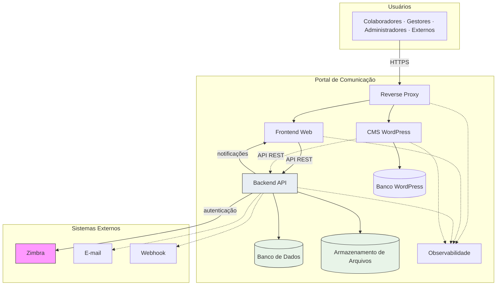
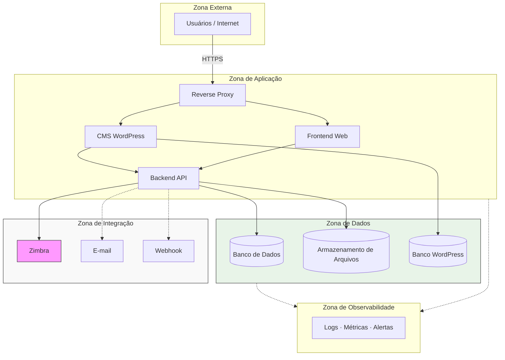

# Deployment Architecture — Portal de Comunicação

## Objetivo

Este documento modela a **arquitetura de implantação** da solução do Portal de Comunicação — como os containers definidos em `03-container-architecture.md` são distribuídos em ambientes, zonas de confiança, rede, persistência, segurança, continuidade e observabilidade.

Apresenta visões **lógica** e **física** do deployment, sem gerar artefatos executáveis (Docker Compose, Kubernetes, Terraform, Ansible, scripts ou configurações).

**Rastreabilidade:** `docs/solution-design/03-container-architecture.md`, `docs/architecture/07-deployment-architecture.md`, `docs/architecture/08-decision-records.md`, `docs/architecture/09-risk-assessment.md`.

---

# Visão Geral do Deployment

## Estratégia geral de implantação

O Portal de Comunicação implanta-se como **aplicação web distribuída em camadas**, replicada em **quatro ambientes segregados** (local, dev, hml, prod). A topologia de containers é **idêntica em estrutura** entre ambientes; diferem configuração, dados, criticidade operacional e exposição a sistemas externos.

O deployment segue o modelo de **monólito modular** na camada de aplicação (ADR-001): um único Backend API implantado por ambiente, com Frontend Web, CMS WordPress, persistência segregada e Reverse Proxy como ponto de entrada.

## Separação entre deployment lógico e físico

| Visão | Descrição | Escopo |
| ----- | --------- | ------ |
| **Lógica** | Relacionamentos entre containers, fluxos de comunicação e dependências funcionais | O que se comunica com o quê e por qual finalidade |
| **Física** | Agrupamento de containers em zonas de implantação com fronteiras de rede e confiança | Onde os containers residem e quais fronteiras protegem cada agrupamento |

A visão lógica é independente de provedor ou plataforma. A visão física modela zonas sem escolher cloud, datacenter ou orquestrador específico.

## Princípios arquiteturais aplicados

- **ADR-011:** ambientes isolados com persistência segregada.
- **ADR-004:** metadados e binários em repositórios de implantação distintos.
- **ADR-005, ADR-006:** Backend central; Frontend sem acesso direto a persistência.
- **ADR-003:** Zimbra como dependência externa crítica por ambiente.
- Estado alvo **sem** API Backend Legado no deployment (ADR-015 — migração em `09-migration-strategy.md`).

**Nível de confiança:** Médio-Alto para topologia e zonas; Médio para mecanismos técnicos de backup e failover (a detalhar na Implementation).

---

# Princípios de Deployment

| Princípio | Aplicação na solução |
| --------- | -------------------- |
| **Alta Coesão** | Containers agrupados por responsabilidade: apresentação, aplicação, persistência, integração e observabilidade em zonas distintas |
| **Baixo Acoplamento** | Frontend e CMS consomem Backend por API; persistência acessível apenas pelo Backend; CMS com banco próprio |
| **Isolamento de Ambientes** | local, dev, hml e prod com persistência e configuração segregadas — sem compartilhamento de dados entre ambientes |
| **Paridade entre Ambientes** | Mesma topologia lógica de containers em todos os ambientes; comportamento equivalente com dados e integrações proporcionais |
| **Separação de Responsabilidades** | Reverse Proxy para entrada; Backend para negócio e segurança; persistência exclusiva do núcleo via Backend |
| **Recuperação de Falhas** | Prioridade de restauração definida por criticidade; backup e restauração de Banco e Armazenamento obrigatórios |
| **Observabilidade** | Coleta transversal de logs, métricas e alertas de todos os containers implantados |
| **Segurança por Camadas** | Zonas de confiança com comunicação controlada; TLS na fronteira; persistência não exposta a atores |

---

# Topologia Lógica

Elementos da topologia lógica de deployment e papel de cada um.

| Elemento | Papel no deployment |
| -------- | ------------------- |
| **Usuários** | Atores humanos que iniciam requisições via navegador ou cliente web |
| **Reverse Proxy** | Ponto de entrada HTTP/HTTPS; roteamento ao Frontend e WordPress; terminação TLS |
| **Frontend Web** | Interface SPA (Vue); consome Backend API; sem persistência de negócio |
| **CMS WordPress** | Conteúdo institucional complementar; banco próprio; integração pontual com Backend |
| **Backend API** | Núcleo da solução; negócio, segurança, orquestração e notificações |
| **Banco de Dados** | Metadados transacionais do núcleo; acesso exclusivo via Backend |
| **Armazenamento de Arquivos** | Binários documentais; acesso exclusivo via Backend |
| **Observabilidade** | Coleta transversal de logs, métricas e alertas |
| **Zimbra** | Sistema externo crítico — validação de identidade corporativa |
| **Webhook** | Sistema externo opcional — recebimento de notificações |
| **E-mail** | Sistema externo opcional — canal alternativo de notificação |

### Fluxo lógico principal

```text
Usuários → Reverse Proxy → Frontend Web / CMS WordPress
                                ↓
                          Backend API → Banco de Dados
                                    → Armazenamento de Arquivos
                                    → Zimbra
                                    → Webhook / E-mail (opcional)
                                    → Frontend Web (notificações)

Todos os containers → Observabilidade (sinais)
```

---

# Topologia Física

Agrupamentos físicos da solução em **cinco zonas de implantação**. Sem escolha de provedor ou cloud.

## Zona Externa

| Aspecto | Descrição |
| ------- | --------- |
| **Conteúdo** | Usuários (atores); tráfego de Internet |
| **Responsabilidade** | Origem de requisições externas; identidade validada pelo portal após autenticação |
| **Containers** | Nenhum container da solução — apenas atores e tráfego de entrada |
| **Fronteira** | Comunicação com Reverse Proxy via HTTPS |

## Zona de Aplicação

| Aspecto | Descrição |
| ------- | --------- |
| **Conteúdo** | Reverse Proxy, Frontend Web, CMS WordPress, Backend API |
| **Responsabilidade** | Processamento de requisições, apresentação, negócio e segurança |
| **Fronteira** | Recebe tráfego da Zona Externa; acessa Zona de Dados e Zona de Integração |
| **Restrição** | Frontend e CMS sem acesso direto à Zona de Dados do núcleo |

## Zona de Dados

| Aspecto | Descrição |
| ------- | --------- |
| **Conteúdo** | Banco de Dados (núcleo), Armazenamento de Arquivos, Banco WordPress (CMS) |
| **Responsabilidade** | Persistência durável; maior nível de proteção |
| **Fronteira** | Acesso do núcleo exclusivamente via Backend API; banco WordPress acessível apenas pelo CMS |
| **Restrição** | Não exposta a Usuários nem a Sistemas Externos |

## Zona de Integração

| Aspecto | Descrição |
| ------- | --------- |
| **Conteúdo** | Zimbra, Webhook, E-mail corporativo |
| **Responsabilidade** | Sistemas externos consumidos ou notificados pelo Backend API |
| **Fronteira** | Backend API inicia comunicação; portal não provisiona identidade |
| **Restrição** | Zimbra crítico; Webhook e E-mail opcionais |

## Zona de Observabilidade

| Aspecto | Descrição |
| ------- | --------- |
| **Conteúdo** | Infraestrutura de logs, métricas, alertas e monitoramento |
| **Responsabilidade** | Coleta e análise de sinais operacionais de todos os containers |
| **Fronteira** | Recebe exportação de sinais; não participa de fluxos de negócio |
| **Restrição** | Acesso restrito a operadores autorizados |

---

# Zonas de Confiança

Fronteiras de segurança lógicas e comunicação permitida entre zonas.

| Zona | Conteúdo | Nível de confiança |
| ---- | -------- | ------------------ |
| **Internet** | Tráfego público; atores não autenticados ou autenticados | Baixo — entrada não confiável |
| **Portal** | Reverse Proxy, Frontend, Backend, WordPress | Médio-Alto — boundary da solução |
| **Persistência** | Banco de Dados, Armazenamento, Banco WordPress | Alto — dados confidenciais (BR-004) |
| **Integrações Corporativas** | Zimbra, E-mail | Externo — dependência institucional |
| **Monitoramento** | Observabilidade | Restrito — operadores autorizados |

### Matriz de comunicação permitida

| Origem | Destino | Permitido | Condição |
| ------ | ------- | --------- | -------- |
| Internet | Portal (Reverse Proxy) | Sim | HTTPS obrigatório |
| Portal (Frontend/CMS) | Portal (Backend) | Sim | API REST interna |
| Portal (Backend) | Persistência | Sim | Único consumidor do núcleo |
| Portal (WordPress) | Persistência (Banco WP) | Sim | Apenas banco próprio do CMS |
| Portal (Backend) | Integrações Corporativas | Sim | Zimbra obrigatório; demais opcionais |
| Internet | Persistência | **Não** | Dados nunca expostos diretamente |
| Internet | Backend (direto) | **Não** | Entrada apenas via Reverse Proxy e Frontend |
| Persistência | Internet | **Não** | Sem exposição externa |
| Integrações Corporativas | Persistência | **Não** | Sem acesso direto a dados do portal |
| Monitoramento | Portal / Persistência | Sim (leitura) | Coleta de sinais; sem mutação de negócio |

---

# Estratégia de Rede

## Comunicação interna

| Fluxo | Protocolo lógico | Zonas envolvidas |
| ----- | ---------------- | ---------------- |
| Reverse Proxy → Frontend / WordPress | HTTP/HTTPS interno | Portal |
| Frontend → Backend API | HTTPS / API REST | Portal |
| WordPress → Backend API | HTTPS / API REST | Portal |
| Backend → Banco de Dados | Protocolo de banco relacional | Portal → Persistência |
| Backend → Armazenamento | Protocolo de armazenamento | Portal → Persistência |
| WordPress → Banco WordPress | Protocolo de banco relacional | Portal → Persistência |
| Containers → Observabilidade | Exportação de logs/métricas | Portal / Persistência → Monitoramento |

## Comunicação externa

| Fluxo | Protocolo lógico | Zonas envolvidas |
| ----- | ---------------- | ---------------- |
| Usuários → Reverse Proxy | HTTPS | Internet → Portal |
| Backend → Zimbra | Protocolo de autenticação corporativa | Portal → Integrações |
| Backend → Webhook | HTTPS (callback) | Portal → Integrações |
| Backend → E-mail | SMTP | Portal → Integrações |

## Restrições de acesso

- Persistência do núcleo acessível **somente** pelo Backend API.
- Banco WordPress acessível **somente** pelo CMS WordPress.
- Atores **não** acessam Backend API, Banco ou Armazenamento diretamente.
- Integrações externas **não** acessam Persistência do portal.

## Fluxos permitidos

- Usuário autenticado → Frontend → Backend → Persistência (após autorização).
- Backend → Zimbra (autenticação).
- Backend → canais opcionais (notificação).
- Operadores → Observabilidade (consulta de sinais).

## Fluxos proibidos

- Usuário → Banco de Dados ou Armazenamento.
- Usuário → Backend API (bypass do Frontend).
- WordPress → Banco de Dados do núcleo.
- Zimbra → Persistência do portal.
- Internet → Persistência (qualquer protocolo).

## Princípio de menor privilégio

Cada container recebe conectividade **mínima necessária** à sua função: Frontend apenas ao Backend; Backend à Persistência e Integrações; CMS ao seu banco e pontualmente ao Backend; Observabilidade em modo leitura de sinais.

---

# Estratégia de Persistência

Sem definição de tecnologia específica de banco ou storage.

## Banco de Dados (núcleo)

| Aspecto | Estratégia |
| ------- | ---------- |
| **Conteúdo** | Metadados transacionais: organização, documentos, acesso, notificações, auditoria, sessão |
| **Volumes persistentes** | Volume dedicado por ambiente; sobrevive a reinicialização do container |
| **Backup** | Cópias periódicas agendadas; retenção proporcional à criticidade do ambiente |
| **Restauração** | Procedimento documentado; prioridade 1 em recuperação (R-002) |
| **Retenção** | Produção: conforme política institucional; ambientes inferiores: descartável ou ciclo curto |
| **Isolamento** | Instância ou volume **exclusivo** por ambiente (ADR-011) |

## Armazenamento de Arquivos

| Aspecto | Estratégia |
| ------- | ---------- |
| **Conteúdo** | Binários de documentos referenciados por metadados no Banco |
| **Volumes persistentes** | Volume de objetos/arquivos dedicado por ambiente |
| **Backup** | Cópias periódicas; coordenadas com backup de metadados para reconciliação |
| **Restauração** | Prioridade 2 — após Banco de Dados; verificar coerência metadado/binário (R-004) |
| **Retenção** | Crescimento contínuo; sujeito a quotas por colaborador (BR-023) |
| **Isolamento** | Repositório exclusivo por ambiente |

## Banco WordPress

| Aspecto | Estratégia |
| ------- | ---------- |
| **Conteúdo** | Conteúdo editorial e páginas institucionais do CMS |
| **Volumes persistentes** | Volume dedicado; separado do Banco do núcleo |
| **Backup** | Independente do núcleo; criticidade menor |
| **Restauração** | Não bloqueia operação do fluxo principal do portal |
| **Retenção** | Conforme política de conteúdo institucional |

### Coerência metadado/binário

Restauração deve preservar **referências** entre metadados (Banco) e binários (Armazenamento). Procedimento de reconciliação para registros órfãos documentado operacionalmente (mitigação R-004).

---

# Estratégia de Segurança

## TLS

- Terminação TLS no **Reverse Proxy** na fronteira Internet → Portal.
- Comunicação interna entre containers do Portal preferencialmente criptografada em ambientes hml e prod.
- Certificados gerenciados por ambiente — **sem valores** na documentação.

## Gestão de Segredos

- Credenciais, tokens e chaves em **variáveis de ambiente** ou **secrets** por ambiente.
- Segredos **não versionados** em repositório (conforme `docker-strategy.mdc`).
- Rotação periódica de credenciais de integração com Zimbra e banco de dados.

## Credenciais

- Autenticação de colaboradores via Zimbra — portal não armazena senhas corporativas de longo prazo.
- Sessão autenticada gerenciada pelo Backend; token ou mecanismo equivalente no cliente.
- Credenciais de serviço (banco, armazenamento, integrações) exclusivas por ambiente.

## Comunicação segura

- Entrada externa exclusivamente HTTPS.
- Backend como único ponto de decisão de autorização (ADR-005).
- Persistência sem exposição de rede pública.

## Integração com Zimbra

- Comunicação do Backend para Zimbra em canal seguro conforme política corporativa.
- Zimbra obrigatório em produção; simulação ou ambiente de teste em local e dev.
- Sem mecanismo alternativo de identidade documentado (ADR-003, R-003).

## Proteção de dados

- Conteúdo confidencial e de uso profissional (BR-004).
- Persistência na zona de maior proteção.
- Acesso a dados condicionado a autorização no Backend em cada operação.

## Auditoria

- Eventos de governança registrados pelo Backend no Banco de Dados (BR-005).
- Auditoria técnica (logs de acesso, erros) complementar via Observabilidade.
- Catálogo fechado de eventos auditáveis pendente (OQ-019).

---

# Continuidade Operacional

Relacionamento direto com riscos críticos e de continuidade.

## R-001 — Backend API como ponto único de processamento

| Aspecto | Descrição |
| ------- | --------- |
| **Impacto** | Indisponibilidade paralisa todo o portal — Frontend inoperante para negócio |
| **Estratégia de mitigação** | Monitoramento de saúde do Backend; procedimento de reinicialização; decisão futura de escalabilidade horizontal (R-014); deployment com recuperação rápida |
| **Prioridade de recuperação** | **1 — imediata** |
| **Dependências críticas** | Banco de Dados e Armazenamento acessíveis para retomada |

## R-002 — Banco de Dados como persistência central

| Aspecto | Descrição |
| ------- | --------- |
| **Impacto** | Sem metadados — autenticação, autorização, organização e negócio paralisados |
| **Estratégia de mitigação** | Backup periódico automatizado; testes de restauração; volume persistente dedicado; procedimento de recovery documentado |
| **Prioridade de recuperação** | **1 — imediata** |
| **Dependências críticas** | Restauração de metadados transacionais; coerência com Armazenamento |

## R-003 — Dependência única do Zimbra

| Aspecto | Descrição |
| ------- | --------- |
| **Impacto** | Novos logins impossibilitados; colaboradores sem sessão ativa não ingressam |
| **Estratégia de mitigação** | Monitoramento da integração Zimbra; comunicação operacional com gestão de e-mail corporativo; sessões ativas podem sustentar operação temporária (R-028) |
| **Prioridade de recuperação** | **2 — alta** (novos acessos) |
| **Dependências críticas** | Disponibilidade externa do Zimbra — fora do controle direto do portal |

## R-015 — Continuidade operacional não especificada

| Aspecto | Descrição |
| ------- | --------- |
| **Impacto** | Tempo de indisponibilidade indefinido em falha; recuperação sem critérios documentados |
| **Estratégia de mitigação** | Este documento estabelece prioridades e estratégias; `05-environment-strategy.md` detalhará procedimentos por ambiente; testes periódicos de backup e restauração |
| **Prioridade de recuperação** | Aplicar matriz de prioridades abaixo a todos os containers críticos |
| **Dependências críticas** | Procedimentos operacionais, responsáveis e ferramentas a definir na Implementation |

### Matriz de prioridade de recuperação

| Prioridade | Containers / Cenários |
| ---------- | --------------------- |
| **1 — Imediata** | Banco de Dados, Backend API |
| **2 — Alta** | Armazenamento de Arquivos, integração Zimbra, Frontend Web, Reverse Proxy |
| **3 — Média** | CMS WordPress, Observabilidade |
| **4 — Baixa** | Webhook, E-mail (canais opcionais) |

### Dependências para restabelecimento

| Cenário | Ordem lógica de restabelecimento |
| ------- | -------------------------------- |
| Falha total do ambiente | Persistência (Banco + Armazenamento) → Backend API → Frontend + Reverse Proxy → Integrações |
| Falha parcial do Backend | Reinicialização Backend com Persistência intacta |
| Falha do Zimbra | Operação com sessões ativas; novos logins aguardam restauração externa |

---

# Estratégia de Observabilidade

| Dimensão | Estratégia |
| -------- | ---------- |
| **Logs** | Agregação centralizada de logs de Reverse Proxy, Frontend, Backend, WordPress e erros de integração; retenção proporcional ao ambiente |
| **Métricas** | Disponibilidade, latência, taxa de erro, volume de operações, uso de armazenamento, sessões ativas |
| **Alertas** | Indisponibilidade de Backend, Banco, falhas de autenticação Zimbra, erros críticos de aplicação |
| **Monitoramento** | Dashboards de saúde por container; acompanhamento de riscos R-001, R-002, R-003 |
| **Auditoria técnica** | Logs de acesso HTTP, tentativas de autenticação, erros de autorização — complementar à auditoria de negócio |
| **Rastreabilidade** | Correlação de identificadores de requisição entre Frontend e Backend para diagnóstico de incidentes |

### Limites

- Observabilidade **não substitui** auditoria de governança de negócio (componente Auditoria no Backend).
- Stack específica reservada à camada Implementation.
- Métricas administrativas de negócio em aberto (OQ-022).

---

# Estratégia de Disponibilidade

Objetivos de disponibilidade **qualitativos** — sem SLA numérico nesta camada.

| Container | Criticidade | Objetivo de disponibilidade |
| --------- | ----------- | --------------------------- |
| **Backend API** | Crítica | Máxima disponibilidade operacional; recuperação imediata em falha |
| **Banco de Dados** | Crítica | Máxima disponibilidade; backup contínuo; restauração testada |
| **Integração Zimbra** | Crítica (novos acessos) | Dependência externa monitorada; plano de comunicação com área corporativa |
| **Frontend Web** | Alta | Disponível sempre que Backend operacional; redeploy rápido |
| **Armazenamento de Arquivos** | Alta | Disponível para publicação e download; backup periódico |
| **Reverse Proxy** | Alta | Ponto de entrada — indisponibilidade bloqueia todos os atores |
| **CMS WordPress** | Média | Disponibilidade desejável; não bloqueia fluxo principal do portal |
| **Observabilidade** | Média | Degradação aceitável temporariamente; não bloqueia operação |
| **Webhook / E-mail** | Baixa | Best-effort; canais opcionais |

### Efeito em cascata

| Container indisponível | Impacto |
| ---------------------- | ------- |
| Backend API | Portal inoperante |
| Banco de Dados | Portal inoperante |
| Armazenamento | Publicação e download bloqueados |
| Zimbra | Novos logins bloqueados |
| Frontend / Reverse Proxy | Atores sem interface |
| WordPress | Conteúdo institucional indisponível; núcleo preservado |

---

# Ambientes de Implantação

Quatro ambientes segregados (ADR-011). Topologia de containers **idêntica**; diferem dados, configuração e integrações.

## Local

| Aspecto | Definição |
| ------- | --------- |
| **Objetivo** | Desenvolvimento individual; validação rápida; depuração |
| **Criticidade** | Baixa |
| **Integrações habilitadas** | Zimbra simulado ou mock; Webhook/E-mail desabilitados |
| **Persistência** | Volumes locais; dados descartáveis |
| **Restrições** | Sem dados de produção; sem exposição pública |

## Dev

| Aspecto | Definição |
| ------- | --------- |
| **Objetivo** | Integração contínua; testes de equipe; validação de contratos |
| **Criticidade** | Média |
| **Integrações habilitadas** | Zimbra de teste; Webhook/E-mail opcionais/desabilitados |
| **Persistência** | Volumes isolados; sem dados de produção |
| **Restrições** | Acesso restrito à equipe técnica |

## Hml

| Aspecto | Definição |
| ------- | --------- |
| **Objetivo** | Homologação funcional; aceite de negócio; gate antes de produção |
| **Criticidade** | Alta |
| **Integrações habilitadas** | Zimbra de pré-produção; Webhook/E-mail opcionais |
| **Persistência** | Volumes isolados; dados representativos não produtivos |
| **Restrições** | Paridade comportamental com produção; promoção obrigatória antes de prod |

## Prod

| Aspecto | Definição |
| ------- | --------- |
| **Objetivo** | Operação institucional; uso real por colaboradores e gestores |
| **Criticidade** | Crítica |
| **Integrações habilitadas** | Zimbra corporativo obrigatório; Webhook/E-mail conforme política |
| **Persistência** | Volumes isolados; dados operacionais confidenciais; backup obrigatório |
| **Restrições** | Máxima proteção; alterações apenas via promoção hml → prod |

### Colocação de containers por ambiente

| Container | Local | Dev | Hml | Prod |
| --------- | ----- | --- | --- | ---- |
| Reverse Proxy | Sim | Sim | Sim | Sim |
| Frontend Web | Sim | Sim | Sim | Sim |
| Backend API | Sim | Sim | Sim | Sim |
| CMS WordPress | Sim | Sim | Sim | Sim |
| Banco de Dados | Sim (isolado) | Sim (isolado) | Sim (isolado) | Sim |
| Armazenamento de Arquivos | Sim (isolado) | Sim (isolado) | Sim (isolado) | Sim |
| Banco WordPress | Sim (isolado) | Sim (isolado) | Sim (isolado) | Sim |
| Observabilidade | Opcional | Sim | Sim | Sim |
| Zimbra | Simulação | Teste | Pré-produção | Corporativo |
| Webhook / E-mail | Desabilitado | Opcional | Opcional | Opcional |

---

# Diagrama de Deployment Lógico



---

# Diagrama de Deployment Físico



---

# Dependências para Próximos Artefatos

## `05-environment-strategy.md`

- Detalhamento por ambiente: local, dev, hml, prod.
- Paridade, isolamento e promoção de versões.
- Modelagem Docker Compose por ambiente (sem arquivos executáveis).
- Configuração via variáveis de ambiente e secrets.
- Procedimentos operacionais de backup e restauração (R-015).

## `06-integration-contracts.md`

- Contratos de rede e protocolo entre containers.
- Exposição do Backend API ao Frontend e WordPress.
- Integrações Backend → Zimbra, Webhook, E-mail por ambiente.
- Restrições de firewall e comunicação entre zonas.

## `07-data-ownership.md`

- Volumes persistentes por tipo de dado.
- Ownership de metadados, binários e conteúdo CMS.
- Estratégia de backup/restauração alinhada à Persistência.
- Isolamento de dados entre ambientes.

## `08-security-architecture.md`

- TLS, segredos e credenciais por zona.
- Matriz de comunicação entre zonas de confiança.
- Proteção de dados na Zona de Persistência.
- Integração segura com Zimbra.

## `09-migration-strategy.md`

- Deployment durante coexistência com legado (transitório).
- Transição para topologia alvo sem API Backend Legado.
- Impacto em persistência e integrações durante migração.

---

# Conclusão

A arquitetura de deployment da solução alvo organiza **oito containers** e **três sistemas externos** em **cinco zonas físicas** e **cinco zonas de confiança**, implantados de forma **idêntica em estrutura** nos ambientes local, dev, hml e prod com **persistência e configuração segregadas**.

O **Backend API** e o **Banco de Dados** concentram criticidade operacional (R-001, R-002); a integração **Zimbra** é dependência externa crítica (R-003). Este documento estabelece estratégias de rede, persistência, segurança, continuidade e observabilidade para mitigar **R-015** e preparar `05-environment-strategy.md` — sem artefatos executáveis.

O Reverse Proxy materializa a fronteira Internet → Portal; a Persistência permanece na zona de maior proteção, acessível exclusivamente pelo Backend API, materializando ADR-004, ADR-005, ADR-006 e ADR-011 no deployment.

---

## Fontes Utilizadas

| Fonte | Uso |
| ----- | --- |
| `docs/solution-design/03-container-architecture.md` | Containers, comunicação, disponibilidade |
| `docs/solution-design/02-system-context.md` | Fronteiras e fluxos |
| `docs/solution-design/01-solution-overview.md` | Ambientes e integrações |
| `docs/architecture/07-deployment-architecture.md` | Zonas, continuidade, ambientes |
| `docs/architecture/08-decision-records.md` | ADRs de deployment |
| `docs/architecture/09-risk-assessment.md` | R-001, R-002, R-003, R-015 |
| `.cursor/rules/architecture/deployment-modeling.mdc` | Visões lógica/física, itens obrigatórios |
| `.cursor/rules/architecture/docker-strategy.mdc` | Ambientes, volumes, segredos |

*Nenhum Docker Compose, Kubernetes, Terraform, Ansible, script, YAML ou configuração executável foi produzido para a construção deste artefato.*

---

## Nível de Confiança

**Médio-Alto**

| Faixa | Escopo |
| ----- | ------ |
| Alto | Topologia lógica/física, zonas, ambientes, prioridades de recuperação |
| Médio | Mecanismos técnicos detalhados de backup, failover e ferramentas de observabilidade |
