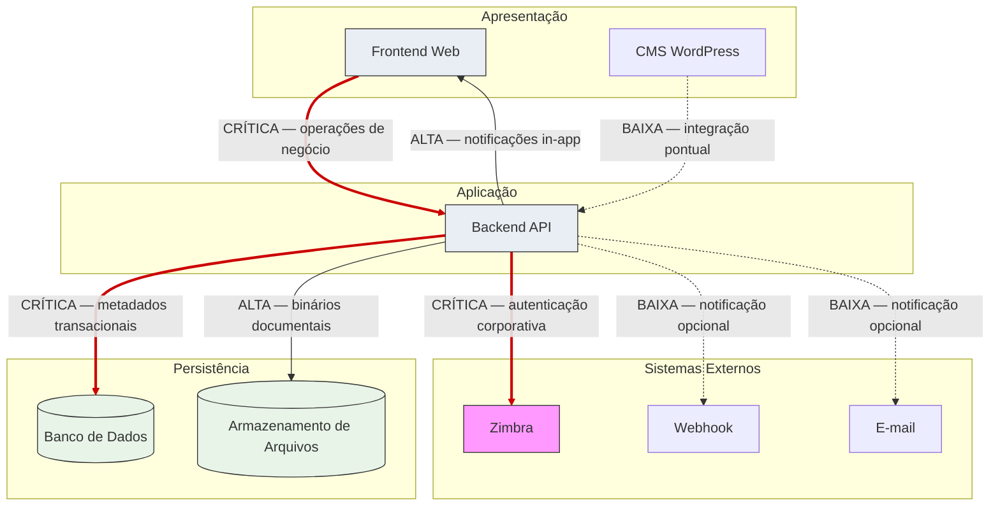

# Integration Contracts — Portal de Comunicação

## Objetivo

Este documento formaliza os **contratos arquiteturais de integração** da solução do Portal de Comunicação da Unimed Ceará. Modela responsabilidades, direção de fluxos, dados trafegados, restrições, criticidade, resiliência, segurança e observabilidade entre containers da solução e sistemas externos — em nível **conceitual**, sem definir endpoints reais, OpenAPI, schemas físicos, DTOs, classes ou código.

Consolida integrações referenciadas em `02-system-context.md`, `03-container-architecture.md`, `04-deployment-architecture.md` e `05-environment-strategy.md`, endereçando lacunas L-003, L-009 e L-010 de `10-target-architecture.md`.

**Rastreabilidade:** `docs/solution-design/01-solution-overview.md` a `05-environment-strategy.md`, `docs/architecture/08-decision-records.md`, `docs/architecture/09-risk-assessment.md`, `docs/architecture/10-target-architecture.md`.

---

# Princípios de Integração

Princípios transversais que regem todos os contratos da solução.

## Baixo acoplamento

Containers comunicam-se por **interfaces bem definidas** sem exposição de persistência interna. Frontend e WordPress consomem Backend exclusivamente por API; Backend é único consumidor do núcleo de persistência (ADR-004, ADR-006). Contextos internos do Backend referenciam-se por identificador de negócio, sem duplicar estado mutável (ADR-009).

## Contratos explícitos

Toda integração possui **origem, destino, finalidade, dados trafegados e restrições** documentados. Capacidades expostas ao Frontend devem possuir contrato correspondente no Backend — lacuna L-010 (endpoints órfãos, R-008) exige inventário e alinhamento antes da implementação completa.

## Versionamento

Contratos evoluem de forma **controlada** com compatibilidade retroativa entre ambientes de promoção. Alterações breaking exigem coordenação entre consumidor e provedor e validação em Dev e Hml antes de Prod.

## Resiliência

Integrações críticas possuem estratégia de **timeout, retry e fallback conceitual**. Canais opcionais degradam sem bloquear operação principal. Indisponibilidade do Zimbra não deve paralisar sessões já autenticadas até regras de expiração formalizadas (R-028).

## Observabilidade

Toda integração emite **sinais rastreáveis**: logs, métricas e correlação de requisições. Falhas de integração crítica geram alertas operacionais proporcionais ao ambiente.

## Segurança

Autenticação corporativa via Zimbra (ADR-003); **autorização efetiva exclusivamente no Backend** (ADR-005). Comunicação externa via TLS; credenciais segregadas por ambiente. Frontend não decide acesso a recursos.

## Idempotência

Operações de integração que alteram estado devem ser **idempotentes quando aplicável** — especialmente publicação documental coordenada (metadado + binário), concessão de permissão e entrega de notificações, para suportar retry seguro em falhas parciais.

## Rastreabilidade

Requisições entre Frontend e Backend devem ser **correlacionáveis** para diagnóstico. Eventos de governança (autenticação, permissões, alterações organizacionais) registrados pelo componente Auditoria (BR-005), complementados por logs técnicos de integração.

---

# Catálogo de Integrações

Inventário consolidado de todas as integrações da solução alvo.

| Integração | Origem | Destino | Tipo | Criticidade | Direção | Status |
| ---------- | ------ | ------- | ---- | ----------- | ------- | ------ |
| Operações de negócio | Frontend Web | Backend API | Síncrona — API REST/HTTPS | **Crítica** | Unidirecional (request/response) | ATIVO |
| Notificações in-app | Backend API | Frontend Web | Síncrona / streaming | Alta | Backend → Frontend | ATIVO (unificação pendente — L-009) |
| Conteúdo institucional pontual | CMS WordPress | Backend API | Síncrona — API REST/HTTPS | Baixa | Unidirecional | ATIVO — escopo a detalhar |
| Persistência transacional | Backend API | Banco de Dados | Síncrona — protocolo relacional | **Crítica** | Backend → Banco | ATIVO |
| Binários documentais | Backend API | Armazenamento de Arquivos | Síncrona — protocolo de objetos/arquivos | Alta | Backend → Armazenamento | ATIVO |
| Identidade corporativa | Backend API | Zimbra | Síncrona — autenticação corporativa | **Crítica** | Backend → Zimbra | ATIVO |
| Notificação externa (callback) | Backend API | Webhook | Assíncrona — HTTP/HTTPS | Baixa | Backend → Webhook | Opcional |
| Notificação por e-mail | Backend API | E-mail corporativo | Assíncrona — SMTP | Baixa | Backend → E-mail | Opcional |
| Observabilidade | Todos os containers | Observabilidade | Assíncrona — exportação de sinais | Média | Emissão unidirecional | ATIVO |
| Legado (transitório) | API Backend Legado | Backend API / Frontend | Síncrona — API REST | Alta | Bidirecional parcial | LEGADO — ADR-015 |

**Nota:** API Backend Legado permanece catalogada apenas durante fase de migração; **excluída** do estado alvo final (`09-migration-strategy.md`).

---

# Integração Frontend → Backend

Contrato principal da solução — **único canal** de operações de negócio para atores humanos.

## Objetivo

Permitir que o Frontend Web (camada de apresentação) **consuma capacidades de negócio** do Backend API para todos os fluxos de valor: autenticação, organização, documentos, acesso, comunicação, busca e notificações — sem acesso direto a persistência ou sistemas externos (ADR-002, ADR-006).

## Responsabilidades

| Parte | Responsabilidade |
| ----- | ---------------- |
| **Frontend (consumidor)** | Apresentar interface; encaminhar operações; manter estado de sessão no cliente; exibir resultados e erros; não decidir autorização efetiva |
| **Backend (provedor)** | Executar regras de negócio; autenticar (via Zimbra); autorizar; orquestrar persistência; retornar apenas dados permitidos ao solicitante |

### Capacidades contratuais (por domínio)

| Domínio | Operações lógicas | Bounded context |
| ------- | ----------------- | --------------- |
| Autenticação e sessão | Login, logout, refresh de sessão, contexto organizacional | Controle de Acesso |
| Organização | Consulta e gestão de singulares, áreas, equipes, vínculos, onboarding | Organização Corporativa |
| Documentos | Publicação, consulta, download, pastas, visibilidade, compartilhamento | Gestão Documental |
| Acesso | Papéis, permissões, solicitações, decisões | Controle de Acesso |
| Comunicação | Notificações in-app, busca unificada, comunicados | Comunicação Interna |
| Auditoria | Consulta de eventos de governança (escopo administrativo) | Controle de Acesso |

**Lacuna L-010:** capacidades referenciadas no Frontend sem contrato Backend correspondente devem ser inventariadas, implementadas ou removidas da interface (R-008).

## Dados Trafegados

| Categoria | Direção | Descrição conceitual |
| --------- | ------- | -------------------- |
| Credenciais de login | Frontend → Backend | E-mail corporativo e senha — encaminhados para validação no Zimbra; não persistidos de longo prazo |
| Token / credencial de sessão | Backend → Frontend | Mecanismo de sessão autenticada para requisições subsequentes |
| Metadados de apresentação | Backend → Frontend | Documentos, pastas, organização, notificações, resultados de busca — filtrados por autorização |
| Metadados de operação | Frontend → Backend | Dados de formulários, uploads, solicitações — validados no Backend |
| Binários documentais | Frontend → Backend → Armazenamento | Upload via Backend; Frontend **não** acessa armazenamento diretamente |
| Erros e status | Backend → Frontend | Códigos e mensagens de negócio; sem exposição de detalhes internos de infraestrutura |

## Dependências

| Dependência | Tipo | Impacto |
| ----------- | ---- | ------- |
| Backend API disponível | Obrigatória | Frontend inoperante para negócio sem Backend (R-017) |
| Banco de Dados (via Backend) | Indireta | Operações transacionais dependem de persistência |
| Zimbra (via Backend) | Indireta | Novos logins dependem de autenticação corporativa |
| Reverse Proxy | Infraestrutura | Entrada HTTPS; roteamento |

## Restrições

- Frontend **não** contém regras de negócio (ADR-006).
- Frontend **não** efetua decisão de autorização — guards de interface são informativos (ADR-005, R-031).
- Frontend **não** acessa Banco de Dados, Armazenamento de Arquivos ou Zimbra diretamente.
- Toda operação sensível revalidada no Backend independentemente do estado do cliente.
- Capacidades PARCIAL expostas devem ser identificadas — onboarding (OQ-001), solicitação de permissão (OQ-003), perfis externos (OQ-002).

## Riscos Relacionados

### R-001 — API Backend como ponto único de processamento

| Aspecto | Descrição |
| ------- | --------- |
| **Impacto na integração** | Indisponibilidade do Backend paralisa **todos** os fluxos Frontend → Backend; interface sem funcionalidade de negócio |
| **Mitigação contratual** | Monitoramento de saúde da integração; contrato de erro claro ao Frontend para indisponibilidade; sem atalhos de acesso direto a dados |

### R-002 — Banco de Dados como persistência central

| Aspecto | Descrição |
| ------- | --------- |
| **Impacto na integração** | Backend indisponível para operações transacionais quando Banco falha; Frontend recebe erro mesmo com Backend parcialmente ativo |
| **Mitigação contratual** | Backend deve sinalizar indisponibilidade de persistência; Frontend exibe estado degradado; operações read-only sem persistência **não** documentadas como alternativa |

---

# Integração WordPress → Backend

Integração **pontual e desacoplada** para conteúdo institucional complementar.

## Objetivo

Permitir que o CMS WordPress consuma **capacidades específicas** do Backend API quando conteúdo institucional necessitar de dados ou operações do núcleo do portal — sem acoplamento de persistência e sem participação em fluxos centrais de autorização documental (ADR-002).

## Responsabilidades

| Parte | Responsabilidade |
| ----- | ---------------- |
| **WordPress (consumidor)** | Gerenciar conteúdo editorial; invocar Backend apenas para integrações pontuais documentadas; manter persistência própria |
| **Backend (provedor)** | Expor operações de consulta ou integração pontual; aplicar autorização quando operação sensível; não expor persistência interna |

### Escopo contratual esperado (conceitual)

- Consulta de informações institucionais expostas pelo Backend para enriquecimento de páginas.
- Integrações futuras **somente** mediante registro neste catálogo e validação em Dev/Hml.

**Fora do escopo:** publicação documental governada, autorização de recursos, gestão organizacional, notificações in-app.

## Dados Trafegados

| Categoria | Direção | Descrição conceitual |
| --------- | ------- | -------------------- |
| Dados de consulta pontual | WordPress → Backend | Identificadores ou parâmetros de consulta institucional |
| Respostas de apresentação | Backend → WordPress | Dados autorizados para exibição editorial — sem metadados transacionais brutos |
| Credenciais de serviço | WordPress → Backend | Autenticação de integração servidor-a-servidor — segregada por ambiente |

WordPress **não** trafega binários documentais governados nem metadados de permissão.

## Dependências

| Dependência | Tipo | Impacto |
| ----------- | ---- | ------- |
| Backend API | Obrigatória quando integração habilitada | WordPress opera autonomamente para conteúdo puramente editorial |
| Banco WordPress | Próprio ao CMS | Independente do Banco do núcleo |
| Reverse Proxy | Infraestrutura | Entrega de conteúdo CMS |

## Restrições

- WordPress **não** acessa Banco de Dados do núcleo (ADR-004, ADR-006).
- WordPress **não** efetua decisão de autorização sobre recursos documentais.
- WordPress **não** participa de fluxos de compartilhamento ↔ autorização (L-003, ADR-008).
- Integração exclusivamente por API REST — sem acoplamento de entidades internas.

## Riscos Relacionados

### R-005 — Coexistência da API Backend Legado

| Aspecto | Descrição |
| ------- | --------- |
| **Impacto na integração** | Durante migração, WordPress ou consumidores legados podem referenciar rotas ou contratos duplicados; risco de inconsistência entre integração alvo e legado |
| **Mitigação contratual** | WordPress deve consumir **exclusivamente** Backend API alvo; rotas legadas não fazem parte do contrato deste documento; descomissionamento em `09-migration-strategy.md` |

### R-006 — Dois subsistemas de notificação

| Aspecto | Descrição |
| ------- | --------- |
| **Impacto na integração** | Se WordPress disparar eventos que geram notificações no Backend, subsistemas paralelos podem duplicar entrega ou persistência (L-009) |
| **Mitigação contratual** | WordPress **não** emite notificações in-app diretamente; eventos de integração pontual não devem acionar subsistema legado de notificação; unificação pendente no Backend (ADR-012) |

---

# Integração Backend → Banco de Dados

Contrato de **persistência transacional** do núcleo da solução.

## Objetivo

Permitir que o Backend API persista e recupere **metadados transacionais** de todos os bounded contexts — organização, documentos, acesso, comunicação, auditoria e sessão — como fonte de verdade exclusiva do portal (ADR-004, ADR-007).

## Responsabilidades

| Parte | Responsabilidade |
| ----- | ---------------- |
| **Backend (consumidor)** | Leitura e escrita transacional; garantir consistência intra-aggregate; orquestrar transações de negócio |
| **Banco de Dados (provedor)** | Armazenar metadados; garantir integridade transacional; servir exclusivamente o Backend |

### Ownership lógico de dados persistidos

| Categoria | Owner no Backend |
| --------- | ---------------- |
| Estrutura organizacional, vínculos | Organização Corporativa |
| Documentos (metadados), pastas, visibilidade, compartilhamento | Gestão Documental |
| Papéis, sessão, permissões, solicitações, auditoria | Controle de Acesso |
| Notificações in-app | Comunicação Interna |
| Configuração institucional | Transversal |

## Dados Trafegados

| Categoria | Descrição conceitual |
| --------- | -------------------- |
| Metadados organizacionais | Singulares, áreas, equipes, colaboradores, vínculos, contexto |
| Metadados documentais | Documentos, pastas, visibilidade, compartilhamento, referências a binários |
| Metadados de acesso | Papéis, permissões efetivas, solicitações, sessão |
| Notificações | Estado de notificações in-app |
| Auditoria | Eventos de governança (catálogo em aberto — OQ-019) |
| Referências | Identificadores de negócio entre aggregates (ADR-009) — **sem** binários |

## Dependências

| Dependência | Tipo | Impacto |
| ----------- | ---- | ------- |
| Volume persistente por ambiente | Infraestrutura | Isolamento ADR-011 |
| Backend API | Consumidor exclusivo | Nenhum outro container acessa o Banco do núcleo |

## Restrições

- Acesso **exclusivo** pelo Backend API — Frontend, WordPress e sistemas externos **proibidos**.
- Binários documentais **não** persistidos no Banco (ADR-004).
- Persistência isolada por ambiente (local, dev, hml, prod).
- Consistência forte intra-aggregate; eventual inter-aggregate mediada por eventos (ADR-010).
- Entidades de capacidades PARCIAL podem não possuir persistência confirmada (R-016).

## Riscos Relacionados

### R-002 — Banco de Dados como persistência central

| Aspecto | Descrição |
| ------- | --------- |
| **Impacto na integração** | Indisponibilidade impede autenticação, autorização, organização e toda operação transacional |
| **Mitigação contratual** | Prioridade de recuperação 1; backup periódico; Backend deve falhar de forma explícita quando persistência indisponível |

### R-004 — Inconsistência metadado/binário

| Aspecto | Descrição |
| ------- | --------- |
| **Impacto na integração** | Metadado persistido no Banco sem binário correspondente no Armazenamento gera documento inacessível |
| **Mitigação contratual** | Publicação documental como operação coordenada com atomicidade lógica; referência a binário somente após confirmação de armazenamento; procedimento de reconciliação |

---

# Integração Backend → Armazenamento de Arquivos

Contrato de **persistência de binários documentais**.

## Objetivo

Permitir que o Backend API armazene e recupere **binários de documentos** publicados via Gestão Documental, referenciados por metadados no Banco de Dados (ADR-004).

## Responsabilidades

| Parte | Responsabilidade |
| ----- | ---------------- |
| **Backend (consumidor)** | Upload, download autorizado, reconciliação com metadados, aplicação de quotas (BR-023) |
| **Armazenamento (provedor)** | Persistir binários; disponibilizar para recuperação; suportar crescimento de volume |

## Dados Trafegados

| Categoria | Direção | Descrição conceitual |
| --------- | ------- | -------------------- |
| Binários documentais | Backend → Armazenamento | Conteúdo de documentos publicados |
| Binários recuperados | Armazenamento → Backend | Download após autorização |
| Referências lógicas | Backend ↔ Banco (paralelo) | Identificador de negócio ligando metadado a binário |
| Metadados de armazenamento | Backend → Banco | Localização lógica, tamanho, checksum quando aplicável |

Armazenamento **não** recebe metadados de negócio (visibilidade, compartilhamento, permissões).

## Dependências

| Dependência | Tipo | Impacto |
| ----------- | ---- | ------- |
| Banco de Dados | Coordenação | Referência metadado ↔ binário |
| Backend API | Consumidor exclusivo | Sem acesso direto por Frontend ou WordPress |
| Volume persistente por ambiente | Infraestrutura | Isolamento ADR-011 |

## Restrições

- Acesso **exclusivo** pelo Backend após autorização validada.
- Publicação coordenada — binário não exposto sem validação de escopo e quota.
- Download somente após decisão de autorização no Backend (ADR-005).
- Frontend recebe binário **via Backend** — nunca diretamente do Armazenamento.

## Riscos Relacionados

### R-004 — Inconsistência metadado/binário

| Aspecto | Descrição |
| ------- | --------- |
| **Impacto na integração** | Falha parcial no armazenamento após persistência de metadado — ou inverso — gera estado inconsistente |
| **Mitigação contratual** | Ordem de operação definida na publicação; compensação em falha; reconciliação periódica; idempotência em retry de upload |

### R-029 — Crescimento de binários sem política global

| Aspecto | Descrição |
| ------- | --------- |
| **Impacto na integração** | Volume documental cresce continuamente; armazenamento como gargalo de longo prazo |
| **Mitigação contratual** | Quotas por colaborador (BR-023); monitoramento de utilização; alertas de capacidade em Hml e Prod |

---

# Integração Backend → Zimbra

Contrato de **identidade corporativa** — dependência externa crítica.

## Objetivo

Validar credenciais de e-mail corporativo de colaboradores da Unimed Ceará, permitindo que o Backend estabeleça sessão autenticada e associe contexto organizacional — **sem provisionar identidade** no portal (ADR-003, BR-025, BR-026).

## Responsabilidades

| Parte | Responsabilidade |
| ----- | ---------------- |
| **Backend (consumidor)** | Encaminhar credenciais para validação; interpretar resultado; estabelecer sessão; **não** armazenar senhas corporativas de longo prazo |
| **Zimbra (provedor)** | Validar identidade de e-mail corporativo; confirmar ou rejeitar autenticação |

## Dados Trafegados

| Categoria | Direção | Descrição conceitual |
| --------- | ------- | -------------------- |
| Credenciais de autenticação | Backend → Zimbra | E-mail corporativo e senha — trânsito seguro |
| Resultado de validação | Zimbra → Backend | Sucesso ou falha — sem transferência de estado organizacional |
| Identificador de e-mail | Backend (interno) | Referência à identidade validada — vínculo organizacional resolvido no portal |

Portal **não** trafega metadados documentais, permissões ou binários com o Zimbra.

## Dependências

| Dependência | Tipo | Impacto |
| ----------- | ---- | ------- |
| Disponibilidade do Zimbra | Externa crítica | Novos logins bloqueados quando indisponível |
| Banco de Dados | Interna | Sessão e vínculo persistidos após autenticação bem-sucedida |
| Rede corporativa / Internet | Infraestrutura | Conforme topologia de deployment |

## Restrições

- Zimbra é **única** fonte de identidade corporativa documentada — sem LDAP, AD ou SSO alternativo (ADR-003).
- Backend **não** provisiona contas de e-mail.
- Perfis externos (parceiro, convidado) podem requerer modelo distinto — pendente (OQ-002, R-019).
- Comunicação em canal seguro conforme política corporativa.

## Comportamento por Ambiente

| Ambiente | Tier | Comportamento contratual |
| -------- | ---- | ------------------------ |
| **Local** | Simulação / mock | Validação de fluxo de autenticação sem dependência do serviço corporativo; contrato de resposta equivalente (sucesso/falha) |
| **Dev** | Teste | Instância ou endpoint de teste; autenticação real contra ambiente de validação |
| **Hml** | Pré-produção | Paridade comportamental com Prod; gate de homologação de login |
| **Prod** | Corporativo | Zimbra institucional obrigatório; indisponibilidade bloqueia novos acessos |

## Riscos Relacionados

### R-003 — Dependência única do Zimbra

| Aspecto | Descrição |
| ------- | --------- |
| **Impacto na integração** | Indisponibilidade impossibilita novos logins; sem alternativa documentada |
| **Mitigação contratual** | Monitoramento da integração; comunicação operacional com gestão de e-mail; escalação institucional em Prod |

### R-028 — Comportamento de sessão ativa sem Zimbra ambíguo

| Aspecto | Descrição |
| ------- | --------- |
| **Impacto na integração** | Colaboradores com sessão ativa podem continuar operando durante indisponibilidade do Zimbra — regras de expiração e revalidação não formalizadas |
| **Mitigação contratual** | Definir contrato de sessão: duração, refresh e comportamento em indisponibilidade prolongada; documentar em `08-security-architecture.md` |

---

# Integração Backend → Webhook

Canal **opcional** de entrega de notificações a sistemas destino.

## Objetivo

Permitir que o Backend encaminhe **notificações de eventos** a endpoint HTTP/HTTPS configurado por destinatário ou política institucional — como canal complementar à entrega in-app (ADR-012).

## Responsabilidades

| Parte | Responsabilidade |
| ----- | ---------------- |
| **Backend (emissor)** | Formatar payload de notificação; invocar callback; registrar sucesso/falha; não bloquear fluxo principal em falha |
| **Webhook (receptor)** | Receber e processar notificação; responder conforme contrato acordado |

## Dados Trafegados

| Categoria | Direção | Descrição conceitual |
| --------- | ------- | -------------------- |
| Evento de notificação | Backend → Webhook | Identificador de evento, destinatário lógico, conteúdo resumido — **sem** dados confidenciais além do necessário |
| Confirmação de recebimento | Webhook → Backend | Status HTTP — quando aplicável |
| Configuração de destino | Banco (via Backend) | URL e parâmetros de integração — segregados por ambiente |

## Dependências

| Dependência | Tipo | Impacto |
| ----------- | ---- | ------- |
| Gestão de Notificações (Backend) | Interna | Emissão após persistência in-app |
| Conectividade HTTP externa | Infraestrutura | Best-effort |
| Banco de Dados | Interna | Configuração de destinos |

## Restrições

- Canal **opcional** — indisponibilidade não bloqueia operação principal (R-032).
- Notificação in-app permanece **canal primário** (ADR-012).
- Payload deve respeitar confidencialidade (BR-004).
- Credenciais de callback segregadas por ambiente.

## Comportamento por Ambiente

| Ambiente | Status | Comportamento |
| -------- | ------ | ------------- |
| **Local** | Desabilitado | Sem invocação externa |
| **Dev** | Opcional | Endpoint de teste; validação de formato |
| **Hml** | Opcional | Validação de entrega em pré-produção |
| **Prod** | Conforme política | Best-effort; falha silenciosa aceitável com registro em log |

## Riscos Relacionados

### R-032 — Indisponibilidade de canais opcionais

| Aspecto | Descrição |
| ------- | --------- |
| **Impacto na integração** | Webhook indisponível — notificação externa não entregue; in-app preservado |
| **Mitigação contratual** | Retry limitado; registro de falha; sem propagação de erro ao ator; monitoramento de taxa de falha |

---

# Integração Backend → E-mail

Canal **opcional** de notificação por e-mail corporativo.

## Objetivo

Permitir que o Backend encaminhe **notificações por e-mail** a destinatários configurados — canal alternativo complementar à entrega in-app (ADR-012).

## Responsabilidades

| Parte | Responsabilidade |
| ----- | ---------------- |
| **Backend (emissor)** | Compor mensagem; encaminhar via SMTP; registrar entrega ou falha |
| **E-mail corporativo (provedor)** | Entregar mensagem ao destinatário |

## Dados Trafegados

| Categoria | Direção | Descrição conceitual |
| --------- | ------- | -------------------- |
| Mensagem de notificação | Backend → E-mail | Destinatário, assunto, corpo — conteúdo proporcional ao evento |
| Confirmação de envio | E-mail → Backend | Status de entrega — quando disponível |
| Configuração SMTP | Segredos por ambiente | Credenciais de relay — não versionadas |

## Dependências

| Dependência | Tipo | Impacto |
| ----------- | ---- | ------- |
| Gestão de Notificações (Backend) | Interna | Emissão após persistência in-app |
| Servidor SMTP / relay corporativo | Externa | Best-effort |
| Zimbra (indireta) | Referência | Endereços de destinatário corporativos |

## Restrições

- Canal **opcional** — não bloqueia operação principal (R-032).
- In-app permanece primário (ADR-012).
- Conteúdo confidencial sujeito a política de e-mail institucional (BR-004).
- Backend **não** substitui Zimbra na gestão de identidade.

## Comportamento por Ambiente

| Ambiente | Status | Comportamento |
| -------- | ------ | ------------- |
| **Local** | Desabilitado | Sem envio real |
| **Dev** | Opcional | Sandbox ou relay de teste |
| **Hml** | Opcional | Validação de templates e entrega |
| **Prod** | Conforme política | Envio real conforme configuração institucional |

## Riscos Relacionados

### R-032 — Indisponibilidade de canais opcionais

| Aspecto | Descrição |
| ------- | --------- |
| **Impacto na integração** | E-mail indisponível — notificação por canal alternativo não entregue; in-app preservado |
| **Mitigação contratual** | Retry limitado; fila ou descarte com log; monitoramento de falhas; sem impacto em fluxos transacionais |

---

# Contratos de Dados

Modelagem **conceitual** dos agregados e informações trafegadas nas integrações. Sem schemas físicos, DTOs ou tabelas.

## Identidade

| Aspecto | Definição conceitual |
| ------- | -------------------- |
| **Owner** | Zimbra (identidade de e-mail); Backend mantém referência e sessão |
| **Conteúdo** | E-mail corporativo validado; identificador interno de colaborador; estado de sessão |
| **Fronteira** | Portal não provisiona contas; autenticação via Zimbra; perfis externos pendentes (OQ-002) |
| **Integrações** | Frontend → Backend → Zimbra; sessão persistida Backend → Banco |

## Organização

| Aspecto | Definição conceitual |
| ------- | -------------------- |
| **Owner** | Organização Corporativa (upstream — ADR-013) |
| **Conteúdo** | Singulares, áreas, equipes, colaboradores, vínculos, contexto organizacional ativo |
| **Fronteira** | Referenciado por identificador por demais contextos (ADR-009); pré-requisito de operação (BR-010, BR-011) |
| **Integrações** | Frontend → Backend → Banco |

## Documentos

| Aspecto | Definição conceitual |
| ------- | -------------------- |
| **Owner metadados** | Gestão Documental |
| **Owner binários** | Gestão Documental (via Armazenamento) |
| **Conteúdo** | Metadados: documento, pasta, visibilidade, compartilhamento (audiência), referência a binário. Binário: conteúdo documental |
| **Fronteira** | Compartilhamento ≠ autorização efetiva (ADR-008, L-003, OQ-005); metadado no Banco, binário no Armazenamento (ADR-004) |
| **Integrações** | Frontend → Backend → Banco + Armazenamento |

## Permissões

| Aspecto | Definição conceitual |
| ------- | -------------------- |
| **Owner** | Controle de Acesso |
| **Conteúdo** | Papéis por escopo, permissões efetivas, solicitações, decisões, estado de concessão/negação |
| **Fronteira** | Integração obrigatória com compartilhamento documental (L-003); revogação pendente (OQ-006, OQ-017, R-011); solicitação PARCIAL (OQ-003, R-010) |
| **Integrações** | Frontend → Backend → Banco; alinhamento interno Gestão Documental ↔ Controle de Acesso |

## Notificações

| Aspecto | Definição conceitual |
| ------- | -------------------- |
| **Owner** | Comunicação Interna (ADR-012) |
| **Conteúdo** | Notificação in-app: destinatário, evento, estado de leitura, timestamp |
| **Fronteira** | Estado alvo: subsistema unificado (L-009, R-006); canais externos opcionais |
| **Integrações** | Backend → Banco (persistência); Backend → Frontend (entrega); Backend → Webhook/E-mail (opcional) |

## Auditoria

| Aspecto | Definição conceitual |
| ------- | -------------------- |
| **Owner** | Controle de Acesso |
| **Conteúdo** | Eventos de governança: autenticação, papéis, solicitações, concessões, negações, alterações organizacionais |
| **Fronteira** | Catálogo fechado pendente (OQ-019, L-015); complementar a logs técnicos de integração |
| **Integrações** | Backend → Banco; consulta Frontend → Backend (escopo administrativo) |

---

# Estratégia de Versionamento

Governança de evolução dos contratos de integração.

## Versionamento de APIs

- Contratos Frontend ↔ Backend e WordPress ↔ Backend expõem **versão lógica** identificável (major/minor conceitual).
- Versão major: alteração breaking — remoção ou mudança semântica de operação.
- Versão minor: extensão compatível — novos campos opcionais ou novas operações.
- Backend é **provedor**; Frontend e WordPress são consumidores dependentes.

## Compatibilidade

- Ambientes de promoção exigem **compatibilidade** entre versão do consumidor e provedor.
- Dev e Hml validam compatibilidade antes de Prod.
- Integrações internas Backend → Banco/Armazenamento evoluem com migrações de schema na Implementation — fora do escopo deste documento.

## Evolução de contratos

| Tipo de mudança | Processo |
| --------------- | -------- |
| Extensão compatível | Deploy Backend primeiro; Frontend consome quando disponível |
| Alteração breaking | Coordenação explícita; depreciação documentada; validação em Hml |
| Nova integração externa | Registro neste catálogo; novo ADR se alterar topologia |
| Lacuna L-010 | Inventário → implementação ou remoção de expectativa no Frontend |

## Descontinuação

- Operações obsoletas passam por período de **depreciação** antes de remoção.
- API Backend Legado descontinuada conforme `09-migration-strategy.md` — contratos legados não evoluem.
- Canais opcionais podem ser desabilitados por ambiente sem impacto no núcleo.

## Backward compatibility

- Prod **nunca** recebe consumidor incompatible com Backend implantado.
- Frontend em Prod deve operar com Backend de mesma versão promovida de Hml.
- Campos adicionais em respostas ignorados por consumidores antigos quando possível.

---

# Estratégia de Resiliência

Padrões conceituais de tolerância a falhas — sem tecnologia específica.

## Timeout

| Integração | Expectativa conceitual |
| ---------- | ---------------------- |
| Frontend → Backend | Timeout proporcional à operação; operações longas (upload) com limite estendido |
| Backend → Banco | Timeout curto — falha rápida em indisponibilidade |
| Backend → Armazenamento | Timeout estendido para transferência de binários |
| Backend → Zimbra | Timeout moderado — autenticação crítica; falha explícita ao Frontend |
| Backend → Webhook / E-mail | Timeout curto — canal opcional |

## Retry

| Integração | Política conceitual |
| ---------- | ------------------- |
| Frontend → Backend | Retry limitado para erros transitórios; idempotência em operações seguras |
| Backend → Banco / Armazenamento | Retry em falha transitória; compensação em publicação documental |
| Backend → Zimbra | Retry limitado; sem retry infinito em credenciais inválidas |
| Backend → Webhook / E-mail | Retry com backoff; descarte após limite com registro |

## Circuit Breaker (conceitual)

- Proteção contra cascata quando integração externa crítica (Zimbra) ou persistência falha repetidamente.
- Estado aberto: falha rápida sem sobrecarga; sessões ativas podem continuar conforme R-028.
- Estado half-open: tentativa de recuperação periódica.
- Aplicável prioritariamente a Backend → Zimbra e Backend → Banco.

## Fallback

| Integração | Fallback conceitual |
| ---------- | ------------------- |
| Backend → Zimbra | Nenhum para novos logins; sessões ativas temporariamente |
| Backend → Webhook / E-mail | Degradação silenciosa; in-app preservado |
| Backend → Armazenamento | Erro explícito; metadado não confirmado sem binário |
| Frontend → Backend | Mensagem de indisponibilidade ao ator |

## Monitoramento

- Taxa de timeout, retry e falha por integração.
- Alertas em integrações críticas (Frontend → Backend, Backend → Banco, Backend → Zimbra).
- Dashboard de saúde de integrações por ambiente.

---

# Estratégia de Segurança

Segurança das integrações alinhada aos ADRs existentes.

## Autenticação

- Colaboradores: credenciais validadas no Zimbra via Backend (ADR-003).
- Frontend → Backend: sessão autenticada após login bem-sucedido; credencial em requisições subsequentes.
- WordPress → Backend: autenticação de serviço (credencial segregada por ambiente).
- Backend → Zimbra / SMTP: credenciais de integração em secrets.

## Autorização

- **Toda decisão efetiva de acesso** no Backend (ADR-005).
- Frontend e WordPress recebem apenas dados autorizados.
- Busca unificada filtrada por Autorização antes da entrega (ADR-014).
- Compartilhamento e Autorização coordenados — fronteira sensível (ADR-008, L-003).

## TLS

- Comunicação externa (Usuários → Portal, Backend → Webhook) via HTTPS/TLS.
- Comunicação interna criptografada preferencialmente em Hml e Prod.
- Terminação TLS no Reverse Proxy na fronteira Internet → Portal.

## Segregação de credenciais

- Secrets exclusivos por ambiente (ADR-011).
- Credenciais de Prod **nunca** reutilizadas em Local, Dev ou Hml.
- Rotação periódica de credenciais de integração.

## Proteção de dados

- Conteúdo confidencial (BR-004) trafega apenas por canais autorizados.
- Binários e metadados sensíveis não expostos em logs de integração.
- Payload de Webhook/E-mail minimizado ao necessário.

## Auditoria

- Eventos de governança no Backend → Banco (BR-005).
- Logs técnicos de integração: autenticação, falhas, tentativas de acesso.
- Catálogo de eventos auditáveis pendente (OQ-019).

---

# Estratégia de Observabilidade

Sinais operacionais das integrações.

## Logs de integração

| Integração | Eventos registrados |
| ---------- | ------------------- |
| Frontend → Backend | Requisições, erros, latência, identificador de correlação |
| WordPress → Backend | Invocações pontuais, falhas |
| Backend → Banco / Armazenamento | Operações, erros de conexão, timeouts |
| Backend → Zimbra | Tentativas de autenticação (sem senha), falhas, latência |
| Backend → Webhook / E-mail | Envios, falhas, retries |

## Métricas

- Disponibilidade e latência por integração.
- Taxa de erro Frontend → Backend.
- Taxa de falha de autenticação Zimbra.
- Volume de operações transacionais Backend → Banco.
- Taxa de falha Webhook/E-mail (R-032).
- Incidentes metadado/binário (R-004).

## Alertas

| Condição | Severidade |
| -------- | ---------- |
| Backend indisponível para Frontend | Crítica (R-001) |
| Banco indisponível | Crítica (R-002) |
| Zimbra indisponível | Crítica — novos logins (R-003) |
| Taxa de erro elevada Frontend → Backend | Alta |
| Falha persistente Webhook/E-mail | Baixa |

## Rastreabilidade

- Identificador de correlação propagado Frontend → Backend em requisições.
- Eventos de negócio rastreáveis ao identificador de sessão e colaborador.
- Auditoria de governança consultável por administradores.

## Correlação de requisições

- Mesmo identificador de correlação atravessa Frontend → Backend → Banco/Armazenamento/Zimbra quando aplicável.
- Facilita diagnóstico de incidentes em cadeia de integração.

---

# Matriz de Criticidade

Classificação consolidada com justificativa.

| Integração | Criticidade | Justificativa |
| ---------- | ----------- | ------------- |
| **Frontend → Backend** | **Crítica** | Único canal de operações de negócio para atores; indisponibilidade paralisa portal (R-001, R-017) |
| **Backend → Banco de Dados** | **Crítica** | Persistência central de metadados, sessão, permissões e organização; portal inoperante sem banco (R-002) |
| **Backend → Armazenamento de Arquivos** | **Alta** | Publicação e download bloqueados sem armazenamento; consulta de metadados pode parcialmente continuar (R-004) |
| **Backend → Zimbra** | **Crítica** | Única fonte de identidade corporativa; novos logins impossíveis sem Zimbra (R-003) |
| **Backend → Webhook** | **Baixa** | Canal opcional; in-app preservado; falha silenciosa aceitável (R-032) |
| **Backend → E-mail** | **Baixa** | Canal opcional complementar; não bloqueia operação principal (R-032, ADR-012) |
| **WordPress → Backend** | **Baixa** | CMS complementar ao núcleo; conteúdo editorial opera autonomamente |
| **Backend → Frontend (notificações)** | **Alta** | Canal primário de entrega in-app; degrada experiência sem entrega, mas núcleo transacional preservado |

---

# Diagrama de Integrações

Visão consolidada de fluxos, criticidade e dependências.



**Legenda:** linha contínua — integração obrigatória; linha tracejada — opcional. Espessura/cor destacada — criticidade Crítica. API Backend Legado **ausente** do estado alvo.

### Dependências estruturais

```text
Frontend ──(depende)──→ Backend ──(depende)──→ Banco de Dados
                              ├──→ Armazenamento de Arquivos
                              └──→ Zimbra

WordPress ──(opcional)──→ Backend

Backend ──(opcional)──→ Webhook / E-mail
```

---

# Dependências para Próximos Artefatos

Como este documento alimenta artefatos subsequentes.

## `07-data-ownership.md`

- Contratos de Dados (Identidade, Organização, Documentos, Permissões, Notificações, Auditoria) como base de ownership.
- Separação metadado (Banco) × binário (Armazenamento) nos contratos de Documentos.
- Fronteira Banco WordPress (CMS) vs. Banco do núcleo — WordPress fora do ownership do portal.
- Referência por identificador entre aggregates (ADR-009) materializada nos contratos.
- Lacunas R-016 (persistência não confirmada) e L-003 (compartilhamento ↔ autorização).

## `08-security-architecture.md`

- Estratégia de Segurança das integrações: autenticação Zimbra, autorização Backend, TLS, secrets.
- Comportamento de sessão durante indisponibilidade do Zimbra (R-028).
- Fronteira sensível compartilhamento ↔ autorização (L-003, ADR-008).
- Proteção de dados em trânsito e em repouso por integração.
- Auditoria de governança vs. logs técnicos.
- Perfis externos e contratos de identidade pendentes (OQ-002).

## `09-migration-strategy.md`

- Catálogo inclui integração legada transitória (ADR-015, R-005).
- Contratos alvo vs. contratos legados — paridade de rotas para descomissionamento.
- Unificação de subsistemas de notificação (L-009, R-006) impactando contratos Backend → Frontend e canais externos.
- Resolução de endpoints órfãos (L-010, R-008) como pré-requisito de migração completa.
- Validação de contratos por ambiente na sequência Dev → Hml → Prod.
- Mecanismos de autenticação duplicados (R-013) eliminados com descomissionamento do legado.

---

# Conclusão

Os contratos arquiteturais de integração do Portal de Comunicação estabelecem **Frontend → Backend** e **Backend → Banco de Dados** e **Backend → Zimbra** como integrações **críticas** — eixo de todo fluxo de valor da solução. **Backend → Armazenamento de Arquivos** e entrega in-app são **altas**; **WordPress → Backend**, **Webhook** e **E-mail** são **baixas** ou opcionais, com degradação aceitável.

Os princípios de **baixo acoplamento, contratos explícitos, versionamento, resiliência, observabilidade, segurança, idempotência e rastreabilidade** governam a evolução controlada das integrações, materializando ADR-002 a ADR-006, ADR-008, ADR-012 e ADR-014.

Lacunas **L-003** (compartilhamento ↔ autorização), **L-009** (notificações duplicadas) e **L-010** (endpoints órfãos) condicionam completude dos contratos e devem ser endereçadas antes da implementação plena. A coexistência provisória do legado (ADR-015) permanece fora do estado alvo, catalogada apenas para orientar `09-migration-strategy.md`.

Este documento não define endpoints, OpenAPI, schemas físicos ou código. Estabelece a **base contratual conceitual** para `07-data-ownership.md`, `08-security-architecture.md` e `09-migration-strategy.md`.

---

## Fontes Utilizadas

| Fonte | Uso |
| ----- | --- |
| `docs/solution-design/02-system-context.md` | Atores, fluxos, sistemas externos, lacunas |
| `docs/solution-design/03-container-architecture.md` | Comunicação entre containers, protocolos lógicos |
| `docs/solution-design/04-deployment-architecture.md` | Zonas, rede, segurança de integração |
| `docs/solution-design/05-environment-strategy.md` | Comportamento por ambiente (Zimbra, Webhook, E-mail) |
| `docs/architecture/08-decision-records.md` | ADR-002 a ADR-006, ADR-008, ADR-012, ADR-014, ADR-015 |
| `docs/architecture/09-risk-assessment.md` | R-001 a R-004, R-005, R-006, R-008, R-010, R-028, R-029, R-032 |
| `docs/architecture/10-target-architecture.md` | Lacunas L-003, L-009, L-010 |
| `.cursor/rules/process/solution-design-phase.mdc` | Governança da camada |
| `.cursor/rules/architecture/component-modeling.mdc` | Capacidades de negócio vs. implementação |

*Nenhum endpoint, OpenAPI, Swagger, classe, DTO, schema físico, SQL ou YAML foi produzido para a construção deste artefato.*

---

## Nível de Confiança

**Médio-Alto**

| Faixa | Escopo |
| ----- | ------ |
| Alto | Integrações críticas, catálogo, princípios, matriz de criticidade, contratos de dados do núcleo |
| Médio | Escopo exato WordPress → Backend; sessão sem Zimbra (R-028); capacidades PARCIAL e lacunas L-003, L-009, L-010 |
