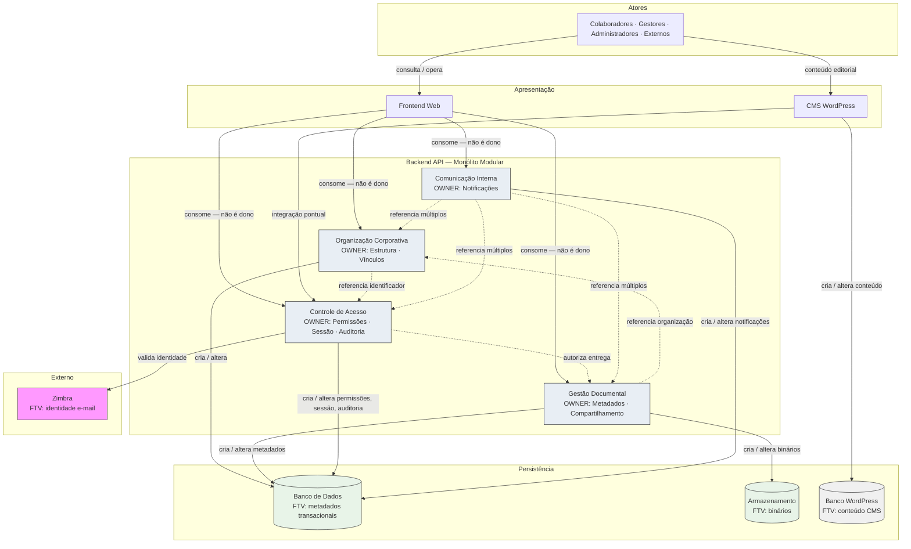

# Data Ownership — Portal de Comunicação

## Objetivo

Este documento formaliza a **propriedade dos dados (data ownership)** da solução do Portal de Comunicação da Unimed Ceará. Estabelece quem é responsável por cada domínio de dados, onde reside a fonte da verdade, quem pode ler e alterar informações, e como os dados evoluem ao longo do ciclo de vida — em nível **conceitual e arquitetural**, sem definir modelo físico, tabelas, schemas, entidades de implementação, DTOs ou endpoints.

Consolida ownership derivado dos bounded contexts, contratos de `06-integration-contracts.md`, estratégia de persistência de `03-container-architecture.md` e regras de negócio documentadas (BR-004, BR-005, BR-006, BR-023), materializando ADR-004, ADR-008, ADR-009, ADR-010 e ADR-013.

**Rastreabilidade:** `docs/solution-design/01-solution-overview.md` a `06-integration-contracts.md`, `docs/architecture/08-decision-records.md`, `docs/architecture/09-risk-assessment.md`, `docs/architecture/10-target-architecture.md`.

---

# Princípios de Ownership

Princípios transversais que regem a propriedade de dados em toda a solução.

## Fonte única da verdade

Cada domínio de dados possui **um único owner lógico** responsável pela integridade e evolução do estado. Contextos consumidores referenciam dados por identificador de negócio, sem duplicar estado mutável (ADR-009, BR-006). Réplicas, caches ou projeções não substituem a fonte de verdade.

## Consistência

Consistência **forte** dentro de cada aggregate; consistência **eventual** entre aggregates de contextos distintos, mediada por eventos de domínio (ADR-010). Operações que cruzam fronteiras de ownership coordenam-se pelo Backend API sem violar limites de aggregate.

## Rastreabilidade

Alterações relevantes em dados de governança devem ser **identificáveis**: quem alterou, quando e em qual escopo. Auditoria de negócio complementa logs técnicos (BR-005). Promoções entre ambientes preservam rastreabilidade de versão da solução.

## Menor privilégio

Leitura e escrita concedidas ao **mínimo necessário** por consumidor. Frontend e WordPress não acessam persistência diretamente; Backend aplica autorização antes de expor ou alterar dados (ADR-005, ADR-006).

## Responsabilidade explícita

Todo domínio de dados possui **owner nomeado** (bounded context / módulo lógico) com autoridade de alteração documentada. Ambiguidade de ownership é lacuna arquitetural — ex.: comunicados (OQ-004, R-018) permanecem fora deste catálogo até decisão formal.

## Governança

Alterações em dados sensíveis ou estruturais seguem **controle proporcional à classificação**: metadados confidenciais e permissões exigem trilha de auditoria; conteúdo público segue regras de visibilidade documentadas.

## Isolamento

Persistência **segregada por ambiente** (ADR-011). Dados de produção não compartilham repositório com ambientes inferiores. Banco do núcleo, Armazenamento de Arquivos e Banco WordPress são repositórios **logicamente separados**.

## Auditoria

Eventos de governança registrados pelo owner de Auditoria (Controle de Acesso). Catálogo fechado de eventos obrigatórios pendente (OQ-019, L-015). Auditoria **não substitui** logs técnicos de infraestrutura.

---

# Catálogo de Domínios de Dados

Inventário consolidado dos domínios de dados da solução alvo.

| Domínio | Responsável (Owner) | Consumidores | Criticidade | Sensibilidade | Fonte da Verdade |
| ------- | ------------------- | ------------ | ----------- | ------------- | ---------------- |
| Identidade | Zimbra (externo) + Controle de Acesso (sessão) | Organização Corporativa, Gestão Documental, Comunicação Interna, Frontend | Crítica | Confidencial | Zimbra (e-mail); Backend/Banco (sessão e referência) |
| Estrutura Organizacional | Organização Corporativa | Gestão Documental, Controle de Acesso, Comunicação Interna | Crítica | Restrita | Banco de Dados (núcleo) |
| Usuários e Perfis | Organização Corporativa + Controle de Acesso | Gestão Documental, Comunicação Interna, Frontend | Alta | Restrita / Confidencial | Banco de Dados (núcleo) |
| Permissões | Controle de Acesso | Gestão Documental, Comunicação Interna, Frontend | Crítica | Confidencial | Banco de Dados (núcleo) |
| Documentos (metadados) | Gestão Documental | Controle de Acesso, Comunicação Interna, Frontend | Crítica | Restrita / Confidencial | Banco de Dados (núcleo) |
| Arquivos Binários | Gestão Documental | Controle de Acesso (via entrega), Frontend (via Backend) | Alta | Confidencial | Armazenamento de Arquivos |
| Notificações | Comunicação Interna | Frontend, canais opcionais | Alta | Interna / Restrita | Banco de Dados (núcleo) |
| Auditoria | Controle de Acesso | Administradores (via Frontend) | Alta | Confidencial | Banco de Dados (núcleo) |
| Conteúdo Institucional | CMS WordPress | Atores (via Frontend/Proxy), Backend (pontual) | Média | Pública / Interna | Banco WordPress (CMS) |
| Configuração Institucional | Transversal (Backend) | Todos os módulos | Média | Interna | Banco de Dados (núcleo) |

---

# Identidade

Dados que vinculam colaboradores à credencial corporativa e ao estado de sessão no portal.

## Responsável

| Aspecto | Owner |
| ------- | ----- |
| **Identidade de e-mail corporativo** | Zimbra (sistema externo) — portal **não provisiona** contas (ADR-003) |
| **Sessão autenticada e referência interna** | Controle de Acesso (módulo Autenticação Corporativa e Gestão de Sessão) |

## Fonte da Verdade

| Dado | Fonte da Verdade |
| ---- | ---------------- |
| Validade de credencial de e-mail | **Zimbra** |
| Estado de sessão, token, expiração | **Banco de Dados** (núcleo) — owner Controle de Acesso |
| Identificador interno de colaborador | **Banco de Dados** — referência cruzada com Organização Corporativa |

## Consumidores

| Consumidor | Finalidade de leitura |
| ---------- | --------------------- |
| Organização Corporativa | Resolver vínculo colaborador ↔ e-mail |
| Gestão Documental | Atribuir ownership de publicação; quotas (BR-023) |
| Controle de Acesso | Autorização por identidade e contexto |
| Comunicação Interna | Endereçar notificações |
| Frontend Web | Manter credencial de sessão no cliente — **sem** persistir identidade corporativa |

## Regras de Ownership

- Portal **valida** identidade no Zimbra; **não cria** contas de e-mail corporativo (BR-025, BR-026).
- Apenas Controle de Acesso **altera** estado de sessão no portal.
- Demais contextos **referenciam** identidade por identificador — sem duplicar credenciais (BR-006, ADR-009).
- Perfis externos (parceiro, convidado) — ownership operacional **pendente** (OQ-002, R-019).

## Restrições

- Senhas corporativas **não** persistidas de longo prazo no portal.
- Frontend **não** acessa Zimbra diretamente.
- Identidade de produção **não** replicada para ambientes inferiores sem política de anonimização.

## Riscos Relacionados

### R-003 — Dependência única do Zimbra

| Aspecto | Descrição |
| ------- | --------- |
| **Impacto no ownership** | Fonte de verdade de identidade corporativa externa ao portal; indisponibilidade impede novos vínculos sessão-identidade |
| **Mitigação** | Monitoramento da integração; sessões ativas sustentadas temporariamente (R-028) |

### R-028 — Comportamento de sessão ativa sem Zimbra ambíguo

| Aspecto | Descrição |
| ------- | --------- |
| **Impacto no ownership** | Owner de sessão (Controle de Acesso) opera com identidade previamente validada — regras de expiração e revalidação não formalizadas |
| **Mitigação** | Definir ciclo de vida de sessão em `08-security-architecture.md` |

---

# Estrutura Organizacional

Dados de hierarquia cooperativa: singulares, áreas, equipes, vínculos e contexto organizacional.

## Responsável

**Organização Corporativa** — contexto **upstream** obrigatório (ADR-013). Nenhum fluxo opera sem vínculo e contexto organizacional válidos (BR-009, BR-010, BR-011).

## Fonte da Verdade

**Banco de Dados** (núcleo) — metadados transacionais de estrutura organizacional. Gestão exclusiva via Backend API.

## Consumidores

| Consumidor | Tipo de uso |
| ---------- | ----------- |
| Gestão Documental | Escopo de publicação e visibilidade |
| Controle de Acesso | Escopo de papéis e autorização |
| Comunicação Interna | Escopo de notificações e busca |
| Frontend Web | Apresentação — via Backend |

Consumidores **referenciam** por identificador; **não alteram** estrutura sem passar pelo owner (ADR-009).

## Regras de Ownership

- Apenas Organização Corporativa **cria, altera e desativa** singulares, áreas, equipes e vínculos.
- Alterações organizacionais propagam impacto a consumidores via eventos — consistência eventual (ADR-010).
- Colaborador sem área vinculada pode ser **impedido de operar** (BR-010).
- Onboarding — fluxo oficial **pendente** (OQ-001, R-020); ownership de dados de onboarding permanece em Organização Corporativa.

## Restrições

- Gestão Documental **não** redefine hierarquia organizacional.
- Controle de Acesso **não** duplica estrutura — consome referências.
- Dados federativos multi-singular sujeitos a escopo (OQ-013, R-024).

## Riscos Relacionados

### R-008 — Endpoints órfãos Frontend ↔ Backend

| Aspecto | Descrição |
| ------- | --------- |
| **Impacto no ownership** | Capacidades de gestão organizacional referenciadas no Frontend sem contrato Backend correspondente — expectativa de alteração de dados sem owner efetivo |
| **Mitigação** | Inventário L-010; alinhar contratos antes de expor alteração de estrutura organizacional |

---

# Usuários e Perfis

Representação operacional de colaboradores, papéis administrativos e perfis de acesso no portal.

## Responsável

| Aspecto | Owner |
| ------- | ----- |
| **Vínculo colaborador ↔ organização** | Organização Corporativa |
| **Papéis, perfis de acesso e perfis externos** | Controle de Acesso |
| **Quota de armazenamento por colaborador** | Gestão Documental (referência a colaborador) |

## Fonte da Verdade

**Banco de Dados** (núcleo):

- Vínculos e representação de colaborador: Organização Corporativa.
- Papéis atribuídos e perfis: Controle de Acesso.

## Consumidores

| Consumidor | Finalidade |
| ---------- | ---------- |
| Gestão Documental | Quotas, ownership de documentos |
| Controle de Acesso | Decisão de autorização |
| Comunicação Interna | Destinatários de notificações |
| Frontend Web | Exibição de perfil e contexto — via Backend |

## Regras de Ownership

- Organização Corporativa **altera** vínculos; Controle de Acesso **altera** papéis e perfis de acesso.
- Atribuição de papel registrável em auditoria (BR-005).
- Parceiro autorizado vs. convidado — distinção operacional **não formalizada** (OQ-002, BR-001, BR-033).
- Matriz de papéis administrativos incompleta por escopo (OQ-020, R-030).

## Restrições

- Frontend **não** altera papéis nem vínculos sem Backend.
- WordPress **não** acessa dados de usuários do núcleo.
- Perfis externos PARCIAL — ownership condicionado a decisão OQ-002.

## Riscos Relacionados

### R-006 — Dois subsistemas de notificação

| Aspecto | Descrição |
| ------- | --------- |
| **Impacto no ownership** | Alterações de perfil ou vínculo que disparam notificações podem persistir em subsistemas paralelos — inconsistência na representação de estado percebido pelo usuário |
| **Mitigação** | Unificação L-009; fonte única de notificações in-app |

### R-008 — Endpoints órfãos Frontend ↔ Backend

| Aspecto | Descrição |
| ------- | --------- |
| **Impacto no ownership** | Interface de gestão de usuários ou perfis sem contrato efetivo — leitura ou alteração de dados sem owner validado |
| **Mitigação** | Inventário e alinhamento L-010 |

---

# Permissões

Dados de autorização efetiva: papéis por escopo, permissões de pasta, solicitações e decisões.

## Responsável

**Controle de Acesso** — componentes Autorização, Gestão de Papéis, Gestão de Solicitações de Permissão e integração com Gestão de Compartilhamento (ADR-008).

## Fonte da Verdade

**Banco de Dados** (núcleo) — permissões efetivas, solicitações, estado de concessão/negação.

**Nota de fronteira:** compartilhamento (audiência) é owner de **Gestão Documental**; permissão efetiva (quem acessa) é owner de **Controle de Acesso** — integração obrigatória (L-003, OQ-005, R-009).

## Consumidores

| Consumidor | Finalidade |
| ---------- | ---------- |
| Gestão Documental | Consulta permissão para entrega de documento |
| Comunicação Interna | Filtro de busca unificada (ADR-014) |
| Frontend Web | Exibição condicionada — decisão no Backend |

## Regras de Ownership

- **Somente** Controle de Acesso **altera** permissões efetivas.
- Gestão Documental **altera** compartilhamento (audiência); Controle de Acesso **deve** alinhar permissão efetiva.
- Responsável pelo recurso decide solicitações (BR-031) — critério por escopo pendente (OQ-016, R-021).
- Revogação de permissão **não documentada** (OQ-006, OQ-017, R-011).
- Solicitação de permissão ponta a ponta **PARCIAL** (OQ-003, R-010).

## Restrições

- Frontend **nunca** decide autorização efetiva (ADR-005).
- Herança de permissões em hierarquia de pastas **indefinida** (OQ-012, R-022).
- Busca unificada deve filtrar por Autorização — escopo adicional pendente (OQ-024, R-012).

## Riscos Relacionados

### R-006 — Dois subsistemas de notificação

| Aspecto | Descrição |
| ------- | --------- |
| **Impacto no ownership** | Concessão ou negação de permissão gera notificação — subsistemas paralelos podem duplicar ou omitir registro de entrega |
| **Mitigação** | Unificação de notificações; auditoria de decisão independente do canal de entrega |

### R-008 — Endpoints órfãos Frontend ↔ Backend

| Aspecto | Descrição |
| ------- | --------- |
| **Impacto no ownership** | Fluxos de solicitação/aprovação referenciados na interface sem persistência ou contrato confirmado (R-016) |
| **Mitigação** | Confirmar ownership e contrato antes de promover capacidade PARCIAL |

---

# Documentos

Metadados de gestão documental: documentos, pastas, visibilidade, compartilhamento e referências a binários.

## Responsável

**Gestão Documental** — componentes Gestão de Documentos, Pastas, Visibilidade, Compartilhamento.

## Fonte da Verdade

**Banco de Dados** (núcleo) — metadados transacionais documentais. Binários **não** residem no Banco (ADR-004).

## Consumidores

| Consumidor | Finalidade |
| ---------- | ---------- |
| Controle de Acesso | Validar entrega conforme permissão |
| Comunicação Interna | Busca unificada (projeção read-only) |
| Frontend Web | Apresentação e formulários — via Backend |
| Armazenamento de Arquivos | Referência cruzada metadado ↔ binário |

## Regras de Ownership

- Gestão Documental **cria, altera e arquiva** metadados de documentos e pastas.
- Visibilidade conforme regras de negócio (BR-019); compartilhamento define **audiência** — não substitui permissão (ADR-008).
- Alteração de compartilhamento/visibilidade pós-publicação — regras **pendentes** (OQ-011, R-025).
- Comunicado vs. documento — ownership **indefinido** (OQ-004, R-018) — fora do escopo ATIVO pleno.
- Publicação coordenada com binário — atomicidade lógica (R-004).

## Restrições

- Metadados confidenciais de uso profissional (BR-004).
- Quota por colaborador bloqueia nova publicação (BR-023).
- Frontend **não** persiste metadados documentais.

## Riscos Relacionados

### R-004 — Inconsistência metadado/binário

| Aspecto | Descrição |
| ------- | --------- |
| **Impacto no ownership** | Owner de metadados (Gestão Documental) e owner de binários devem permanecer referencialmente consistentes |
| **Mitigação** | Publicação coordenada; reconciliação; procedimento de recovery alinhado |

### R-029 — Crescimento de binários sem política global

| Aspecto | Descrição |
| ------- | --------- |
| **Impacto no ownership** | Metadados crescem com volume documental; quotas individuais (BR-023) limitam por colaborador, não globalmente |
| **Mitigação** | Monitoramento de volume; política institucional de armazenamento |

---

# Arquivos Binários

Conteúdo documental em formato binário — separado dos metadados transacionais.

## Responsável

**Gestão Documental** — componente Gestão de Armazenamento, orquestrado pelo Backend API.

## Fonte da Verdade

**Armazenamento de Arquivos** — repositório exclusivo de binários documentais (ADR-004).

## Consumidores

| Consumidor | Finalidade |
| ---------- | ---------- |
| Gestão Documental | Coordenação upload/download; referência no metadado |
| Controle de Acesso | Autorização prévia à entrega |
| Frontend Web | Download/upload **via Backend** — nunca direto |

## Regras de Ownership

- Apenas Backend (Gestão de Armazenamento) **escreve e remove** binários após validação de negócio.
- Binário **sempre** referenciado por metadado no Banco — sem órfãos intencionais.
- Quota de armazenamento verificada antes de aceitar novo binário (BR-023).
- Exclusão de binário coordenada com metadado — ciclo de vida unificado logicamente.

## Restrições

- Armazenamento **não** contém metadados de negócio (visibilidade, permissões).
- Acesso direto por Frontend ou WordPress **proibido**.
- Isolamento por ambiente (ADR-011).

## Riscos Relacionados

### R-004 — Inconsistência metadado/binário

| Aspecto | Descrição |
| ------- | --------- |
| **Impacto no ownership** | Falha parcial deixa binário sem metadado ou metadado sem binário — ownership divergente entre repositórios |
| **Mitigação** | Ordem de operação na publicação; reconciliação periódica; restore coordenado |

### R-029 — Crescimento de binários sem política global

| Aspecto | Descrição |
| ------- | --------- |
| **Impacto no ownership** | Owner acumula volume contínuo; pressão em capacidade de Armazenamento |
| **Mitigação** | Quotas por colaborador; alertas; política de retenção e arquivamento |

---

# Notificações

Estado de notificações in-app e encaminhamento a canais opcionais.

## Responsável

**Comunicação Interna** — componente Gestão de Notificações (ADR-012).

## Fonte da Verdade

**Banco de Dados** (núcleo) — estado alvo: **subsistema unificado**. Baseline documenta dois subsistemas paralelos em migração (L-009, R-006).

## Consumidores

| Consumidor | Finalidade |
| ---------- | ---------- |
| Frontend Web | Exibição in-app ao destinatário |
| Webhook / E-mail | Encaminhamento opcional — **não** são fonte de verdade |
| Controle de Acesso | Notificações de decisões de permissão |

## Regras de Ownership

- Comunicação Interna **cria e altera** estado de notificações (leitura, entrega).
- Emissores de eventos (outros módulos) **solicitam** notificação — não persistem diretamente em subsistema alternativo.
- Canais externos (Webhook, E-mail) são **projeção de entrega** — estado primário in-app no Banco.
- Notificação endereçada ao colaborador identificado (BR-035).

## Restrições

- Sem serviço de notificação independente como container (ADR-012).
- Canais opcionais best-effort — indisponibilidade não altera ownership in-app.
- Unificação pendente antes de estado alvo pleno (L-009).

## Riscos Relacionados

### R-032 — Indisponibilidade de canais opcionais

| Aspecto | Descrição |
| ------- | --------- |
| **Impacto no ownership** | Falha em Webhook/E-mail não afeta fonte de verdade in-app; destinatário pode não receber cópia externa |
| **Mitigação** | Retry limitado; registro de falha; in-app permanece canal autoritativo de estado |

---

# Auditoria

Registro de eventos de governança de negócio.

## Responsável

**Controle de Acesso** — componente Auditoria (BR-005).

## Fonte da Verdade

**Banco de Dados** (núcleo) — eventos de auditoria de governança.

## Consumidores

| Consumidor | Finalidade |
| ---------- | ---------- |
| Administradores | Consulta por escopo de atuação via Frontend → Backend |
| Observabilidade | Logs técnicos **complementares** — não substituem auditoria de negócio |

## Regras de Ownership

- Auditoria **registra**; **não altera** dados de negócio auditados.
- Eventos esperados: autenticação, papéis, solicitações, concessões, negações, alterações organizacionais.
- Catálogo fechado de eventos **pendente** (OQ-019, L-015, R-023).
- Apenas operadores autorizados **consultam** auditoria conforme escopo administrativo.

## Restrições

- Logs de infraestrutura **não** substituem auditoria de governança.
- Auditoria segregada por ambiente — sem agregação cross-ambiente.
- Retenção conforme política institucional.

## Riscos Relacionados

### R-008 — Endpoints órfãos Frontend ↔ Backend

| Aspecto | Descrição |
| ------- | --------- |
| **Impacto no ownership** | Consulta de auditoria referenciada no Frontend sem contrato Backend — leitura de dados de governança sem owner validado na API |
| **Mitigação** | Formalizar contrato de consulta; restringir a escopo administrativo documentado |

---

# Conteúdo Institucional

Material editorial e páginas estáticas gerenciadas no CMS.

## Responsável

**CMS WordPress** — autonomia sobre conteúdo editorial. Integrações pontuais com Backend quando necessário.

## Fonte da Verdade

**Banco WordPress** (CMS) — separado do Banco do núcleo. WordPress é owner de conteúdo institucional complementar.

## Consumidores

| Consumidor | Finalidade |
| ---------- | ---------- |
| Atores | Leitura via Reverse Proxy |
| Backend API | Consulta pontual para integração desacoplada |
| Frontend Web | **Sem** dependência direta para núcleo de negócio |

## Regras de Ownership

- WordPress **cria, altera e publica** conteúdo editorial.
- Conteúdo institucional **não** substitui documentos governados pelo núcleo.
- Integração WordPress → Backend **somente leitura pontual** ou operação explicitamente contratada.
- Conteúdo público (convidado) pode residir no CMS ou no núcleo conforme visibilidade (BR-033).

## Restrições

- WordPress **não** acessa Banco do núcleo, metadados documentais ou permissões.
- Regras centrais de negócio **não** residem no CMS.
- Backup independente do núcleo.

## Riscos Relacionados

### R-005 — Coexistência da API Backend Legado

| Aspecto | Descrição |
| ------- | --------- |
| **Impacto no ownership** | Durante migração, conteúdo ou integrações CMS podem referenciar rotas ou dados legados — ownership ambíguo entre legado e Backend alvo |
| **Mitigação** | WordPress consome exclusivamente Backend alvo; descomissionamento legado em `09-migration-strategy.md` |

---

# Matriz de Ownership

Consolidado de autoridade de leitura, escrita, auditoria, retenção e classificação por dado lógico.

| Dado | Sistema Dono | Sistema Consumidor | Leitura | Escrita | Auditoria | Retenção | Classificação |
| ---- | ------------ | ------------------ | ------- | ------- | --------- | -------- | ------------- |
| Credencial e-mail (validação) | Zimbra | Backend | Backend | Zimbra | Login registrado | N/A (externo) | Confidencial |
| Sessão autenticada | Backend (Controle de Acesso) | Frontend | Frontend (token), módulos Backend | Controle de Acesso | Sim | Ciclo de sessão | Confidencial |
| Singulares, áreas, equipes | Backend (Organização) | Documental, Acesso, Comunicação, Frontend | Autorizados via Backend | Organização Corporativa | Sim | Institucional | Restrita |
| Vínculos de colaborador | Backend (Organização) | Acesso, Documental, Comunicação | Autorizados via Backend | Organização Corporativa | Sim | Institucional | Restrita |
| Papéis e perfis | Backend (Controle de Acesso) | Documental, Comunicação, Frontend | Autorizados via Backend | Controle de Acesso | Sim | Institucional | Confidencial |
| Permissões efetivas | Backend (Controle de Acesso) | Documental, Comunicação, Frontend | Autorizados via Backend | Controle de Acesso | Sim | Institucional | Confidencial |
| Solicitações de permissão | Backend (Controle de Acesso) | Frontend, responsável | Partes envolvidas | Controle de Acesso | Sim | Institucional | Confidencial |
| Metadados de documentos | Backend (Gestão Documental) | Acesso, Comunicação, Frontend | Autorizados via Backend | Gestão Documental | Sim | Institucional | Restrita / Confidencial |
| Compartilhamento (audiência) | Backend (Gestão Documental) | Controle de Acesso | Autorizados via Backend | Gestão Documental | Sim | Institucional | Restrita |
| Binários documentais | Armazenamento (via Gestão Documental) | Frontend via Backend | Autorizados via Backend | Gestão Documental | Indireta (publicação) | Institucional | Confidencial |
| Notificações in-app | Backend (Comunicação Interna) | Frontend | Destinatário | Comunicação Interna | Opcional | Curta / média | Interna |
| Eventos de auditoria | Backend (Controle de Acesso) | Administradores | Escopo admin | Sistema (append-only lógico) | N/A | Institucional | Confidencial |
| Conteúdo editorial CMS | WordPress | Atores, Backend (pontual) | Público / autenticado | WordPress | Limitada | Conteúdo | Pública / Interna |
| Configuração institucional | Backend (transversal) | Todos os módulos | Administradores | Administradores | Sim | Institucional | Interna |
| Logs técnicos | Observabilidade | Operadores | Operadores | Sistema | N/A | Proporcional ao ambiente | Interna |

**Legenda de autoridade:** escrita sempre mediada pelo owner via Backend API, exceto Zimbra (identidade corporativa) e WordPress (conteúdo CMS).

---

# Classificação da Informação

Categorias de sensibilidade aplicáveis aos domínios de dados. Base: conteúdo **confidencial e de uso profissional** (BR-004) e restrições de acesso documentadas.

## Categorias

| Classificação | Definição | Controles esperados |
| ------------- | --------- | ------------------- |
| **Pública** | Informação destinada a acesso amplo, incluindo convidados (BR-033) | Visibilidade pública; sem escopo organizacional exigido |
| **Interna** | Informação de uso corporativo sem restricao elevada | Acesso autenticado; escopo organizacional quando aplicável |
| **Restrita** | Informação limitada a escopo organizacional ou papel específico | Autorização por papel e escopo; compartilhamento controlado |
| **Confidencial** | Informação sensível de governança, permissões, sessão ou documentos privados (BR-004) | Autorização rigorosa; auditoria; segregação por ambiente |

## Mapeamento por domínio

| Domínio | Classificação predominante | Observação |
| ------- | -------------------------- | ---------- |
| Identidade (sessão) | Confidencial | Credenciais validadas externamente |
| Estrutura Organizacional | Restrita | Dados federativos multi-singular |
| Usuários e Perfis | Restrita / Confidencial | Papéis administrativos — confidencial |
| Permissões | Confidencial | Governança de acesso |
| Documentos (metadados) | Restrita / Confidencial | Conforme visibilidade e compartilhamento |
| Arquivos Binários | Confidencial | Conteúdo documental profissional (BR-004) |
| Notificações | Interna / Restrita | Conforme evento e destinatário |
| Auditoria | Confidencial | Governança institucional |
| Conteúdo Institucional | Pública / Interna | Material editorial complementar |
| Configuração Institucional | Interna | Parâmetros operacionais |
| Logs técnicos | Interna | Sem conteúdo de negócio sensível quando possível |

Documentos **privados** e recursos com solicitação de permissão são **Confidenciais** por padrão. Conteúdo **público** explicitamente marcado classifica-se como **Público** (BR-033).

---

# Ciclo de Vida dos Dados

Fases lógicas do ciclo de vida — sem implementação.

## Criação

| Domínio | Gatilho | Owner |
| ------- | ------- | ----- |
| Sessão | Login bem-sucedido | Controle de Acesso |
| Estrutura organizacional | Ação administrativa | Organização Corporativa |
| Documento + binário | Publicação autorizada | Gestão Documental |
| Permissão | Concessão ou política de papel | Controle de Acesso |
| Notificação | Evento de negócio | Comunicação Interna |
| Evento de auditoria | Operação de governança | Controle de Acesso |
| Conteúdo CMS | Ação editorial | WordPress |

## Atualização

- Owner exclusivo altera estado mutável do domínio.
- Consumidores **não** atualizam dados de ownership alheio.
- Alterações cross-context via eventos — consistência eventual (ADR-010).
- Compartilhamento atualizado por Gestão Documental; permissão alinhada por Controle de Acesso.

## Consulta

- Toda consulta passa por Backend com **autorização prévia** (ADR-005).
- Busca unificada: projeção read-only — **sem mutação** (ADR-014, BR-038).
- Auditoria: consulta restrita a administradores no escopo.

## Compartilhamento

- Compartilhamento define **audiência** — owner Gestão Documental.
- Permissão efetiva habilita **acesso** — owner Controle de Acesso.
- Fronteira sensível L-003 — equivalência pendente (OQ-005).

## Arquivamento

- Documentos podem transitar a estado arquivado — regras de negócio aplicáveis.
- Metadados preservados; binários retidos conforme política de retenção.
- Conteúdo CMS arquivado no WordPress independentemente do núcleo.

## Exclusão

- Exclusão lógica preferencial a exclusão física imediata — detalhes na Implementation.
- Binário e metadado excluídos de forma **coordenada** pelo owner Gestão Documental.
- Revogação de permissão — ciclo de vida **incompleto** (OQ-006, OQ-017).
- Dados de ambientes inferiores descartáveis conforme `05-environment-strategy.md`.

## Auditoria

- Eventos de criação, alteração e decisão registrados append-only logicamente.
- Exclusões e revogações devem gerar evento quando catálogo fechado (OQ-019).

---

# Estratégia de Retenção

Política de retenção por tipo de dado e ambiente. Relacionada a R-029 (crescimento de binários).

## Metadados

| Ambiente | Retenção |
| -------- | -------- |
| Local / Dev | Curta ou descartável |
| Hml | Média — ciclos de homologação |
| Prod | Conforme política institucional de governança documental |

Metadados transacionais retidos enquanto recurso estiver ativo e conforme obrigação institucional.

## Documentos

- Metadados de documentos ativos: retenção enquanto documento existir.
- Documentos arquivados: retenção conforme política departamental/cooperativa.
- Ambientes inferiores: dados representativos não produtivos — sem cópia de Prod.

## Binários

- Retenção **alinhada** aos metadados correspondentes — restore coordenado.
- Crescimento contínuo monitorado (R-029); quotas por colaborador (BR-023).
- Prod: backup periódico; retenção de backup conforme política institucional.

## Logs

- Logs técnicos: retenção proporcional ao ambiente (`05-environment-strategy.md`).
- Local: horas/dias; Prod: conforme política operacional.
- Logs **não** substituem auditoria de negócio.

## Auditoria

- Retenção **longa** conforme exigência de governança institucional.
- Segregada por ambiente; acesso restrito.
- Catálogo de eventos define escopo mínimo retido (OQ-019).

## Conteúdo CMS

- Retenção editorial conforme política de conteúdo institucional.
- Independente do núcleo; backup separado.
- Indisponibilidade não bloqueia fluxo principal do portal.

---

# Estratégia de Consistência

Garantia de coerência entre repositórios e integrações. Relacionada a R-004.

## Banco de Dados

- Consistência **forte** intra-aggregate (ADR-010).
- Transações de negócio coordenadas pelo Backend dentro dos limites de cada aggregate.
- Fonte de verdade de metadados — consumidores leem versão autoritativa.

## Armazenamento

- Binário **sempre** referenciado por metadado válido após publicação confirmada.
- Exclusão ou alteração coordenada com metadado.
- Restore de backup alinhado ao restore do Banco — mesma janela temporal lógica.

## WordPress

- Consistência **interna** ao CMS — sem transação distribuída com núcleo.
- Integração pontual Backend ↔ WordPress: consistência eventual.
- Sem replicação de metadados documentais no CMS.

## Integrações

- Zimbra: identidade validada no login — sessão portal é fonte subsequentemente.
- Webhook/E-mail: entrega best-effort — estado in-app autoritativo.
- Frontend ↔ Backend: contrato versionado; sem estado de negócio autoritativo no cliente.

## Sincronização

- **Proibida** sincronização bidirecional de estado mutável entre contextos — apenas referência por identificador (ADR-009).
- API Backend Legado (transitório): sincronização parcial **temporária** — eliminada no estado alvo (ADR-015, R-005).
- Compartilhamento → permissão: sincronização lógica obrigatória entre módulos (L-003).

## Reconciliação

- Verificação periódica metadado ↔ binário — registros órfãos tratados operacionalmente.
- Pós-restore: reconciliação obrigatória antes de retomar operação em Hml/Prod.
- Subsistemas de notificação: unificação elimina inconsistência L-009.

---

# Estratégia de Governança

Controles de ownership, mudanças e conformidade.

## Ownership

- Owner lógico por domínio definido neste documento e em ADRs.
- Novos domínios de dados exigem registro aqui e avaliação de ADR se alterar fronteiras.
- Ambiguidade (comunicados, perfis externos) bloqueia promoção a ATIVO pleno.

## Responsabilidades

| Papel | Responsabilidade |
| ----- | ---------------- |
| **Owner de domínio** (módulo Backend) | Integridade, evolução e regras de alteração |
| **Backend API** | Enforcement de ownership na orquestração |
| **Administrador** | Operações dentro do escopo autorizado |
| **Equipe técnica** | Implementação fiel ao ownership documentado |
| **Operadores** | Backup, restore e segregação por ambiente |

## Mudanças

- Alteração de ownership ou fronteira entre domínios exige **novo ADR** ou revisão formal.
- Capacidades PARCIAL não alteram ownership — condicionam completude operacional (R-007).
- Migração de legado não transfere ownership — consolida no Backend alvo (R-005).

## Auditoria

- Operações de governança registradas (BR-005).
- Consulta de auditoria restrita por escopo administrativo.
- Logs técnicos complementam — não substituem.

## Conformidade

- Classificação da informação (BR-004) aplicada em autorização e retenção.
- Dados de Prod protegidos de exposição em ambientes inferiores (ADR-011).
- Quotas e limites documentais respeitados (BR-023).

## Rastreabilidade

- Identificador de negócio estável entre contextos (ADR-009).
- Correlação de requisições Frontend → Backend para operações sensíveis.
- Promoção entre ambientes rastreável (`05-environment-strategy.md`).

---

# Diagrama de Ownership

Visão consolidada: criação, consumo, ownership e fonte da verdade.

**Legenda:** FTV = Fonte da Verdade; OWNER = autoridade de alteração; linha contínua = criação/consumo direto; linha tracejada = referência por identificador ou autorização. Frontend **nunca** é dono de dados de negócio.

---

# Dependências para Próximos Artefatos

Como este documento alimenta artefatos subsequentes da camada Solution Design.

## `08-security-architecture.md`

- Classificação da informação (Pública, Interna, Restrita, Confidencial) como base de controles.
- Ownership de sessão e identidade (R-003, R-028).
- Fronteira compartilhamento ↔ permissão (L-003, ADR-008).
- Menor privilégio na matriz de leitura/escrita.
- Auditoria vs. logs técnicos.
- Proteção de dados confidenciais (BR-004) por domínio.
- Perfis externos e ownership pendente (OQ-002).

## `09-migration-strategy.md`

- Ownership alvo vs. estado legado — consolidação no Backend (R-005, ADR-015).
- Unificação de subsistemas de notificação (L-009, R-006) — fonte única de verdade.
- Resolução de endpoints órfãos (L-010, R-008) — ownership exposto sem contrato.
- Reconciliação metadado/binário em migração de dados (R-004).
- Segregação de persistência por ambiente durante transição (ADR-011).
- Entidades PARCIAL sem persistência confirmada (R-016).

## `10-delivery-roadmap.md`

- Sequência de implementação alinhada a owners (Organização upstream — ADR-013).
- Lacunas que bloqueiam ownership pleno: OQ-001, OQ-003, OQ-005, OQ-004, OQ-019.
- Capacidades ATIVO vs. PARCIAL por domínio de dados.
- Priorização de reconciliação e unificação no roadmap.
- Gates de ambiente condicionados a integridade de ownership (Dev → Hml → Prod).

---

# Conclusão

A estratégia de data ownership do Portal de Comunicação atribui **responsabilidade explícita** a cada domínio de dados, alinhada aos **quatro bounded contexts** do Backend API e aos sistemas externos e de persistência. **Zimbra** é fonte da verdade de identidade corporativa; **Banco de Dados** concentra metadados transacionais por owner lógico; **Armazenamento de Arquivos** é fonte da verdade de binários; **WordPress** ownership autônomo de conteúdo institucional.

Os princípios de **fonte única da verdade, consistência, rastreabilidade, menor privilégio, governança, isolamento e auditoria** materializam ADR-004, ADR-008, ADR-009, ADR-010 e ADR-013. A **matriz de ownership** consolida autoridade de leitura, escrita e classificação; o **ciclo de vida** e as estratégias de **retenção, consistência e governança** endereçam R-004 e R-029.

Lacunas em compartilhamento ↔ permissão (L-003), notificações duplicadas (L-009), endpoints órfãos (L-010), revogação (R-011) e comunicados (OQ-004) condicionam completude operacional sem alterar a estrutura de ownership documentada. Este artefato não define tabelas, schemas ou entidades — estabelece a **base de governança de dados** para `08-security-architecture.md`, `09-migration-strategy.md` e `10-delivery-roadmap.md`.

---

## Fontes Utilizadas

| Fonte | Uso |
| ----- | --- |
| `docs/solution-design/03-container-architecture.md` | Ownership por container e bounded context |
| `docs/solution-design/06-integration-contracts.md` | Contratos de dados e fronteiras |
| `docs/solution-design/05-environment-strategy.md` | Retenção, isolamento, persistência |
| `docs/solution-design/04-deployment-architecture.md` | Zonas e segregação |
| `docs/architecture/08-decision-records.md` | ADR-004, ADR-008, ADR-009, ADR-010, ADR-011, ADR-013 |
| `docs/architecture/09-risk-assessment.md` | R-003, R-004, R-005, R-006, R-008, R-028, R-029, R-032 |
| `docs/architecture/10-target-architecture.md` | Lacunas L-003, L-009, L-010 |
| `docs/domain/09-business-rules.md` | BR-004, BR-005, BR-006, BR-023 (referência indireta via Architecture) |
| `.cursor/rules/process/solution-design-phase.mdc` | Governança da camada |

*Nenhuma tabela física, SQL, DTO, entidade de implementação, schema ou endpoint foi produzido para a construção deste artefato.*

---

## Nível de Confiança

**Médio-Alto**

| Faixa | Escopo |
| ----- | ------ |
| Alto | Ownership do núcleo (organização, documentos, acesso, binários), princípios, matriz, classificação BR-004 |
| Médio | Perfis externos, comunicados, revogação, catálogo de auditoria — condicionados a OQs em aberto |
