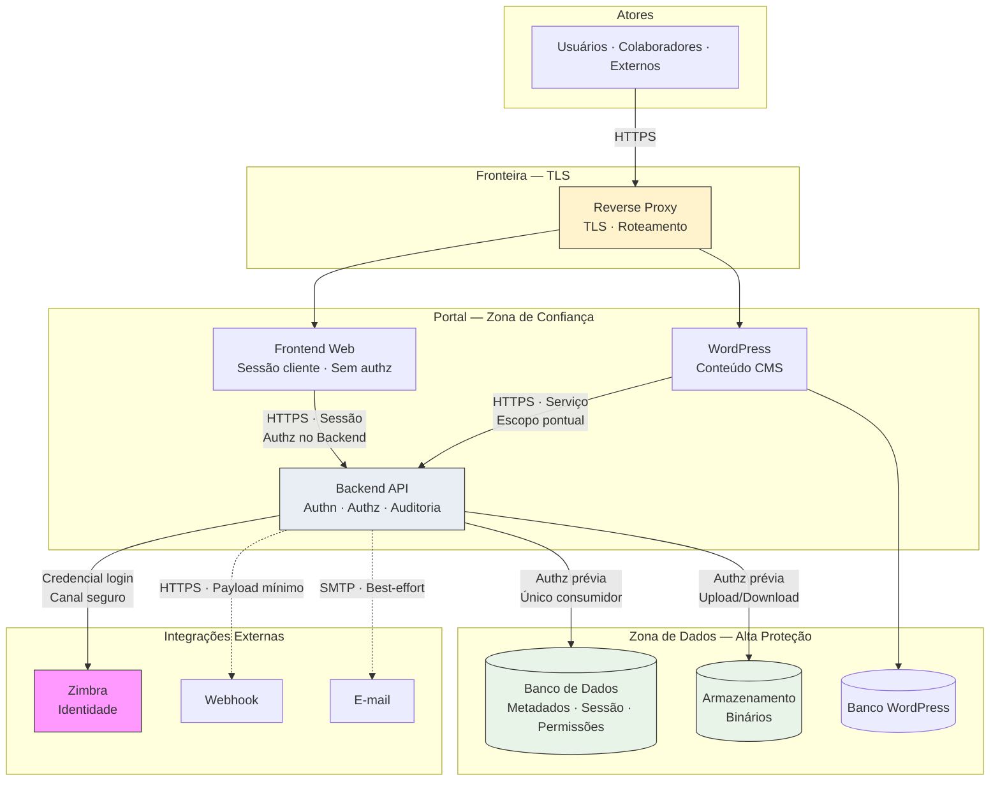

# Security Architecture — Portal de Comunicação

| Item | Valor |
|------|-------|
| Camada | Solution Design |
| Categoria documental | **Evidence** (materialização de solução) |
| SSOT de arquitetura de segurança | `docs/architecture/06-security-architecture.md` |
| Status | Complementa o SSOT — **não** compete como segunda fonte normativa |

## Objetivo

Este documento consolida a **arquitetura de segurança** da solução do Portal de Comunicação da Unimed Ceará **no nível Solution Design**. Define identidade, autenticação, autorização, proteção de dados, auditoria, rastreabilidade e observabilidade de segurança — em nível **arquitetural e conceitual**, sem implementação técnica detalhada, código, configuração de framework, regras de firewall ou infraestrutura executável.

Em caso de conflito com `docs/architecture/06-security-architecture.md`, **prevalece o SSOT de Architecture**.

Materializa ADR-003, ADR-005, ADR-006, ADR-008 e ADR-011; consolida classificação de `07-data-ownership.md`, contratos de `06-integration-contracts.md` e zonas de confiança de `04-deployment-architecture.md`.

**Rastreabilidade:** `docs/solution-design/01-solution-overview.md` a `07-data-ownership.md`, `docs/architecture/06-security-architecture.md`, `docs/architecture/08-decision-records.md`, `docs/architecture/09-risk-assessment.md`, `docs/architecture/10-target-architecture.md`.

---

# Princípios de Segurança

Princípios transversais que regem a segurança de toda a solução.

## Menor Privilégio

Cada ator, container e integração recebe **acesso mínimo necessário** à função. Frontend e WordPress não acessam persistência diretamente; Backend valida autorização em **cada operação sensível**. Credenciais de serviço segregadas por ambiente e função.

## Defesa em Profundidade

Segurança aplicada em **múltiplas camadas**: fronteira de rede (Reverse Proxy, TLS), camada de aplicação (Backend), persistência (zonas isoladas), integrações externas e observabilidade. Falha em uma camada não deve comprometer isolamento total quando demais controles operam corretamente.

## Segregação de Responsabilidades

Autenticação (identidade via Zimbra), autorização (Controle de Acesso), compartilhamento (Gestão Documental) e auditoria (Controle de Acesso) são **responsabilidades distintas** com integração obrigatória (ADR-008). Frontend apresenta; Backend decide (ADR-005, ADR-006).

## Autorização Centralizada

**Toda decisão efetiva de acesso** reside no Backend API (ADR-005). Guards de interface no Frontend são informativos — nunca substituem validação no servidor (R-031). WordPress não decide acesso a recursos documentais governados pelo núcleo.

## Rastreabilidade

Operações de governança e acessos sensíveis devem ser **identificáveis**: quem, quando, qual recurso, qual decisão. Correlação de requisições Frontend → Backend para investigação de incidentes.

## Auditoria

Eventos de governança registrados pelo componente Auditoria (BR-005). Auditoria de negócio **complementada** por logs técnicos — não substituída por eles. Catálogo fechado de eventos pendente (OQ-019).

## Segurança por Padrão

Configurações padrão **restritivas**: persistência não exposta publicamente; canais opcionais desabilitados em ambientes inferiores; capacidades PARCIAL identificadas antes de exposição em Prod (R-007). Dados de Prod não replicados para ambientes inferiores sem anonimização (ADR-011).

## Segurança por Design

Controles de segurança **embutidos na arquitetura** desde Solution Design — não adicionados posteriormente. Bounded contexts, ownership de dados, zonas de confiança e contratos de integração já incorporam fronteiras de segurança.

---

# Visão Geral de Segurança

Responsabilidades de segurança por componente da solução alvo.

## Frontend Web

| Aspecto | Responsabilidade de segurança |
| ------- | ------------------------------ |
| **Papel** | Camada de apresentação (ADR-006) |
| **Controles** | Manter credencial de sessão no cliente; comunicação HTTPS com Backend; não expor dados além do autorizado |
| **Limites** | Sem regras de negócio; sem decisão efetiva de autorização; sem acesso a persistência ou Zimbra |
| **Riscos** | R-017 (dependência total do Backend); R-031 (guards permissivos — mitigado por ADR-005) |

## Backend API

| Aspecto | Responsabilidade de segurança |
| ------- | ------------------------------ |
| **Papel** | Núcleo de negócio e **único ponto de decisão de segurança** efetiva |
| **Controles** | Autenticação via Zimbra; autorização por operação; orquestração segura de persistência; auditoria de governança |
| **Módulos** | Controle de Acesso (authn/authz/auditoria); Gestão Documental (visibilidade/compartilhamento); Organização (escopo); Comunicação (notificações filtradas) |
| **Riscos** | R-001 (SPOF); R-009, R-010, R-011 (governança de acesso) |

## CMS WordPress

| Aspecto | Responsabilidade de segurança |
| ------- | ------------------------------ |
| **Papel** | Conteúdo institucional complementar — autonomia editorial |
| **Controles** | Persistência própria; integração pontual autenticada com Backend; sem acesso ao núcleo |
| **Limites** | Sem regras centrais de autorização documental; sem acesso ao Banco do núcleo |
| **Riscos** | Baixo impacto no fluxo principal; R-005 durante migração se acoplado a legado |

## Banco de Dados

| Aspecto | Responsabilidade de segurança |
| ------- | ------------------------------ |
| **Papel** | Persistência de metadados transacionais — zona de maior proteção |
| **Controles** | Acesso exclusivo via Backend; isolamento por ambiente; backup e restore segregados |
| **Dados sensíveis** | Sessão, permissões, auditoria, metadados confidenciais |
| **Riscos** | R-002 (SPOF de persistência) |

## Armazenamento de Arquivos

| Aspecto | Responsabilidade de segurança |
| ------- | ------------------------------ |
| **Papel** | Binários documentais — separado de metadados (ADR-004) |
| **Controles** | Acesso exclusivo via Backend após autorização; não exposto à Internet |
| **Riscos** | R-004 (coerência metadado/binário); R-029 (crescimento de volume) |

## Integrações

| Integração | Responsabilidade de segurança |
| ---------- | ------------------------------ |
| **Zimbra** | Fonte de identidade corporativa; canal seguro; dependência crítica (R-003) |
| **Webhook / E-mail** | Canais opcionais; payload minimizado; best-effort (R-032) |
| **Frontend → Backend** | TLS; sessão autenticada; autorização por requisição |
| **WordPress → Backend** | Autenticação de serviço; escopo pontual |

## Reverse Proxy e Observabilidade

| Componente | Responsabilidade |
| ---------- | ---------------- |
| **Reverse Proxy** | Terminação TLS; ponto de entrada controlado; roteamento |
| **Observabilidade** | Logs, métricas e alertas de segurança; acesso restrito a operadores |

---

# Modelo de Identidade

Modelo lógico de identidade na solução. Relacionado a ADR-003, ADR-005 e ADR-006.

## Identidade Corporativa

- Colaboradores identificados por **e-mail corporativo** da Unimed Ceará (BR-025, BR-026).
- **Zimbra** é fonte da verdade de validação de credencial (ADR-003).
- Portal **não provisiona** contas de e-mail — mantém referência interna e sessão após validação.

## Sessão

- Estabelecida pelo Backend após autenticação bem-sucedida.
- Credencial de sessão (token ou mecanismo equivalente) mantida no Frontend para requisições subsequentes.
- Associada a identificador interno de colaborador e **contexto organizacional** ativo.
- Owner: Controle de Acesso (`07-data-ownership.md`).

## Usuários Internos

- Colaboradores com vínculo organizacional válido (BR-010, BR-011).
- Autenticação via Zimbra; autorização por papel e escopo no Backend.
- Operação condicionada a contexto organizacional (singular, área, equipe).

## Administradores

- Papéis administrativos por escopo: global, singular, área (BR-034 — matriz incompleta, OQ-020).
- Capacidades: estrutura organizacional, papéis, políticas, consulta de auditoria.
- Ações administrativas sujeitas a auditoria e menor privilégio por escopo.

## Parceiros

- **Parceiro Autorizado** — acesso externo restrito conforme política institucional (BR-001).
- Modelo operacional **não formalizado** (OQ-002, OQ-018, R-019).
- Capacidade documentada como **PARCIAL**.

## Convidados

- Acesso a conteúdos **públicos** com perfil limitado (BR-033).
- Sem escopo organizacional interno completo.
- Distinção operacional vs. parceiro **em aberto** (OQ-002).

### Relação com ADRs

| ADR | Aplicação no modelo de identidade |
| --- | --------------------------------- |
| **ADR-003** | Zimbra como provedor externo de identidade corporativa |
| **ADR-005** | Autorização efetiva no Backend — identidade não implica acesso automático |
| **ADR-006** | Frontend mantém sessão no cliente — não decide identidade nem autorização |

---

# Estratégia de Autenticação

Autenticação de atores e estabelecimento de sessão.

## Fonte de identidade

| Tipo de ator | Fonte |
| ------------ | ----- |
| Colaboradores internos | **Zimbra** — e-mail corporativo |
| Administradores / gestores | **Zimbra** — mesma identidade corporativa |
| Parceiros / convidados | **Pendente** — OQ-002; possível mecanismo distinto a definir |
| WordPress → Backend | Credencial de **serviço** — segregada por ambiente |
| Backend → Zimbra / SMTP | Credencial de **integração** — secrets por ambiente |

## Validação de credenciais

1. Ator submete credenciais via Frontend.
2. Frontend encaminha ao Backend — **sem** validação local de negócio.
3. Backend consome Zimbra para validar e-mail e senha corporativos.
4. Em sucesso: Backend resolve vínculo organizacional e estabelece sessão.
5. Em falha: resposta genérica — sem exposição de detalhes de infraestrutura.

Senhas corporativas **não** persistidas de longo prazo no portal.

## Sessão autenticada

- Emitida pelo Backend após validação no Zimbra.
- Referenciada em operações subsequentes — revalidação de autorização por operação, não apenas por presença de sessão.
- Vinculada a contexto organizacional do colaborador.

## Expiração

- Sessão possui **tempo de validade** — valor específico reservado à Implementation.
- Expiração por inatividade e por tempo absoluto — ambos conceitualmente aplicáveis.
- Sessão expirada exige novo login (sujeito a disponibilidade do Zimbra).

## Renovação

- Mecanismo de renovação de sessão **sem reautenticação completa** — a definir na Implementation.
- Renovação condicionada a sessão ainda válida e Backend operacional.
- Comportamento durante indisponibilidade do Zimbra relacionado a R-028.

## Revogação

- Logout explícito invalida sessão no Backend.
- Revogação administrativa de sessão — escopo a formalizar.
- Revogação de **permissão** a recursos — ciclo de vida incompleto (OQ-006, OQ-017, R-011) — distinto de revogação de sessão.

## Comportamento em indisponibilidade do Zimbra

| Cenário | Comportamento esperado |
| ------- | ---------------------- |
| Novo login | **Bloqueado** — sem alternativa documentada (R-003) |
| Sessão ativa existente | Operação **pode continuar** temporariamente — regras de expiração e revalidação **não formalizadas** (R-028) |
| Renovação de sessão | Depende de disponibilidade do Backend; reautenticação no Zimbra quando exigida |
| Prod | Comunicação operacional com gestão de e-mail corporativo |

### Riscos relacionados

| Risco | Relação |
| ----- | ------- |
| **R-003** | Dependência única do Zimbra para novos acessos |
| **R-028** | Ambiguidade de sessão ativa sem Zimbra |

---

# Estratégia de Autorização

Decisão efetiva de acesso a recursos. **Exclusivamente no Backend** (ADR-005).

## Papéis

- Atribuídos por **escopo organizacional** (singular, área, equipe, global).
- Owner: Controle de Acesso — Gestão de Papéis.
- Papéis administrativos com limites por escopo — matriz incompleta (OQ-020, R-030).
- Atribuição registrada em auditoria (BR-005).

## Perfis

- Perfil operacional derivado de papéis e contexto organizacional.
- Perfis externos (parceiro, convidado) — **PARCIAL** (OQ-002).
- Frontend exibe capacidades conforme resposta do Backend — não infere perfil autonomamente.

## Permissões

- **Permissão efetiva** — quem acessa o recurso (Controle de Acesso).
- Mecanismos: papel + escopo, permissão de pasta, concessão por solicitação aprovada.
- Revogação **não documentada** (OQ-006, OQ-017, R-011).

## Escopo Organizacional

- Toda operação condicionada a contexto organizacional válido (ADR-013, BR-009).
- Colaborador sem área vinculada pode ser impedido de operar (BR-010).
- Autorização avalia escopo antes de entregar recurso.

## Compartilhamento

- Define **audiência** do documento — quem está na lista de exposição lógica (Gestão Documental).
- Owner: Gestão de Compartilhamento — módulo Gestão Documental.
- **Não equivale** automaticamente a permissão efetiva (ADR-008, OQ-005, R-009).

## Solicitação de Permissão

- Colaborador sem acesso direto solicita acesso a recurso privado (BR-029).
- Responsável pelo recurso aprova ou nega (BR-030, BR-031).
- Fluxo ponta a ponta **PARCIAL** (OQ-003, R-010); responsável por escopo pendente (OQ-016, R-021).

## Separação: Compartilhamento × Permissão Efetiva

| Dimensão | Compartilhamento | Permissão Efetiva |
| -------- | ---------------- | ----------------- |
| **Owner** | Gestão Documental | Controle de Acesso |
| **Define** | Audiência (quem deveria ver) | Acesso (quem pode acessar) |
| **Integração** | **Obrigatória** — alinhamento na publicação e alterações |
| **Lacuna** | L-003, OQ-005 — equivalência não consolidada |
| **Risco** | R-009 — divergência exposição vs. acesso |

Toda entrega de recurso documental passa por **Autorização** no Backend, independentemente do compartilhamento registrado.

### Riscos relacionados

| Risco | Relação |
| ----- | ------- |
| **R-009** | Divergência compartilhamento vs. autorização efetiva |
| **R-010** | Fluxo de solicitação de permissão incompleto |
| **R-011** | Revogação de permissão não documentada |

---

# Estratégia para Perfis Externos

Atores fora do núcleo de colaboradores internos.

## Parceiro Autorizado

| Aspecto | Descrição |
| ------- | --------- |
| **Definição** | Acesso externo restrito conforme política institucional (BR-001) |
| **Autenticação** | Mecanismo **não formalizado** — possível via Zimbra ou modelo distinto (OQ-002) |
| **Autorização** | Escopo limitado; regras operacionais pendentes |
| **Status** | **PARCIAL** — não promover a ATIVO sem encerramento OQ-002 |

## Convidado

| Aspecto | Descrição |
| ------- | --------- |
| **Definição** | Acesso a conteúdos **públicos** (BR-033) |
| **Autenticação** | Quando exigida — mecanismo pendente |
| **Autorização** | Limitada a recursos de visibilidade pública; sem escopo organizacional interno |
| **Status** | **PARCIAL** |

## Restrições

- Perfis externos **não** recebem escopo organizacional interno completo.
- Sem acesso a documentos privados ou restritos salvo política explícita futura.
- Distinção parceiro vs. convidado **operacionalmente indefinida** (OQ-002, OQ-018).

## Limitações

- Modelo de identidade externa não consolidado — bloqueia governança plena de acesso externo.
- Guards de Frontend permissivos exigem compensação no Backend (R-031, ADR-005).

## Riscos

| Risco | Impacto |
| ----- | ------- |
| **R-019** | Perfis externos sem distinção operacional — governança ambígua |
| **R-031** | Interface pode sugerir acesso não efetivado no Backend |

## Lacunas conhecidas

| ID | Lacuna |
| -- | ------ |
| **OQ-002** | Parceiro vs. convidado — critérios operacionais |
| **OQ-018** | Detalhamento de perfil externo |
| **L-006** | Perfis externos sem critérios operacionais |

---

# Proteção de Dados

Controles de proteção alinhados à classificação de `07-data-ownership.md` e BR-004.

## Pública

| Aspecto | Proteção esperada |
| ------- | ----------------- |
| **Definição** | Conteúdo explicitamente público; acessível a convidados (BR-033) |
| **Autenticação** | Pode ser acessível sem login conforme política |
| **Autorização** | Visibilidade pública validada no Backend |
| **Transmissão** | HTTPS na fronteira |
| **Persistência** | Metadados no Banco; binários no Armazenamento — acesso via Backend |
| **Auditoria** | Publicação e alteração de visibilidade registráveis |

## Interna

| Aspecto | Proteção esperada |
| ------- | ----------------- |
| **Definição** | Uso corporativo; notificações; configuração institucional |
| **Autenticação** | Obrigatória |
| **Autorização** | Escopo organizacional quando aplicável |
| **Transmissão** | HTTPS; comunicação interna criptografada em Hml/Prod |
| **Persistência** | Zona de Dados — acesso exclusivo via Backend |
| **Logs** | Sem conteúdo sensível desnecessário |

## Restrita

| Aspecto | Proteção esperada |
| ------- | ----------------- |
| **Definição** | Limitada a escopo organizacional ou papel (estrutura org., documentos departamentais) |
| **Autenticação** | Obrigatória via Zimbra |
| **Autorização** | Papel + escopo + compartilhamento + permissão efetiva |
| **Transmissão** | HTTPS; TLS interno em Hml/Prod |
| **Persistência** | Isolamento por ambiente; backup segregado |
| **Auditoria** | Alterações organizacionais e de compartilhamento |

## Confidencial

| Aspecto | Proteção esperada |
| ------- | ----------------- |
| **Definição** | Governança de acesso, sessão, permissões, documentos privados, binários profissionais (BR-004) |
| **Autenticação** | Obrigatória; sessão protegida |
| **Autorização** | Rigorous — solicitação formal para recursos privados (BR-029) |
| **Transmissão** | HTTPS; sem exposição em logs ou canais opcionais além do necessário |
| **Persistência** | Máxima proteção na Zona de Dados; segregação Prod vs. demais ambientes |
| **Auditoria** | Obrigatória — concessão, negação, alteração de permissão |
| **Retenção** | Conforme política institucional; exclusão coordenada |

---

# Proteção de Documentos

Controles de segurança por tipo de exposição documental.

## Documentos Públicos

- Visibilidade pública explicitamente definida (BR-033).
- Autorização valida visibilidade antes de entrega — busca unificada incluída (ADR-014).
- Metadados classificados como Públicos; binários acessíveis via Backend após validação.

## Documentos Restritos

- Limitados a escopo organizacional (singular, área, equipe).
- Autorização por papel e escopo no Backend.
- Compartilhamento pode restringir audiência dentro do escopo.

## Documentos Compartilhados

- Compartilhamento define audiência (Gestão Documental).
- Permissão efetiva deve **alinhar-se** ao compartilhamento (L-003).
- Alteração pós-publicação — regras pendentes (OQ-011, R-025).

## Documentos Privados

- Acesso via permissão direta ou solicitação aprovada (BR-029 a BR-032).
- Classificação **Confidencial** por padrão.
- Fluxo de solicitação **PARCIAL** (OQ-003, R-010).

## Controle de acesso

- **Toda entrega** passa por Autorização no Backend (ADR-005).
- Download de binário somente após autorização sobre metadado e escopo.
- Frontend recebe apenas conteúdo permitido — decisão no servidor.

## Auditoria

- Publicação, alteração de visibilidade e compartilhamento registráveis.
- Concessão e negação de permissão auditadas (BR-005).
- Catálogo completo pendente (OQ-019).

## Rastreabilidade

- Identificador de documento estável (ADR-009).
- Correlação publicação ↔ binário ↔ permissão consultável em auditoria.

---

# Proteção de Arquivos Binários

Segurança do repositório de binários documentais (ADR-004).

## Upload

- Exclusivamente via Backend após autenticação e autorização de publicação.
- Validação de escopo, visibilidade e **quota** (BR-023) antes de aceitar.
- Frontend **não** envia binário diretamente ao Armazenamento.
- Atomicidade lógica com metadado (R-004).

## Download

- Somente após autorização validada no Backend.
- Binário **nunca** exposto por URL direta bypassando Backend.
- Entrega via Frontend com controle de sessão.

## Armazenamento

- Zona de Dados — não exposto à Internet.
- Acesso exclusivo pelo Backend (Gestão de Armazenamento).
- Isolamento por ambiente (ADR-011).

## Retenção

- Alinhada aos metadados correspondentes (`07-data-ownership.md`).
- Crescimento monitorado (R-029); quotas por colaborador.

## Exclusão

- Coordenada com metadado — owner Gestão Documental.
- Exclusão física conforme política — detalhes na Implementation.

## Recuperação

- Restore coordenado com Banco de Dados.
- Reconciliação metadado ↔ binário pós-restore (R-004).

### Riscos relacionados

| Risco | Mitigação de segurança |
| ----- | ---------------------- |
| **R-004** | Publicação coordenada; sem confirmação de metadado sem binário válido |
| **R-029** | Quotas; monitoramento; alertas de capacidade |

---

# Segurança das Integrações

Princípios de segurança por integração (`06-integration-contracts.md`).

## Frontend → Backend

| Princípio | Aplicação |
| --------- | --------- |
| Autenticação | Sessão estabelecida após Zimbra; credencial em requisições |
| Autorização | Decisão no Backend por operação |
| Transporte | HTTPS |
| Dados | Apenas dados autorizados retornados; sem persistência no cliente além de sessão |
| Rastreabilidade | Identificador de correlação |

## WordPress → Backend

| Princípio | Aplicação |
| --------- | --------- |
| Autenticação | Credencial de serviço segregada por ambiente |
| Autorização | Escopo pontual e explícito — sem acesso amplo ao núcleo |
| Transporte | HTTPS |
| Dados | Consulta pontual — sem metadados transacionais brutos |
| Isolamento | Sem acesso ao Banco do núcleo |

## Backend → Zimbra

| Princípio | Aplicação |
| --------- | --------- |
| Autenticação | Credencial de integração em secrets |
| Transporte | Canal seguro conforme política corporativa |
| Dados | Apenas credenciais de login em trânsito — não persistidas |
| Disponibilidade | Monitorada — impacto em novos logins (R-003) |
| Tier por ambiente | Mock (Local) → corporativo (Prod) |

## Backend → Webhook

| Princípio | Aplicação |
| --------- | --------- |
| Autenticação | Credencial ou assinatura de callback — quando aplicável |
| Transporte | HTTPS |
| Dados | Payload minimizado; sem confidenciais desnecessários |
| Degradação | Falha não bloqueia operação (R-032) |

## Backend → E-mail

| Princípio | Aplicação |
| --------- | --------- |
| Autenticação | SMTP autenticado — credenciais em secrets |
| Dados | Conteúdo proporcional ao evento; política institucional de e-mail |
| Degradação | Best-effort (R-032) |

---

# Gestão de Segredos

Gestão conceitual de credenciais e material criptográfico. Relacionado a ADR-011.

## Credenciais

| Tipo | Gestão |
| ---- | ------ |
| Integração Zimbra | Secret por ambiente; rotação periódica |
| Banco de Dados | Secret por ambiente; acesso restrito a Backend |
| Armazenamento | Secret por ambiente |
| WordPress → Backend | Credencial de serviço por ambiente |
| SMTP / Webhook | Secret por ambiente |

## Tokens

- Token de sessão emitido pelo Backend — validade e formato reservados à Implementation.
- Tokens de serviço para integrações — segregados; não reutilizados entre ambientes.

## Segredos

- Armazenados em mecanismo de **secrets** ou variáveis de ambiente — **não versionados** em repositório.
- Valores reais **ausentes** desta documentação.

## Certificados

- TLS na fronteira Reverse Proxy — gerenciados por ambiente.
- Renovação conforme política operacional.

## Variáveis de Ambiente

- Configuração não sensível via variáveis versionadas como template.
- Valores sensíveis exclusivamente via secrets.

## Segregação por Ambiente

- **Local, Dev, Hml, Prod** — secrets **disjointos** (ADR-011).
- Credencial de Prod **nunca** utilizada em ambientes inferiores.
- Proibido commitar secrets em repositório de código.

---

# Estratégia de Auditoria

Registro de eventos de governança de negócio (BR-005). Distinto de logs técnicos.

## Autenticação

- Login bem-sucedido e tentativas falhas — registro esperado.
- Logout e expiração de sessão — quando catálogo fechado (OQ-019).

## Autorização

- Decisões de entrega de recurso sensível — escopo a detalhar.
- Negações de acesso a recursos privados.

## Alteração de Permissões

- Concessão e negação via solicitação (BR-031).
- Atribuição e remoção de papéis.
- Revogação — **pendente** (OQ-006, OQ-017, R-011).

## Publicação

- Publicação de documentos e alteração de visibilidade.
- Coordenação metadado/binário.

## Compartilhamento

- Alteração de audiência de documentos.
- Alinhamento com permissão efetiva — trilha cross-módulo.

## Administração

- Alterações em estrutura organizacional.
- Configuração institucional sensível.

## Consulta de Auditoria

- Restrita a **administradores** no escopo de atuação.
- Via Frontend → Backend — contrato sujeito a L-010 (R-008).
- Dados classificados como **Confidenciais**.

### Relacionamentos

| Referência | Descrição |
| ---------- | --------- |
| **BR-005** | Auditoria registra eventos de governança |
| **OQ-019** | Catálogo fechado de eventos pendente |
| **R-023** | Eventos relevantes podem não ser registrados sem catálogo |

---

# Estratégia de Observabilidade de Segurança

Sinais de segurança sem definição de ferramentas.

## Logs

| Origem | Eventos de segurança |
| ------ | -------------------- |
| Backend | Autenticação (sem senha), autorização negada, erros de integração |
| Reverse Proxy | Acesso HTTP, códigos de resposta, IPs de origem |
| Frontend | Erros encaminhados — sem dados sensíveis |
| Zimbra (integração) | Falhas e latência de autenticação |

## Eventos

- Tentativas de acesso não autorizado.
- Picos de falha de autenticação.
- Falhas de integração crítica (Zimbra, Banco).

## Alertas

| Condição | Severidade |
| -------- | ---------- |
| Indisponibilidade Backend / Banco | Crítica |
| Falha persistente Zimbra | Crítica (novos logins) |
| Taxa elevada de auth negada | Alta — possível incidente |
| Falha Webhook/E-mail | Baixa |

## Rastreabilidade

- Identificador de correlação Frontend → Backend.
- Sessão associada a operações sensíveis nos logs.

## Correlação

- Mesmo identificador atravessa camadas para investigação de incidente.
- Auditoria de negócio + logs técnicos para visão completa.

## Incidentes

- Registro formal de incidente de segurança — processo em Estratégia de Resposta.
- Retenção de logs proporcional ao ambiente (`05-environment-strategy.md`).

---

# Estratégia de Resposta a Incidentes

Processo conceitual de resposta — sem runbooks executáveis nesta camada.

## Detecção

- Alertas de observabilidade de segurança.
- Reporte de usuários ou administradores.
- Falhas de autenticação ou autorização em volume anômalo.

## Registro

- Incidente documentado com timestamp, ambiente, componentes afetados.
- Preservação de logs e registros de auditoria do período.

## Investigação

- Correlação de requisições via identificador de rastreio.
- Consulta de auditoria de governança quando aplicável.
- Identificação de escopo: identidade, documentos, permissões.

## Mitigação

- Revogação de sessão quando comprometida — escopo a formalizar.
- Bloqueio de acesso a recurso específico via Backend.
- Isolamento de componente afetado conforme `05-environment-strategy.md`.

## Recuperação

- Restore de persistência com reconciliação (R-004).
- Restabelecimento de integração Zimbra para novos logins.
- Comunicação a stakeholders em Prod.

## Lições Aprendidas

- Revisão pós-incidente documentada.
- Atualização de riscos e controles quando aplicável — via governança formal (não alteração retroativa de ADRs nesta camada).

---

# Segurança por Ambiente

Diferenças de proteção entre Local, Dev, Hml e Prod (`05-environment-strategy.md`).

## Local

| Aspecto | Proteção |
| ------- | -------- |
| **Dados** | Descartáveis; sem dados reais de Prod |
| **Zimbra** | Mock/simulação |
| **Secrets** | Locais; não compartilhados |
| **TLS** | Opcional em desenvolvimento |
| **Auditoria** | Mínima |
| **Restrição** | Sem exposição pública |

## Dev

| Aspecto | Proteção |
| ------- | -------- |
| **Dados** | Isolados; sem Prod |
| **Zimbra** | Teste |
| **Secrets** | Segregados Dev |
| **TLS** | Desejável |
| **Auditoria** | Habilitada — retenção curta |
| **Acesso** | Restrito à equipe técnica |

## Hml

| Aspecto | Proteção |
| ------- | -------- |
| **Dados** | Representativos não produtivos |
| **Zimbra** | Pré-produção |
| **Secrets** | Segregados Hml |
| **TLS** | Obrigatório na fronteira; interno preferencialmente criptografado |
| **Auditoria** | Paridade estrutural com Prod |
| **Governança** | Gate antes de Prod; testes de controles de segurança |

## Prod

| Aspecto | Proteção |
| ------- | -------- |
| **Dados** | Operacionais confidenciais (BR-004) |
| **Zimbra** | Corporativo obrigatório |
| **Secrets** | Segregados Prod; rotação rigorosa |
| **TLS** | Obrigatório |
| **Auditoria** | Completa; retenção institucional |
| **Governança** | Alterações via promoção Hml → Prod; controle de mudanças formal |
| **Monitoramento** | Alertas operacionais completos |

### Restrições transversais

- Persistência **nunca** compartilhada entre ambientes (ADR-011).
- Capacidades PARCIAL identificadas em Prod (R-007).
- Dados confidenciais de Prod **proibidos** em Local/Dev/Hml sem anonimização.

---

# Matriz de Responsabilidades

Consolidado de ownership de controles de segurança.

| Componente | Responsabilidade de Segurança | Owner | Criticidade | Dependências |
| ---------- | ------------------------------ | ----- | ----------- | ------------ |
| **Frontend Web** | Apresentação segura; sessão no cliente; HTTPS | Equipe Frontend | Alta | Backend, Reverse Proxy |
| **Backend API** | Authn, authz, auditoria, orquestração segura | Equipe Backend | **Crítica** | Zimbra, Banco, Armazenamento |
| **Controle de Acesso** (módulo) | Identidade de sessão, permissões, auditoria | Backend — Controle de Acesso | **Crítica** | Zimbra, Organização |
| **Gestão Documental** (módulo) | Visibilidade, compartilhamento, quotas | Backend — Gestão Documental | Crítica | Controle de Acesso |
| **CMS WordPress** | Conteúdo editorial; hardening CMS | Equipe CMS | Média | Banco WordPress, Proxy |
| **Banco de Dados** | Proteção de metadados; isolamento | Operadores / DBA | **Crítica** | Backend exclusivo |
| **Armazenamento de Arquivos** | Proteção de binários; isolamento | Operadores | Alta | Backend exclusivo |
| **Reverse Proxy** | TLS, roteamento, fronteira | Operadores | Alta | Frontend, WordPress |
| **Zimbra** | Identidade corporativa | Gestão e-mail corporativo | **Crítica** | Institucional |
| **Observabilidade** | Logs, alertas de segurança | Operadores | Média | Todos os containers |
| **Webhook / E-mail** | Entrega opcional segura | Operadores / Backend | Baixa | Backend |

---

# Mapeamento de Riscos

Relacionamento explícito entre riscos de segurança, impacto, mitigação e responsável.

| Risco | Impacto em segurança | Mitigação | Responsável |
| ----- | -------------------- | --------- | ----------- |
| **R-003** | Novos logins impossíveis; identidade dependente de sistema externo | Monitoramento Zimbra; plano de continuidade; comunicação institucional | Operadores + Backend |
| **R-004** | Documento inacessível ou binário órfão; integridade comprometida | Atomicidade lógica na publicação; reconciliação; restore coordenado | Gestão Documental / Operadores |
| **R-006** | Notificações duplicadas ou inconsistentes; trilha de governança confusa | Unificação L-009; in-app como canal autoritativo | Comunicação Interna |
| **R-008** | Capacidades de segurança na UI sem enforcement no Backend | Inventário L-010; alinhar contratos auth/authz/auditoria | Backend + Frontend |
| **R-009** | Colaborador vê recurso na audiência mas não acessa — ou inverso | Resolver OQ-005; integração compartilhamento ↔ autorização | Gestão Documental + Controle de Acesso |
| **R-010** | Recursos privados sem governança formal de acesso | Completar fluxo OQ-003; formalizar responsável OQ-016 | Controle de Acesso |
| **R-011** | Permissões sem revogação formal — acesso prolongado indevido | Definir ciclo de vida OQ-006/OQ-017; auditar concessões | Controle de Acesso |
| **R-019** | Perfis externos ambíguos — acesso indevido ou bloqueio incorreto | Encerrar OQ-002; modelo distinto se necessário | Controle de Acesso + Negócio |
| **R-023** | Eventos de segurança não registrados | Fechar catálogo OQ-019; auditoria obrigatória por evento | Controle de Acesso |
| **R-028** | Sessões ativas operando sem revalidação Zimbra — janela de risco | Formalizar expiração e revalidação; documentar comportamento | Controle de Acesso |
| **R-029** | Armazenamento como vetor de negação ou vazamento por volume | Quotas BR-023; monitoramento; política de retenção | Gestão Documental / Operadores |
| **R-032** | Notificação externa não entregue — sem impacto em auth/authz core | Retry; in-app autoritativo; monitoramento best-effort | Comunicação Interna |

---

# Diagrama de Segurança

Controles de segurança entre componentes.

**Legenda:** linha tracejada — canal opcional. Todo acesso a dados do núcleo **mediado e autorizado** pelo Backend. Zimbra — identidade externa crítica.

---

# Dependências para Próximos Artefatos

## `09-migration-strategy.md`

- Consolidação de autenticação única — eliminação de mecanismos duplicados legados (R-013, ADR-015).
- Segurança durante coexistência: rotas legadas vs. alvo; superfície de ataque ampliada (R-005).
- Unificação de notificações — trilha de auditoria única (R-006, L-009).
- Resolução de endpoints órfãos de segurança (L-010, R-008).
- Reconciliação metadado/binário em migração (R-004).
- Segregação de secrets e persistência por ambiente durante transição (ADR-011).
- Perfis externos e solicitação de permissão — controles PARCIAL a migrar ou restringir.

## `10-delivery-roadmap.md`

- Sequência de entrega de controles de segurança: authn Zimbra → authz core → auditoria → perfis externos.
- Lacunas bloqueantes: OQ-002, OQ-003, OQ-005, OQ-006, OQ-019.
- Gates de ambiente incluem validação de controles de segurança em Hml.
- Capacidades PARCIAL não promovidas sem encerramento de OQs de segurança (R-007).
- Priorização de mitigação R-003, R-009, R-010, R-011 no roadmap.
- Entrega de observabilidade de segurança alinhada a ambientes Dev → Hml → Prod.

---

# Conclusão

A arquitetura de segurança do Portal de Comunicação centraliza **autenticação corporativa no Zimbra** (ADR-003) e **autorização efetiva no Backend API** (ADR-005), com Frontend e WordPress como consumidores sem decisão de acesso. A **separação entre compartilhamento e permissão efetiva** (ADR-008) e a **classificação da informação** (Pública, Interna, Restrita, Confidencial — BR-004) governam proteção de dados em repouso e em trânsito.

Os princípios de **menor privilégio, defesa em profundidade, segregação de responsabilidades, rastreabilidade, auditoria e segurança por design** materializam-se nas zonas de confiança, ownership de dados e contratos de integração já documentados. **Secrets segregados por ambiente** (ADR-011) e **TLS na fronteira** completam controles transversais.

Lacunas em perfis externos (OQ-002, R-019), solicitação e revogação de permissão (OQ-003, OQ-006, R-010, R-011), equivalência compartilhamento ↔ acesso (OQ-005, R-009), catálogo de auditoria (OQ-019, R-023) e sessão sem Zimbra (R-028) condicionam maturidade plena — sem alterar a estrutura de segurança definida. Este documento não define JWT, OAuth, frameworks ou infraestrutura — estabelece a **base arquitetural de segurança** para `09-migration-strategy.md` e `10-delivery-roadmap.md`.

---

## Fontes Utilizadas

| Fonte | Uso |
| ----- | --- |
| `docs/solution-design/01-solution-overview.md` | Estratégia de segurança inicial |
| `docs/solution-design/04-deployment-architecture.md` | Zonas, TLS, segredos |
| `docs/solution-design/05-environment-strategy.md` | Segurança por ambiente |
| `docs/solution-design/06-integration-contracts.md` | Segurança das integrações |
| `docs/solution-design/07-data-ownership.md` | Classificação, ownership, proteção |
| `docs/architecture/08-decision-records.md` | ADR-003, ADR-005, ADR-006, ADR-008, ADR-011, ADR-014 |
| `docs/architecture/09-risk-assessment.md` | Riscos mapeados |
| `docs/architecture/10-target-architecture.md` | Lacunas L-003, L-006, L-015 |
| `docs/domain/09-business-rules.md` | BR-004, BR-005, BR-025–BR-033 (via Architecture) |
| `.cursor/rules/process/solution-design-phase.mdc` | Governança da camada |

*Nenhum código, JWT, OAuth, configuração de framework, firewall, YAML, Terraform ou Kubernetes foi produzido para a construção deste artefato.*

---

## Nível de Confiança

**Médio-Alto**

| Faixa | Escopo |
| ----- | ------ |
| Alto | Authn Zimbra, authz centralizada, classificação, zonas, integrações, ADRs |
| Médio | Perfis externos, solicitação/revogação, sessão sem Zimbra, catálogo de auditoria — OQs em aberto |
