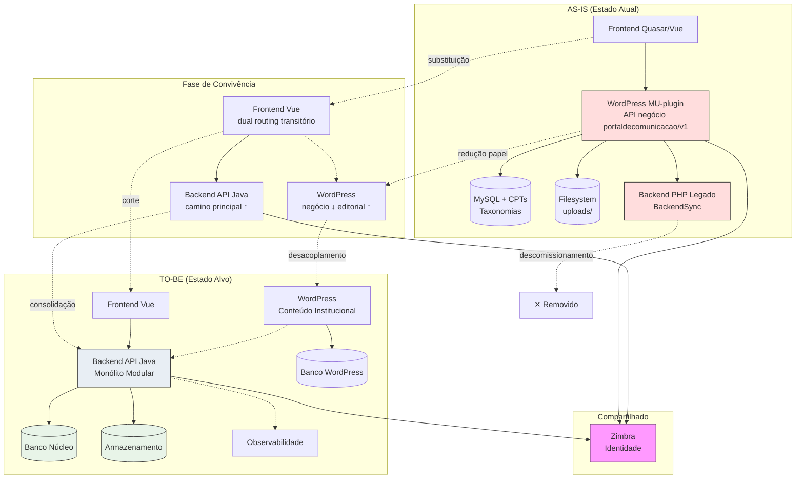

# Migration Strategy — Portal de Comunicação

## Objetivo

Este documento define a **estratégia de migração arquitetural** do Portal de Comunicação da Unimed Ceará — transição controlada entre o **estado atual (AS-IS)** e o **estado alvo (TO-BE)** documentados nas camadas Discovery, Architecture e Solution Design.

Estabelece convivência temporária, estratégias de dados, integrações e segurança durante a transição, critérios de prontidão e de corte, governança e mapeamento de riscos — **sem plano de execução detalhado, backlog, cronograma, scripts ou artefatos executáveis**.

Materializa ADR-015 (coexistência provisória do legado) como estratégia de saída, alinhada a `10-target-architecture.md` e aos artefatos Solution Design `01` a `08`.

**Rastreabilidade:** `docs/discovery/07-current-architecture.md` (baseline operacional AS-IS), `docs/architecture/10-target-architecture.md` (TO-BE), `docs/solution-design/06-integration-contracts.md`, `docs/solution-design/07-data-ownership.md`, `docs/solution-design/08-security-architecture.md`, `docs/architecture/08-decision-records.md`, `docs/architecture/09-risk-assessment.md`.

**Nota:** o caminho `docs/architecture/07-current-architecture.md` referencia o artefato de deployment da camada Architecture (`07-deployment-architecture.md`). O baseline AS-IS consolidado provém de `docs/discovery/07-current-architecture.md`, abstraído em `10-target-architecture.md` seção 3.

---

# Visão Geral da Migração

## Arquitetura Atual (AS-IS)

A arquitetura operacional atual é uma **aplicação web centrada no CMS WordPress** como API principal de negócio:

- **Frontend:** SPA Quasar/Vue consumindo `portaldecomunicacao/v1` exposta pelo MU-plugin WordPress.
- **Aplicação:** WordPress Core + MU-plugin com Controllers, Services, JWT nativo, Zimbra, RBAC WordPress (6 roles, 47 capabilities).
- **Persistência:** MySQL externo; CPTs, taxonomias, user meta; tabelas customizadas (`audit_log`, `portal_notifications`, `pdc_notifications`); filesystem `uploads/portaldecomunicacao/`.
- **Legado:** Backend PHP separado (`backend/routes/api.php`) com `BackendSync` parcial.
- **Integrações:** Zimbra, SSE notificações, webhooks, e-mail; JWT duplicado; **28 endpoints órfãos** no frontend.
- **Infraestrutura:** Docker Swarm + Traefik (dev/prd), Nginx local; GitLab CI + Harbor.

## Arquitetura Alvo (TO-BE)

A arquitetura alvo é uma **aplicação web modular** com Backend centralizado:

- **Frontend Vue** consumindo **exclusivamente Backend API** (Java/Spring Boot).
- **Backend monólito modular** com quatro bounded contexts.
- **CMS WordPress desacoplado** — conteúdo institucional complementar; integração pontual por API.
- **Persistência segregada:** Banco de Dados (metadados) + Armazenamento de Arquivos (binários) + Banco WordPress (CMS).
- **Sem API Backend Legado** no estado final.
- **Notificações unificadas** no Backend.
- **Quatro ambientes** isolados (Local, Dev, Hml, Prod); Observabilidade transversal.
- **Zimbra** permanece fonte de identidade corporativa (ADR-003).

## Objetivos da Migração

| Objetivo | Descrição |
| -------- | --------- |
| **Centralizar negócio e segurança** | Transferir regras de negócio, autenticação e autorização efetiva do CMS WordPress para Backend API (ADR-002, ADR-005) |
| **Desacoplar apresentação e persistência** | Frontend consome Backend; WordPress não é mais API principal de negócio (ADR-006) |
| **Separar metadados e binários** | Migrar de modelo WordPress/filesystem misto para Banco + Armazenamento (ADR-004) |
| **Eliminar legado** | Descomissionar Backend PHP legado e rotas paralelas (ADR-015) |
| **Unificar notificações** | Consolidar subsistemas `portal_notifications` e `pdc_notifications` (L-009) |
| **Alinhar contratos** | Resolver endpoints órfãos e duplicidades JWT (L-010) |
| **Preservar continuidade** | Migração incremental com convivência controlada e reversibilidade |
| **Manter identidade corporativa** | Zimbra inalterado como provedor de identidade (ADR-003) |

## Benefícios Esperados

| Benefício | Origem arquitetural |
| --------- | ------------------- |
| Simplicidade de fronteiras | Monólito modular alinhado ao domínio (ADR-001, ADR-007) |
| Segurança centralizada | Autorização exclusivamente no Backend (ADR-005) |
| Ownership claro de dados | Fonte única da verdade por bounded context (`07-data-ownership.md`) |
| Redução de acoplamento CMS/negócio | WordPress restrito a conteúdo institucional |
| Eliminação de duplicidades | JWT, notificações, rotas legadas |
| Contratos explícitos | Frontend ↔ Backend por capacidade (`06-integration-contracts.md`) |
| Ambientes segregados | Paridade e isolamento (ADR-011, `05-environment-strategy.md`) |
| Observabilidade | Sinais transversais de segurança e operação |

---

# Estado Atual (AS-IS)

Consolidação do baseline operacional. Fonte primária: `docs/discovery/07-current-architecture.md`.

## Componentes atuais

| Componente | Papel AS-IS | Status |
| ---------- | ----------- | ------ |
| **Frontend SPA (Quasar/Vue)** | Interface; consome CMS como API principal | ATIVO |
| **CMS WordPress + MU-plugin** | API REST `portaldecomunicacao/v1`; regras de negócio; auth JWT; RBAC | ATIVO — **núcleo atual** |
| **MySQL externo** | Persistência WordPress + tabelas customizadas | ATIVO |
| **Filesystem uploads** | Binários em `wp-content/uploads/portaldecomunicacao/` | ATIVO |
| **Backend PHP legado** | 20 rotas paralelas; `BackendSync` | LEGADO |
| **Zimbra** | Autenticação corporativa | ATIVO — crítico |
| **Traefik / Nginx** | Proxy e TLS | ATIVO |
| **Redis** | Cache | PARCIAL — compose isolado |

## Integrações atuais

| Integração | AS-IS |
| ---------- | ----- |
| Frontend → CMS (`portaldecomunicacao/v1`) | **Principal** — dependência total |
| Frontend → CMS (`jwt-auth/v1`) | PARCIAL — validação alternativa |
| CMS → Zimbra | Autenticação login |
| CMS → Backend PHP (`BackendSync`) | Sincronização parcial |
| CMS → SSE | Notificações tempo real |
| CMS → wp_mail / webhook | Canais opcionais |
| Frontend → endpoints órfãos | 28 rotas sem registro CMS |

## Dependências atuais

- Frontend **depende integralmente** do CMS WordPress para negócio.
- CMS **depende** de WordPress Core (roles, CPTs, taxonomias, ACF).
- CMS **depende** de MySQL externo e GFS/filesystem para binários.
- `BackendSync` **acopla** CMS ao Backend PHP legado.
- JWT transportado via `Authorization: Bearer` + headers de contexto (`X-Active-Role`, `X-User-Area-Id`, `X-User-Team-Id`).

## Limitações atuais

| Limitação | Evidência |
| --------- | --------- |
| CMS como aplicação e persistência de negócio | Contradiz TO-BE (Backend central) |
| Backend PHP legado coexistente | ADR-015 provisório; R-005 |
| Dois subsistemas de notificação | `portal_notifications` + `pdc_notifications`; R-006 |
| JWT duplicado (nativo + plugin) | R-013 |
| 28 endpoints órfãos frontend | L-010, R-008 |
| Guards frontend permissivos | R-031 |
| Divergência roles frontend/backend | R-030 |
| Entidades sem persistência confirmada | PermissionRequest, Analytics, Comunicados; R-016 |
| Onboarding com fluxos divergentes | OQ-001, R-020 |
| Capacidades PARCIAL expostas | R-007 |

---

# Estado Alvo (TO-BE)

Consolidação da solução alvo. Fonte primária: `10-target-architecture.md` e Solution Design `01`–`08`.

## Frontend Vue

- Camada de **apresentação exclusiva** (ADR-006).
- Consome **Backend API** para todas as operações de negócio.
- Mantém sessão no cliente; **não decide autorização** (ADR-005).
- Notificações in-app via Backend.

## Backend Java (Spring Boot)

- **Monólito modular** — quatro bounded contexts (ADR-001, ADR-007).
- Núcleo de negócio, autenticação (via Zimbra), autorização, orquestração, notificações, auditoria (ADR-002, ADR-012).
- **Único consumidor** do Banco de Dados e Armazenamento do núcleo.

## CMS WordPress

- Conteúdo **institucional complementar** — desacoplado do núcleo.
- Banco WordPress próprio; integração **pontual** com Backend por API.
- **Não** contém regras centrais de negócio documental ou autorização.

## Banco de Dados

- Metadados transacionais do núcleo: organização, documentos, acesso, notificações, auditoria, sessão.
- Acesso **exclusivo** via Backend (ADR-004, ADR-011).
- Separado do Banco WordPress.

## Armazenamento de Arquivos

- Binários documentais; referenciados por metadados no Banco.
- Acesso **exclusivo** via Backend (ADR-004).

## Observabilidade

- Coleta transversal de logs, métricas e alertas.
- Complementa auditoria de governança — não substitui.

## Integrações alvo

| Integração | TO-BE |
| ---------- | ----- |
| Frontend → Backend API | **Crítica** — canal único de negócio |
| Backend → Zimbra | **Crítica** — identidade corporativa |
| Backend → Banco / Armazenamento | **Crítica / Alta** |
| WordPress → Backend | **Baixa** — pontual |
| Backend → Webhook / E-mail | **Opcional** |
| API Backend Legado | **Ausente** — descomissionado |

---

# Princípios da Migração

## Migração Incremental

Transição por **fases e capacidades**, não big-bang. Cada incremento entrega valor verificável em Dev → Hml antes de Prod, conforme `05-environment-strategy.md`.

## Baixo Impacto Operacional

Convivência controlada minimiza interrupção a colaboradores em Prod. Capacidades ATIVAS migradas antes de PARCIAL; PARCIAL restritas ou sinalizadas até completude (R-007).

## Rastreabilidade

Cada fase registra: capacidade migrada, origem AS-IS, destino TO-BE, ambiente validado, decisões de corte. Promoção entre ambientes identificável.

## Reversibilidade

Fases devem permitir **rollback conceitual** — retorno ao caminho AS-IS funcional enquanto coexistência vigorar. Critérios de rollback documentados; não substituem homologação.

## Segurança

Autenticação Zimbra preservada; autorização centralizada progressivamente no Backend. Segregação de ambientes e secrets mantida (ADR-011, `08-security-architecture.md`). Superfície de ataque da coexistência monitorada.

## Compatibilidade

Contratos Frontend ↔ Backend versionados durante transição. Paridade de rotas legado ↔ alvo como pré-requisito de descomissionamento (ADR-015). Dados migrados com reconciliação metadado/binário (R-004).

## Observabilidade

Monitoramento de integrações críticas, falhas de auth e inconsistências de dados durante toda a transição. Alertas proporcionais ao ambiente.

---

# Estratégia de Convivência

Período transitório em que AS-IS e TO-BE operam **simultaneamente** (ADR-015 provisório).

## Legado

| Aspecto | Convivência |
| ------- | ----------- |
| **Backend PHP legado** | Permanece enquanto `BackendSync` ou consumidores dependerem; rotas mapeadas; **não** evolui como caminho principal |
| **Rotas CMS legadas** | Coexistem com novas rotas Backend até corte por capacidade |
| **JWT duplicado** | Consolidar progressivamente no mecanismo alvo do Backend; eliminar plugin redundante na fase de corte CMS-auth |

## Nova Solução

| Aspecto | Convivência |
| ------- | ----------- |
| **Backend API alvo** | Caminho **principal** para capacidades migradas; Frontend direcionado por feature flag ou roteamento lógico |
| **Frontend Vue** | Pode consumir CMS (AS-IS) e Backend (TO-BE) **temporariamente** por módulo — estado transitório a minimizar |
| **Persistência alvo** | Instâncias segregadas por ambiente; **sem** compartilhamento com WordPress AS-IS |

## Integrações Compartilhadas

| Integração | Convivência |
| ---------- | ----------- |
| **Zimbra** | **Compartilhado** — única fonte de identidade; CMS AS-IS e Backend TO-BE validam no mesmo provedor por ambiente |
| **Webhook / E-mail** | Podem ser acionados por CMS ou Backend durante transição — convergir para Backend (ADR-012) |
| **SSE (AS-IS)** | Substituído por entrega in-app via Backend — coexistência breve até corte de notificações |

## WordPress

| Fase | Papel |
| ---- | ----- |
| **Transição inicial** | Continua API principal para capacidades **não migradas** |
| **Transição intermediária** | API principal de negócio **diminui**; CMS restrito a conteúdo editorial + rotas remanescentes |
| **Estado alvo** | Apenas conteúdo institucional; integração pontual Backend |

## Banco de Dados

| Repositório | Convivência |
| ----------- | ----------- |
| **MySQL WordPress AS-IS** | Permanece fonte de verdade para dados **não migrados** |
| **Banco núcleo TO-BE** | Recebe dados migrados ou sincronizados; **instância separada** |
| **Banco WordPress TO-BE** | Conteúdo CMS; separado do núcleo |

**Proibido:** compartilhar persistência de Prod AS-IS com Prod TO-BE sem processo formal de migração e validação.

## Identidade Corporativa

- **Zimbra inalterado** — ambos os caminhos (CMS AS-IS, Backend TO-BE) consomem Zimbra.
- Sessão **não unificada** automaticamente entre CMS JWT e Backend TO-BE — usuário pode reautenticar ao alternar caminho durante coexistência.
- Objetivo: **mecanismo único de sessão** no Backend ao concluir migração de autenticação (R-013).

```text
Fase Convivência:

Frontend ──→ CMS WordPress (AS-IS) ──→ MySQL WP + Filesystem
    │
    └──→ Backend API (TO-BE) ──→ Banco Núcleo + Armazenamento
              │
              ├──→ Zimbra (compartilhado)
              └──→ Backend PHP Legado (transitório, reduzir)
```

---

# Estratégia de Dados

Baseada em `07-data-ownership.md`. Migração **conceitual** — sem scripts ou SQL.

## Metadados

| AS-IS | TO-BE | Estratégia |
| ----- | ----- | ---------- |
| CPTs (`portal_documento`), taxonomias (`portal_pasta`, `portal_area`), postmeta | Banco de Dados núcleo — Gestão Documental / Organização | **Migração** por domínio; mapeamento CPT/taxonomia → modelo lógico alvo |
| `wp_usermeta` (contexto, roles) | Banco núcleo — Controle de Acesso / Organização | **Migração** com normalização de roles divergentes |
| ACF options | Configuração institucional transversal | **Migração** seletiva |

Princípio: owner TO-BE assume fonte da verdade após corte por domínio.

## Documentos

- Metadados documentais migram de WordPress para Banco núcleo.
- Visibilidade, compartilhamento e escopo preservados conforme regras de negócio.
- Fronteira compartilhamento ↔ permissão validada na migração (L-003, OQ-005).

## Binários

| AS-IS | TO-BE | Estratégia |
| ----- | ----- | ---------- |
| `wp-content/uploads/portaldecomunicacao/` | Armazenamento de Arquivos | **Migração** com referência cruzada metadado ↔ binário |
| — | — | Reconciliação obrigatória pós-migração (R-004) |

Ordem lógica: metadado migrado ou criado → binário transferido → referência validada.

## Permissões

| AS-IS | TO-BE | Estratégia |
| ----- | ----- | ---------- |
| Capabilities `portal_*`, ACL pasta/documento | Permissões efetivas — Controle de Acesso | **Migração** com mapeamento role/capability → papel/escopo |
| Solicitações (PARCIAL AS-IS) | Solicitações TO-BE | **Migração** condicionada a OQ-003; ou **não migrar** dados incompletos |

## Auditoria

| AS-IS | TO-BE | Estratégia |
| ----- | ----- | ---------- |
| Tabela `audit_log` | Auditoria — Banco núcleo | **Migração** histórica conforme política de retenção; eventos novos apenas no TO-BE após corte |

## Notificações

| AS-IS | TO-BE | Estratégia |
| ----- | ----- | ---------- |
| `portal_notifications` + `pdc_notifications` | Subsistema unificado — Comunicação Interna | **Unificação** antes ou durante migração; **não** manter duplicidade no TO-BE (L-009) |
| SSE AS-IS | In-app via Backend → Frontend | **Substituição** |

## Identidade

| AS-IS | TO-BE | Estratégia |
| ----- | ----- | ---------- |
| `wp_users` / user meta | Referência colaborador + sessão Backend | **Migração** de vínculos organizacionais; identidade e-mail permanece no **Zimbra** |
| JWT CMS | Sessão Backend | **Substituição** de mecanismo; Zimbra **mantido** |

---

# Estratégia de Integrações

Baseada em `06-integration-contracts.md`. Ações por integração.

## Frontend

| AS-IS | TO-BE | Ação |
| ----- | ----- | ---- |
| Consome CMS `portaldecomunicacao/v1` | Consome Backend API exclusivamente | **Substituição** progressiva por módulo |
| 28 endpoints órfãos | Contratos alinhados ou removidos | **Migração** (implementar) ou **descontinuação** (remover UI) — L-010 |
| Dois clientes Axios (`api`, `cmsApi`) | Cliente único Backend | **Substituição** |
| Headers contexto (`X-Active-Role`, etc.) | Contexto via Backend API | **Substituição** — decisão no servidor |

## WordPress

| AS-IS | TO-BE | Ação |
| ----- | ----- | ---- |
| API principal de negócio | CMS editorial desacoplado | **Substituição** de papel; **manutenção** temporária de rotas remanescentes |
| MU-plugin negócio | Integração pontual → Backend | **Descontinuação** gradual de controllers de negócio |
| `portaldecomunicacao/v1` (~98 rotas) | Backend API modular | **Migração** rota a rota por capacidade |

## Zimbra

| Ação | Detalhe |
| ---- | ------- |
| **Manutenção** | Provedor de identidade inalterado (ADR-003) |
| Consumidores migram de CMS para Backend | Mesmo tier por ambiente (mock → corporativo) |

## Webhook

| Ação | Detalhe |
| ---- | ------- |
| **Migração** | De `wp_mail`/CMS para Backend (ADR-012) |
| **Manutenção** temporária | CMS pode emitir até corte de notificações |

## E-mail

| Ação | Detalhe |
| ---- | ------- |
| **Migração** | Canal opcional centralizado no Backend |
| **Descontinuação** | Plugins SMTP WordPress para notificações de negócio após unificação |

## Backend

| Integração | Ação |
| ---------- | ---- |
| **Backend API TO-BE (Java)** | **Nova** — caminho principal |
| **Backend PHP legado** | **Descontinuação** após paridade e eliminação BackendSync (ADR-015) |
| **BackendSync (CMS → legado)** | **Descontinuação** — reduzir superfície até remoção |

### Matriz resumo

| Integração | Migração | Substituição | Manutenção | Descontinuação |
| ---------- | -------- | ------------ | ---------- | -------------- |
| Frontend → CMS | — | ✓ (→ Backend) | ✓ (transitório) | ✓ (final) |
| Frontend → Backend | ✓ | — | — | — |
| CMS negócio → Backend | ✓ | ✓ (papel CMS) | ✓ (transitório) | ✓ (controllers negócio) |
| Zimbra | — | — | ✓ | — |
| Webhook / E-mail | ✓ (→ Backend) | — | ✓ (transitório) | ✓ (CMS emissores) |
| Backend PHP legado | — | — | ✓ (transitório) | ✓ (final) |
| SSE notificações | — | ✓ (in-app Backend) | ✓ (breve) | ✓ |
| JWT plugin WordPress | — | ✓ | ✓ (transitório) | ✓ |

---

# Estratégia de Segurança Durante a Migração

Baseada em `08-security-architecture.md`.

## Autenticação

- Zimbra **permanece** única fonte corporativa durante toda a transição.
- Consolidar de JWT CMS duplicado para **mecanismo único Backend** — fase dedicada (R-013).
- Proibir introdução de autenticação paralela sem novo ADR.

## Autorização

- Capacidades migradas: autorização **somente no Backend** (ADR-005).
- Capacidades remanescentes no CMS: mantêm RBAC WordPress AS-IS **temporariamente** — risco de divergência (R-009); minimizar tempo de coexistência.
- Guards frontend permanecem informativos; decisão no Backend para rotas migradas.

## Sessão

- Sessões CMS e Backend **independentes** durante coexistência — usuário pode precisar reautenticar ao mudar de caminho.
- Objetivo: sessão única Backend ao concluir migração auth.
- Comportamento sem Zimbra formalizado antes de Prod TO-BE (R-028).

## Auditoria

- Eventos de capacidades migradas: auditoria **Backend** exclusivamente.
- Eventos remanescentes CMS: auditoria AS-IS até corte.
- Catálogo unificado alvo (OQ-019) — não bloquear migração do núcleo, mas registrar lacuna.

## Proteção de Dados

- Classificação BR-004 aplicada em ambos os caminhos durante transição.
- Dados confidenciais de Prod **não** copiados para Dev/Hml sem anonimização.
- Migração de binários via Backend — sem exposição direta filesystem.

## Segregação de Ambientes

- Persistência TO-BE isolada por ambiente (ADR-011).
- Secrets TO-BE disjointos de AS-IS.
- Validação de controles de segurança em **Hml** antes de corte em Prod.

---

# Estratégia para Funcionalidades PARCIAL

Capacidades incompletas no AS-IS e TO-BE. Governança durante migração.

## OQs abertas prioritárias

| OQ | Tema | Impacto na migração |
| -- | ---- | ------------------- |
| **OQ-001** | Onboarding oficial | Gate de entrada; dois fluxos AS-IS — unificar antes de corte |
| **OQ-002** | Parceiro vs. convidado | Perfis externos — restringir ou não migrar até decisão |
| **OQ-003** | Solicitação de permissão | Dados PARCIAL — migração condicionada |
| **OQ-004** | Comunicado vs. documento | Fronteira Comunicação/Documental |
| **OQ-005** | Compartilhamento ↔ acesso | Validar na migração documental |
| **OQ-006, OQ-017** | Revogação de permissão | Não promover governança plena sem ciclo completo |
| **OQ-016** | Responsável pelo recurso | Solicitação de permissão |
| **OQ-019** | Catálogo auditoria | Migrar núcleo; completar catálogo em paralelo |

## Lacunas arquiteturais

| ID | Lacuna | Tratamento na migração |
| -- | ------ | ---------------------- |
| **L-001** | Onboarding | Unificar fluxo; não cortar AS-IS até TO-BE validado |
| **L-003** | Compartilhamento ↔ autorização | Validar em Hml na migração documental |
| **L-008** | Legado coexistindo | Plano de descomissionamento explícito |
| **L-009** | Notificações duplas | Unificar **antes** de declarar Comunicação migrada |
| **L-010** | Endpoints órfãos | Inventário → implementar ou remover UI |

## Capacidades incompletas AS-IS

| Capacidade AS-IS | Status | Tratamento |
| ---------------- | ------ | ---------- |
| Solicitação de Permissões | PARCIAL | Migrar após OQ-003; ou manter AS-IS até decisão |
| Onboarding | PARCIAL | Unificar OQ-001 |
| Busca Global | PARCIAL | Migrar como projeção Backend (ADR-014) |
| Analytics | PARCIAL | **Não migrar** dados sem persistência (R-016) |
| Comunicados / Fique por Dentro | PARCIAL | Condicionado OQ-004 |
| Convidados | PARCIAL | Condicionado OQ-002 |
| Central de Colaboração | PARCIAL | Avaliar escopo antes de migração |

## Governança

- Capacidades PARCIAL **identificadas** na interface TO-BE — não promover como ATIVAS (R-007).
- Aceite de negócio em Hml obrigatório para capacidades PARCIAL expostas em Prod.
- Encerramento de OQ registrado formalmente antes de ativação plena.

## Critérios para ativação

| Critério | Descrição |
| -------- | --------- |
| Contrato Frontend ↔ Backend confirmado | Sem órfãos para a capacidade (L-010) |
| Persistência TO-BE confirmada | Fonte de verdade definida (R-016) |
| OQs relacionadas encerradas | Ou explicitamente aceitas como limitação documentada |
| Testes em Hml | Funcional e segurança |
| Aceite de negócio | Para capacidades visíveis a usuários finais |

---

# Estratégia de Descomissionamento

Remoção controlada de componentes AS-IS. ADR-015 provisório encerrado ao completar.

## Componentes Legados

| Componente | Critério de remoção |
| ---------- | ------------------- |
| **Backend PHP legado** | Zero consumidores; BackendSync eliminado; paridade de rotas validada; 30 dias estável em Hml |
| **Container Backend PHP** | Após remoção de rotas e deploy TO-BE estável |
| **Redis compose isolado** | Se não integrado ao TO-BE — remover ou integrar explicitamente |

## Integrações Legadas

| Integração | Critério de remoção |
| ---------- | ------------------- |
| **BackendSync** | Nenhuma sincronização necessária; dados migrados |
| **JWT plugin (`jwt-auth-minimal`)** | Autenticação 100% via Backend TO-BE |
| **SSE CMS** | Notificações via Backend TO-BE operacionais |
| **Rotas `backend/routes/api.php`** | Paridade com Backend Java confirmada |

## Persistência Legada

| Persistência | Critério de remoção |
| ------------ | ------------------- |
| **Tabelas customizadas CMS** (`portal_notifications`, `pdc_notifications`) | Subsistema unificado TO-BE operacional; dados históricos arquivados ou migrados |
| **CPTs/taxonomias de negócio no WordPress** | Metadados migrados para Banco núcleo; somente leitura ou arquivamento |
| **Filesystem AS-IS binários** | Binários migrados e referências validadas (R-004) |

## Interfaces Legadas

| Interface | Critério de remoção |
| --------- | ------------------- |
| **Namespace `portaldecomunicacao/v1` (negócio)** | Todas as capacidades ATIVAS migradas; Frontend não consome |
| **Endpoints órfãos frontend** | Implementados no Backend ou removidos da UI |
| **Headers contexto Axios AS-IS** | Substituídos por contrato Backend |

### Sequência lógica de descomissionamento

```text
1. Inventário rotas e órfãos (L-010)
2. Migração núcleo ATIVO (organização, documentos, acesso básico)
3. Unificação notificações (L-009)
4. Migração autenticação unificada (R-013)
5. Eliminação BackendSync e Backend PHP (L-008)
6. Desativação API negócio CMS
7. WordPress restrito a conteúdo institucional
8. Encerramento ADR-015
```

---

# Critérios de Prontidão

## Migração concluída

A migração arquitetural considera-se **concluída** quando **todos** os critérios abaixo forem atendidos:

| Critério | Evidência |
| -------- | --------- |
| Backend API único caminho de negócio | Frontend consome exclusivamente Backend em Prod |
| API Backend Legado descomissionada | ADR-015 encerrado ou substituído |
| Notificações unificadas | Subsistema único operacional (L-009) |
| WordPress desacoplado | Apenas conteúdo institucional + integração pontual |
| Persistência TO-BE operacional | Banco núcleo + Armazenamento segregados |
| Endpoints órfãos resolvidos | L-010 encerrada |
| Zimbra integrado ao Backend TO-BE | Authn corporativa em Prod |
| Quatro ambientes TO-BE operacionais | Local, Dev, Hml, Prod conforme `05-environment-strategy.md` |
| Dados AS-IS migrados ou arquivados | Reconciliação metadado/binário validada |
| Aceite institucional | Operação em Prod TO-BE |

## Componente concluído

| Componente | Critério |
| ---------- | -------- |
| **Frontend** | 100% operações de negócio via Backend; sem dependência CMS API negócio |
| **Backend API** | Capacidades migradas implementadas; monólito modular operacional |
| **CMS WordPress** | Papel editorial; sem controllers de negócio remanescentes |
| **Banco núcleo** | Metadados migrados; owner por bounded context |
| **Armazenamento** | Binários migrados; referências íntegras |
| **Observabilidade** | Sinais de segurança e operação em Prod |

## Integração concluída

| Integração | Critério |
| ---------- | -------- |
| Frontend → Backend | Contratos por capacidade validados em Hml e Prod |
| Backend → Zimbra | Authn Prod estável; monitoramento ativo |
| WordPress → Backend | Escopo pontual documentado e testado |
| Backend → Webhook/E-mail | Opcional — conforme política; não bloqueia conclusão |

## Ambiente pronto

| Ambiente | Critério |
| -------- | -------- |
| **Local / Dev** | Stack TO-BE funcional; integração Zimbra de teste |
| **Hml** | Paridade estrutural Prod; dados representativos; aceite de negócio para releases de migração |
| **Prod** | Promoção Hml → Prod; backup pré-corte; rollback documentado |

---

# Critérios de Rollback

Conceituais — sem procedimentos operacionais detalhados.

## Quando aplicar

| Condição | Rollback considerado |
| -------- | -------------------- |
| Falha crítica pós-corte em Prod | Indisponibilidade de fluxo ATIVO |
| Corrupção de dados migrados | Inconsistência metadado/binário não reconciliável (R-004) |
| Regressão de segurança | Exposição não autorizada de dados confidenciais |
| Falha de autenticação em massa | Zimbra ou sessão Backend inoperantes após release |

## Limites

- Rollback **viable** apenas enquanto caminho AS-IS permanecer operacional (fase de convivência).
- Após descomissionamento de componentes AS-IS, rollback limita-se a **restore de persistência** — não reativação automática de CMS como API principal.
- Rollback **não substitui** homologação inadequada em Hml.

## Responsabilidades

| Papel | Responsabilidade |
| ----- | ---------------- |
| **Líder técnico** | Decisão de rollback técnico |
| **Gestor de negócio** | Decisão de rollback em Prod com impacto institucional |
| **Operadores** | Execução de restore e comunicação |
| **Segurança** | Validação de integridade pós-rollback |

## Condições

- Backup AS-IS ou TO-BE disponível conforme fase.
- Comunicação a stakeholders antes de rollback em Prod.
- Registro de incidente e lições aprendidas obrigatório.
- Reentrada em Hml antes de nova tentativa de corte.

---

# Governança da Migração

## Arquitetura

| Responsabilidade | Detalhe |
| ---------------- | ------- |
| Definir fases e critérios de corte | Alinhado a ADRs e TO-BE |
| Avaliar impacto em ADRs | Novo ADR se alterar fronteira — não alterar retroativamente |
| Validar paridade AS-IS ↔ TO-BE | Pré-requisito descomissionamento |
| Encerrar ADR-015 | Ao concluir descomissionamento legado |

## Negócio

| Responsabilidade | Detalhe |
| ---------------- | ------- |
| Aceite funcional em Hml | Capacidades migradas e PARCIAL expostas |
| Priorização de capacidades | Núcleo ATIVO antes de PARCIAL |
| Encerramento de OQs | OQ-001, OQ-003, OQ-005 prioritárias |
| Comunicação a usuários | Mudanças visíveis em Prod |

## Desenvolvimento

| Responsabilidade | Detalhe |
| ---------------- | ------- |
| Implementar TO-BE conforme Solution Design | Sem redefinir arquitetura |
| Inventariar e resolver órfãos | L-010 |
| Testes de migração de dados | Reconciliação R-004 |
| Feature flags / roteamento transitório | Minimizar dual consumption |

## Infraestrutura

| Responsabilidade | Detalhe |
| ---------------- | ------- |
| Ambientes segregados TO-BE | ADR-011 |
| Backup pré-corte | Banco + Armazenamento |
| Promoção Local → Dev → Hml → Prod | `05-environment-strategy.md` |
| Observabilidade durante transição | Alertas integrações críticas |

## Segurança

| Responsabilidade | Detalhe |
| ---------------- | ------- |
| Validar controles por fase | `08-security-architecture.md` |
| Consolidar autenticação | Eliminar JWT duplicado (R-013) |
| Proteger dados confidenciais na migração | BR-004 |
| Revisar superfície de coexistência | R-005, R-009 |

## Aprovações

| Decisão | Aprovador mínimo |
| ------- | ---------------- |
| Início de fase de migração | Líder técnico + Arquitetura |
| Corte em Hml | Líder técnico + QA + Negócio |
| Corte em Prod | Líder técnico + Negócio + Operadores + Segurança |
| Descomissionamento componente legado | Arquitetura + Operadores |
| Encerramento migração (ADR-015) | Arquitetura + Negócio |

---

# Mapeamento de Riscos

Riscos de transição — impacto, mitigação, fase afetada e responsável.

| Risco | Impacto na migração | Mitigação | Fase afetada | Responsável |
| ----- | -------------------- | --------- | ------------ | ----------- |
| **R-001** | Backend TO-BE como SPOF após corte; indisponibilidade paralisa portal | Monitoramento; recovery; validação Hml antes Prod | Corte Backend; Prod | Operadores + Backend |
| **R-002** | Migração de metadados para Banco núcleo — falha corrompe negócio | Backup pré-migração; restore testado; migração incremental | Dados; Prod | Operadores + Backend |
| **R-003** | Zimbra crítico em ambos caminhos; bloqueio novos logins | Manter Zimbra; monitorar; plano continuidade | Todas | Operadores + Institucional |
| **R-004** | Migração binários/metadados gera inconsistência | Atomicidade lógica; reconciliação pós-migração; ordem metadado→binário | Dados; corte documental | Gestão Documental + Operadores |
| **R-005** | Coexistência legado amplia superfície e estado divergente | Reduzir BackendSync; paridade rotas; descomissionamento planeado | Convivência; descomissionamento | Arquitetura + Backend |
| **R-006** | Dois subsistemas notificação persistem se migração incompleta | Unificar L-009 **antes** de corte Comunicação | Notificações; médio prazo | Comunicação Interna |
| **R-007** | PARCIAL expostas como completas pós-migração | Identificar limitações; aceite Hml; não promover sem OQs | Todas releases | Negócio + Desenvolvimento |
| **R-008** | Órfãos perpetuados no TO-BE | Inventário L-010; implementar ou remover UI | Curto prazo; Frontend | Desenvolvimento |
| **R-009** | Divergência compartilhamento/permissão na migração documental | Validar OQ-005; testes Hml integração módulos | Migração documental | Documental + Acesso |
| **R-010** | Solicitação permissão migrada incompleta | Condicionar a OQ-003; não cortar AS-IS até validado | Governança avançada | Controle de Acesso + Negócio |
| **R-011** | Permissões migradas sem revogação | Documentar limitação; plano OQ-006/OQ-017 | Pós-migração acesso | Controle de Acesso |
| **R-019** | Perfis externos migrados sem modelo claro | Restringir escopo; aguardar OQ-002 | Perfis externos | Negócio + Segurança |
| **R-023** | Auditoria incompleta pós-migração | Migrar eventos críticos; fechar catálogo OQ-019 | Auditoria; médio prazo | Controle de Acesso |
| **R-028** | Sessão dual CMS/Backend confusa em coexistência | Comunicar; convergir auth; formalizar expiração | Convivência; auth | Controle de Acesso |
| **R-029** | Volume binários na migração pressiona storage | Quotas; migração batch; monitoramento | Dados; Armazenamento | Gestão Documental + Operadores |
| **R-032** | Canais opcionais falham durante migração | In-app autoritativo; retry; não bloquear corte | Notificações | Comunicação Interna |

---

# Diagrama de Migração

Transição AS-IS → TO-BE com coexistência.



**Legenda:** vermelho — componentes descomissionados; setas tracejadas — fluxos de transição; Zimbra permanece em todas as fases.

### Fases lógicas de transição

```text
Fase 0 — Preparação
  Inventário órfãos · Ambientes TO-BE · Backend núcleo ATIVO

Fase 1 — Núcleo paralelo
  Backend TO-BE operacional em Dev/Hml · Frontend roteamento por capacidade

Fase 2 — Migração dados núcleo
  Organização · Documentos · Acesso básico · Reconciliação

Fase 3 — Unificação transversal
  Notificações · Autenticação única · Resolução órfãos

Fase 4 — Descomissionamento
  Backend PHP · API negócio CMS · BackendSync · JWT duplicado

Fase 5 — Estabilização TO-BE
  WordPress editorial · Prod exclusivo TO-BE · Encerramento ADR-015
```

---

# Dependências para Próximo Artefato

## `10-delivery-roadmap.md`

Este documento alimenta o roadmap de entrega com:

| Dimensão | Conteúdo derivado |
| -------- | ----------------- |
| **Sequência de fases** | Fases 0–5 da migração como marcos do roadmap |
| **Priorização** | Núcleo ATIVO antes de PARCIAL; curto/médio prazo de `10-target-architecture.md` seção 8 |
| **Gates** | Critérios de prontidão por componente, integração e ambiente |
| **Dependências** | OQs bloqueantes (OQ-001, OQ-003, OQ-005) antes de capacidades específicas |
| **Riscos** | Matriz de riscos de transição prioriza mitigações no roadmap |
| **Convivência** | Dual routing transitório — escopo limitado no tempo |
| **Descomissionamento** | Sequência lógica como entregáveis finais |
| **Capacidades excluídas** | Analytics, entidades sem persistência — fora do escopo imediato |
| **Alinhamento ambientes** | Local → Dev → Hml → Prod para cada release de migração |
| **Encerramento Solution Design** | Migração como ponte Architecture → Implementation |

---

# Conclusão

A estratégia de migração do Portal de Comunicação define a transição controlada de uma **arquitetura centrada no CMS WordPress** (AS-IS) para uma **solução modular com Backend Java centralizado**, Frontend Vue desacoplado e WordPress restrito a conteúdo institucional (TO-BE).

A **convivência temporária** (ADR-015) minimiza impacto operacional enquanto o núcleo ATIVO migra incrementalmente — dados, integrações e segurança seguem ownership de `07-data-ownership.md` e controles de `08-security-architecture.md`. **Descomissionamento** do Backend PHP legado, API de negócio CMS, JWT duplicado e subsistemas de notificação paralelos marca o encerramento da transição.

Critérios de **prontidão**, **rollback** e **governança** multi-disciplinar garantem rastreabilidade e reversibilidade durante as fases. Lacunas L-003, L-009, L-010 e OQs prioritárias condicionam cortes específicos sem impedir migração do núcleo estabilizado.

Este documento não define backlog, cronograma, scripts ou SQL — estabelece a **estratégia arquitetural de migração** que orienta `10-delivery-roadmap.md` e a futura camada Implementation, preservando ADRs, riscos e arquitetura alvo inalterados.

---

## Fontes Utilizadas

| Fonte | Uso |
| ----- | --- |
| `docs/discovery/07-current-architecture.md` | Baseline AS-IS consolidado |
| `docs/architecture/10-target-architecture.md` | TO-BE, lacunas, roadmap arquitetural |
| `docs/architecture/08-decision-records.md` | ADR-015 e ADRs aplicáveis |
| `docs/architecture/09-risk-assessment.md` | Riscos mapeados |
| `docs/solution-design/05-environment-strategy.md` | Ambientes, promoção, recovery |
| `docs/solution-design/06-integration-contracts.md` | Estratégia integrações |
| `docs/solution-design/07-data-ownership.md` | Migração de dados |
| `docs/solution-design/08-security-architecture.md` | Segurança na transição |
| `docs/solution-design/03-container-architecture.md` | Containers TO-BE |

*Nenhum backlog, cronograma, sprint, script, SQL, Docker Compose, Terraform, Kubernetes ou pipeline foi produzido para a construção deste artefato.*

---

## Nível de Confiança

**Médio-Alto**

| Faixa | Escopo |
| ----- | ------ |
| Alto | AS-IS/TO-BE delta, princípios, convivência legado, descomissionamento, riscos estruturais |
| Médio | Ordem exata de fases, dual routing transitório, capacidades PARCIAL — condicionados a OQs e Implementation |
