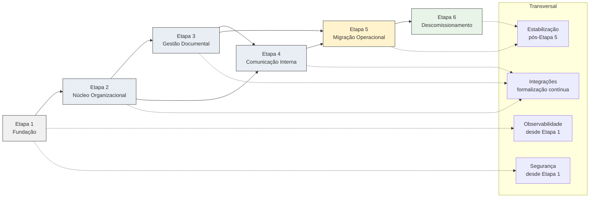

# Delivery Roadmap — Portal de Comunicação

## Objetivo

Este documento consolida o **roadmap arquitetural de entrega** da solução do Portal de Comunicação da Unimed Ceará. Define a **ordem lógica de construção**, dependências arquiteturais, critérios de prontidão e governança de evolução — materializando `10-target-architecture.md` e `09-migration-strategy.md` em sequência de capacidades implementáveis.

**Não representa** cronograma, sprint, backlog, planejamento operacional, estimativas ou histórias de usuário. Estabelece **direcionamento arquitetural** para a camada Implementation e encerra formalmente a camada Solution Design.

**Rastreabilidade:** `docs/solution-design/01-solution-overview.md` a `09-migration-strategy.md`, `docs/architecture/08-decision-records.md`, `docs/architecture/09-risk-assessment.md`, `docs/architecture/10-target-architecture.md`.

---

# Visão Geral do Roadmap

## Arquitetura Atual

Estado operacional **AS-IS** (Discovery): SPA Quasar/Vue consumindo **CMS WordPress** como API principal (`portaldecomunicacao/v1`); MU-plugin com regras de negócio, JWT, RBAC WordPress; MySQL + CPTs/taxonomias + tabelas customizadas; filesystem de binários; **Backend PHP legado** com `BackendSync`; Zimbra para autenticação; dois subsistemas de notificação; 28 endpoints órfãos; JWT duplicado.

## Arquitetura Alvo

Estado **TO-BE** (Architecture + Solution Design): **Frontend Vue** consumindo **Backend API Java** (monólito modular, quatro bounded contexts); **CMS WordPress desacoplado** (conteúdo institucional); **Banco de Dados** (metadados) + **Armazenamento de Arquivos** (binários); Zimbra inalterado; notificações unificadas no Backend; quatro ambientes segregados; Observabilidade transversal; **sem API Backend Legado**.

## Estratégia de Evolução

Transição **incremental** AS-IS → TO-BE com **convivência controlada** (ADR-015 provisório), seguida de **descomissionamento** de legado. Núcleo ATIVO (organização, documentos, acesso básico) priorizado sobre capacidades PARCIAL. Alinhado ao roadmap arquitetural de `10-target-architecture.md` seções 8 e 9.

## Princípios adotados

| Princípio | Origem |
| --------- | ------ |
| Backend como núcleo de negócio | ADR-002 |
| Monólito modular por bounded context | ADR-001, ADR-007 |
| Autorização centralizada | ADR-005 |
| Separação metadado/binário | ADR-004 |
| Zimbra como identidade | ADR-003 |
| Ambientes isolados | ADR-011 |
| Migração incremental com reversibilidade | `09-migration-strategy.md` |
| OQs bloqueantes respeitadas antes de ativação plena | Domain `10-open-questions.md` |

---

# Princípios de Entrega

## Entrega Incremental

Cada etapa entrega **capacidade verificável** em ambiente Dev antes de avançar. Promoção Local → Dev → Hml → Prod conforme `05-environment-strategy.md`. Nenhuma etapa depende de big-bang.

## Baixo Acoplamento

Frontend consome Backend exclusivamente (estado alvo); bounded contexts referenciam-se por identificador (ADR-009). Integrações externas opcionais não bloqueiam núcleo.

## Redução de Risco

Riscos críticos (R-001, R-002, R-003) endereçados desde Fundação. Riscos altos de legado, notificações e contratos (R-005, R-006, R-008) priorizados antes de descomissionamento.

## Validação Contínua

Smoke tests por etapa; homologação funcional em Hml; aceite de negócio para capacidades visíveis. Reconciliação metadado/binário em Gestão Documental e Migração.

## Segurança por Design

Autenticação Zimbra e autorização Backend desde Núcleo. Segregação de ambientes e secrets desde Fundação (`08-security-architecture.md`).

## Observabilidade desde o início

Sinais mínimos em Dev desde Fundação; paridade estrutural Hml/Prod antes de corte. Alertas em integrações críticas (Backend, Banco, Zimbra).

## Reversibilidade

Convivência AS-IS/TO-BE permite rollback conceitual enquanto legado operacional (`09-migration-strategy.md`). Backup pré-corte em Migração e Descomissionamento.

---

# Macroetapas da Evolução

Visão consolidada das fases de evolução da solução.

| Macroetapa | Objetivo |
| ---------- | -------- |
| **Fundação** | Infraestrutura lógica TO-BE operacional: ambientes, persistência segregada, proxy, observabilidade base, segurança transversal |
| **Núcleo** | Organização Corporativa e Controle de Acesso ATIVOS: identidade, autenticação, autorização, estrutura organizacional |
| **Capacidades** | Gestão Documental e Comunicação Interna — valor de negócio incremental sobre o núcleo |
| **Integrações** | Contratos Frontend ↔ Backend, WordPress pontual, Zimbra, canais opcionais — formalização e alinhamento |
| **Migração** | Transferência de dados, usuários e tráfego AS-IS → TO-BE; validação por ambiente |
| **Estabilização** | Operação TO-BE em Prod; mitigação de riscos remanescentes; fechamento de lacunas não bloqueantes |
| **Descomissionamento** | Remoção Backend PHP, API negócio CMS, JWT duplicado, notificações duplas, BackendSync; encerramento ADR-015 |

As **seis etapas** deste roadmap (1–6) materializam estas macroetapas de forma operacionalmente sequenciável.

---

# Etapa 1 — Fundação da Plataforma

Estabelecer a **plataforma TO-BE** mínima operável — sem capacidades de negócio completas.

## Objetivo

Disponibilizar topologia de containers alvo em ambiente Local/Dev com persistência segregada, fronteira segura, observabilidade base e configuração por ambiente — **habilitando** construção do Backend e Frontend sem dependência de CMS AS-IS para infraestrutura.

## Escopo

| Dimensão | Conteúdo |
| -------- | -------- |
| **Ambientes** | Modelagem Local e Dev conforme `05-environment-strategy.md`; secrets segregados (ADR-011) |
| **Observabilidade** | Coleta mínima de logs e saúde de containers |
| **Segurança base** | TLS na fronteira; gestão de secrets; zonas de confiança (`04-deployment-architecture.md`) |
| **Persistência** | Banco núcleo + Armazenamento + Banco WordPress — instâncias isoladas por ambiente |
| **Reverse Proxy** | Ponto de entrada Frontend e WordPress |
| **Backend API** | Esqueleto monólito modular — health check, estrutura por bounded context |
| **Frontend Web** | Esqueleto Vue — consumo Backend, roteamento base |
| **CMS WordPress** | Container editorial desacoplado — sem API negócio alvo |

## Dependências

- Solution Design `03`–`05` concluídos (containers, deployment, ambientes).
- Nenhuma dependência de migração de dados AS-IS.
- Stack conforme `.cursor/rules/delivery/implementation-rules.mdc`.

## Critérios de Prontidão

| Critério | Evidência |
| -------- | --------- |
| Stack completa sobe em Local e Dev | Todos os containers da topologia alvo |
| Persistência isolada por ambiente | ADR-011 |
| Reverse Proxy roteia Frontend e WordPress | HTTPS na fronteira |
| Backend responde health check | Observabilidade registra sinal |
| Secrets não versionados | Segregação por ambiente |
| Documentação de variáveis (templates) | Sem valores sensíveis |

## Riscos Relacionados

| Risco | Mitigação na etapa |
| ----- | ------------------ |
| **R-001** | Health check Backend; monitoramento desde Dev |
| **R-002** | Volumes persistentes dedicados; backup conceitual definido |
| **R-015** | Prioridades de recovery documentadas em `04`, `05` |
| **R-028** | Preparação de módulo sessão — formalização posterior |

### Mapeamento por componente

| Componente | Entrega |
| ---------- | ------- |
| Ambientes | Local, Dev operacionais |
| Observabilidade | Logs básicos, health |
| Segurança base | TLS, secrets, zonas |
| Persistência | Banco + Armazenamento + WP DB isolados |
| Reverse Proxy | Entrada HTTPS |

---

# Etapa 2 — Núcleo Organizacional

Construir **upstream obrigatório** (ADR-013) e **Controle de Acesso** ATIVO.

## Objetivo

Entregar autenticação corporativa via Zimbra, sessão, estrutura organizacional (singulares, áreas, equipes, vínculos) e autorização por papel e escopo — **pré-requisito** de toda capacidade posterior.

## Escopo

| Dimensão | Conteúdo |
| -------- | -------- |
| **Organização Corporativa** | Singulares, áreas, equipes, colaboradores, vínculos, contexto organizacional |
| **Controle de Acesso** | Autenticação Zimbra, sessão, papéis, autorização base, auditoria inicial |
| **Identidade** | Referência Zimbra + identificador interno; sem provisionamento de e-mail |
| **Autenticação** | Login/logout via Backend → Zimbra |
| **Autorização** | Decisão efetiva no Backend (ADR-005); papel + escopo |
| **Frontend** | Módulos organização e login consumindo Backend exclusivamente |

**Fora do escopo pleno:** onboarding oficial (OQ-001), solicitação de permissão (OQ-003), perfis externos (OQ-002), revogação (OQ-006/OQ-017).

## Dependências

- **Etapa 1** concluída.
- Integração Backend → Zimbra operacional em Dev (tier teste).
- Contratos Frontend → Backend para auth e organização (`06-integration-contracts.md`).

## Critérios de Prontidão

| Critério | Evidência |
| -------- | --------- |
| Login corporativo via Zimbra em Dev | R-003 monitorado |
| Sessão estabelecida e validada por operação | ADR-005 |
| CRUD organizacional básico funcional | ADR-013 |
| Autorização por papel/escopo em operação sensível | Backend decide — Frontend não |
| Auditoria de login e alteração organizacional | BR-005 |
| Smoke tests Hml | Promoção Dev → Hml |

## Riscos Relacionados

| Risco | Mitigação |
| ----- | --------- |
| **R-003** | Monitoramento Zimbra; tier teste em Dev |
| **R-008** | Contratos auth/org alinhados — sem órfãos |
| **R-009** | Base de autorização antes de compartilhamento documental |
| **R-013** | Mecanismo único de auth Backend — não replicar JWT CMS |
| **R-028** | Sessão documentada em `08-security-architecture.md` |
| **R-031** | Autorização exclusiva Backend |

### Mapeamento por capacidade

| Capacidade | Status alvo da etapa |
| ---------- | -------------------- |
| Organização Corporativa | ATIVO (exceto onboarding OQ-001) |
| Autenticação / Sessão | ATIVO |
| Autorização base (papel + escopo) | ATIVO |
| Onboarding | PARCIAL — não promover |

---

# Etapa 3 — Gestão Documental

Entregar **Gestão Documental** ATIVA com separação metadado/binário.

## Objetivo

Publicação, consulta, download, pastas, visibilidade, compartilhamento e busca unificada (projeção read-only) — com atomicidade lógica metadado/binário e integração obrigatória compartilhamento ↔ autorização.

## Escopo

| Dimensão | Conteúdo |
| -------- | -------- |
| **Pastas** | Estrutura documental por escopo organizacional |
| **Documentos** | Metadados no Banco; publicação coordenada |
| **Compartilhamento** | Audiência — Gestão Documental (ADR-008) |
| **Permissões** | Permissão efetiva — Controle de Acesso; integração com compartilhamento |
| **Busca** | Projeção read-only filtrada por Autorização (ADR-014) |
| **Binários** | Armazenamento via Backend; quotas (BR-023) |

**Condicionado:** OQ-005 (equivalência compartilhamento ↔ acesso) — governança plena requer decisão; núcleo documental básico pode avançar com ressalva documentada.

## Dependências

- **Etapa 2** concluída — contexto organizacional e autorização base.
- Persistência Banco + Armazenamento operacional (Etapa 1).
- Contratos Frontend ↔ Backend documentais inventariados (L-010).

## Critérios de Prontidão

| Critério | Evidência |
| -------- | --------- |
| Publicação metadado + binário coordenada | R-004 mitigado |
| Download autorizado via Backend | ADR-004, ADR-005 |
| Visibilidade e compartilhamento persistidos | Owner Gestão Documental |
| Autorização validada antes de entrega | ADR-005 |
| Busca retorna apenas resultados autorizados | ADR-014 |
| Quota bloqueia publicação quando excedida | BR-023 |
| Testes reconciliação metadado/binário em Hml | R-004 |
| Aceite Hml para fluxos ATIVOS documentais | Negócio |

## Riscos Relacionados

| Risco | Mitigação |
| ----- | --------- |
| **R-004** | Atomicidade lógica; reconciliação |
| **R-009** | Integração compartilhamento ↔ autorização; OQ-005 |
| **R-008** | Contratos publicação/consulta/download |
| **R-029** | Quotas; monitoramento volume |
| **R-001** | Backend orquestra — monitoramento |

### Mapeamento por capacidade

| Capacidade | Status alvo |
| ---------- | ----------- |
| Gestão Documental (núcleo) | ATIVO |
| Compartilhamento ↔ Autorização | ATIVO com ressalva OQ-005 |
| Solicitação permissão | PARCIAL — Etapa 2+ OQ-003 |

---

# Etapa 4 — Comunicação Interna

Entregar **Comunicação Interna** com notificações unificadas.

## Objetivo

Notificações in-app centralizadas no Backend (ADR-012); canais opcionais (Webhook, E-mail); comunicados e capacidades transversais — **após** unificação de subsistemas legados.

## Escopo

| Dimensão | Conteúdo |
| -------- | -------- |
| **Notificações** | Subsistema unificado — fonte única in-app (L-009) |
| **Comunicados** | Condicionado OQ-004 — PARCIAL até decisão ownership |
| **Canais** | In-app primário; Webhook/E-mail opcionais (R-032) |
| **Integrações** | Backend → Frontend (entrega); Backend → Webhook/E-mail |
| **Busca / Fique por Dentro** | PARCIAL — escopo conforme OQs |

**Pré-requisito explícito:** unificação `portal_notifications` + `pdc_notifications` AS-IS **não** replicada no TO-BE — um subsistema apenas.

## Dependências

- **Etapa 2** (identidade para endereçamento).
- **Etapa 3** recomendada (eventos documentais geram notificações).
- Etapa 1 (Observabilidade para monitorar canais).

## Critérios de Prontidão

| Critério | Evidência |
| -------- | --------- |
| Notificações in-app persistidas e entregues via Frontend | ADR-012 |
| Subsistema único — sem duplicidade | L-009, R-006 |
| Canais opcionais best-effort — falha não bloqueia | R-032 |
| Comunicados identificados como PARCIAL se OQ-004 aberta | R-007 |
| Testes Hml entrega notificação ponta a ponta | Aceite |

## Riscos Relacionados

| Risco | Mitigação |
| ----- | --------- |
| **R-006** | Unificação antes de declarar etapa concluída |
| **R-032** | In-app autoritativo; retry opcional |
| **R-007** | PARCIAL sinalizado |
| **R-008** | Contratos notificação alinhados |

### Mapeamento por capacidade

| Capacidade | Status alvo |
| ---------- | ----------- |
| Notificações in-app | ATIVO |
| Webhook / E-mail | Opcional |
| Comunicados | PARCIAL — OQ-004 |
| Métricas administrativas | PARCIAL |

---

# Etapa 5 — Migração Operacional

Transferir operação AS-IS → TO-BE com convivência controlada.

## Objetivo

Executar migração de dados, integrações e tráfego de usuários do CMS WordPress AS-IS para Backend TO-BE — validando por ambiente antes de corte em Prod.

## Escopo

| Dimensão | Conteúdo |
| -------- | -------- |
| **Migração de Dados** | Metadados, binários, permissões, auditoria histórica — `09-migration-strategy.md` |
| **Migração de Integrações** | Frontend → Backend; redução CMS API negócio; Zimbra mantido |
| **Migração de Usuários** | Vínculos organizacionais; identidade permanece Zimbra |
| **Validação de Ambientes** | Dev → Hml → Prod; reconciliação; backup pré-corte |
| **Convivência** | Dual routing transitório por capacidade — minimizar duração |
| **Inventário órfãos** | L-010 resolvido antes de corte amplo |

## Dependências

- **Etapas 1–4** com capacidades ATIVAS operacionais em Hml.
- Plano de dados e rollback (`09-migration-strategy.md`).
- Aceite de negócio Hml para escopo migrado.

## Critérios de Prontidão

| Critério | Evidência |
| -------- | --------- |
| Dados núcleo migrados ou estratégia de corte validada | Reconciliação R-004 |
| Frontend consome Backend para capacidades migradas | L-010 encerrada |
| Zero regressão crítica em Hml | Aceite negócio |
| Backup Prod pré-corte | R-002 |
| Rollback documentado | `09-migration-strategy.md` |
| Prod TO-BE operacional para escopo migrado | Promoção Hml → Prod |

## Riscos Relacionados

| Risco | Mitigação |
| ----- | --------- |
| **R-004** | Reconciliação metadado/binário |
| **R-005** | Convivência controlada; reduzir BackendSync |
| **R-007** | PARCIAL identificadas |
| **R-008** | Órfãos resolvidos pré-migração |
| **R-009** | Validar permissões migradas |
| **R-010** | Não migrar solicitação incompleta |
| **R-028** | Comunicar sessão dual durante convivência |
| **R-029** | Migração batch binários; quotas |

### Mapeamento por dimensão

| Dimensão | Entrega |
| -------- | ------- |
| Dados | Metadados + binários + permissões migrados |
| Integrações | Frontend → Backend principal |
| Usuários | Vínculos no Banco núcleo |
| Ambientes | Prod TO-BE para escopo acordado |

---

# Etapa 6 — Descomissionamento

Remover componentes AS-IS e encerrar ADR-015.

## Objetivo

Eliminar Backend PHP legado, API de negócio CMS, JWT duplicado, subsistemas de notificação AS-IS e BackendSync — consolidando **TO-BE exclusivo** em Prod.

## Escopo

| Dimensão | Conteúdo |
| -------- | -------- |
| **Backend PHP Legado** | Remoção container e rotas |
| **API CMS Legada** | Desativação `portaldecomunicacao/v1` negócio |
| **JWT Duplicado** | Remoção plugin/mecanismo redundante |
| **Notificações Duplicadas** | Desativação tabelas AS-IS pós-unificação |
| **BackendSync** | Eliminação sincronização CMS → legado |
| **WordPress** | Papel exclusivo conteúdo institucional |
| **ADR-015** | Encerramento ou substituição formal |

## Dependências

- **Etapa 5** concluída — Prod TO-BE estável.
- Paridade de rotas validada.
- 30 dias estável em Hml (critério `09-migration-strategy.md`).
- Zero consumidores dos componentes legados.

## Critérios de Prontidão

| Critério | Evidência |
| -------- | --------- |
| Backend PHP removido | Sem BackendSync |
| Frontend 100% Backend — sem CMS negócio | L-010 |
| JWT único Backend | R-013 encerrado |
| Notificações AS-IS desativadas | R-006 encerrado |
| WordPress editorial apenas | ADR-002 materializado |
| ADR-015 encerrado | Arquitetura |
| Aceite institucional migração concluída | Negócio |

## Riscos Relacionados

| Risco | Mitigação |
| ----- | --------- |
| **R-005** | Descomissionamento elimina coexistência |
| **R-006** | Verificar subsistema único antes de remover AS-IS |
| **R-013** | Auth unificada confirmada |
| **R-001** | Monitoramento intensificado pós-corte |
| **R-002** | Backup final AS-IS arquivado |

### Mapeamento por componente legado

| Componente | Ação |
| ---------- | ---- |
| Backend PHP Legado | Descomissionamento |
| API CMS negócio | Descomissionamento |
| JWT Duplicado | Descomissionamento |
| Notificações Duplicadas AS-IS | Descomissionamento |
| BackendSync | Descomissionamento |

---

# Dependências Entre Etapas

| Etapa | Depende de | Motivo | Impacto se violada |
| ----- | ---------- | ------ | ------------------ |
| **1 — Fundação** | — | Base infraestrutural | Nenhuma construção TO-BE possível |
| **2 — Núcleo** | 1 | Persistência, proxy, Zimbra tier Dev | Sem auth/org — demais fluxos bloqueados (ADR-013) |
| **3 — Gestão Documental** | 2 | Escopo organizacional e autorização | Documentos sem contexto ou acesso inválido |
| **4 — Comunicação** | 2; 3 (recomendado) | Identidade; eventos documentais | Notificações sem destinatário ou contexto |
| **5 — Migração** | 1–4 (ATIVOS em Hml) | Capacidades TO-BE antes de transferir tráfego | Migração para solução incompleta |
| **6 — Descomissionamento** | 5 | Prod TO-BE estável | Remoção prematura de fallback AS-IS |

**Integrações** e **Estabilização** são transversais: Integrações formalizadas progressivamente nas Etapas 2–4; Estabilização contínua pós-Etapa 5 e após Etapa 6.

---

# Capacidades Prioritárias

Classificação baseada em `10-target-architecture.md`, `09-risk-assessment.md` e Open Questions.

## Obrigatórias

Capacidades **ATIVAS** no núcleo — bloqueiam valor mínimo da solução TO-BE.

| Capacidade | Bounded context | Etapa |
| ---------- | --------------- | ----- |
| Autenticação Zimbra + sessão | Controle de Acesso | 2 |
| Autorização papel + escopo | Controle de Acesso | 2 |
| Estrutura organizacional (singulares, áreas, equipes, vínculos) | Organização Corporativa | 2 |
| Publicação e consulta documental | Gestão Documental | 3 |
| Download autorizado | Gestão Documental + Controle de Acesso | 3 |
| Separação metadado/binário | Gestão Documental | 3 |
| Notificações in-app unificadas | Comunicação Interna | 4 |
| Migração núcleo AS-IS → TO-BE | Transversal | 5 |
| Descomissionamento legado | Transversal | 6 |

## Importantes

Capacidades que **elevam maturidade** — entregar após obrigatórias ou com ressalva PARCIAL.

| Capacidade | Condição | Etapa |
| ---------- | -------- | ----- |
| Busca unificada | ADR-014; OQ-024 escopo adicional pendente | 3 |
| Compartilhamento ↔ autorização alinhados | OQ-005 | 3 |
| Auditoria governança ampliada | OQ-019 catálogo | 2–4 |
| Webhook / E-mail | Política institucional | 4 |
| WordPress conteúdo institucional | Desacoplado | 1, 6 |
| Continuidade operacional | L-011; R-015 | 1, 5 |
| Resolução endpoints órfãos | L-010 | 2–5 |

## Opcionais

Capacidades **PARCIAL** ou dependente de OQ — não bloqueiam conclusão do núcleo.

| Capacidade | Bloqueio |
| ---------- | -------- |
| Onboarding oficial | OQ-001 |
| Solicitação de permissão ponta a ponta | OQ-003, OQ-016 |
| Revogação de permissão | OQ-006, OQ-017 |
| Perfis externos (parceiro, convidado) | OQ-002 |
| Comunicados institucionais | OQ-004 |
| Analytics / métricas administrativas | R-016; persistência não confirmada |
| Central de Colaboração | PARCIAL AS-IS |
| Escalabilidade horizontal | Decisão pendente; R-014 |

---

# Capacidades Bloqueadas

Open Questions que **impedem ativação plena** até encerramento formal.

| OQ | Tema | Impacto | Etapa afetada |
| -- | ---- | ------- | ------------- |
| **OQ-001** | Fluxo oficial de onboarding | Gate de entrada colaborador indefinido; dois fluxos AS-IS | 2 — Organização |
| **OQ-002** | Parceiro vs. convidado | Perfis externos sem modelo operacional (R-019) | 2 — Acesso externo |
| **OQ-003** | Solicitação de permissão ponta a ponta | Governança recursos privados incompleta (R-010) | 2, 3 |
| **OQ-005** | Compartilhamento ≡ acesso efetivo | Risco divergência audiência vs. acesso (R-009, L-003) | 3 |
| **OQ-006** | Revogação de permissão | Ciclo de vida acesso incompleto (R-011) | 2, 3 |
| **OQ-017** | Revogação ou expiração | Complementa OQ-006 | 2, 3 |
| **OQ-019** | Catálogo eventos auditáveis | Auditoria incompleta (R-023, L-015) | 2–4 |

**Tratamento:** capacidades bloqueadas permanecem **PARCIAL** — expostas com limitação documentada (R-007) ou **restritas** até encerramento. Não promover a ATIVO em Prod sem decisão registrada.

---

# Critérios de Evolução

## Quando avançar de etapa

| Condição | Descrição |
| -------- | --------- |
| Critérios de prontidão da etapa atual | Todos atendidos em Hml |
| Riscos críticos da etapa mitigados | Plano documentado |
| Aceite técnico | Líder técnico |
| Aceite negócio | Para capacidades visíveis a usuários |
| Promoção ambiente | Dev → Hml antes de ampliar escopo Prod |

## Quando interromper

| Condição | Ação |
| -------- | ---- |
| Regressão crítica em Hml/Prod | Pausar avanço; rollback se necessário |
| Risco crítico materializado sem mitigação | Pausar até plano aprovado |
| OQ bloqueante impacta escopo em corte | Reavaliar escopo da etapa |
| Falha reconciliação dados | Interromper Migração (Etapa 5) |

## Quando revisar arquitetura

| Condição | Processo |
| -------- | -------- |
| Lacuna impeditiva descoberta em Implementation | Revisão Solution Design — **sem** alterar ADRs retroativamente |
| Necessidade de novo container, banco ou auth | **Novo ADR** Architecture |
| OQ encerrada com impacto em contratos | Atualizar `06-integration-contracts.md` via governança |

## Quando abrir novo ADR

- Novo container ou serviço independente.
- Mecanismo de autenticação paralelo ao Zimbra.
- Alteração de topologia de deployment ou número de bancos.
- Descomissionamento ADR-015 — encerrar ou substituir ADR-015 formalmente.

---

# Governança da Evolução

| Papel | Responsabilidade |
| ----- | ---------------- |
| **Arquitetura** | Validar aderência ADRs; aprovar avanço de etapa; novos ADRs quando necessário; encerrar Solution Design / autorizar Implementation |
| **Negócio** | Priorizar capacidades; aceite Hml/Prod; encerrar OQs; comunicação institucional |
| **Desenvolvimento** | Implementar TO-BE por etapa; inventário órfãos; testes; contratos Frontend ↔ Backend |
| **Infraestrutura** | Ambientes segregados; backup/restore; promoção; observabilidade |
| **Segurança** | Validar controles por etapa; consolidar auth; proteção dados na migração |
| **Operação** | Monitoramento Prod; incidentes; recovery; pós-descomissionamento |

**Aprovações por marco:**

| Marco | Aprovadores |
| ----- | ----------- |
| Conclusão Etapa 1 | Arquitetura + Infraestrutura |
| Conclusão Etapas 2–4 | Arquitetura + Negócio (aceite Hml) + Segurança |
| Corte Migração Prod (Etapa 5) | Todos os papéis |
| Descomissionamento (Etapa 6) | Arquitetura + Negócio + Operação |

---

# Métricas de Evolução

Indicadores **conceituais** — sem metas numéricas obrigatórias nesta camada. Alinhados a `10-target-architecture.md` seção 11.

## Adoção

- Proporção de fluxos de usuário no caminho TO-BE vs. AS-IS.
- Capacidades migradas vs. remanescentes no CMS.

## Migração

- Domínios de dados migrados (organização, documentos, permissões, binários).
- Registros reconciliados vs. órfãos metadado/binário.

## Cobertura Funcional

- Capacidades ATIVAS operacionais vs. PARCIAL identificadas.
- Contratos Frontend ↔ Backend confirmados vs. órfãos (L-010).

## Riscos

- Riscos críticos/altos com mitigação ativa vs. abertos.
- Incidentes associados a R-001, R-002, R-003 em Prod.

## Observabilidade

- Containers críticos com sinal de saúde em Prod.
- Alertas de integração Zimbra e Backend funcionais.

## Qualidade

- Aceites Hml aprovados por etapa.
- Rollbacks executados vs. cortes bem-sucedidos.

---

# Mapeamento de Riscos

| Risco | Fase impactada | Mitigação | Criticidade |
| ----- | -------------- | --------- | ----------- |
| **R-001** | Todas; pico pós-descomissionamento | Monitoramento Backend; recovery | Crítica |
| **R-002** | 1, 3, 5, 6 | Backup; restore; migração incremental | Crítica |
| **R-003** | 2, 5 | Zimbra monitorado; tier por ambiente | Crítica |
| **R-004** | 3, 5 | Atomicidade; reconciliação | Alta |
| **R-005** | 5, 6 | Convivência limitada; descomissionamento | Alta |
| **R-006** | 4, 5, 6 | Unificação L-009 antes de corte | Alta |
| **R-007** | 2–6 | PARCIAL identificadas; aceite Hml | Alta |
| **R-008** | 2–6 | Inventário L-010 | Alta |
| **R-009** | 3, 5 | OQ-005; integração módulos | Alta |
| **R-010** | 2, 3, 5 | OQ-003; não migrar incompleto | Alta |
| **R-011** | 2, 3, 5 | OQ-006/OQ-017; documentar limitação | Alta |
| **R-019** | 2, 5 | OQ-002; restringir externos | Moderada |
| **R-028** | 2, 5 | Sessão unificada; formalizar expiração | Moderada |
| **R-029** | 3, 5 | Quotas; monitoramento volume | Moderada |
| **R-032** | 4, 5 | In-app primário; best-effort externo | Baixa |

---

# Roadmap Arquitetural



**Legenda:** Etapas 1–4 constroem TO-BE; Etapa 5 transfere operação; Etapa 6 remove AS-IS. Integrações, Observabilidade e Segurança são contínuas.

---

# Encerramento da Camada Solution Design

## O que está consolidado

A camada **Solution Design** entrega **dez artefatos** (`01` a `10`) que transformam a Architecture aprovada em **solução implementável**:

| Artefato | Conteúdo consolidado |
| -------- | -------------------- |
| `01-solution-overview.md` | Visão executiva, componentes, princípios |
| `02-system-context.md` | Atores, fronteiras, fluxos |
| `03-container-architecture.md` | Containers C4, bounded contexts |
| `04-deployment-architecture.md` | Topologia, zonas, continuidade |
| `05-environment-strategy.md` | Local, Dev, Hml, Prod; promoção |
| `06-integration-contracts.md` | Contratos conceituais entre componentes |
| `07-data-ownership.md` | Ownership, classificação, ciclo de vida |
| `08-security-architecture.md` | Authn, authz, proteção, auditoria |
| `09-migration-strategy.md` | AS-IS → TO-BE, convivência, descomissionamento |
| `10-delivery-roadmap.md` | Ordem lógica de entrega — este documento |

**Rastreabilidade:** ADR-001 a ADR-014 materializados; ADR-015 com estratégia de saída; 32 riscos considerados; lacunas L-001 a L-018 referenciadas.

```text
Solution Design = CONCLUÍDA
```

## O que pertence à camada Implementation

| Responsabilidade | Exemplos |
| ---------------- | -------- |
| Código-fonte | Backend Java/Spring Boot modular; Frontend Vue |
| Contratos executáveis | APIs REST implementadas; testes de integração |
| Modelo de dados físico | Schema banco; migrations |
| Configuração aplicação | Application properties; variáveis |
| Testes automatizados | Unitários, integração, e2e |
| Documentação técnica de código | Javadoc, README módulos |

Implementation **consome** Solution Design e Architecture **sem alterá-los** — divergências exigem governança formal.

## O que pertence à camada Infrastructure

| Responsabilidade | Exemplos |
| ---------------- | -------- |
| Docker Compose por ambiente | `docker-compose.local.yml` a `.prod.yml` (conceituais em `05`) |
| Manifests e provisioning | Quando aplicável na organização |
| Backup/restore executável | Procedimentos operacionais |
| Monitoramento | Stack Observabilidade concreta |
| Certificados e secrets runtime | Gestão operacional |
| Rede e volumes | Configuração física |

Infrastructure materializa deployment e ambientes definidos em Solution Design `04` e `05`.

## O que pertence à camada Delivery

| Responsabilidade | Exemplos |
| ---------------- | -------- |
| Planejamento operacional | Cronograma, sprints, releases |
| Backlog e histórias | Product backlog, user stories |
| Estimativas | Story points, capacity |
| CI/CD pipelines | GitLab CI, deploy automatizado |
| Gestão de projeto | Marcos, stakeholders, comunicação |
| Runbooks | Procedimentos incidente, rollback operacional |

Delivery **operacionaliza** o roadmap arquitetural deste documento — sem substituí-lo.

---

# Conclusão

O roadmap arquitetural de entrega do Portal de Comunicação organiza a evolução em **seis etapas sequenciais**: Fundação → Núcleo Organizacional → Gestão Documental → Comunicação Interna → Migração Operacional → Descomissionamento — com dependências explícitas, capacidades prioritárias classificadas e OQs bloqueantes respeitadas.

A construção do **TO-BE** (Etapas 1–4) precede a **transferência operacional** (Etapa 5) e a **eliminação do AS-IS** (Etapa 6), materializando ADR-001 a ADR-014, a estratégia de migração e os contratos de integração, dados e segurança documentados na camada Solution Design.

Riscos críticos R-001, R-002 e R-003 acompanham todas as fases; riscos de legado, notificações e contratos (R-005, R-006, R-008) concentram-se em Migração e Descomissionamento. Capacidades PARCIAL não bloqueiam o núcleo ATIVO, mas exigem governança explícita (R-007).

Com a conclusão deste artefato, a camada **Solution Design está formalmente encerrada** — autorizando o início da camada **Implementation** conforme `.cursor/rules/delivery/implementation-rules.mdc`, condicionada à execução das etapas aqui definidas.

---

## Fontes Utilizadas

| Fonte | Uso |
| ----- | --- |
| `docs/solution-design/01-solution-overview.md` a `09-migration-strategy.md` | Solução, migração, dependências |
| `docs/architecture/10-target-architecture.md` | TO-BE, lacunas, roadmap arquitetural |
| `docs/architecture/08-decision-records.md` | ADRs |
| `docs/architecture/09-risk-assessment.md` | Riscos mapeados |
| `docs/discovery/07-current-architecture.md` | AS-IS |
| `docs/domain/10-open-questions.md` | OQs bloqueantes |
| `.cursor/rules/delivery/implementation-rules.mdc` | Critério entrada Implementation |
| `.cursor/rules/process/solution-design-phase.mdc` | Governança camada |

*Nenhum backlog, sprint, cronograma, Gantt, tarefa detalhada, estimativa, história de usuário ou artefato de infraestrutura executável foi produzido para a construção deste artefato.*

---

## Nível de Confiança

**Médio-Alto**

| Faixa | Escopo |
| ----- | ------ |
| Alto | Sequência etapas, dependências, capacidades obrigatórias, descomissionamento |
| Médio | Ordem fina Etapas 3/4 paralelas; capacidades PARCIAL — condicionadas a OQs |
