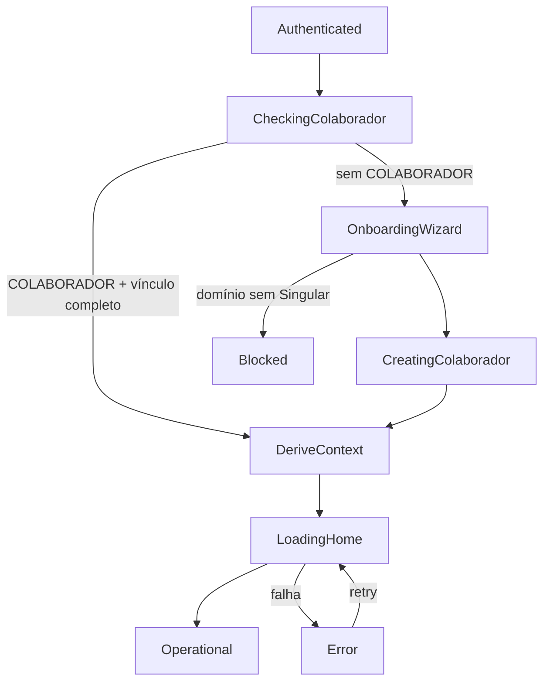

# Fluxos — FT-PRIMEIRO-ACESSO

| Campo | Valor |
|--------|--------|
| Feature ID | FT-PRIMEIRO-ACESSO |
| Status | APPROVED (reconciliado 2026-08-17) |
| Versão | 1.1 |
| Decisões | DH-02, DH-03, DH-04, DH-PA-01, DH-PA-02, DH-PA-03 |

---

# Fluxo Principal (TO-BE)

```text
Authenticated (FT-AUTH — identidade)
        ↓
CheckingColaborador
        ↓
   ┌────┴────────────────┐
   │                     │
COLABORADOR          sem COLABORADOR
com vínculo          ou vínculo incompleto
completo                  │
   │                     OnboardingWizard
   │                     (domínio → Singular → Área → Equipe opt.)
   │                           ↓
   │                     CreatingColaborador (DH-03)
   │                           │
   └───────────┬───────────────┘
               ↓
    DeriveContext (Contexto Ativo = vínculo — DH-02)
               ↓
         LoadingHome (UC-PA-006)
               ↓
          Operational
```



---

# Fluxos Alternativos

## FA-001 — Reentrada com COLABORADOR existente (UC-PA-008)

```text
Authenticated → CheckingColaborador → (vínculo completo) → DeriveContext → LoadingHome → Operational
```

Omite OnboardingWizard.

## FA-002 — Retry após falha de Home

```text
LoadingHome → Error → LoadingHome (mesmo Contexto Ativo derivado)
```

---

# Fluxos de Exceção

## FE-001 — Domínio sem Singular (BR-044, DH-PA-02)

```text
OnboardingWizard → Blocked (informar usuário; sem prosseguimento automático)
```

Autenticação/credencial temporária pode permanecer; operação negada.

## FE-002 — Vínculo inválido no COLABORADOR

```text
CheckingColaborador | DeriveContext → invalidate → UC-PA-010
```

## FE-003 — Falha de infraestrutura

```text
OnboardingWizard | CreatingColaborador | LoadingHome → Error
```

Recuperação: retry sem novo login, se FT-AUTH/credencial PA ainda válida.

---

# Fluxos superseded (modelo N vínculos — pré-DH-02)

Os fluxos abaixo **não** representam o TO-BE vigente. Preservados como histórico.

## [SUPERSEDED] Seleção entre N vínculos

```text
LoadingContexts → SelectingContext → PersistingContext
```

**Motivo:** DH-02 — 1 vínculo cadastral; sem UI de seleção.

## [SUPERSEDED] Troca de contexto em operação (UC-PA-007)

```text
Operational → ChangingContext → SelectingContext → ...
```

**Motivo:** RF-PA-007, RN-PA-006 superseded — sem segundo vínculo cadastral.

---

# Relação com UCs

| Fluxo | UCs |
|-------|-----|
| Principal | UC-PA-001 → 002 → 006 |
| FA-001 | UC-PA-008 → 006 |
| FE-001 | UC-PA-009 |
| FE-002 | UC-PA-010 |
