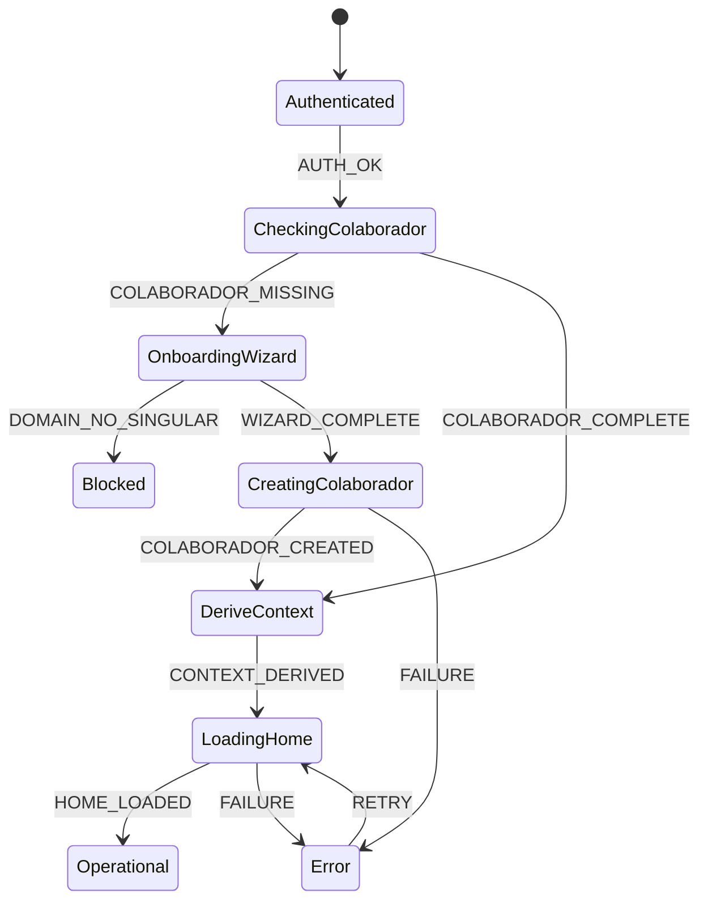

# Máquina de Estados — FT-PRIMEIRO-ACESSO

| Campo | Valor |
|--------|--------|
| Feature ID | FT-PRIMEIRO-ACESSO |
| Status | APPROVED (reconciliado 2026-08-17) |
| Versão | 1.1 |
| Decisões | DH-02, DH-03, DH-PA-01 |

---

# Estados (TO-BE)

| Estado | Descrição | Operação permitida? |
|--------|-----------|---------------------|
| `Authenticated` | Identidade válida (FT-AUTH ou credencial temporária PA) | Não |
| `CheckingColaborador` | Verifica existência de COLABORADOR e integridade do vínculo | Não |
| `OnboardingWizard` | Coleta vínculo: domínio → Singular → Área → Equipe (opt.) | Não |
| `CreatingColaborador` | Persiste COLABORADOR com vínculo completo (DH-03) | Não |
| `DeriveContext` | Deriva Contexto Ativo do vínculo único (DH-02) | Não (transiente) |
| `LoadingHome` | Solicita Home ao backend | Não |
| `Operational` | Contexto derivado + Home ok; navegação operacional | Sim |
| `Blocked` | Bloqueio de negócio (ex.: domínio sem Singular) | Não |
| `Error` | Falha recuperável do fluxo | Não |

---

# Estados superseded (pré-DH-02)

| Estado | Status | Motivo |
|--------|--------|--------|
| `LoadingContexts` | **SUPERSEDED** | Substituído por `CheckingColaborador` + `OnboardingWizard` |
| `SelectingContext` | **SUPERSEDED** | DH-02 — sem seleção entre N vínculos |
| `PersistingContext` | **SUPERSEDED** | Contexto derivado de `COLABORADOR`; sem persistência separada |
| `ChangingContext` | **SUPERSEDED** | RF-PA-007 — sem troca de vínculo cadastral |

---

# Eventos

| Evento | Origem |
|--------|--------|
| `AUTH_OK` | FT-AUTH / credencial temporária PA |
| `COLABORADOR_COMPLETE` | COLABORADOR existe com vínculo válido |
| `COLABORADOR_MISSING` | Identidade sem COLABORADOR ou vínculo incompleto |
| `DOMAIN_NO_SINGULAR` | Domínio sem Singular cadastrada (DH-PA-02) |
| `WIZARD_COMPLETE` | Vínculo coletado no wizard |
| `COLABORADOR_CREATED` | INSERT COLABORADOR ok (DH-03) |
| `CONTEXT_DERIVED` | Contexto Ativo derivado das FKs |
| `HOME_LOADED` | Home OK |
| `FAILURE` | Erro técnico |
| `RETRY` | Tentativa de recuperação |

---

# Transições (TO-BE)

| De | Evento | Condição | Para |
|----|--------|----------|------|
| Authenticated | `AUTH_OK` | — | CheckingColaborador |
| CheckingColaborador | `COLABORADOR_COMPLETE` | vínculo válido (RN-PA-001) | DeriveContext |
| CheckingColaborador | `COLABORADOR_MISSING` | — | OnboardingWizard |
| OnboardingWizard | `DOMAIN_NO_SINGULAR` | — | Blocked |
| OnboardingWizard | `WIZARD_COMPLETE` | — | CreatingColaborador |
| CreatingColaborador | `COLABORADOR_CREATED` | — | DeriveContext |
| CreatingColaborador | `FAILURE` | — | Error |
| DeriveContext | `CONTEXT_DERIVED` | — | LoadingHome |
| LoadingHome | `HOME_LOADED` | — | Operational |
| LoadingHome | `FAILURE` | — | Error |
| Error | `RETRY` | auth/credencial válida | estado anterior recuperável |
| * | sessão inválida | — | sai da Feature (FT-AUTH) |

---

# Falhas

| Código lógico | Estado | Comportamento |
|---------------|--------|---------------|
| `PA_DOMAIN_NO_SINGULAR` | Blocked | Domínio sem Singular; informar usuário (BR-044) |
| `PA_VINCULO_INVALID` | Error / OnboardingWizard | Vínculo inconsistente |
| `PA_CREATE_FAILED` | Error | Falha ao criar COLABORADOR |
| `PA_HOME_FAILED` | Error | Retry mantendo contexto derivado |

---

# Relação com FT-SESSION

A store FT-SESSION reflete:

- `status` de hidratação de identidade;
- vínculo único (`organizationalLinks`);
- `activeContext` como **projeção derivada** do vínculo (DH-02) — não segundo vínculo persistido;
- `isReady` quando Feature em `Operational` (ou política equivalente na implementação).

A máquina de estados acima é a SSOT do **fluxo de primeiro acesso**; a store não redefine as regras.
